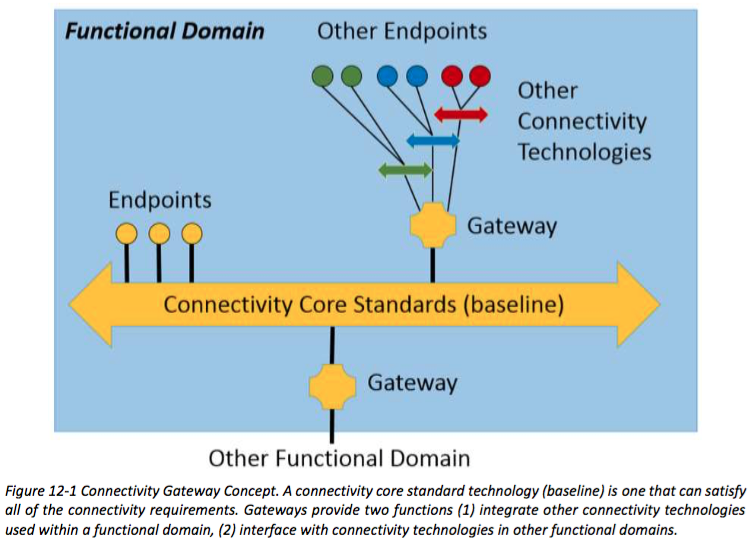


## 12 CONNECTIVITY
## 12连接性
Ubiquitous connectivity is one of the key foundational technology advances that enable the Industrial Internet. The seven-layer Open Systems Interconnect (OSI) Model [15] and the four- layer Internet Model [16] do not adequately represent all Industrial Internet connectivity requirements. An Industrial Internet System is more complex and it is necessary to define a new connectivity functional layer model that addresses its distributed industrial sensors, controllers, devices, gateways and other systems.
无处不在的连接性是其中的关键基础技术的进步，使工业互联网之一。七层开放系统互连（OSI）模型[15]和四层网络模型[16]没有充分代表所有工业互联网连接的要求。一个工业互联网系统较复杂，有必要定义一个寻址其分布式工业传感器，控制器，设备，网关和其他系统的连接性的功能层模型。

### 12.1 ARCHITECTURAL ROLE
### 12.1建筑作用
Connectivity provides the foundational capability among endpoints to facilitate component integration, interoperability and composability (see Chapter 11).
连接提供端点之间的基本能力，以促进组件集成，互操作性和可组合性（参见第11章）。

Technical interoperability is the ability to exchange bits and bytes using an information exchange infrastructure and an unambiguously defined underlying networks and protocols. Syntactic interoperability is the ability to exchange information in a common data format, with a common protocol to structure the data and an unambiguously defined format for the information exchange. Syntactic interoperability requires technical interoperability. 
技术互操作性是交流位和使用信息交换基础设施字节和明确定义底层网络和协议的能力。句法互操作性是在一个共同的数据格式进行信息交换，以共用通讯协议来组织数据和用于信息交换的明确定义的格式的能力。句法互操作性需要技术的互操作性。

For IISs, connectivity comprises two functional layers:
对于IISs，连接性包括两个功能层：

* Communication Transport layer—provides the means of carrying information between endpoints. Its role is to provide technical interoperability between endpoints participating in an information exchange. This function corresponds to layers 1 (physical) through 4 (transport) of the OSI conceptual model or the bottom three layers of the Internet model (See Table 12-1).
* Connectivity Framework layer—facilitates how information is unambiguously structured and parsed by the endpoints. Its role is to provide the mechanisms to realize syntactic interoperability between endpoints. Familiar examples include data structures in programming languages and schemas for databases. This function spans layers 5 (session) through 7 (application) of the OSI conceptual model or the Application layer of the Internet Model (See Table 12-1).
* 通信传输层提供了执行端点之间的信息的手段。它的作用是提供参与信息交换终端之间的技术互操作性。该功能对应于OSI概念模型或因特网模型的底部三层的层1（物理）至4（运输）（见表12-1）。
* 连接架构层，有利于信息是如何明确结构和端点解析。它的作用是提供机制，以实现端点之间的语法互操作性。常见的例子有数据结构的编程语言和架构的数据库。该功能通过OSI概念模型或互联网模型的应用层7（应用程序）跨越5层（会话）（见表12-1）。

The data services framework in the data management crosscutting function builds on the
foundation provided by the connectivity framework to achieve syntactic interoperability between endpoints. That, in turn, provides the foundation for semantic interoperability required by the “Dynamic Composition and Automated Interoperability” as discussed in Chapter 16. 
在数据管理横切函数的数据服务框架基础上提供的连接框架实现端点之间句法互通性的基础。这反过来，提供了对“动态组合和自动互通”需要语义互操作的基础，在第16章中讨论。

The table below summarizes the role and scope of the Connectivity functional layers
下表总结了连接功能层的作用和范围

Scope of IIC Reference Architecture | Correspondence to OSI Reference | Correspondence to Internet Model (RFC 1122) [16] | Correspondence to Levels of Conceptual Interoperability [13]
------------ | ------------- | ------------ | ------------
Crosscutting Function | Model (ISO/IEC 7498) [15] | |
Connectivity Framework Layer | 7. Application 6. Presentation 5. Session | Application Layer | Syntactic Interoperability Mechanism introduces a common structure to exchange information. On this level, a common protocol to structure the data is used; the format of the information exchange is unambiguously defined.
Communication Transport Layer | 4. Transport 3. Network 2. Data Link 1. Physical | Transport Layer Internet Layer Link Layer | Technical Interoperability: provides the communication protocols for exchanging data between participating systems. On this level, a communication infrastructure is established allowing systems to exchange bits and bytes, and the underlying networks and protocols are unambiguously defined.
IIC参考架构范围|对应于OSI参考|对应于互联网模式（RFC 1122）[16] |对应于概念的互操作性水平[13]
横切功能|模型（ISO / IEC 7498）[15] | |
连接架构层| 7.应用6.表示5.会话|应用层|句法互通机制引入了一个共同的结构，以交换信息。在这个层面上，公共协议来组织数据被使用;的信息交换的格式明确定义。
通信传输层| 4.运输3.网络2.数据链路1.物理|传输层网络层链路层|技术互操作性：提供用于参与系统之间交换数据的通信协议。在这个层面上，一个通信基础设施建立允许系统交换比特和字节，以及底层网络和协议被明确定义。

Table 12-1 Role and scope of the connectivity functional layers
表12-1的连接功能层的作用和范围

### 12.2 KEY SYSTEM CHARACTERISTICS
### 12.2钥匙系统特性
In IISs, the connectivity function supports several key characteristics:
在IISs，在连接功能支持几个关键特性：

Performance: High performance connectivity is expected in IISs. The spectrum of performance ranges from tight sub-millisecond control loops to supervisory control on a human scale. The performance characteristic is measured along two axes.
性能：高性能连接，预计在IISs。性能的范围从紧的亚毫秒级的控制环上的人性化管理控制。工作特性是沿着两个轴测量。

* Latency and jitter: The right answer delivered too late is often the wrong answer. Thus, latency must be within limits and low jitter is needed for predictable performance.
* Throughput: High throughput is needed when large volumes of information are exchanged over a short time.
*时延和抖动：正确的答案发送太晚往往是错误的答案。因此，延迟时间必须在限制和低抖动是需要可预测的性能。
*吞吐量：是需要高吞吐量时，大量的信息交换在很短的时间。

High throughput and low latency are often competing requirements. Low latency and jitter are often more critical than throughput because IISs require short reaction times and tight coordination to maintain effective control over the real-world processes.
高吞吐量和低延迟经常竞争的要求。因为IISs需要短的反应时间和紧密协调，以保持有效控制所述现实世界的过程低延迟和抖动通常比通过更为关键。

Scalability: Large numbers of things in the physical world and endpoints that exchange
information about those things must be represented and managed. The connectivity function must support horizontal scaling as billions of things are added into the system.
可扩展性：大批在物理世界中的东西，而交换的那些东西的信息终端都必须表示和管理。在连接功能必须支持水平扩展数十亿的东西被添加到系统中。

Resilience: IISs operate continually in a real-world environment prone to failures. Endpoints operate in a dynamic fashion and may fail or become disconnected. Connectivity should support graceful degradation, including localizing the loss of information exchange to disconnected endpoints and restoring information exchange automatically when a broken connection is restored.
韧性：IISS在现实环境中容易发生故障持续运转。端点工作在一个动态的方式和可能失败或断开连接。连接应支持优雅降级，包括本地化信息交换断开连接端点的损失，并自动恢复信息交换恢复断开的连接时。

Connectivity security—architectural considerations: Information exchange among different actors within a system takes place over the two abstract layers documented in Table 12-1, both of which must consider when designing security solutions, including those of confidentiality, Integrity, availability, scalability, resilience, interoperability and performance. 
连接安全架构方面的考虑：一系统内不同行为者之间的信息交流发生在记录表12-1中的两个抽象层，这两者在设计安全解决方案时，包括保密性，完整性，可用性，可扩展性，适应能力必须考虑，互操作性和性能。

Different information exchange patterns used in the connectivity framework, such as request- response or publish-subscribe patterns, have different security requirements.
在连接框架用于不同的信息交换的模式，如请求 - 响应或发布 - 订阅模式，具有不同的安全要求。

Connectivity Security—building blocks: Information exchange security among connectivity endpoints relies on:
连接安全 - 积木：连接端点之间信息交换的安全性依赖于：

* explicit endpoint information exchange policies
* cryptographically strong mutual authentication between endpoints
* authorization mechanisms that enforce access control rules derived from the policy, and * cryptographically backed mechanisms for ensuring confidentiality, integrity, and
freshness of the exchanged information.
* 明确的端点信息交流政策
* 端点之间的保密性强的相互认证
* 强制实施，从政策衍生的访问控制规则授权机制，以及
* 加密备份，确保保密的信息交换，完整性和新鲜度的机制。

A security management mechanism manages the information exchange policies for connectivity  endpoints. They define how to protect exchanged information. For example, they specify how to filter and route traffic, how to protect exchanged data and metadata (authenticate or encrypt-then-authenticate) and what access control rules should be used.
一个安全的管理机制，管理的连接端点信息交流政策。他们定义如何保护交换的信息。例如，它们指定如何过滤和路由流量，如何保护交换的数据和元数据（认证或加密-然后进行验证），什么访问应使用控制规则。

Longevity: IISs have long lifetimes, yet components, especially those in the communication
transport layer, are often built into the hardware and hence are not easily replaceable. Where feasible, the connectivity software components should support incremental evolution including upgrades, addition and removal of components. It should also support incremental evolution of the information exchange solutions during the lifecycle of a system.
持久：IISS有长的寿命，但组件，特别是那些在通信传输层中，通常内置在硬件，因此不易更换。如果可行，连接软件组件应该支持增量演变，包括升级，添加和删除组件。它还应当在系统的生命周期期间支持信息交换的解决方案的增量变化。

Integrability, interoperability and composability: IISs comprise components that are often
systems in their own right. Connectivity must support the integrability, interoperability and composability of system components (see Chapter 11), isolation and encapsulation of information exchanges internal to a system component, and hierarchical organization of information exchanges. In dynamic systems, connectivity should also support discovery of system components and relevant information exchanges for system composition.
积性，互操作性和可组合性：IISs包括成分，往往在自己的权利体系。连接必须支持系统组件（参见第11章），隔离与信息交换内部系统组件的封装和信息交流的层级组织的积性，互操作性和可组合性。在动力系统，连接也应该支持发现系统组件和相关信息交换系统组成。

Operation: IISs generally require maintaining continuous operation (see Section 6.3). Hence, it must be possible to monitor, manage and dynamically replace elements of the Connectivity function. Monitoring may include health, performance, and service level characteristics of the connectivity function; management may include configuring and administering the capabilities; dynamic replacement may include being able to replace hardware and or software while a system is operating.
操作：IISs一般需要保持连续运行（参见6.3节）。因此，它必须是可以监控，管理和动态替换连通功能的元素。监测可以包括健康，性能和服务水平的连通功能的特性;管理包括配置和管理能力;动态替换可以包括能够替换硬件和软件或同时系统正在运行。

### 12.3 KEY FUNCTIONAL CHARACTERISTICS OF THE CONNECTIVITY FRAMEWORK LAYER
### 12.3 连通框架层重点功能特性
The connectivity framework layer provides a logical information exchange service to the endpoints participating in an information exchange. It can observe and ‘understand’ the information exchanges, and use that knowledge to improve information delivery. It is a logical functional layer on top of the communication transport layer and should be agnostic to the technologies used to implement communication transports.
该连接框架层提供了一个逻辑的信息交换服务，参与信息交换的端点。它可以观察和“理解”的信息交流，并利用这些知识来改善信息传递。它是在通信的传输层之上的逻辑功能层和应不可知的用于实现通信的传输技术。

The key role of the connectivity framework is to provide syntactic interoperability among the endpoints. Information is structured in a common and unambiguous data format, independent of endpoint implementation, and decoupled from the hardware and programming platform. The connectivity framework addresses service discovery, information exchange patterns (such as peer-to-peer, client-server, publish-subscribe), data quality of service, and the programming model.
连通框架的主要作用是提供在端点之间句法的互操作性。信息的结构是共同的和明确的数据格式，独立的端点实现，并且从硬件和编程平台分离。该连接框架解决服务发现，信息交换模式（如对等网络，客户端 - 服务器，发布 - 订阅），服务数据质量和编程模型。

Discovery and permissions: To support more intelligent decisions, the discovery, authentication and access to services (including information exchanges) must be automated.
发现和权限：为支持更为明智的决定，发现，身份验证和访问服务（包括信息交换）必须是自动的。

A connectivity framework should provide mechanisms to discover:
连接性框架应提供各种机制来发现：

* The services available and their associated required or offered quality of service 
* The data formats associated with the services
* The endpoints participating in an information exchange
* 这些服务提供与它们相关的要求或所提供的服务的质量
* 与服务相关的数据格式
* 端点参与信息交流

The connectivity framework discovery mechanisms should provide a means to:
在连接框架发现机制应该提供一种手段：

* Authenticate endpoints before allowing them to participate in an information exchange
* Authorize permissions (e.g. read, write) granted to the endpoints participating in an information exchange
* 让他们参与信息交换之前进行认证端点
* 授权权限（如读，写），以参与信息交换的端点授予

Data exchange patterns: A connectivity framework should support the following information exchange patterns, typical of IIS.
数据交换模式：一种连接框架应该支持以下信息交换模式，典型的IIS。

* Peer-to-peer is a symmetric information exchange pattern between endpoints without any intermediary or broker. It can provide the lowest latency and jitter information exchange between endpoints.
* Client-server is an asymmetric information exchange where endpoints are classified into “client” or “server” roles. A “client” can initiate a service request that is fulfilled by endpoints in the “server” role. An endpoint may operate in both a client and a server role.This pattern is sometimes also referred to as a “pull” or a “request-reply”, or a “request- response” style pattern.
* Publish-subscribe is an information exchange pattern where endpoints are classified into “publishers” or “subscribers”. A publisher can “publish” information on a well-known topic without regard for subscribers. A subscriber can “subscribe” to information from the well-known topic without regards for publishers. Thus, the topic acts as a channel that decouples the publishers form the subscribers. The result is loosely coupled endpoints that can be replaced independently on one another. An endpoint may operate in both a publisher and subscriber role. This pattern is sometimes also referred to as a “push” style pattern.
* 同行对等的端点之间没有任何中间人或经纪人对称的信息交换模式。它可以提供端点之间的最低延迟和抖动的信息交流。
* 客户端 - 服务器是一种非对称信息交流，其中终端分为“客户端”或“服务器”角色。 “客户”可以启动由端点在“服务器”角色完成一个服务请求。端点可以工作在一个客户端和一个服务器role.This图案有时也被称为“拉”或“请求 - 应答”或“请求 - 响应”风格图案。
* 发布 - 订阅就是终端分为“发行商”或“用户”的信息交换模式。不考虑用户的发布者可以“发表”一个众所周知的主题。订户可以从著名的主题“预订”信息，而出版商的问候。因此，该主题充当该解耦出版商形成订户的信道。其结果是松散耦合可独立更换上彼此端点。端点可以工作于一个发布者和用户角色。这种模式有时也被称为“推”风格图案。

Data quality of service: Different information exchanges have varying requirements on how the information is delivered. This non-functional aspect of the information exchange is referred to as the quality of service (QoS).
服务的数据质量：不同的信息交流有不同的信息是如何传递的要求。此非功能的信息交换的方面被称为的服务质量（QoS）的质量。

A connectivity framework should support many of the following information exchange QoS, categories.
连接性框架应该支持下列多种信息交换的QoS，类别。

Delivery refers to the delivery aspects of the information. These include
输送指的是信息的传送方面。 这些包括

* At most once delivery: Variations include fire-and-forget or best efforts delivery, and “latest update” delivery. This is typical of state updates.
* At least once delivery, sometimes also referred to as reliable delivery. This is typical of events and notifications.
* Exactly once delivery: This is typical of job dispatching, and sometimes referred to as “once and only-once” delivery.
* 最多一次交付：变化包括发射后忘记或尽最大努力交付，以及“最新更新”的交付。这是典型的状态更新。
* 至少一次输送，有时也被称为可靠传送。这是典型的事件和通知的。
* 恰好传递一次：这是典型的工作调度，有时被称为“一次且仅一次”交付。

Timeliness refers to the ability of the connectivity framework to prioritize one type of information over another, and inform the endpoints when the delivered information is “late”.
时效性是指连接框架的优先一种类型的对另一信息，并通知端点当配送信息是“迟到”的能力。

Ordering refers to the ability of the connectivity framework to present in the information in the order it was produced, or received, and collate updates from different things in the system.
排序是指连接框架的呈现在它被生产，或者接收的顺序的信息，并整理从系统中的不同的事物的更新的能力。

Durability refers to the ability of the connectivity framework to make information available to late joiners, expire stale information, and extend the lifecycle of the information beyond that of the source when so desired, and survive failures in the 
infrastructure.
耐久性是指连接框架使提供给晚加入者信息的能力，到期陈旧的信息，并且延长了信息的生命周期超出需要的话，当源的，和生存中的基础设施故障。

Lifespan refers to the ability of the connectivity framework to expire stale information.
寿命是指连接框架的到期陈旧信息的能力。

Fault Tolerance refers to the ability of the connectivity framework to ensure that redundant connectivity endpoints are properly managed, and appropriate failover mechanisms are in place when an endpoint or a connection is lost.
容错是指连接框架，以确保冗余连接端点得到妥善管理的能力，以及相应的故障切换机制，在当一个端点或连接丢失。

Security refers to the ability of the connectivity framework to ensure confidentiality, integrity,authenticity and non-repudiation of the information exchange, when so desired.
安全性是指连接框架，以确保保密性，完整性，真实性和不可抵赖性的信息交换，因此在需要时的能力。

The connectivity function’s performance and scalability limits would ultimately be determined by the communication transports layer. Therefore, the connectivity framework layer must introduce minimal overhead in providing the information exchange QoS and must have minimal impact on the overall performance and scalability.
由通信传输层连接功能的性能和可扩展性的限制将最终确定。因此，连接框架层必须引入最小的开销在提供信息交流服务质量，必须对整体性能和可扩展性的影响微乎其微。

Programming Model: IISs typically involve multiple components, developed by multiple parties over time, with a variety of programming languages.
编程模型：IISS通常涉及多个组件，通过多方随着时间的推移开发，具有多种编程语言。

A connectivity framework must provide an un-ambiguously documented programming model, in multiple programming languages, commonly used in the different parts of an IIS, such as C/C++, Java, C# and so on.
连接性框架必须提供一个非含糊记载的编程模型，多种编程语言，在IIS中的不同部分，如C/ C ++，Java和C＃等常用。

## 12.4 KEY FUNCTIONAL CHARACTERISTICS OF THE COMMUNICATION TRANSPORT LAYER
## 12.4 通信传输层的主要功能特性
The communication transport layer transparently provides technical interoperability among the endpoints. The communication transport must address endpoint addressing; modes of communication; network topology, whether endpoints will be connected in a virtual circuit or connectionless, mechanisms to deal with congestion such as prioritization and segmentation, and with timing and synchronization between endpoints.
通信传输层透明地提供端点间的技术互操作性。通信传输必须解决端点地址;通信模式;网络拓扑结构，无论是终端将在虚拟电路或连接的连接机制，以处理拥塞，如优先级和分割，以及与终端之间的定时和同步。

Network addressing: Each node in an IIS can house one or more components, each with one or more connectivity endpoints. Each node is identified by an address that can be locally unique and possibly globally unique. A node, and hence the endpoints residing on it, may be reachable via multiple addresses. The addressing scheme and associated infrastructure should be able to support billions of devices.
网络寻址：在一个IIS每个节点可以容纳一个或多个组件，每个组件具有一个或更多的连接端点。每个节点由一个地址，可以是本地唯一性和可能的全球唯一的。的节点，因此驻留在它的端点，可以经由多个地址可达。寻址方案和相关联的基础设施应该能够支持几十亿设备。

Communication modes: A communication transport can support one or more of the following communication modes:
通信模式：通信传输可以支持一个下列通讯方式的一种或多种：

* Unicast for on-to-one communication between two endpoints
* Multicast for one-to-many communication between endpoints
* Broadcast for one-to-all communication between endpoints, where “all” refers to all the endpoints present on the communication transport network at the time of transmission
*单播有关对一的两个端点之间的通信
*组播的端点之间的一个一对多的通信
*广播为一对的所有端点之间的通信，其中，“所有”，是指所有在发射的时间存在的通信传输网络上的端点

Topology: Communication transport may have one of the network topologies below:
拓扑结构：通信传输可以有下面的网络拓扑之一：

* point-to-point
* hubs-and-spoke
* meshed
* hierarchical
* a combination of the above
It does not preclude others.

* 点对点
* 枢纽和辐条
* 网状
* 等级
* 以上的组合
它不排除其他。

Communication transport gateways (see below) can be used to link multiple networks and communication topologies, to form more complex topologies.
通信传输网关（见下文）可以被用于连接多个网络与通信拓扑，以形成更复杂的拓扑。

Span: A communication transport network in the logical architecture view may span across multiple physical geographies. In the physical view, a logical communication transport network may span just the local area (LAN), or span across large geographic distances (WAN), or span somewhere in between (MAN).
跨度：在逻辑架构视图中的通信传输网络可以跨越多个物理地域跨越。在物理视图，一个逻辑通信传输网络可以跨越只是局部区域（LAN），或跨度横跨大的地理距离的广域网（WAN），或在（MAN）之间跨越的某处。

Connectedness: For interactions between endpoints that require high degree of scalability, low latency and jitter, the design of connectivity function should give careful consideration to the choice of connection-oriented and connectionless mode of communication transport and its specific implementation. For example, UDP as a connectionless communication transport is usually chosen for low latency and jitter applications in typical network settings in comparison to TCP as its connection-oriented counterpart, largely due to the retransmission delay and other overheads in TCP. On the other hand, in a network with complex topology and high variation of traffic loads, connection-oriented communication transport may offer less jitter by providing a “virtual circuit” behavior that reduces the variation in routing path.
连通性：对于需要的可扩展性，低时延和抖动高度终端之间的互动，连通功能的设计应以通信传输的面向连接和无连接模式，其具体实施的选择给予慎重考虑。例如，UDP作为一个连接的通信传输通常选择为在典型的网络设置低延迟和抖动应用相比，TCP作为其面向连接配对，主要是由于重发延迟和其他开销TCP中。另一方面，在具有复杂拓扑和流量负载的高变化的网络，面向连接的通信传输可以通过提供一种“虚电路”的行为，减少在路由路径中的变化提供了较小的抖动。

IISs call for new connection-oriented communication transports that do not suffer the drawbacks that are found in TCP today. When using a connectionless communication transport, the connectivity framework design needs to handle failures in the transport caused, for example, by loss of or out of order packets. Consequently, designing a connectivity framework based on the connection-oriented transport may preclude it from providing a connection-less information exchange.
IISs呼吁新的面向连接的通信传输不遭受被发现在TCP今天的缺点。当使用无连接的通信传输，所述连接框架设计需要处理的失败在运输引起的，例如，通过丢失或乱序分组。因此，设计基于该面向连接的传输连接性框架可以从提供无连接的信息交换排除它。

Prioritization: IISs often need a way to ensure that critical information is delivered first, ahead of non-critical information. The communication transport function may provide the ability to prioritize some byte sequences over others in the information exchange between endpoints.
优先级：IISs往往需要一种方法来确保关键信息首先传递，领先于非关键信息。通信传输功能，可以提供在终端之间的信息交流比别人优先考虑一些字节序列的能力。

Network Segmentation: IISs often need a way to separate information from different functional domains over the same communication transport network. The communication transport function may provide the ability to segment a communication transport network, to isolate different functional domains and to isolate one set of information exchanges from another.
网络分段：IISs往往需要一种方法在相同的通信传输网络分离，从不同的功能域的信息。通信传输功能，可提供的功能分割的通信传输网络，来隔离不同的功能域和隔离一组从其他的信息交流。

Timing & Synchronization: IISs often need a way to synchronize local endpoint clocks over a communication transport network. Many methods are in use today, including NTP or PTP based time synchronization and GPS clocks, and new approaches are in development. The communication transport function may provide ability to synchronize time across the network.
定时与同步：IISS往往需要一种方法来同步本地端的时钟在通信传输网络。许多方法至今都在使用，包括NTP或基于PTP时间同步和GPS时钟，和新的方法正在开发中。通信传输功能，可提供跨网络时间同步能力。

## 12.5 CONNECTIVITY GATEWAYS
## 12.5 连通性网关
IISs need to integrate multiple technologies, and in the system’s lifetime, new connectivity technologies may need to be integrated as well. Gateways can be used to bridge one or more connectivity technologies. This gateway concept is shown in the figure below.
IISS需要多种技术整合，并在系统的寿命，新的连接技术，可能需要被集成为好。网关可用于桥接的一个或多个连接技术。这个网关概念示于下图。



To keep the reference architecture manageable, within a functional domain, a connectivity technology standard is chosen as the baseline, and referred to as the “connectivity core standard”. Gateways are used to bridge other technologies and to the connectivity core standards used in other functional domains.
为了保持参考架构管理，功能域内，连接技术标准的选择为基准，而被称为“连接核心标准”。网关是用来弥补其他的技术，并在其他功能域使用的连接核心标准。

There are two types of commonly deployed connectivity gateways:
有两种类型的常部署连接网关：

* Communication transport gateways expand the logical span of communications across transport networks. They are transparent to the payload and do not make any logical changes to the payload.
* Connectivity framework gateways expand the logical span of connectivity across connectivity framework technologies. They preserve the logical structure of data, but may change the representation (e.g. binary format vs. string format).
* 通信传输网关扩大整个传输网络通信的逻辑范围。它们是透明的有效载荷和不作有效负载的任何逻辑上的改变。
* 连接框架网关扩大整个连接框架技术连接的逻辑范围。它们保持的数据的逻辑结构，但可以改变表示（例如二进制格式与串格式）。

Connectivity gateways provide the architectural construct to incorporate new connectivity technologies that will become relevant in the future. They allow the possibility to pivot to a new baseline core standard that better satisfies the requirements, thus providing a stable foundation anchored in “best-of-breed” technologies available today, while allowing for future evolution.
连接网关提供的建筑结构，其中包含新的连接技术，将成为相关的未来。他们允许的可能性枢转到一个新的基线核心标准，更好地满足要求，从而提供一个稳定的基础锚定在“最佳的品种”技术今天可用的，同时允许未来演进。

