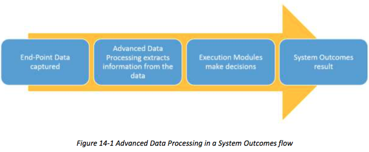
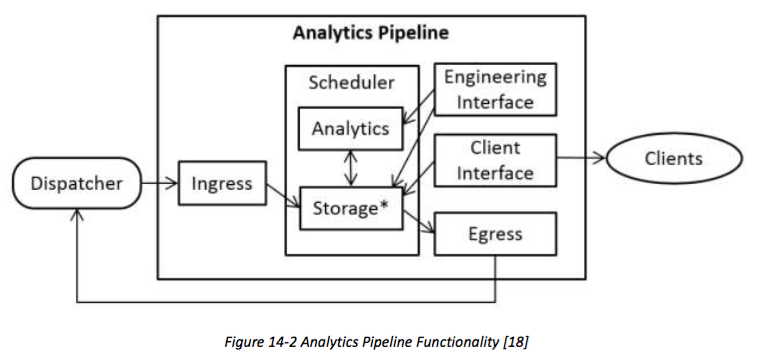

# 13 DATA MANAGEMENT
# 13 数据管理
Industrial Internet Systems Data Management consists of coordinated activities involving tasks and roles from the usage viewpoint and functional components from the functional viewpoint, specifically:
工业网络系统的数据管理由涉及从功能角度看从使用角度看任务，角色和功能部件，特别是协调的活动：

* Reduction and Analytics
* Publish and Subscribe
* Query
* Storage, Persistence and Retrieval
* Integration
* Description and Presence
* Data Framework
* Rights Management
* 削减和分析
* 发布和订阅
* 查询
* 存储，持久性和检索
* 积分
* 说明和状态
* 数据框架
* 权限管理

## 13.1 REDUCTION AND ANALYTICS
## 13.1还原和分析
Sensors and other systems in the IIS produce extremely large amounts of data.[^36] Transmitting all this raw data over the networks to a central data center is often unnecessary and prohibitively expensive, but insights contained in the raw data must not be lost.
在IIS传感器和其他系统产生非常大量的数据。[^36]传送过网络上的所有这些原始数据到中央数据中心通常是不必要的，昂贵的，但包含在原始数据的见解必须不会丢失。

[^36]: Data quality monitoring and sensor health monitoring are common applications for data reduction and analysis.

Reduction and analytics can manage data by either reducing the volume or velocity without losing the value or the information content. It is analogous to lossy data compression, as the original IIS data is irretrievable.
还原和分析可以管理通过降低音量或速度数据，而不会失去价值或信息内容。它类似于有损数据压缩，作为原始数据的IIS不可恢复。

Analytics summarize raw data and produce an approximation of the truth that is suitable for downstream communication, processing and storage, while data sampling and filtering are examples of data reduction techniques devoid of analytics. Data reduction and analytics services suggest a migration of computing, networking and storage resources from enterprise to edge systems.
分析总结的原始数据，并产生适合于下游通信，处理和存储的道理的近似，而数据采样与滤波是数据压缩技术缺乏的分析的例子。数据整理和数据分析服务建议的计算，网络和存储资源从企业到边缘系统迁移。

## 13.2 PUBLISH AND SUBSCRIBE
## 13.2发布和订阅
Publish and subscribe is suited for exchanging data updates between loosely coupled components and allows the publish-subscribe framework to optimize the communication path between publishers and subscribers based on their requirements.
发布和订阅适合用于交换松散耦合的组件之间的数据的更新，并允许发布 - 订阅框架，以优化根据他们的要求发布者和订阅之间的通信路径。

Publish-subscribe contributes to IIS reliability, maintenance and resilience by the decoupling of publishing and subscribing components in both location (location transparency) and time (asynchronous delivery). This decreases the likelihood of fault-propagation and simplifies incremental updating and evolution. Interactions on the receiver side can be periodic (time-driven) or responsive (event-driven), depending on the needs of the user. Asynchronous transfers can also handle IIS component failures such as a network failure on the data path by delaying rather than cancelling an ongoing data transfer operation. 
通过发布和订阅部件在两个位置（位置透明）和时间（异步传送）去耦发布 - 订阅有贡献到IIS可靠性，维护和恢复能力。这降低了断层传播的可能性，并简化了增量更新和进化。在接收器侧的相互作用可以是周期性的（时间驱动）或响应（事件驱动），根据用户的需要。异步传输也可以处理IIS组件故障，如通过延迟而不是取消正在进行的数据传送操作的数据路径上的网络故障。

Publish-subscribe naturally supports the following kinds of IIS data exchange.
发布 - 订阅自然地支持以下几种IIS的数据交换。

Streaming data: Data is continually or periodically updated at fixed rates ranging from KHz frequencies to multi-second periods, requiring low latencies and jitter with best-effort reliability. Components often check for the reception of data on a periodic basis. When the volume of streaming data is exceedingly large, publish-subscribe offers key advantages for the large numbers of interconnected systems.
流数据：数据是连续或定期更新的固定利率从千赫频率多秒的时间，需要低时延和抖动与尽力而为的可靠性。组件经常检查数据的定期接待。当流数据的量是非常大的，发布 - 订阅提供了重要优势，为大量相互关联的系统。

Alarm and event: Data is issued when detection of specific IIS system conditions occurs. This spontaneous publication requires the IIS system to provide at a minimum guaranteed at-least- once delivery. IIS alarm and event data should be delivered with low latency and high priority, and pre-empt lower priority data where needed to ensure critical alarms are transmitted within acceptable delays. Parallel processing of a topic by multiple subscribers is essential when large number of spontaneous alarms or events may arrive at once.
报警和事件：当检测到特定的IIS系统的情况下出现的数据发出。这种自发的出版物需要IIS系统，以提供最低保证的，最小-一次传递。 IIS报警和事件数据应交付低延迟和高优先级，并在需要的地方，确保紧急报警是可以接受的延迟范围内传播抢先低优先级的数据。通过多个用户的一个话题并行处理是必不可少的，当大量自发的告警或事件可能到达一次。

Command and control: Control algorithms or people change the behavior or state of IIS components by generating command and control messages. They are typically time sensitive and require delivery by a deadline to allow target IIS component to react in a timely manner.Spontaneous publication is the norm and it requires guaranteed, low-latency and high-priority delivery, pre-empting lower priority data where needed, to minimize response time.
指挥和控制：控制算法或个人通过生成命令和控制信息更改IIS组件的行为或状态。他们通常是时间敏感，需要交付的最后期限，让目标IIS组件，及时作出反应。自然出版是正常的，它需要保证的，低延时和高优先级传递，抢占在需要低优先级的数据，最大限度地减少响应时间。

Configuration: Configuration or policy data are exchanged to enable IIS components to adjust their algorithms and behavior. These data change slowly, and typically have low latency and low priority requirements. Persistence is essential to support information requirements of newly joining subscribers even when the original moment of publication is missed. The data may also need to persist beyond the lifetime of the original publisher.
配置：配置或政策数据交换，使IIS组件，以调整他们的算法和行为。这些数据慢慢改变，并且通常具有低延迟和低优先级的要求。坚持是必须支持新加入的用户的信息需求，即使公布的原时刻错过。该数据可能还需要持续超过原始发布者的寿命。

Publish-subscribe serves these purposes:
发布 - 订阅服务这些目的：

* Reliable data flow from the edge to a data consolidation and aggregation tier, for example to a cloud-based data services platform.
* Scalable handling of a large, evolving number of data sources such as devices, as well as of a large number of data consumers.
* End-user, application-level data consumption often requires a subscription model, from data consolidated on a platform to application components.
* Reliable control flow from applications or management services to devices: Control commands can be multi-cast in a way that allows devices to get these commands whenever they are ready.
* 从边缘到基于云的数据服务平台的可靠数据流给数据合并和聚合层，例如。
* 的数据源的一个大的，进化的数目可扩展的处理，如设备，以及大量数据的消费者。
* 最终用户，应用程序级的数据消费往往需要订阅模式，从整合在一个平台上的应用程序组件的数据。
* 从应用程序或管理服务，设备可靠的控制流程：控制命令可以多播的方式，使设备得到这些命令时，他们已经准备就绪。

## 13.3 QUERY
## 13.3查询
IISs employ two models to make queries. The one-time query model is associated with traditional databases and it fits well with the request-response pattern. The continuous query model is associated with data stream management systems and in-memory databases. It fits naturally with a publish-subscribe pattern and is better suited to handle infinite and rapidly changing data streams and support real-time analytics.
IISs采用两种模式来进行查询。一次性查询模型与传统的数据库相关联，并且它很好地符合请求 - 响应模式。连续查询模型与数据流管理系统和内存数据库相关联。它天生适合发布 - 订阅模式，更适合处理无限的，快速变化的数据流，并支持实时分析。

IISs use a combination of two styles to select a subset of data from a larger data set: Save Data;Run Query and its inverse, Save Query; Run Data. [^37] Both query styles and models may apply at 1140 different levels in an IIS architecture, including at the device level.
IISs使用两种样式的组合来选择一个更大的数据集数据的子集：保存数据;运行查询和逆，保存查询;运行数据。 [^37]这两种查询方式和模型可能在1140不同层次的应用在一个IIS架构，包括在设备级别。

[^37]: Essentially, the difference is in the active element – in the first case, a knowledge base contains the data and a query is run against that data such as SQL. In the latter case, the query is fixed in a stream processor and the data is run through it to filter out anything from the stream that does not fit. The latter can be a better fit when the data being generated is too voluminous to store, however, once filtered the ‘filtered out’ data is lost.

Addressable devices may support direct queries (e.g. using WebSockets) in pull mode. Alternatively, device data may be pushed to a gateway configured with filtering rules that selects a subset of the device-generated data stream before acting as a data source to a higher-level data broker or data bus.
可寻址设备可以支持拉模式直接查询（如使用的WebSockets）。可替代地，设备数据可以被推动到配置了作为数据源到较高层次的数据经纪人或数据总线之前选择器件产生的数据流的子集过滤规则的网关。

Query serves the following purposes:
查询有以下用途：

* selection of a subset of device-generated data, either pulled by requests to addressable devices or pushed to a gateway running filters, and
* selective, usage-centric access to consolidated data by end-users and analytics, possibly in the cloud
*选择装置产生的数据的一个子集，要么通过请求寻址装置拉或推至一个网关上运行的过滤器，并
*选择，使用为中心，以合并数据，最终用户和分析云中的访问，有可能

## 13.4 STORAGE, PERSISTENCE AND RETRIEVAL
## 13.4存放，持久性和检索
Storage, persistence and retrieval support many IIS functions:
存储，持久性和检索的支持许多IIS功能：

Record supports defining and persisting a subset of IIS data in sequential order. Preserving time- stamping information supports ordering identification and reproduction between different data sets. Record data is typically not queried or reproduced as a time-series. Record is used for meeting record-keeping obligations, post-processing and analysis, replaying of system scenarios and related II use cases.
记录支持定义和坚持的IIS数据子集的顺序。保留时间标记信息支持订购不同的数据集之间的识别和繁殖。记录数据通常不查询或再现为一个时间序列。纪录是用来满足保存记录的义务，后处理和分析，回放的系统方案和相关II的用例。

Replay supports retrieving a collection of IIS data previously recorded by replaying data-items in the order received. Replay supports creating simulation environments, regression tests and related II use cases.
重播支持检索先前通过重放数据项中接收的顺序记录的IIS数据的集合。回放支持创建仿真环境，回归测试以及相关的II的用例。

Historian persists selected data for delayed time-series analysis.
历史学家持续延迟的时间序列分析所选择的数据。

Big data solutions support voluminous IIS Control Domain system data. 
大数据解决方案支持大量IIS Control Domain系统的数据。

Storage, persistence and retrieval serve these purposes:
存储，持久性和检索服务于这些目的：

* creation of audit records for future auditing (record and historian)
* support for simulations and various forms of testing (record and replay) and 
* reliable storage and scalable archiving (Big Data).
* 对未来审计（记录和历史学家）创作的审计记录
* 用于模拟和各种形式的测试（录制和回放）的支持，
* 可靠的存储和可扩展的归档（大数据）。

## 13.5 INTEGRATION
## 13.5集成
Subsystems often have only partially compatible data models, so integration mechanisms between them are essential. An IIS Integration mechanism may use a wide variety of available integration mechanisms, including:
子系统往往只是部分兼容的数据模型，所以它们之间的整合机制是必不可少的。一个IIS集成机制可以使用各种可用的一体化机制，其中包括：

Syntactical transformation, which requires knowledge about the structure of the data and transformation rules in both IIS subsystems. Presence Discovery (see below) partially addresses this requirement. Semantic compatibility is also required and can be achieved via an Open Standards based metadata solution such as ISO 11179.
语法变换，这需要了解的数据，并转换规则中的IIS子系统的结构。存在发现（见下文）部分地解决了这个要求。语义兼容性也是必需的，可以通过基于开放标准的元数据解决方案，如ISO11179来实现。

Domain transformation, which converts a data domain based on one protocol to a data domain based on another.
域变换，其将基于一个协议到基于另一个数据域上的数据域。

Integration serves these purposes:
集成服务这些目的：

* enabling integration across various middleware and application components and
* supporting functions analogous to conventional ETL, typically occurring in the first stages of data transfer, and preceding initial storage. [^38]
* 在不同的中间件和应用程序组件实现整合和
* 支持功能类似传统的ETL，典型地在数据传输的第一阶段产生的，并初始存储前述。

[^38]: Extract, transform, load, a process in database usage and especially in data warehousing.

## 13.6 DESCRIPTION AND PRESENCE
## 13.6描述和在线
Description and presence enable components to discover the kinds, format, structure and metadata of available system data. Both use a variety of available mechanisms including query.
描述和存在使组件以发现可用的系统数据的种，格式，结构和元数据。两者都使用了各种可用的机制，包括查询。

Presence allows components to discover which kinds of data are available using mechanisms such as query.
存在允许组件发现哪些类型的数据都可以使用的机制，如查询。

Metadata description enables components to obtain definitions of the structure of, and other information about, the present data.
_元数据描述使成分，得到的结构，以及有关，本数据等信息的定义。_

Description and presence serve the following purposes:
描述和状态达到以下目的：

* dynamic integration of new application components or middleware in a deployed IIS,
* addition of new types of devices with different data models and communication modes, 
* design of a system management console applicable to various IISs and
* composition of IIS with different data models.
* 新的应用程序组件或中间件的部署IIS动态集成，
* 增加新的类型具有不同的数据模型和通信方式的设备中，
* 系统管理控制台的设计适用于不同的IISs和
* IIS与不同的数据模型组成。

## 13.7 DATA FRAMEWORK
## 13.7数据框架
Data frameworks provide users with insight into state and behavior of data exchange
components by exposing diagnostic data, such as data update rates, number of discovered framework participants and detected message loss. Diagnostic data is similar to other data and therefore subject to all regular data mechanisms.
数据框架，为用户提供洞察状态和数据交换组件的行为被揭露的诊断数据，如数据更新率，发现框架参加人数和检测到的信息丢失。诊断数据是类似其他数据，并因此受到了所有常规数据的机制。

Monitoring and analyzing framework-associated information access is required such as data exposed by ‘description and presence’. Framework mechanisms produce regular data that should be accessible via ‘publish, subscribe and query’. The data provided enables creation of a dashboard for the data management framework that can track:
监测和分析框架，相关的信息需要访问如“描述和存在'暴露的数据。框架机制产生定期的数据，应该是通过“发布，订阅和查询”访问。提供的数据能够创建仪表盘的数据管理框架，可以跟踪：

Component presence discovery identifies IIS component past or present framework participation.
组件存在发现标识IIS组件过去或现在的框架的参与。

Component activity monitoring monitors IIS component data such as update frequencies, throughput numbers, CPU load and memory usage.
组件活动监控显示器IIS组件的数据，例如更新频率，吞吐量数字，CPU负载和内存使用情况。

Traffic monitoring monitors data flow characteristics such as data exchange volume, throughput,latencies, and jitters.
交通监控监测的数据流特性，如数据交换量，吞吐量，延迟，抖动和。

Data frameworks serve these purposes:
数据框架为这些用途：

* design of a system management console applicable to various IIS and not specific to system technologies and components and
* ongoing deployed IIS testing and diagnostics
* 系统管理控制台的设计适用于各种IIS和不特定的系统技术和部件，并
* 持续部署IIS测试和诊断

## 13.8 RIGHTS MANAGEMENT
## 13.8权限管理
IIS data rights management identifies and tracks data ownership. Rights management enables data owners to grant use rights, manage access based on the granted rights, and protect against unauthorized use. Rights management must be built on security functions but are clearly distinct from generic data protection and privacy.
IIS数据权限管理识别和跟踪数据的所有权。权限管理使数据所有者授予使用权，管理基础上，授予的权限访问，并防止未经授权的使用。权限管理必须建立在安全的功能，但显然，从一般的数据保护和隐私截然不同。

Rights management serves these purposes:
权限管理服务这些目的：

* general data stewardship, in particular in case of consolidation and integration scenarios (between IISs, or IIS integration with enterprise systems),
* out-sourcing of data-related functions of an IIS to third parties such as cloud providers and
* support for regulatory and compliance requirements.
* 一般的数据管理，特别是在案件的整合和集成方案（IISS之间，或与企业系统集成的IIS）
* 外包的IIS给第三方，如云提供商的数据相关的功能和
* 监管和合规性要求的支持。

# 14 ANALYTICS AND ADVANCED DATA PROCESSING
# 14 分析和先进的数据处理
Analytics and advanced data processing transform and analyze massive amounts of data from
sensors to extract useful information that can deliver specific functions, give operators insightful information and recommendations, and enable real-time business and operational decisions, as shown in Figure 14-1. This section discusses the middle two boxes: advanced data processing in a system outcomes flow.
分析和先进的数据处理来自传感器的转换和分析海量数据的提取，可以提供特定的功能，使运营商有见地的信息和建议，并支持实时业务和运营决策，如图14-1的有用信息。本节讨论中间两个框：在一个系统的结果流了先进的数据处理。



## 14.1 ADVANCED DATA PROCESSING
## 14.1先进的数据处理
Advanced data processing enables a better understanding of system operational states and environments. It identifies and analyzes emerging information patterns to enable control system assessments under varied conditions in different environments. These assessments improve functionality and reduce operational cost and negative effects. For example, they enable utility companies to optimize electricity level output based on dynamic usage patterns that factor in weather, season, events, pricing, resource availability, cost and electricity generation asset availability; support vehicle and equipment fleet management; optimize smart home energy management and other unimagined capabilities. This is called dynamic operations optimization.
先进的数据处理能更好地了解系统运行状态和环境。它识别和分析新兴的信息模式，以便在各种条件在不同的环境下的控制系统的评估。这些评估改进功能和降低运营成本和负面影响。例如，它们使公用事业公司基于这样的因素天气，季节，事件，定价，资源可用性，成本和发电资产的可用性动态使用模式的电平输出进行优化;支持车辆和设备的车队管理;优化的智能家庭能源管理等难以想象的能力。这就是所谓的动态操作优化。

Advanced data processing can also optimize system missions. For example, metropolitan area real-time traffic pattern analysis combined with roadway conditions, roadway construction and maintenance, weather condition, time and day, seasons, accidents and other events can lead to vehicle control systems determining optimal routes to reduce travel time, congestion, pollution and energy consumption.
先进的数据处理还可以优化系统的任务。例如，城域网实时流量图案分析结合巷道条件，道路施工及维修，天气状况，时间和日，季节，事故和其他事件可导致车辆控制系统确定最佳路由，以减少旅行时间，拥堵，污染和能源消耗。

Industrial Internet advanced data processing consists of a number of components, with the two primary disciplines being complex event processing and advanced analytics. They share a common objective in discovering meaningful patterns from data.
工业因特网先进的数据处理包括多个部件，与两个主学科被复杂事件处理和高级分析。他们从数据发现有意义的模式都有一个共同的目标。

Complex event processing receives streaming data from disparate sources to detect, abstract, filter and aggregate event-patterns, and finally to correlate and model them to detect event relationships, such as causality, membership, and timing characteristics. By identifying meaningful events and inferring patterns that suggest large and more complex correlations, proper responses can be made to these events and circumstances.
复杂事件处理接收流媒体从不同来源的数据进行检测，抽象，过滤和聚合的事件模式，最后以关联和模拟他们检测事件的关系，如因果关系，成员身份和时序特性。通过确定有意义的事件，并推断建议大和更复杂的相关性的模式，适当的响应，可向这些事件和情况。

Advanced analytics are used to discover and communicate meaningful patterns in data and to predict outcomes. Traditional business analytics are typically applied to business data to describe, predict and improve business performance.
高级分析用来发现和交流有意义的模式数据和预测结果。传统的业务分析，通常适用于业务数据来描述，预测和提高经营业绩。

Advanced data processing can reside in various components in an IIS across the breadth of its Functional Domains. It may, for example, be implemented in the information domain to analyze data aggregated from the control domain, other functional domains and external sources to providing analytic results covering the full scope of an end-to-end IIS. It may also be implemented in the control domain to analyze data to realize functionality in a local scope.
先进的数据处理可以驻留在各种部件在横跨其功能领域的广度IIS。它可能，例如，可以在从控制结构域的聚集数据，其它功能结构域和外部来源分析提供分析结果覆盖的端至端的IIS的全部范围的信息域中实现。它也可以在控制域中实现对数据进行分析，以在局部范围实现功能。

## 14.2 ADVANCED DATA PROCESSING PATTERN AND PROPERTIES
## 14.2 先进的数据处理格局与性能
Advanced data processing can be implemented according to a variety of architectural patterns. One common architecture is a pipes and filters architecture [17] that allows pipelines to be created, in parallel and series, based on the application requirements, as depicted in Figure 14-2. The value in this composability is two-fold:
先进的数据处理可以根据各种架构模式来实现。一个共同的体系结构是一个管道和过滤器结构[17]，它允许将创建管道，在并联和串联，根据应用的要求，如在图14-2所示。在此组合性的值是双重的：

* the problem is divided into parts where each can be solved independently, to support different requirements and
* pipelines need not be co-located allowing the processing to be deployed as appropriate.
* 问题分成部分，其中每一个都可以独立地解决，以支持不同的要求，并
* 管线不必共同位于允许处理被部署为适当。



Two components enable change over time. A dispatcher directs the input to the relevant analytics pipeline(s) that supply an environment in which data is analyzed and stored, and clients either pull data from a pipeline (as a query), or have data pushed to them (a notification).
两个组件能够随时间的变化。甲调度指示输入到相关分析管线表示供应，其中数据分析和存储的环境中，与客户端或者从管道（作为查询）提取数据，或具有数据被推给他们（通知）。

A pipeline feeds the dispatcher with data, composed with other pipelines that tap into these data streams. Each analytics pipeline has a model set of features:
一个管道饲料调度数据，与其他管线的挖掘这些数据流组成。每个分析管道具有特征的模型集：

* ingress: connected to the dispatcher with the responsibility to transform the incoming data stream into something the storage component can handle,
* storage: temporary or long-term resource, such as a buffer, memory, disk, storage cluster, distributed file system that makes the data available to other components,
*analytics: configured with algorithmic functionality, which is designed using the
engineering interface ,
* outgress: responsible for exposing the pipeline results,
* Scheduler: manages concurrent access to storage and schedules the analytics tasks,
* engineering interface: design time environment for specifying and experimenting with
analytics algorithms, and
* client interface: provides access the data, including analytics results.
* 入口：连接到调度程序与责任来转换输入数据流弄成存储组件可以处理，
* 存储：临时或长期性的资源，如缓冲器，存储器，磁盘，存储簇，分布式文件系统，使得提供给其他组件的数据，
* 分析：配置了算法的功能，这是使用的工程设计的接口，
* outgress：负责公开管道结果，
* 调度：管理并发访问，存储和调度分析的任务，
* 工程界面：设计时环境，用于指定和分析算法进行实验，并
* 客户端接口：提供访问数据，包括分析结果。

Each pipeline should have an ingress and egress specification defining compatibility criteria for the dispatcher and other pipelines, and a quality-of-service specification setting response-time expectations. 
每个管道应具有一个入口和出口规范限定兼容性标准的调度和其它管道，并服务质量的一个规范设定响应时间的期望。

To match defined application needs, each pipeline type’s properties must be understood.
要匹配定义的应用需求，每条管线类型的属性必须被理解。

Property | Description 
------------ | ------------- 
Data Flexibility  | New/unknown data types, without data model modification
Algorithm Flexibility | Variety of supporting libraries, query representations
Productivity | Ratio between effort and cost
Static Capacity | Store or configure permanently
Dynamic Capacity | Process or manage data simultaneously with concurrent tasks
Analytics Latency | Time delay experienced in core data processing
Round Trip Response | Time elapsed between request and response
Scalability | Ease, speed and affordability of changing performance qualities
Reliability | MTBF, operation when faults occur, degree of recovery, no data loss
属性| 描述
数据灵活性|新的/未知的数据类型，而没有数据模型修正
算法的灵活性|多款支持库，查询交涉
生产力|付出与成本比率
静电容量|存储或配置永久
动态容量|处理或并发任务的同时管理数据
分析延迟|延时经历了核心数据处理
往返响应|经过时间的请求和响应之间
可扩展性|轻松，速度和变化的性能品质的负担能力
可靠性|平均无故障时间，运行时出现故障，采出程度，没有数据丢失

Table 14-1 Analytics Pipeline Properties [18]

## 14.3 ADVANCED ANALYTICS
## 14.3 高级分析
Advanced analytics are intended to spot opportunities in real-time, make fast and accurate predictions and act with confidence at the point of decision. These advanced analytics fall into four major categories:
先进的分析的目的是发现商机实时，使快速而准确的预测，并与在判定点信心行动。这些先进的分析功能可分为四大类：

* descriptive analytics: gain insight from historical data with reporting, scorecards, clustering and such.
* predictive analytics: identify expected behaviors or outcomes based on predictive modeling using statistical and machine learning techniques.
* prescriptive analytics: recommend decisions using optimization, simulation etc.
* 描述性分析：从获得与报告，记分卡，集群和这样的历史数据的洞察力。
* 预测分析：确定预期行为，或基于使用统计和机器学习技术的预测模型的结果。
* 规范分析：建议用优化决策，模拟等。

The results of analytics can be used to support human decisions through visual analytics to enhance human understanding and generate confidence in a decision 
分析的结果可以通过使用可视化分析，以支持人类的决策，以提高人的理解和产生信心的决定

Advanced Analytics use a combination of the following execution approaches:
高级分析使用相结合的以下执行方法：

* Automated: automated data analysis, modeling and result application to automatic and continuous executions (including improving the analytics and modeling themselves in systems capable of learning).
* Real-time: near instantaneous analytic results with correct timing information enabling appropriate and timely actions.
* Streaming: continuous results flow of on-the-fly analysis of live streaming data in memory without storage persistence until after analysis completion.
* Active: active sharing of real-time pattern discoveries with other components enabling
fast and accurate responses to discovered system changes.
* Causal-oriented: identifying complex, causal relationships in the data anchored in well-
understood physical laws enabling better analysis using new approaches such as physical modeling and combining physical modeling with neural network deep-learning capabilities.
* Distributed: shared processing and results generation leveraging dynamic inter- and intra- functional domain relationships within and across II systems.
* 自动：自动数据分析，建模和结果应用到自动连续执行（包括提高分析和学习能力的系统建模本身）。
* 实时：具有使适当和及时的行动，正确的定时信息近瞬时分析结果。
* 流：上即时分析在存储器实时流数据的连续结果流无存储装置的持久性，直到分析结束后。
* 活动：以使得能够发现系统的变化快速，准确的答复等组成积极共享实时模式的发现。
* 因果导向：识别挂靠在使用新的方法，如物理建模，并结合神经网络的深度学习的能力，物理模拟更好的分析很好理解的物理定律的数据复杂，因果关系。
* 分布：共享处理和结果的产生利用内部和跨II系统动态间和细胞内功能区的关系。

IIS place unique requirements on advanced analytics to include timing constraints, data volume constraints and safety criticality, as described below.
Timing constraints: If network latency cannot meet real-time requirements or the communication is not dependable, analytics must be performed in close proximity to the data sources and the systems that consume the results. For example, the results of image analytics of an autonomous vehicle must be made available to the model executor controlling the driving system within milliseconds.
高级分析的IIS地方独特的要求，以包括定时约束，数据量的限制和安全临界性，如下所述。
时序约束：如果网络延迟无法满足实时性要求或通信是不可靠的，分析必须在靠近数据源和消耗的结果的系统来执行。例如，自主汽车的图像分析的结果必须提供给模型执行人控制在几毫秒内驱动系统。

Data volume constraints: Control systems that operate at high frequency and high speed, such an aircraft engine process large volume of time-series data of high resolution in both time and value. Network bandwidth constraints may make it infeasible to transport such large data volumes across the network. Dynamic Composition and Automated Interoperability, enables dynamic binding of the data to the analytic capabilities at the edge, and bursts of high volume data to the appropriate analytic systems on demand. When low-level, high-resolution data are analyzed locally, summary data can find useful patterns across fleets of systems.
数据量的限制：在高频率和高的速度工作的控制系统，例如飞机引擎进程大体积的高分辨率在时间和值的时间序列数据。网络带宽的限制可能使得不可能通过网络传输如此大的数据量。动态组合物和自动互操作性，使数据的分析功能在边缘的动态结合，和高容量的数据，以根据需要适当的分析系统的脉冲串。当低层次的，高分辨率的数据进行本地分析，汇总数据可以发现有用的模式在整个系统车队。

Safety criticality constraint: Safety-critical situations such as the presence of a child in an autonomous vehicle requires instantaneous, zero-fault-tolerant analytic. Failure to execute a safety override because the image analytics failed due to poor image quality is not an option.
安全的关键性制约因素：安全，紧急情况下，如一个孩子在自主汽车的存在需要瞬时，零容错分析。未能执行安全超控，因为图像的分析失败，原因是图像质量差是不是一种选择。
