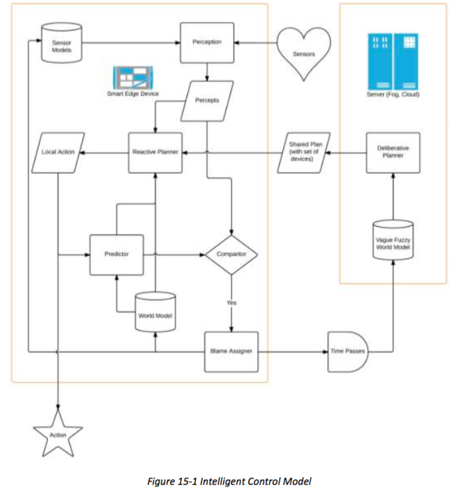

# 15 INTELLIGENT AND RESILIENT CONTROL
# 15 智能弹性控制
## 15.1 MOTIVATION 
## 15.1 动机
The control model prevailing in industrial automation systems today tends to be localized in scope and reactive in response, such as the limited implemented by When we embark on the task of creating a control, even a simple PID controller, we must consider a number of system engineering factors in respect to the conditions, constraints on operation, and the context. We then build a mechanism that takes some inputs to produce some outputs including engineering data values (voltages, temperatures etc.) and control signals to hardware, (opening or closing a breaker). Most of these factors are kept in the heads of the control (systems?) engineers and are thus a black box.
控制模型当今流行的工业自动化系统往往是局部的活动范围和应对反应，如受限于当我们走上创建一个控件，甚至一个简单的PID控制器的任务来实现，我们必须考虑一系列制度工程因素在相对于所述的条件下，在操作的限制，并在上下文。然后，我们构建需要一些输入来产生一些输出，包括工程数据值（电压，温度等）和控制信号的硬件，（打开或关闭断路器）的机构。大多数的这些因素都保持在控制的磁头（系统？）的工程师，因而一个黑盒子。

In IISs, we intend to perform distributed rather than local control, and to make predictions about how the world will change as a result of control. Moreover, this control must be 'intelligent and resilient’ so that it can operate within a dynamic and unpredictable environment, using a distributed, collaborative capability to sense, make sense of, and affect the world and so achieve the goals of the specific entity that is acting (the agent). However, to reason and make predictions about how other controllers will work, particularly in unpredictable circumstances and dynamic environments, etc., we need transparency into that black box—the head of the control engineer. We need to understand how those choices were made, and what models of the world, assumptions about the world, understanding of the actions an actuator can take, and so on,
prompted those decisions.
在IISs，我们打算执行分布，而不是局部控制，并且使这个世界将如何改变作为控制的结果预测。而且，这种控制必须是“智能和弹性的”，以便它可以在动态和不可预测的环境中操作，使用分布式，协同能力以感测，使感，并影响世界等实现的具体实体的目标，这担当（代理）。然而，推理和对如何其它控制器将工作，特别是在无法预测的情况下和动态环境等的预测，我们需要透明度到控制工程师的黑盒的头部。我们需要了解这些选择被做了，和这个世界的模型，对世界的假设，致动器可以，等行动的认识，
促使这些决定。

By employing models, either explicit or implicit, we can affect the desired intelligent control of the resources available to the agent and enable planning to bring the world to a state more acceptable to our interests. By making these modeling choices explicit, we improve the communication with the users of the system, and enable more advanced approaches to resiliency.
通过采用模型，显式或隐式的，我们可以影响可用的代理资源的期望的智能控制，使规划将世界到更容易接受我们的利益的状态。通过使这些建模选择明确的，我们提高与系统的用户的通信，并实现更先进的方法，以弹性。

## 15.2 CONSIDERATIONS
## 15.2 考量
The control engineer makes these choices based on a number of considerations, including:
控制工程师使得这些选择基于许多因素，其中包括：

Is the model of the world fully or partially observable? In a chess game, where the world is completely observable, the rules are known, so a legal move has a deterministic result. We may not be able to precisely determine the opponents move, we know it will be from a list of legal moves, and once it has been made we will know which move in the list has been taken. On the other hand, in a world that is only partially observable, such as many card games where cards are hidden, we are forced to infer world state based on the actions of the opponent. This affects our choices of the decision theory to use, the way we will model the world, the kinds of recovery strategies that are available to us after a fault, etc.
是世界的模型全部或部分可观察到的？在国际象棋比赛，那里的世界是完全可观的，规则是已知的，因此法律的举动具有确定性的结果。我们可能不能够精确地确定对手移动，我们知道这将是从合法动作列表，并且一旦它已被提出，我们将知道哪个移动列表中已采取。在另一方面，在世界上只有部分可观，比如很多纸牌游戏，其中卡是隐藏的，我们不得不根据对手的行动来推断世界的状态。这会影响我们的选择决定的理论来使用，我们将模拟世界的方式，各种恢复策略是提供给我们一个故障后，等

Are actions deterministic or probabilistic? When dealing with actions that can fail, such as a game of billiards, we are forced to consider not only the position of the balls we want to create if our shot is successful (leading to the next shot we will take being easier), but also that if we are unsuccessful (leading to the next shot our opponent will take being harder). Many models presume sensing the world is ‘free’ in that it evolves continuously and outside of the influence of our decision making system, but taking a reading may require effort in that we have to move our sensor to observe something. That means that a world that might at one level of analysis appear to be fully observable is really only partially observable (because we don’t have the processing capability to digest all of the sensor information we may be receiving) and also that what we think is the ‘right’ choice may not be, because we didn’t see everything—the outcome of a particular action in a fully known state may be deterministic, but if we can’t fully know the state— if some portion of it is uncertain, then we may want to say that the outcome of the action is uncertain (probabilistic) as well.
是行动的确定性或概率？当可能发生故障的动作，比如打台球的处理，我们不得不考虑我们要建立，如果我们的投篮成功（导致下一个镜头，我们将是更容易）的球不仅是位置，但同样，如果我们不成功（导致下一个镜头我们的对手将是更难）。许多模型假设感知世界是“免费”的，因为它不断地和我们的决策系统的影响之外的发展，但同时读取可能需要努力，我们必须将我们的传感器来观察的东西。这意味着，可能在分析一个级别出现的世界完全观察到真的只有部分观察到的（因为我们没有足够的处理能力来消化所有的，我们可以接收传感器信息），而且我们在想什么是“正确”的选择可能不是，因为我们没有看到一个完全已知状态特定的动作可能是确定性的一切-的结果，但如果我们不能完全知道语句，如果它的某些部分是不确定的，那么我们可能想说的是，该操作的结果是不确定的（概率）为好。

Can we plan all at once, or must we plan-to-plan? One way to deal with uncertainty is to defer planning until we have more knowledge—that is we can ‘plan to plan’ in that we create a partial plan that includes ‘planning’ as an action that will be taken under certain circumstances.
我们可以计划一次全部，或者我们必须从计划到规划？处理不确定性的方法之一是延迟规划，直到我们有更多的知识，也就是我们不能计划计划'中，我们创建部分计划，其中包括“规划”，因为他们会在某些情况下采取的动作。

>Example: I may not know the train schedule to NY, so I have to plan to get the schedule before I buy the ticket. Since getting the schedule is insufficient to know which ticket to buy, I then have to plan to plan - decide now to postpone my decision as to which train to take, and thus the specifics of what I will do upon arrival. Or I may create a contingency plan, where I do all the work now iterating through every reasonable contingency, e.g., arrival before lunch,arrival after lunch, arrival after dinner, arrival after the subways are shut down, etc. It is a metacognitive action to decide which kind of plan I should create, but that decision can also be fixed at design time (i.e. the system will always generate a non-contingent plan, and if there are sufficient unknowns to prevent generation of such a plan, planning will fail with a list of unknowns to be satisfied).
>例：我可能不知道的列车时刻表，以纽约，所以我有计划，以获得时间表之前，我买了票。由于得到的时间表不足以知道买哪些票，然后我得计划计划 - 现在决定推迟我的决定哪个训练取，因而我会做什么在抵达时的具体细节。或者，我可以创造一个应急计划，在那里我做了所有的工作，现在通过各种合理的应急迭代，比如，午饭前到达，午餐后抵达，晚餐后到来，地铁抵达后都关机等，这是一种认知行为决定哪一种方案我应该创建，但该决定也可以固定在设计时（即系统总是会生成一个非偶然的计划，如果有足够的未知因素，防止产生这样的计划，计划将失败与未知的名单得到满足）。

Can we specify alternative methods to achieve goals? There’s usually more than one way to skin a cat, and just as there are several possible routes to travel from point A to point B, by specifying multiple non-redundant ways to achieve a goal we build in a mechanism for the system to have backup strategies. For instance, while raising the house temperature is best achieved by turning on the furnace, a fireplace can be used, or the stove, or electrical heaters - all alternative methods that can be used if the furnace temporarily is non-operational.
我们可以指定其他方法来实现目标？还有平时对皮肤一只猫的方法不止一种，只是因为有几个可能的路径从A点行驶到B点，通过指定多个非冗余的方式来实现我们建立一个机制，一个目标系统具有备份策略。例如，并同时将房子温度最好通过接通炉实现，壁炉可以使用，或炉子，或电加热器的 - 所有的替代方法，可使用，如果在炉暂时是不可操作。

Can we specify methods to reclaim or recover resources (particularly after casualty)? Such methods may be as simple as instructions for rebooting the network routers in case the network stops working, to strategies for reducing electrical usage to allow high current machinery to be started. Similar to the alternative methods, such an approach allows us to construct resilient systems - those that can reconstitute their capabilities after a failure. One can easily imagine resources having been assigned to processes (such as a database) to be in an unknown state during use, but should the process fail, we need to have a method to return those resources to some kind of known good state so they can be used again without having to wait for repair. In a database, this might be a rollback; in a nuclear power plant, this might be an orderly shutdown followed by a cold restart.
我们可以指定方法来回收或（特别是事故发生后）恢复的资源？这样的方法可以很简单，如对于重新启动网络中的路由器的情况下在网络停止工作，以策略，以减少电力使用，以允许开始高电流机械指令。类似于替代的方法，这种方法使我们能够构造弹性系统 - 那些在发生故障后，可以重建他们的能力。人们可以很容易想象的资源已经被分配给进程（如数据库）是在使用过程中未知状态，而应该在过程中失败，我们需要有一种方法对这些资源的恢复某种已知的正常状态，使他们可再次使用，而不必等待维修。在数据库中，这可能是一个回滚;在核电厂，这可能是一个有序的关闭之后冷启动。

Do we want to learn and adapt to our inputs over time? Our main concern is application to dynamic situations - so the connection between the inputs and outputs may not be known perfectly at design time, and may change over time. For instance, if we are controlling both heat and humidity in a house, we may not know what kind of insulation the house has, and the system may not even know the time of the year it is (so if heating or cooling will be called for, if humidity will need to be added or subtracted, and at what rate). We will know that cooling will dehumidify. But presuming we have (unlike most residential systems) the ability to change the rate of cooling or adjust the balance between cooling and dehumidification, we may want to do so based on how the system has reacted in the past to such controls and furthermore be willing to readapt since seasonal changes will alter the response.
难道我们要学习和适应我们的投入随着时间的推移？我们主要关心的是应用到动态情况 - 这样的输入和输出之间的连接可能不知道完全在设计时，也可以随时间改变。例如，如果我们同时控制温度和湿度在一所房子，我们可能不知道什么样的绝缘的房子有，并且系统可能甚至不知道年它的时间（因此，如果加热或冷却将被称为为，如果湿度将需要被相加或相减，以及以何种速率）。我们都知道，冷却会除湿。但追求，我们有（不像大多数住宅系统）来改变冷却速率或调整冷却，除湿之间的平衡的能力，我们可能会想这样做基于系统如何在过去已经反应到这样的控制，此外愿意要重新适应，因为季节的变化会改变的响应。

These considerations allow building appropriate models of and the relationships between the following that were previously mapped in the control engineer’s head:
这些考虑允许建立适当的模式和先前映射到控制工程师的头部以下的关系：

* the (relevant) world (context, environment, state of the universe, etc.),[^39]
* action (both atomic and compound—e.g. a typical process that does something useful),
* communication (as a kind of action),
* intention (as of other agents),
* sensors,
* actuation and
* ethics (that is, those actions we must and must not do within a context)
* 在（有关）世界（背景下，环境，宇宙的状态等），[^39]
* 动作（包括原子和化合物 - 例如，一个典型的过程中，做一些有用的东西），
* 通信（作为一种行为），
* 意向（如其他代理），
* 传感器，
* 驱动和
* 道德（即，这些行动一定要且必须在环境中不会做）

[^39]: Modeling invariably involves abstracting away irrelevant detail. Deciding what is and what is not relevant is part of the job and risks of systems engineering.

## 15.3 FUNCTIONAL COMPONENTS
## 15.3 功能组件
Figure 15-1 is a sketch of one way we might architect an intelligent control for a very dynamic environment. As a top-level decomposition, we have the following modules:
Deliberative and reactive planners: Long-horizon plans (typically called “deliberative”) set goals. Short-horizon planners (“reactive”) make satisficing real-time decisions (addressing resiliency) using a long-term plan to guide executing the plan in the current situation. Thus even when the long-term plan is obsolete, i.e. we cannot execute the plan as written, the reactive planner must be able to modify it on the fly to fit the actual circumstances. The planners handle most physical or logical planning constraints. For example, you cannot put down something you are not holding and you cannot use two positives to make a negative.[^40]
图15-1是一个我们可能建筑师智能控制一个非常动态的环境的方式草图。作为一个顶级的分解，我们有以下几个模块：
协商和无功策划：龙地平线计划（通常称为“协商”）设定的目标。短视距规划师（“无”），用长远的计划，以指导执行该计划在当前形势下做出令人满意的实时决策（寻址弹性）。因此，即使在长期计划是过时的，也就是说，我们不能执行书面，无功规划师必须能够修改它的飞行，以适应实际情况的计划。规划者处理大多数物理或逻辑的规划限制。例如，你不能放下的东西，你不拿着，你不能同时采用两种阳性做出负面的。

[^40]: Yeah, yeah. [32]



The deliberative planner needs more resources to establish a long-term plan, and is driven on a general understanding of the current world state, but is not the ‘man on the scene.’ That is the reactive planner, in the tight loop with the sensors and actuators making moment-to-moment decisions—guided by the long term plan, but able to override actions—the long term plan provides the moral equivalent of ‘commander’s guidance’ while the reactive planner is the non-commissioned officer making tactical decisions under fire.
慎思规划师需要更多的资源，建立一个长期计划，并推动就当前世界状态的一般理解，但不是“人的身影。”这是无功规划师，在紧凑循环使用传感器和执行器制作的时刻到时刻的决策导向的长期计划，但能够覆盖的行为，长远规划提供了“指挥官的指导意见”的道德等同，而反应的策划者是士官做出战术决定下火。

Because planning is a joint activity, and ‘the plan’ may not be visible to any particular agent or set of agents—since much of the plan is parochial and by the time it is observed by a (remote) agent, it will have been implemented or overtaken by events. A flexible mechanism for planning and implementing plans is therefore called for. One recommendation is a small but flexible reactive planner in the device itself and a deliberative (offline) planner provided as a service by a larger system or through remote service providers.
因为规划是一个关节活动，和'计划'可以是不可见的任何特定试剂或一组代理-因为许多计划的是狭隘和由它是由一个（远程）剂中观察到的时间，它会一直实施或事过境迁。因此，一个灵活的机制来规划和实施计划的要求。一个建议是在设备本身和由一个较大的系统或通过远程服务提供商提供的作为服务一个审议（脱机）筹办一个小而灵活反应性规划器。

Predictor and precepts: Because plans may fail in an uncertain and dynamic world, we should expect that any particular agent’s plan may fail, and that its models may make mistakes and fail. We therefore need perception to look at the relevant part of the world (driven by the plan) and for it to generate percepts—individual perceptions of interest to the agent.
预测和戒律：因为计划可能会在一个不确定的和动态的世界失败，我们应该期待什么特别的代理人的计划可能会失败，它的型号可能会犯错误和失败。因此，我们需要观念来看待世界（由计划驱动）的相关部分，并为它产生的利益的代理知觉个体的看法。

The Predictor function informs the reactive planner what the likely outcome of planned actions will be, and through the comparator can look at what actually happened as the result of taking an action. If there is no difference, the operation continues but when there is a difference, we invoke the Blame Assigner (see below). A predictor function predicts what the state of the world will be at some point in the future, given an action or lack of action by that agent. (We regard not taking an action as an action: waiting). We can break the predictor down into two components: one that uses the models to chain out a possible future, and another that learns from experience. A learning function also requires additional parameters, including at least the inertia (how long to wait until making a prediction) or entropy rate (how likely is the pattern of the next input to be different from the past). (As an example, if we see the time series 0, 1, 1, 2, 3, 5, 8, 13: at what point do we react and say ‘Fibonacci’—after the 2? The 3? The 13? At what point do we go back and make sure we are still seeing Fibonacci numbers? Every time? Every xx numbers? What if the pattern repeats? Stops and changes to some other pattern?).
预测功能可为无功规划师有什么计划行动的可能的结果将是，通过比较可以看看究竟发生了什么，作为采取措施的结果。如果没有差别，操作继续，但如果是有区别的，我们调用了追溯分配器（见下文）。一个预测函数预测世界的状态会是怎样在未来的某个时刻，鉴于该代理人的行动或不采取行动。 （我们认为不采取行动的一个动作：等待）。我们可以打破预测器分解成两个分量：一个使用这些模型来链条出一个可能的未来，而另一个从学习体验。学习功能还需要额外的参数，包括至少惯性（等待多长时间，直到进行预测）或熵率（怎么可能是下一个输入的模式是与以往不同）。 （作为一个例子，如果我们看到的时间序列0，1，1，2，3，5，8，13：在哪一点我们反应并说“Fibonacci'-后2 3 13在？？？什么时候做，我们回去，并确保我们仍然看到斐波那契数？每一次？每XX号？如果什么模式重复？停止和改变一些其他的方式？）。

Blame assigner: Given a world model, a predictor and a plan, we can predict the likelihood our plan will succeed, and then amend the plan to increase the likelihood of success (in probabilistic models). But we may be ‘surprised’ when our action does not have the intended effect. The ‘blame assigner’ makes the decision as to why things aren’t as we thought they would be by considering a number of possible scenarios to determine the component at fault when something goes awry. It could be bad sensing where the control did generate the expected effect, but our decision to act was based on incorrect sensor data, or the world was not in the state we thought it was when we selected the action. It could be because of a bad model in which we have the wrong effects or likelihood of effects from our action, or because of the conditions under which the action is effective were incomplete, etc. It could also be because of faulty action in which e.g. we intended to press button A, but actually pressed button B, etc.
要怪就怪分配器：给定一个世界模型，一个预测和计划，我们可以预测的可能性我们的计划会成功，然后修改，以增加成功的可能性（以概率模型）的计划。但是，我们可能是“惊讶”当我们的行动没有达到预期效果。该“怪出让方”作出判决，为什么事情并不像我们想象他们会考虑一些可能出现的情况有过错来确定组件时，事情就会出差错。这可能是坏的传感，其中控制确实产生预期的效果，但是我们决定采取行动是基于不正确的传感器数据，还是世界是不是我们想，当我们选择的动作是状态。这可能是因为一个糟糕的模型中，我们有错误的影响或影响我们的行动，或者是因为根据该行动是有效的不完整的条件可能性等，也可能是因为错误的诉讼中，如我们打​​算按按钮A，但实际上按下按钮B等。

Ethical governor: An ethical governor (not in this diagram) might also be used to vet the action decisions to make sure that the agent does not perform any action it ‘must not’ perform (for, e.g., safety, security, or other reasons) and does perform any action it ‘must’ perform. It is a special deontic checker that validates that a course of action is within the scope of agreed upon ethics within appropriately negotiated, communicated, and represented community policies. The ethical governor must have the ability to override the agents’ intentions. We give ethical rules special treatment because they do not tend to be an issue at the level of action selection but rather the overall plan pragmatics.[^41]
_道德省长：有道德的州长（未在此图中），也可用于兽医的行动决策，以确保代理不执行任何操作它不能“执行（对，例如，安全，安保，或其他原因）和不执行任何操作它必须“执行。这是一个特殊的道义检查，它验证的行动方针的范围之内约定适当的协商，沟通，并代表社会政策范围内的道德。道德调速器必须具备覆盖代理的意图的能力。我们给道德规则特殊待遇，因为他们不倾向于是一个问题，在行动选择的层面，而是总体规划语。_

[^41]: Ron Arkin: Governing Lethal Behavior: Embedding Ethics in a Hybrid Deliberative/Reactive Robot Architecture [22]

Security, safety and other models implemented by the ethical governor would be able to reject a request made by an operator or other agents. The autonomy implemented by an agent would always have ‘final say’ on accepting or rejecting a request.
保安，安全和其他型号的道德州长实施将能够拒绝由运营商或其他代理人提出的要求。通过代理人实施的自主性总是有'说了算'的接受或拒绝的请求。

Another task of the ethical governor is to determine when it is safe to dynamically change a device’s behavior and/or performance through updating the device by deciding if the update is appropriate for the current circumstance and does not violate a safety or security constraint.
伦理调速器的另一任务是确定何时可以安全通过，决定更新设备动态地改变设备的行为和/或性能，如果该更新是适合当前情况和不违反安全或安全约束。

The agent should also store its own meta-information, so as to advertise its capabilities to the community, or to describe them in whole or in part in answer to a query about them.[^42]
代理还应该存储其自己的元信息，以告知其能力到社区，或描述它们中的全部或部分在回答有关他们的查询。

[^42]: Note that this does not require the agent to understand the meta-information, just be able to report it. The meta-information could then be parsed or interpreted by the receiver, through either pattern matching or general reasoning.
