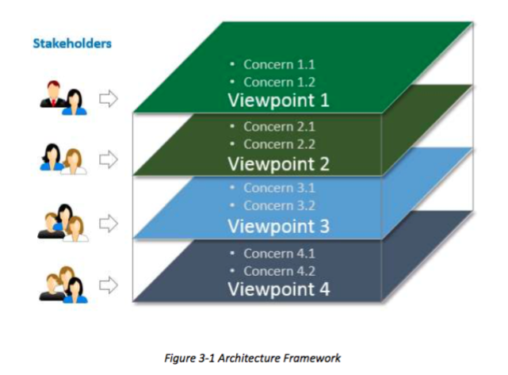
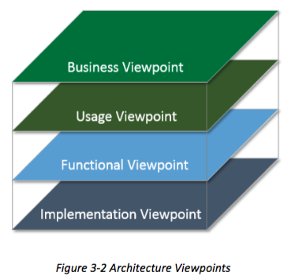

## 3 INDUSTRIAL INTERNET REFERENCE ARCHITECTURE
## 3 工业互联网参考架构
### 3.1 INDUSTRIAL INTERNET ARCHITECTURE FRAMEWORK
### 3.1 工业互联网体系结构
Many stakeholders are involved when considering complex systems such as those expected of Industrial Internet Systems (IISs). These stakeholders have many intertwining concerns pertinent to the system of interest. Their concerns cover the full lifecycle of the system, and their complexity calls for a framework to identify and classify the concerns into appropriate categories so that they can be evaluated and addressed systematically.
考虑到复杂的系统，如预期的工业互联网系统（IISs）的时候，许多利益相关者有参与进来。这些利益相关者有关的感兴趣的系统很多相互交织的关注。他们的关注覆盖系统的整个生命周期，和它们的复杂性要求的框架，以识别和分类的问题纳入适当的类别，以便它们可以评估和系统地处理。

To address this need, the Industrial Internet Consortium has defined an architecture framework that describes the conventions, principles and practices for the description of architectures established within a specific domain of application and/or community of stakeholders. Based on ISO/IEC/IEEE 42010:2011 [5], the IIC Architecture Framework facilitates easier evaluation, and systematic and effective resolution of stakeholder concerns, and serves as a valuable resource to guide the development and the documentation of, and the communication about, the Industrial Internet Reference Architecture (IIRA).
为了满足这一需求，工业互联网协会定义了一个架构框架，描述的约定，原则和实践应用的利益相关者和/或社区的特定领域内建立体系结构的描述。基于ISO/ IEC/ IEEE420102011[5]，在IIC体系结构框架有利于更容易评估和利益相关者的关注系统，有效的解决，并作为一种宝贵的资源，引导发展和文档，以及有关通信，工业网络参考架构（IIRA）。

The ISO/IEC/IEEE 42010:2011 standard specification codifies the conventions and common
practices of architecting and provides a core ontology for the description of architectures. The IIAF adopts the general concepts and constructs in this specification, e.g. architecture and architecture framework, concern, stakeholder, and viewpoint.
在ISO/ IEC/ IEEE42010：2011标准规范编纂的各项公约和共同架构和实践提供了一个核心本体为架构的描述。所述IIAF采用在本说明书中，例如，一般的概念和构造架构和架构框架，关心，利益相关者和观点。

The term concern refers to any topic of interest pertaining to the system. A stakeholder is an individual, team, organization or classes thereof, having an interest in a system. A viewpoint consists of conventions framing the description and analysis of specific system concerns.
术语关注是指与所述系统相关的兴趣的任何主题。风险承担者是个人，团队，组织或类物，有兴趣的系统。视点由公约框架的具体制度关注的描述和分析。

The stakeholders, concerns, viewpoints and their relationship, as shown in Figure 3-1, form the basis of the Architecture Framework. The Industrial Internet Reference Architecture is fully described by the analysis on the set of specific concerns in viewpoints.
利益相关方，关注，观点和他们的关系，如图3-1所示，形成体系结构框架的基础。工业网络参考架构是完全被分析的一系列观点中的具体问题描述。

>Example: Suppose we want to address the concerns of what the functional subsystems are,
across what interfaces they interact and how they interact to realize the desired system behaviors. A functional decomposition of the system can make each of the subsystems easier to conceive, understand, design, implement, reuse and maintain. A component diagram may be used to describe structure of the subsystems and their interfaces, sequence diagrams the way in which the subsystems interact, and state diagrams the way in which the system or one of its subsystems behaves in response to external events. These diagrams and their associated documentation collectively describe and address the concerns of the
functional viewpoint.
例如：假设我们要解决什么样的功能子系统有关心的问题，横跨哪些接口它们相互作用，以及他们如何交互以实现所期望的系统行为。该系统的功能分解可以使每一个容易的子系统想象，理解，设计，实施，再利用和维护。组件图可以用来形容子系统及其接口的结构，序列图中，各子系统之间的交互方式，以及状态图中的系统或它的子系统的行为响应外部事件的方式。这些图表及其相关文件共同描述和处理功能的观点的关注。

### 3.2 INDUSTRIAL INTERNET VIEWPOINTS
### 3.2 工业互联网观点

The various concerns of an IIS are classified and grouped together as four viewpoints:
一个IIS的各种关注进行分类，聚合为四种观点：
＊ Business
＊ Usage
＊ Functional
＊ Implementation
* 业务
* 用法
* 功能
* 实现

As shown in Figure 3-2, these four viewpoints form the basis for a detailed viewpoint-by- viewpoint analysis of individual sets of Industrial Internet System concerns.
如图3-2所示，这四个观点形成的基础，工业互联网体系的担忧各组的详细观点逐角度的分析。

The Business Viewpoint attends to the concerns of the identification of stakeholders and their business vision, values and objectives in establishing an IIS in its business and regulatory context. It further identifies how the IIS achieves the stated objectives through its mapping to fundamental system capabilities.
业务视点照顾到利益相关者的识别目标，在业务和管理方面建立IIS的关注，他们的业务愿景，价值观和。它进一步明确了如何在IIS通过其映射到基本的系统功能，实现了既定目标。

These concerns are business-oriented and are of particular interest to business decision-makers,product managers and system engineers.
这些问题都是以企业为主体，并特别感兴趣的企业决策者，产品经理和系统工程师。

The usage viewpoint addresses the concerns of expected system usage. It is typically represented as sequences of activities involving human or logical users that deliver its intended functionality in ultimately achieving its fundamental system capabilities.
用法的观点解决预期的系统使用情况的关切。它通常表示为涉及能够提供在最终实现其基本的系统功能，它的预期功能的人类或逻辑用户的活动序列。

The stakeholders of these concerns typically include system engineers, product managers and the other stakeholders including the individuals who are involved in the specification of the IIS under consideration and who represent the users in its ultimate usage.
这些问题的利益相关者通常包括系统工程师，产品经理和其他利益相关者，包括参与在IIS中所考虑的规范谁和谁代表了用户在其最终用途的个人。

The functional viewpoint focuses on the functional components in an IIS, their interrelation and structure, the interfaces and interactions between them, and the relation and interactions of the system with external elements in the environment, to support the usages and activities of the overall system.
功能视点集中于在一个IIS的功能部件，其相互关系和结构，它们之间的接口和交互，和指向与该系统与环境中的外部因素的相互作用，以支持整个系统的用途和活动。

These concerns are of particular interest to system and component architects, developers and integrators.
这些问题尤其吸引系统和组件架构师，开发人员集成商。

The implementation viewpoint deals with the technologies needed to implement functional
components, their communication schemes and their lifecycle procedures. These components are coordinated by activities (Usage viewpoint) and supportive of the system capabilities
(Business viewpoint).
实现观点处理来实现功能组件，它们的通信方案，并在其生命周期过程所需的技术。这些组件由活动（用法视点）和支持的系统能力（业务观点）协调。

These concerns are of particular interest to system and component architects, developers and integrators, and system operators.
这些问题尤其吸引系统和组件架构师，开发人员集成商和系统操作者。

### 3.3 SECURITY ACROSS THE VIEWPOINTS
### 3.3 安全横跨观点

Security of industrial control systems today often relies on physical security, the isolation of the systems and the obscurity of proprietary communication protocols. Industrial Internet Systems, on the other hand, are, by nature, connected and distributed. They continually exchange data; they are deeply integrated with enterprise systems; and they evolve over their lifetimes, converging with other IISs. Consequently, their attack surface is significantly larger than isolated industrial control systems.
工业控制系统今天往往依赖于物理安全，系统的隔离和专有通信协议的默默无闻的安全性。工业互联网系统，另一方面，是在本质上，连接及分发。他们不断地交换数据;他们深深地与企业系统集成;他们发展了自己的一生，与其他国际战略研究所融合。因此，他们的攻击面是不是孤立的工业控制系统显著较大。

IISs call for an integrated approach to security spanning the physical world (including direct observability), the network world (including preservation of rights to the use of data), and the business world (including property rights and rights to make contracts). They simply cannot treat security as a separate, add-on design concern.
IISs要求的综合方法安全跨越物理世界（包括直接观测性），在网络世界（包括保存的权利，使用数据），和商业世界（包括财产权和权利，使合约）。他们根本不把安全性作为一个单独的，附加的设计问题。

#### 3.3.1 AN INTEGRATED APPROACH TO SECURITY
#### 3.3.1 综合处理安全

The IIC Reference Architecture therefore integrates security policies for physical plant, hardware,software and communication as core to system design, across all the viewpoints:
因此，IIC参考架构集成了物理设备，硬件，软件和通信为核心，以系统设计的安全策略，在所有的观点：

* The business viewpoint establishes the return on investment for security, in the context of other considerations such as performance or consumer satisfaction. It also defines requirements for security compliance backed by security metrics that are collected.
* The usage viewpoint strives to make security transparent to the user, minimizing their involvement, and to establish a strong differentiation between machine-to-machine protocols and human interaction.
* The functional viewpoint defines what security functions must be provided for each functional domain and how they work in concert to provide consistent security for the system as a whole.
* The implementation viewpoint applies security technologies in respect to common architecture patterns and system components.
* 业务观点建立在投资回报的安全性，在其他因素，如性能和消费者满意的范围内。它还定义了安全合规性通过所收集的安全指标支持的要求。
* 用法视点力图使安全对用户透明，尽量减少它们的参与，并建立机器对机器的协议和人类交互之间有很强的分化。
* 功能视点定义了安全功能必须被提供用于每个功能域，以及它们如何协同工作，以对整个系统提供一致的安全性。
* 实现观点适用的安全技术相对于通用的架构模式和系统组件。

#### 3.3.2 THREAT MODELING AND SECURE DESIGN
#### 3.3.2 威胁建模和安全设计
All elements in an IIS are subject to various threats from various kinds of actors—anyone from employees and other insiders to casual hackers, terrorists, and state-sponsored actors, including from one’s own state when it exceeds its authority. Comprehensive threat modeling of users, assets, data and entry points considers:[^5]
在IIS中的所有元素都受到来自各种行为，任何人员工和其他内部人士向业余黑客，恐怖分子，国家支持的行动者，包括从自己的状态，当它超过了其权威的各种威胁。用户，资产，数据和切入点考虑综合威胁建模：

[^5]:A structured analysis to identify, quantify, and address the security risks associated with an application or a system.

* the solution as a whole,
* the features whose failures are security relevant and
* the features that cross a trust boundary separating different trust levels or domains.
* 解决方案是个整体，
* 特征是失败与安全相关
* 跨越信任边界分隔不同信任级别或领域的功能。

Secure system design requires consideration of not only threats and the typical software issues,but also hardware design at chip and device level, physical plant design, a robust personnel security program and supply chain security.
安全系统设计需要考虑的不仅是威胁和典型的软件问题，而且在芯片和设备级，物理设备的设计，强大的人才保障计划和供应链安全的硬件设计。

The functional capabilities that address these threats manifest differently in each viewpoint: they need to have a business rationale and value (business viewpoint), be coordinated by specific activities and roles (usage viewpoint), have specific security functions (functional viewpoint), and dictate some architectural and deployment properties while relying on specific technologies (implementation viewpoint).
解决这些威胁体现在每一个观点不同的功能的能力：他们需要有一个企业理念和价值（经营角度看），通过具体的活动和角色（使用视点）相协调，具有特定的安全功能（功能性的观点），并决定一些建筑和部署的性能，同时依靠特定的技术（实现的观点）。