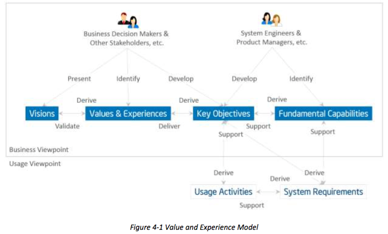

## 4 THE BUSINESS VIEWPOINT
## 4 商业观点
### 4.1 ELEMENTS OF THE BUSINESS VIEWPOINT
### 4.1 商业观点元素
Business-oriented concerns such as value proposition, expected return on investment, cost of maintenance and product liability must be evaluated when considering an Industrial Internet System as a solution to business problems. To identify, evaluate and address these business concerns, we introduce a number of concepts and define the relationships between them, as shown in Figure 4-1. [^6]
商业化的问题，如价值主张，投资预期收益，维护和产品责任成本必须考虑的工业互联网系统作为解决业务问题的时候进行评估。为了识别，评估和解决这些企业的关注，我们介绍了一些概念和定义的关系，他们之间，如图4-1所示。

[^6]:This approach is based on the work, An IoT Experience Framework (IoTEF), presented to the Industrial Internet Consortium by Intel Corporation and the Business Motivation Model (BMM) [24] by the Object Management Group (OMG), consistent with best practices in this domain. Some of the terminology has been changed to be consistent with the ISO/IEC/IEEE 42010:2011.

Stakeholders have a major stake in the business and strong influence in its direction. They include those who drive the conception and development of IISs in an organization. They are often recognized as key strategic thinkers and visionaries within a company or an industry. It is important to identify these key stakeholders and engage them early in the process of evaluating these business-oriented concerns.
利益相关者有重大利害关系的商业和强大的影响力在它的方向。它们包括那些谁开车伦敦国际战略研究所的概念和发展的组织。他们通常被认为是一个公司或一个行业内重要的战略思想家和梦想家。重要的是要找出这些关键利益相关者和评估这些面向企业的关注过程的早期搞起来是很重要的。

Vision describes a future state of an organization or an industry.[^7] It provides the business direction toward which an organization executes. Senior business stakeholders usually develop and present an organization’s vision.
愿景描述了组织的未来状态或一个行业它提供了一个组织对执行其业务方向。高级业务利益相关者通常是制定和提出了一个组织的愿景。

[^7]:The concepts of vision, values and experiences and key objectives are related to the BMM concept of Ends (i.e. the results, or what needs to be achieved).

Values and experiences reflect how the vision may be perceived by the stakeholders who will be involved in funding the implementation of the new system as well as by the users of the resulting system. These values and experiences are typically identified by senior business and technical leaders in an organization. They provide the rationale as to why the vision has merit.
价值观和经历反映如何视力可能通过谁将会参与新系统的实施提供资金以及由所产生的系统用户的利益相关者所感知。这些价值和经验通常是确定的高级业务和技术领导者的组织。它们提供了理由，为什么愿景有可取之处。

Key Objectives are quantifiable high-level technical and ultimately business outcomes expected of the resultant system in the context of delivering the values and experiences. Key objectives should be measurable and time-bound. Senior business and technical leaders develop the Key Objectives.
主要目标是在提供价值和经验的情况下预期所产生的系统的可量化的高层次技术和最终的业务成果。主要目标应是可衡量的，有时限。高级业务和技术带头人培养的关键目标。

Fundamental capabilities refer to high-level specifications of the essential ability of the system to complete specific core business tasks.[^8] Key objectives are the basis for identifying the fundamental capabilities. Capabilities should be specified independently of how they are to be implemented (neutral to both the architecture and technology choices) so that system designers and implementers are not unduly constrained at this stage.
基本能力是指系统来完成特定的核心业务tasks.Key目标的基础上确定的基本能力，核心能力的高层次的规范。能力应独立的它们是如何被实现（中性到架构和技术选择两者），使得系统设计者和实现没有不适当地约束在此阶段指定。

[^8]:A capability is normally defined as “the ability to do something” although in enterprise architecture terms it is extended to be “a high-level specification of the enterprise’s ability” (MODAF). Fundamental Capabilities map to the Means aspect of the BMM, being a starting point for considering how the solution will provide the “means” to deliver the vision.

The process for following this approach is for the stakeholders first to identify the vision of the organization and then how it could improve its operations through the adoption of an IIS. From the vision, the stakeholders establish the values and experiences of the IIS under consideration and develop a set of key objectives that will drive the implementation of the vision. From the objectives, the stakeholders derive the fundamental capabilities that are required for the system.
这个过程对于下面这种做法是为利益攸关者首先要通过采用一个IIS的识别组织的愿景，然后它如何改善其业务。从视觉，利益相关者建立的价值观和IIS的经验，正在考虑和制定出一套将推动愿景的实现关键目标。从目标，利益相关者导出所需要的系统的基本功能。

To verify that the resultant system indeed provides the desired capabilities meeting the objectives, they should be characterized by detailed quantifiable attributes such as the degree of safety, security and resilience, benchmarks to measure the success of the system, and the criteria by which the claimed system characteristics can be supported by appropriate evidence.
要验证所得系统的确提供会议的目标所需要的能力，它们的特点应当是详尽的量化等属性的安全性，安全性和弹性，基准的程度来测量系统的成功，并通过所要求保护的标准系统特性可以通过适当的证据支持。


### 4.2 SECURITY CONCERNS IN THE BUSINESS CONTEXT
### 4.2 在商业环境关注安全
In rationalizing business values and establishing key system objectives for IISs, security inevitably stands out as a key consideration in today’s environment. Security considerations are driven by two main factors:
在合理企业价值观，建立关键系统目标的IISs，安全必然脱颖而出，在今天的环境中重点考虑的问题。安全性考虑取决于两个主要因素：

Regulatory and compliance mandate controlling access to financial systems, protecting credit card information, upholding privacy expectations and protecting critical infrastructure. These are requirements the business must meet, no matter the cost.
监管和合规任务控制对金融体系，保护信用卡信息，维护隐私的期望和保护关键基础设施。这些要求的企业必须满足，不管付出什么代价。

Business value requires safeguarding the business investment in IISs and protecting their
operations against the risk of damage brought about by security breaches. This damage may include interruption or stoppage of operations, destruction of systems, leaking sensitive business and personal data, and intellectual property, harming business reputation, and loss of customers. Heightened security objectives and standards are required to address these risks. However, they would lead to additional investment and likely extended time for system development and deployment. In some cases, they may affect user experience negatively. These additional costs must be justified to stakeholders in the context of the business risks they are addressing,sometime in terms of costs saved by averting damages.
业务价值需要保护的商业投资IISS和保护他们的行动，打击破坏受到安全漏洞所带来的风险。这种损害可能包括中断或业务停止，破坏系统，泄露敏感的商业和个人数据和知识产权，损害商业信誉，和客户的流失。提高安全性的目标和标准，需要解决这些风险。然而，它们将导致额外的投资和很可能延长时间为系统开发和部署。在某些情况下，它们可能产生负面影响用户体验。这些额外的成本必须是合理的，以利益相关者的，他们正在解决，有时在保存避免损害成本方面的经营风险的背景下。

Just like other key system objectives, there must be a way to measure and validate the continued effectiveness of security capabilities implemented in the system in meeting the security objectives. Derived from the security objectives and requirements, Security Metrics and Key Performance Indicators provide reports on compliance, regulatory, contractual or business driven, and create continuous feedback loops to increase accountability, improve effectiveness and provide quantified inputs for effective decision-making.
就像其他关键系统目标，必须有一种方法来衡量和验证实现的系统在满足安全目标的安全功能继续有效。从安全目标和要求派生，安全指标和关键绩效指标提供了有关合规，法规，合同和业务驱动，创造持续的反馈报告环路，以加强问责制，提高效率和有效决策提供量化的投入。


Security has a strong dependency on the quality of the design and implementation of a
component or a system—attackers often gain access to systems by exploiting vulnerabilities in design (flaws) or implementation (bugs). The principle tenets of secure development are the same as in quality development: to apply rigor in documenting, tracking, and validating the desired features and to use known best practices to avoid introducing unknown or undesired side effects. Secure development lifecycle (SDL) is a security development process that is widely used by many organizations to avoid software vulnerabilities.[^9] It begins by benchmarking existing 385 quality practices and improving any shortcomings found during initial assessments. Benefitting from the identified process improvements, the resultant product is typically both more secure and of higher quality by being more reliable and having fewer issues reported by the customers.Investments in security therefore can have measurable and sometimes immediate returns.
安全性对组件或系统攻击者常常获得通过利用漏洞获得系统的设计（缺陷）或实施（错误）的设计和实施质量强依赖性。安全发展的原则，原则是相同的质量发展：适用严格的记录，跟踪和验证所需要的功能和使用已知的最佳做法，以避免引入未知或不希望的副作用。安全开发生命周期（SDL）是一个安全的发展过程，被广泛应用于许多组织，以避免软件漏洞。它首先标杆现有的质量规范和完善过程中初步评估发现的不足之处。从所识别的工艺的改进中受益，将所得产物通常是通过更可靠和具有报告的客户较少的问题既安全质量更高和。在安全的投资，因此可以有可衡量的，有时甚至直接的回报。

[^9]:Microsoft: Security Development Lifecycle, SDL Process Guidance Version 5.2, 2012 [26]