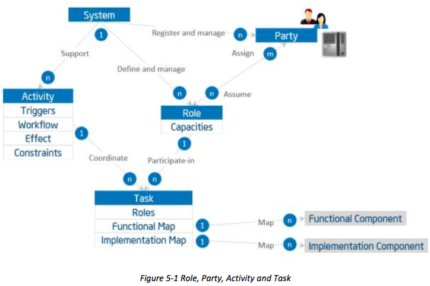

## 5 THE USAGE VIEWPOINT
## 5 用法观点
### 5.1 ELEMENTS OF THE USAGE VIEWPOINT
### 5.1 用法观点元素
The usage viewpoint is concerned with how an Industrial Internet System realizes the key capabilities identified in the business viewpoint. The usage viewpoint describes the activities that coordinate various units of work over various system components. These activities—describing how the system is used—serve as an input for system requirements including those on key system characteristics and guide the design, implementation, deployment, operations and evolution of the IIS.
用法观点是关心如何在工业互联网系统，实现了业务的观点确定的主要功能。用法的观点描述了各种系统组件协调工作的各单位的活动。这些活动描述的系统是如何使用的，作为一个输入系统的要求包括对关键系统的特点和指导设计，实施，部署，运行在IIS和演化。



Figure 5-1 depicts the usage viewpoint’s main concepts and how they relate to each other.
The basic unit of work is a task, such as the invocation of an operation, a transfer of data or an action of a party. A task is carried out by a party assuming a role.
图5-1描绘了用法观点的主要概念，以及它们如何相互关联的。工作的基本单元是一个任务，诸如一个操作的调用，数据的传送或一方的作用。任务是由当事人承担角色。

A role is a set of capacities assumed by an entity to initiate and participate in the execution of, or consume the outcome of, some tasks or functions in an IIS as required by an activity. Roles are assumed by parties. A party is an agent, human or automated, that has autonomy, interest and responsibility in the execution of tasks. A party executes a task by assuming a role that has the right capacities for the execution of the task. A party may assume more than one role, and a role may be fulfilled by more than one party. A party also has security properties for assuming a role.
角色是一组的容量由实体假设发起和参与的执行，也可以根据需要由活动消耗的，某些任务或功能的结果在一个IIS。角色是承担当事人。一方是一家代理，人或自动，具有自主性，权益和责任任务的执行。当事人通过假设已为任务的执行权能力的一个角色执行的任务。当事人可以承担多个角色，一个角色可以由一个以上的政党得到满足。当事人也有承担角色的安全性。

Note: The above definition of role is primarily operational, based on capacities that qualify an agent from a functional perspective. It does not intend to be by itself an access control model for security purposes. However, because assuming a role implies access to the IIS, it is often associated with certain security properties (such as privileges, permissions, etc.). This association in turn may require a more refined notion of role—e.g. reflective of an organization chart, user groups, etc.—that is out of scope for this section. A party also has security properties (credentials, ID...) for assuming a role, the details of which are beyond the scope of this section. A task has a
role, a functional map, and an implementation map.
注：角色的上述定义主要是经营的基础上，有资格的代理人从功能的角度能力。它不打算将本身的访问控制模型，为安全起见。但是，因为承担角色意味着访问IIS，它往往与某些安全性能（如权限，权限等）相关联。反过来这种关联可能需要的角色，例如更精细的概念反射式的组织结构图，用户群体等，这是超出范围为本条。当事人也带来了安全性（证书，身份证...）为承担角色，其中的细节超出了本节的范围。任务有一定的作用，功能地图，并实现地图。

* A role describes, if applicable, the role(s) responsible for the execution of the task.
* A functional map describes to which functions or functional components the task maps. This can be defined only when the functional deposition of the system becomes available to perform the mapping. This mapping includes definition of inputs and outputs in the context where this task is to be executed (i.e. of a particular activity).
* An implementation map describes the implementation component(s) the task relies on for its execution. If role(s) are associated to the task, the map also defines how these roles map their capacities to the component(s) and related operations. Similarly, this property may be defined only when the implementation architecture of the system become available to perform the mapping.
* 一个角色介绍（如适用）的作用负责该任务的执行。
* 功能图描述了哪些功能或功能部件的任务列表。这可以定义仅当系统的功能沉积可用于执行该映射。该映射包括输入和输出的背景下定义，其中该任务将被执行（即一个特定的活动）。
* 一个实现地图介绍任务依靠其执行的执行元件。如果角色（多个）相关联的任务，在地图上还定义如何将这些角色映射的能力的成分和相关业务。同样地，该属性可以被定义仅当系统的实施架构变得可用来执行该映射。

Examples of tasks and roles are:
任务和角色的实例是：

* register a new device to the edge gateway (role: administrator),
* run test procedure for passive RFID readers on processing chain X (roles: administrator,
QA)
* authenticate user request (role: security agent) and
* summarize data streams from all temperature sensors on asset X (role: same as the role
that initiates the edge-to-Cloud data flow processing and consolidation activity that this task is part of).
*注册新设备的边缘网关（角色：管理员），
*运行测试程序对处理链X无源RFID阅读器（角色：管理员，QA）
*验证用户请求（角色：安全剂）和
*汇总来自各温度传感器上的资产X数据流（角色：相同的角色
发起的边缘到云数据流处理和合并的活动，这个任务是的一部分）。

An activity is a specified coordination of tasks (and possibly of other activities, recursively) required to realize a well-defined usage or process of an IIS. An activity may be executed repeatedly. An activity has the following elements:
一个活动是工作的指定协调（和其他活动的可能性，递归的）以实现一个良好定义的用法的IIS或过程必需的。一个活动可以重复执行。一项活动有以下内容：

* A trigger is one or more condition(s) under which the activity is initiated. It may be associated with one or more role(s) responsible for initiating or enabling the execution. * A workflow consists of a sequential, parallel, conditional, iterative organization of tasks. 
* An effect is the difference in the state of the IIS after successful completion of an activity. 
* Constraints are system characteristics that must be preserved during execution and after the new state is achieved, such as data integrity, data confidentiality and resilience. These characteristics may be affected by the enacting of the tasks beyond what is enforceable by the system design or its functional components alone.
* 触发器是一个或一个以上条件（多个）在其下的活性被启动。它可以与一个或多个角色（多个）负责启动或使能执行相关联。
* 工作流程由一个连续的，平行的，有条件的，重复的任务组织。
* 一个效果是成功完成的活动的后在IIS的状态的差别。
* 限制是系统特征它必须在执行期间被保留，并在新的状态实现之后完成，如数据的完整性，数据的保密性和复原能力。这些特性可能受到颁布的任务超出了可执行的系统设计或单独的功能组件。

An example of activity is of a device on-boarding procedure:
活动的一个例子是一个设备上的登机手续的：

	Trigger: Administrator approval of the new addition.
	触发：新增加了管理员的批准。
	Workflow:
	工作流：
		Task 1: Register new device to the Edge gateway.
		任务1：注册新设备到边缘网关。
 		Task 2: Register the new device in the Cloud-based management platform by automatic 	discovery and querying of all gateways.
		任务2:注册由所有网关自动发现和查询的基于云管理平台中的新设备。
		Task 3: Run remote test procedure appropriate for this device type and verify that 	values generated are within expected range and consistent with similar devices in the 	proximity.
		任务3:运行远程测试程序适用于该设备类型和验证生成的值是预期的范围内，并与附近类似的设备一致的范围内。
		
Initially, an abstract description of the activity is sufficient. During design, the activities serve as inputs to the requirements for the system, thus guiding the design of the functional architecture and its components. An activity then requires each task to be mapped to, and supported by, one or more functions. An activity is not restricted to one functional domain but may involve a sequence of tasks that span several functional domains.[^10]
最初，活动的抽象描述就足够了。在设计中，活动作为输入到该系统的要求，从而引导功能架构及其部件的设计。一个活动则需要每个任务映射到，并由一个或多个功能的支持。一个活动不限于一个功能域，但可能涉及跨越几个功能域的任务的顺序。

[^10]: Defined in the functional viewpoint (6.1)

The design of the IIS now has a concrete representation of the activities by mapping its tasks to the functional and implementation components. The mappings then enable architecture and implementation verification.	
在IIS的设计，现在通过映射其任务的功能和执行元件有活动的一个具体表现。该映射然后启用架构和实施核查。	
### 5.2 COMMON SECURITY ACTIVITIES
### 5.2 常见的安全活动
The enforcement of security policies requires the ability to control the various endpoints and their communications involved in an activity in a generic and consistent way to ensure complete end-to-end coverage. Four common security activities are described below.
安全策略的强制执行，需要控制中涉及的活动在通用的和一致的方式的各种端点和它们的通信，以确保完全的端至端的覆盖的能力。四种常见的安全活动介绍如下。

Security monitoring gathers and analyzes security-related data continuously as activities are performed. It may take different forms depending on the context of operations and on security events. For example, different tasks are appropriate before, during and after an attack.
安全监控采集并连续分析的活动中进行安全相关的数据。它可以采取不同的形式取决于操作的与上安全事件的上下文。例如，不同的任务是适当的前，中，攻击后。

Security auditing collects, stores and analyzes of security information related to an IIS.
安全审计收集，存储和相关的IIS安全信息分析。

Security policy management manages both automated and human-driven administrative security
tasks by documenting their usage and constraints.
安全策略管理通过记录他们的使用和约束管理自动和人力驱动的安全管理任务。

Cryptographic support management consists of globally interoperable key management, secure credential storage and revocation.
加密支持管理包括全球通用的密钥管理，安全证书存储和撤销。