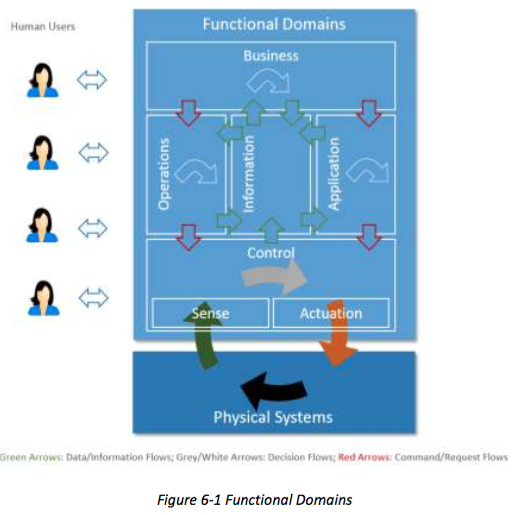
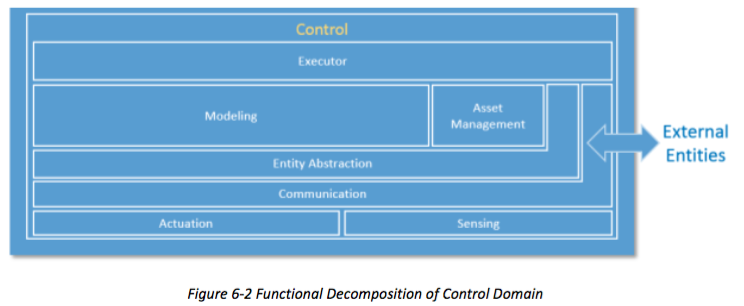
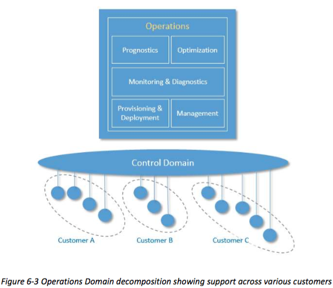
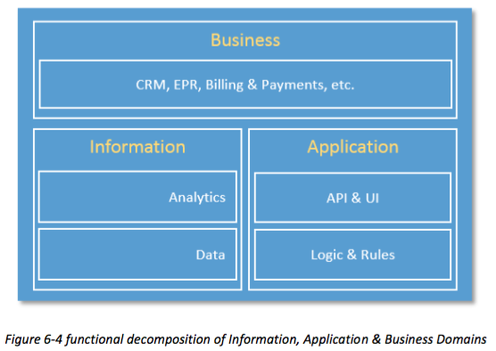

## 6 THE FUNCTIONAL VIEWPOINT 
## 6 功能视点
### 6.1 BACKGROUND		
### 6.1 背景	
	
Industrial Control Systems (ICS) have been widely deployed to enable industrial automation
across industrial sectors.[^11] As we bring these automated control systems online with broader systems in the Industrial Internet effort, control remains a central and essential concept of industrial systems. Control, in this context, is the process of automatically exercising effects on physical systems and the environment, based on sensory inputs to achieve human and business objectives. Many control systems today apply low-latency, fine-grained controls to physical systems in close proximity, without a connection to other systems. Because of this, it is difficult to create local collaborative control, let alone globally orchestrated operations.
工业控制系统（ICS）已被广泛部署，使各产业部门的工业自动化。当我们把这些自动化控制系统在线与工业互联网的努力更广泛的系统，控制仍然是工业系统的核心和基本概念。控制，在这种情况下，是自动上锻炼的物理系统和环境的基础上，感觉输入实现人力和业务目标的效果的过程。许多控制系统适用于今日的低延迟，细粒度控制，以物理系统接近，但无其他系统的连接。正因为如此，也很难创建本地协同控制，更不用说全球协调行动。

Some might argue that the industrial internet is the conjoining of what has been traditionally two different domains with different purposes, standards and supporting disciplines: IT and OT.[^12]  [^13] In IT (information technology), everything is reducible to bits that represent ideas in the programmer’s head and transformed in a way to produce useful inference - anything from the sum of numbers in a column to email systems to schedule optimization problems (e.g. using Simplex). The essential problem with such an approach, noted as one of the fundamental problems in the Artificial Intelligence community is the so-called ‘symbol-grounding problem’— that symbols in the machine (the numbers passed around by the processor) only correspond to world objects because of the intentions of the programmer—they have no meaning to the machine.[^14]  [^15] In OT (operations technology) ‘controls’ (traditionally analogue) have been applied directly to physical processes without any attempt to create symbols or models to be processed by the machine. For example, PID (proportional-integrative-derivative) controllers may control the voltage on a line using a particular feedback equation that is defined by the control engineer and demonstrated to work for a particular application - there is no attempt at generality and no need to divide the problem among multiple processing units. The incidence of IT into the OT world has primarily come about due to a need to network larger systems and establish control over hierarchies of machines while also wanting to inject common IT ideas into the OT world (such as scheduling and optimization of resource consumption). There has also been a move toward controls that digitally simulate the physical world and base their control decisions on the simulation model rather than a control engineer’s equation. This makes other kinds of approaches that have been examined in IT, such as machine learning, possible to apply to OT. This has also led to OT systems to be susceptible to IT problems as well, such as network denial of service attack and spoofing as well as the aforementioned symbol-grounding problem. The combination of IT and OT holds forth a great possibility of advancement - embodied cognition - to a system that can avoid the symbol grounding problem by basing its representation on the world (and not on programmer supplied models) and only its own episodic experience (and thus not be limited to human conceptions of epistemology). However even nearer term breakthroughs that will support advanced analytics based on actual world data rather than engineering models may well yield substantial improvements. The key obstacle is safety and resilience. Mission-critical OT applications are important enough that the typical levels of software reliability that are acceptable in the IT market will not be sufficient for OT. Moreover, actions in the physical world generally cannot be undone, which is a consideration that IT systems normally do not have to address.	
有些人可能会认为，工业互联网是什么传统上两个不同的领域有不同的目的，标准和支持学科成为结合：IT和OT.在IT（信息技术），一切都还原为代表思想在程序员的头部和改造的方式来生产有用的推论位 - 从数字的总和在任何一列电子邮件系统调度优化问题（例如，使用单）。的基本问题与这种方法中，指出作为在人工智能界的基本问题之一是所谓的“符号接地problem'-，在机码元（由处理器周围通过数字）只对应于世界因为用心的对象编程，他们的机器没有任何意义。在OT（作业技术）'控制'（传统模拟）已直接应用于物理过程，没有任何企图制造符号或模型以由机器进行处理。例如，PID（比例 - 综合 - 微分）控制器可以控制上使用由控制工程师定义并表现出特定的反馈方程工作用于特定应用的线的电压 - 有在一般性没有尝试并没有必要划分在多个处理单元的问题。 IT的发病率成OT世界主要来约因需要网络更大的系统，并建立控制机器的层次，同时也希望注入通用的IT理念融入OT世界（如调度和资源消耗的优化）。同时也出现了朝着控制，数字化模拟物理世界，并根据他们的控制决策的仿真模型，而不是一个控制工程师的方程的举动。这使得其他类型的已审查的IT方法，如机器学习，可以申请到OT。这也导致OT系统易受IT问题为好，如网络拒绝服务攻击和欺骗，以及前面提到的符号接地问题。 IT和OT持有来回进步的可能性很大的组合 - 具身认知 - 以一个系统，可以通过立足其表示对世界（而不是提供的编程模型）避免符号接地问题，只有自己的情景体验（和因此，不局限于认识论的人的观念）。然而，即使较近期的突破，将支持基于现实世界的数据，而不是工程模型可能产生实质性的改进先进的分析。关键的障碍是安全性和弹性。关键任务应用OT足够重要的是软件可靠性的一般水平是可以接受的，在IT市场将无法满足OT。此外，在物理世界中通常动作无法复原，这是IT系统通常没有解决一个考虑因素。	

[^11]: ICSs typically include supervisory control and data acquisition (SCADA) systems, distributed control systems (DCS), and other control system configurations such as skid-mounted Programmable Logic Controllers (PLC) that are often found in the industrial control sectors [30].
[^12]: Here we use the more traditional version of the word ‘domain’.
[^13]: Consider this an introduction to the topic—we will deal with the IT/OT problem in more detail in future versions of this and other documents.
[^14]: http://en.wikipedia.org/wiki/Symbol_grounding_problem 
[^15]: http://en.wikipedia.org/wiki/Chinese_room		
Riding on continued advancement of computation and communication technologies, the Industrial Internet can dramatically transform industrial control systems in two major themes:
乘着计算和通信技术的不断进步，工业互联网可以极大地变换两大主题工业控制系统：

Increasing local collaborative autonomy: New sensing and detection technologies provide more, and more accurate, data. Greater embedded computational power enables more advanced analytics of these data and better models of the state of a physical system and the environment in which it operates. The result of this combination transforms control systems from merely automatic to autonomous—allowing them to react appropriately even when the system’s designers did not anticipate the current system state. Moreover, ubiquitous connectivity between peer systems enables a level of fusion and collaboration that was previously impractical.
增加局部协作自主：新感测和检测技术提供以上，更准确，数据。更大的嵌入式计算能力使这些数据的更先进的分析和更好的模型物理系统的状态，并在其开展业务的环境。这个组合的结果转换控制系统，从单纯自动到自主，使他们能够作出适当反应，即使系统的设计者没有预料到当前的系统状态。此外，对等系统之间无处不在的连接实现融合与合作的水平，这在以前是不切实际的。

Increasing system optimization through global orchestration: Collecting sensor data from across the control systems and applying analytics, including models developed through machine learning, to these data, we can gain insight to a business’s operations. With these insights, we can improve decision-making and optimize the system operations globally through automatic and autonomous orchestration.
通过全球协调提高了系统的优化：来自全国各地的控制系统中收集传感器数据和应用的分析，包括通过机器学习开发的模型，这些数据中，我们可以洞察到企业的运营。有了这些见解，我们可以提高决策，并通过自动和自主编排全局优化系统操作。

These two themes have far-reaching impact on the systems that we will build, though each system will have a different focus and will balance the two themes differently.
这两个主题，对我们将建立，但每个系统都会有不同的重点，并兼顾不同的两个主题系统产生深远的影响。

We create the concept of functional domain to address the key concerns surrounding the functional architecture of Industrial Internet Systems. A Functional Domain is a top-level functional decomposition of an Industrial Internet System, each providing a predominantly distinct functionality in the overall system.
我们创建了功能区的概念，以解决围绕工业网络系统的功能结构的关键问题。功能结构域是一个工业互联网系统中，每个提供在整个系统中占优势的不同的功能的顶级功能分解。

This functional domain model is intended to be generally applicable to IISs in many industrial verticals. However, a use case in a certain industrial vertical may place stronger emphasis on functions in one or more functional domains than in the others. In some cases, the functional domains can be implemented as a single system, combined into a single one, or split up and implemented as a part of other domains.
这个功能域模型旨在普遍适用于IISs在许多工业垂直行业。然而，用例在某些工业垂直可将更加强调功能中的一个或多个功能性结构域比其他人。在某些情况下，功能结构域可以被实现为一个单独的系统，组合成一个单一的一个，或分裂和实施为其他域的一部分。
		
The decomposition of functional domains highlights the important building blocks that have been seen to have wide applicability. The set of building blocks is neither a complete nor a minimum set that any system must possess. Rather, it is intended to be a starting point for conceptualizing a concrete functional architecture within these functional domains. A use case under consideration and its specific system requirements will strongly influence how the functional domains are decomposed, so in a concrete architecture derived and extended from this reference architecture, additional functions may be added, some of the functions described here may be left out or combined and all may be further decomposed as needed. 
功能域分解突出已被视为具有广泛适用性的重要组成部分。一组积木的既不是完整的，也不是任何系统必须具备的最小集合。相反，其旨在成为起点这些功能域内概念化的具体功能架构。用例所考虑和其特定的系统要求会强烈影响如何功能结构域被分解，因此，在衍生并从该参考架构可扩展的具体架构，附加功能可被添加，一些这里描述的功能可以被省略或组合和所有可能根据需要进一步分解。

We decompose a typical IIS into five functional domains:
我们分解一个典型的IIS为五个功能区：

* Control domain
* Operations domain
* Information domain
* Application domain
* Business domain
* 控制域
* 运行领域
* 信息领域
* 应用领域
* 商业领域



Data flows and control flows take place in and between these functional domains. Fig 6-1 above illustrates how the functional domains relate to each other with regard to data and control flows. Green arrows show how data flows circulate across domains. Red arrows show how control flows circulate across domains. Other horizontal arrows illustrate some processing taking place within each domain, to process input flows and generate new forms of data or control flows.		
数据流和控制流发生在这些功能域之间。图6-1示出了上述的功能结构域如何与彼此有关的数据和控制流。绿色箭头显示的数据流跨域如何循环。红色箭头显示控制流跨域如何循环。其他水平箭头示出了一些处理采取每个域内进行，以处理输入流和生成的数据或控制流的新形式。
		
Controls, coordination and orchestration exercised from each of the functional domains have different granularities and run on different temporal cycles. As it moves up in the functional domains, the coarseness of the interactions increases, their cycle becomes longer and the scope of impact likely becomes larger. Correspondingly, as the information moves up in the functional domains, the scope of the information becomes broader and richer, new information can be derived, and new intelligence may emerge in the larger contexts.
从每一个功能域行使控制，协调和业务流程有不同的粒度和运行在不同的时间周期。因为它的动作在功能结构域，的相互作用的增加的粗糙，其周期变长，影响的范围可能变得更大。与此相对应，作为信息在功能域向上移动，的信息的范围变得更宽和更丰富的，新的信息可以被获得，并且新的情报可能出现的较大的背景。

We describe each in turn, starting from the bottom of Figure 6-1, above the physical systems.
我们描述每个反过来，从图6-1的底部开始，上面的物理系统。
		
### 6.2 THE CONTROL DOMAIN
### 6.2 控制域

The control domain represents the collection of functions that are performed by industrial
control systems. The core of these functions comprises fine-grained closed-loops, reading data from sensors (“sense” in the figure), applying rules and logic, and exercising control over the physical system through actuators (“actuation”).[^16] Both accuracy and resolution in timing is usually critical. Components or systems implementing these functions (functional components) are usually deployed in proximity to the physical systems they control, and may therefore be geographically distributed. They may not be easily accessible physically by maintenance personnel, and physical security of these systems may require special consideration.		
控制域代表的是由工业控制系统执行的功能集合。这些功能的芯包括细粒闭合回路，由传感器读出的数据（图中的“有义”），应用规则和逻辑，并行使对通过致动器的物理系统（“致动”）的控制。精度和分辨率在定时通常是至关重要的。部件或实现这些功能（功能元件）系统通常部署在靠近它们控制的物理系统，并且因此可以在地理上分布的。他们可能也不容易接近物理维修人员，而这些系统的物理安全性可能需要特殊的考虑。
		
>Examples: Simple examples of functional components in this domain include a control room in electricity utility plant, control units in a wind-turbine, and control units in autonomous vehicles.
>例子：在此领域的功能性成分简单的例子包括控制室的电力公司厂房，控制单元的风力涡轮机，并在无人驾驶汽车控制单元。

The control domain comprises a set of common functions, as depicted in Figure 6-2.[^17] Their implementation may be at various levels of complexity and sophistication depending on the systems, and, in a given system, some components may not exist at all. We describe each in turn.
控制域包括一组常用的功能，如图6-2所示的。其实现可以是在各级复杂性和完善取决于系统的，并且，在给定系统中，某些组件可能不存在。我们描述依次在每个。

Sensing is the function that reads sensor data from sensors. Its implementation spans hardware, firmware, device drivers and software elements. Note that active sensing recursively, requires control and actuation, and may therefore have a more complex linkage to the rest of the control system, for example, an attention element to tell the sensor what is needed.
感测的是，从传感器读取传感器数据的功能。其实现跨越硬件，固件，设备驱动程序和软件元件。注意，有源传感递归，需要控制和致动，并因此可以具有更复杂的联动控制系统的其余部分，例如，一个关注元件告诉需要什么的传感器。

Actuation is the function that writes data and control signals to an actuator to enact the actuation. Its implementation spans hardware, firmware, device drivers and software elements.
致动是写入数据和控制信号到致动器颁布致动的功能。其实现跨越硬件，固件，设备驱动程序和软件元件。
		
[^16]: Possibly in a hierarchy, at several levels.
[^17]: These set of functions are considered essential to many control systems in the control domain. However, they may exist in other domains as well.


Communication connects sensors, actuators, controllers, gateways and other edge systems. The communication mechanisms take different forms, such as a bus (local to an underlying system platform or remote), or networked architecture (hierarchical, hubs and spokes, meshed, point- to-point), some statically configured and others dynamically. Quality of Service (QoS) characteristics such as latency, bandwidth, jitter, reliability and resilience must be taken into account.
通信连接的传感器，致动器，控制器，网关和其他边缘系统。的通信机制采取不同的形式，诸如总线（本地到下层系统平台或远程的），或网络体系结构（分层，集线器和辐条，网状，点到点），一些静态配置和其他动态。的服务质量（QoS）特征，例如等待时间，带宽，抖动，可靠性和弹性质量必须被考虑在内。

Within the communication function, a connectivity abstraction function may be used to encapsulate the specifics of the underlying communication technologies, using one or more common APIs to expose a set of connectivity services. These services may offer additional connectivity features that are not otherwise available directly from the underlying communication technologies, such as reliable delivery, auto-discovery and auto-reconfiguration of network topologies upon failures.
内的通信功能，一个连接抽象函数可以用于封装的基本通信技术的具体情况，使用一个或多个通用API以暴露一组连接服务。这些服务可能会提供额外的连接功能，是没有其他可以直接从底层通信技术，如可靠的传送，自动发现和自动重新配置的故障时的网络拓扑。

Entity abstraction, through a virtual entity representation, provides an abstraction of scores of sensors and actuators, peer controllers and systems in the next higher tiers, and expresses relationships between them. This serves as the context in which sensor data can be understood,actuation is enacted and the interaction with other entities is carried out. Generally, this includes the semantics of the terms used within the representations or messages passed between system elements.
实体的抽象，通过虚拟的实体表示，提供了一个更高的层次传感器和执行器等控制器和系统的分数的抽象，并表示它们之间的关系。这可作为在其中的传感器数据，可以理解的范围内，致动颁布，与其他实体的相互作用进行。通常，这包括系统元件之间传递的陈述或消息中使用的术语的语义。

Modeling deals with understanding the states, conditions and behaviors of the systems under control and those of peer systems by interpreting and correlating data gathered from sensors and peer systems. The complexity and sophistication of modeling of the system under control varies greatly. It may range from straightforward models (such as a simple interpretation of a time series of the temperature of a boiler), to moderately complex (a prebuilt physical model of an aircraft engine), to very complex and elastic (models built with artificial intelligence possessing learning and cognitive capabilities). These modeling capabilities, sometime referred to as edge analytics, are generally required to be evaluated locally in control systems for real-time applications. Edge analytics are also needed in use cases where it is not economical or practical to send a large amount of raw sensor data to remote systems to be analyzed even without a real-time requirement.
造型处理的理解状态，条件和控制系统的行为和那些对系统通过解释和相关传感器和对等系统收集的数据。该控制系统的建模的复杂性和复杂性差别很大。它的范围可以从简单的模型（例如时间序列锅炉的温度的简单解释），以中等复杂（飞机发动机的预建物理模型），来构建具有人工智能具有非常复杂的和弹性的（型号学习和认知能力）。这些建模能力，有时被称为边缘分析，一般都需要在控制系统实时应用的本地计算。还需要在用例边缘分析它是不经济的或实用的发送大量原始传感器数据的远程系统即使没有实时性要求进行分析。
		
A data abstraction sub-function of modeling may be needed for cleansing, filtering, de- duplicating, transforming, normalizing, ignoring, augmenting, mapping and possibly persisting data before the data are ready for analysis by the models or destroyed.
建模的数据抽象子功能可能需要的清洗，过滤，脱翻炒，转化，正火，忽略，扩增，映射以及可能存留数据之前的数据已准备好由分析模型或销毁。

Asset management enables operations management of the control systems including system onboarding, configuration, policy, system, software/firmware updates and other lifecycle management operations. Note that it is subservient to the executor so as to ensure that policies (such as safety and security) are always under the responsibility and authority of the edge entity.
资产管理使控制系统，包括系统的入职培训，配置，策略，系统，软件/固件更新和其他生命周期管理业务的运营管理。需要注意的是屈从于执行程序，以确保各项政策（如安全性和安全性），并且始终在边缘实体的责任和权力。

Executor executes control logic to the understanding of the states, conditions and behavior of the system under control and its environment in accordance with control objectives. The control objectives may be programmed or otherwise set by static configuration, be dynamic under the authority of local autonomy, or be advised dynamically by systems at higher tiers. The outcome of the control logic may be a sequence of actions to be applied to the system under control through actuation. It may also lead to interactions with peer systems or systems at higher tiers. Similar to the case of modeling, the control logic can be:
执行程序执行控制逻辑的状态，条件和系统的下控制行为及按照控制目标环境的认识。该控制目标可以被编程或通过静态配置设定，是根据地方自治的权力动态，或将在较高层级动态建议由系统。控制逻辑的结果可以是一系列的操作，以通过致动控制下施加到该系统。它也可能导致与在较高层级对等系统或系统相互作用。类似建模的情况下，控制逻辑可以是：

* straightforward – a set-point program employing algorithms to control the temperature of a boiler) or
* sophisticated – incorporating aspects of cognitive and learning capabilities with a high degree of autonomy, such as deciding which obstacle a vehicle should crash into—the full school bus pulling out in front of the vehicle from the grade school or the puddle of pedestrians in front of the nursing home?[^18]
*简单 - 一个设定点程序使用算法来控制锅炉的温度）或
*精密 - 结合的认知和学习能力，具有高度自治，比如决定哪些障碍车辆要碰撞问题纳入，全校车从小学车辆或前方行人的水坑前拉出的养老院？

The executor is responsible for assuring policies in its scope are applied so that data movement off its scope, use of actuators, etc. are within the bounds of such policies.
执行程序负责确保施加，使得数据移动了它的范围，使用致动器等，是这些政策的范围内其范围的策略。

[^18]: Such ethical choices are the subject of ‘trolley problems’ and are indicative of deep policy issues that typically should not be left up to a programmer to decide. See, e.g., [33]		
		
### 6.3 THE OPERATIONS DOMAIN
### 6.3 操作域
The operations domain represents the collection of functions responsible for the provisioning, management, monitoring and optimization of the systems in the control domain. Existing industrial control systems mostly focus on optimizing the assets in a single physical plant. The control systems of the Industrial Internet must move up a level, and optimize operations across asset types, fleets and customers. This opens up opportunities for added business and customer value as set out by higher-level, business-oriented domains.
该业务领域代表负责该系统在控制域的配置，管理，监控和优化功能集合。现有的工业控制系统主要集中在一个单一的物理设备优化的资产。工业互联网的控制系统必须向上移动的水平，以及跨资产类型，车队和客户优化运营。这开辟了增值业务和客户价值的机会，设置了由更高级别的，面向业务的领域。

>Examples: Optimizing the operation of one train has obvious cost savings, but optimizing train operations and routes across a fleet yields more, and combining data from fleets owned by different railroads can optimize the utilization of the rail network within a country.
>例如：优化一列火车的运行具有明显的成本节约，但优化列车运营和路线穿过船队的产量多，而且从不同的铁路拥有的船队组合数据可以在一个国家内优化铁路网络的利用率。

Figure 6-3 shows how operations in an IIS can be supported through a suite of interdependent operations support functions.
图6-3显示了如何在一个IIS操作可以通过一系列相互依存的运营支持职能的支持。
		
		
		
Provisioning and Deployment consists of a set of functions required to configure, onboard, register, and track assets, and to deploy and retire assets from operations. These functions must be able to provision and bring assets online remotely, securely and at scale. They must be able to communicate with them at the asset level as well as the fleet level, given the harsh, dynamic and remote environments common in industrial contexts. Provisioning and deployment has a strong dependency on functions in connectivity and security, trust and privacy.
供应及部署由一组配置，板载，注册和跟踪资产，以及部署和运营退休资产所需的功能。这些功能必须能够提供和使资产网上远程地，安全地和在刻度。他们必须能够在资产层面和舰队级别与他们沟通，因为在工业环境中常见的恶劣，充满活力和远程环境。配置和部署，对在连通性和安全性，信任和隐私功能很强的依赖性。

Management consists of a set of functions that enable assets management centers to issue a suite of management commands to the control systems, and from the control systems to the assets in which the control systems are installed, and in the reverse direction enable the control systems and the assets to respond to these commands. For this, many of the legacy “dumb” assets need to be retrofitted to have compute, storage and connectivity capabilities. Management has a strong dependency on functions in intelligent and resilient control.
管理由一组函数，使资产管理中心发出的一套管理的命令到控制系统，并从控制系统，其中控制系统被安装的资产，并且在相反的方向使该控制系统和资产以应对这些命令。对于这一点，许多传统的需要“哑巴”的资产被改装有计算，存储和连接功能。管理层在智能和弹性控制的功能很强的依赖性。

Monitoring and Diagnostics consists of functions that enable the detection and prediction of occurrences of problems. It is responsible for real-time monitoring of asset key performance indicators, collecting and processing asset health data with intelligence so that it can diagnose the real cause of a problem, and then alerting on abnormal conditions and deviations. This set of functions should assist operations and maintenance personnel to reduce the response time between detecting and addressing a problem. Monitoring and diagnostics has a strong dependency on functions in data services and analytics.
监控和诊断包括功能，使出现问题的检测和预测。它负责实时监控资产的关键绩效指标，收集和情报处理资产的健康数据，以便它可以诊断问题的真正原因，然后报警的异常情况和偏差。这组函数应协助操作和维护人员，以减少检测和解决某个问题的响应时间。监控和诊断，对数据业务和分析功能很强的依赖性。

Prognostics consists of the set of functions that serves as a predictive analytics engine of the IISs. It relies on historical data of asset operation and performance, engineering and physics properties of assets, and modeling information. The main goal is to identify potential issues before they occur and provide recommendations on their mitigation. It may use the analytic functions in the information domain to realize its functions.
故障预测包含的功能集，作为国际战略研究所的预测分析引擎。它依赖于资产的运行和性能，资产的工程和物理特性，和建模信息的历史数据。其主要目的是防患于未然，以找出潜在的问题，并提供有关其减排的建议。它可以使用分析功能，在信息领域，以实现其功能。

Optimization consists of a set of functions that improves asset reliability and performance, reduces energy consumption, and increase availability and output in correspondence to how the assets are used. It helps to ensure assets operating at their peak efficiency by identifying production losses and inefficiencies. This process should be automated, as much as it is feasible, in order to avoid potential inaccuracies and inconsistencies.
优化由一组功能，它提高了资产的可靠性和性能，降低了能耗，并提高可用性，并在对应的输出如何资产的使用的。它有助于确保资产以最高效率标识生产损失和低效率运行。这个过程应该是自动的，就像它是可行的，为了避免潜在的错误和不一致之处。

At this level, this set of functions should support key automation and analytics features including:
在这个层面上，这组函数要重点支持自动化和分析功能，包括：

* Automated data collection, processing and validation.
* Ability to capture and identify major events, such as downtime, delay, etc. 
* Ability to analyze and assign causes for known problems.
* 自动数据收集，处理和验证。
* 能够捕捉和识别重大活动，如停机时间，延迟等
* 能够分析和已知问题分配的原因。

Optimization has a strong dependency on functions in dynamic orchestration and automatic integration. It may use the data ingestion and processing functions and analytic functions in the information domain to realize part of its functions.
优化对动态的业务流程，并自动集成功能强大的依赖性。它可以使用数据摄取和处理功能和分析功能，在信息领域，以实现其职能的一部分。

### 6.4 THE INFORMATION DOMAIN
### 6.4 信息域

The Information Domain represents the collection of functions for gathering data from various domains, most significantly from the control domain, and transforming, persisting, and modeling or analyzing those data to acquire high-level intelligence about the overall system.[^19] The data collection and analysis functions in this domain are complementary to those implemented in the control domain. In the control domain, these functions participate directly in the immediate control of the physical systems whereas in the information domain they are for aiding decision- making, optimization of system-wide operations and improving the system models over the long term. Components implementing these functions may or may not be co-located with their counterparts in the control domain. They may be deployed in building closets, in factory control rooms, in corporate datacenters, or in the cloud as a service.
信息领域代表了来自各个领域的控制域，并转化收集数据，最显著，坚持和建模和分析这些数据，以获得对整个系统的高级智能功能集合。数据在这一领域收集和分析功能互补的控制域中实现。在控制领域，这些功能在物理系统，而在信息领域，他们是长期协助决策，整个系统的操作的优化，提高了系统模型的直接控制直接参与。实现这些功能部件可以或可以不位于同一位置与其对应于控制域。它们可以部署在建筑物壁橱，工厂控制室，在企业数据中心，还是在云中的服务。

[^19]: Possibly in a hierarchy, at several levels.

>Examples:

>* Optimizing the electricity generation level of a plant or a generator based on the condition of the facility, fuel cost and electricity price.
* Changing the route of a fleet of freight trucks based on weather, traffic and the condition of the goods in the trucks.
* Changing the output of an automated production plant based on condition of the facility, energy and material cost, demand patterns and logistic.
* Changing the temperature set-point of a boiler based on energy cost, weather condition and usage pattern.

>* 优化植物的发电水平或基于该设施，燃料成本和电力价格的条件的发电机。
* 改变货运卡车车队的路线根据天气，交通和货物的卡车的条件。
* 改变的基础上的设施，能源和材料成本，需求模式和后勤的条件自动生产厂的输出。
* 改变温度设定点基于能量成本，气候条件和使用模式锅炉。

Figure 6-4 illustrates the functional decomposition of the information, application and business domains.
图6-4所示的信息，应用和业务域的功能分解。

	

Data consists of functions for:
数据包括用于功能：

* ingesting sensor and operation state data from all domains,
* quality-of-data processing (data cleansing, filtering, de-duplication, etc.),
* syntactical transformation (e.g., format and value normalization),
* semantic transformation (semantic assignment, context injection and other data
augmentation processing based on metadata (e.g. provisioning data from the Operations
Domain) and other collaborating data set,
* data persistence and storage (e.g. for batch analysis) and
* data distribution (e.g. for streaming analytic processing).
* 从所有域摄取传感器和运行状态的数据，
* 质量-的数据处理（数据清洗，过滤，重复数据删除等），
* 语法转换（例如，格式和值正常化）
* 语义转换（语义分配，语境注入和基于元数据的其他数据增强处理（例如从操作域配置数据）和其他合作数据集，
* 数据持久化和存储（例如用于批量分析）和
* 数据分布（如流分析处理）。

These functions can be used in online streaming mode in which the data are processed as they are received to enable quasi-real-time analytics in support of orchestration of the activities of the assets in the control domain. They may be used in offline batch mode (e.g. seismic sensor data collected and accumulated in an offshore oil platform that does not have high-bandwidth connectivity to the onshore datacenter).
这些功能可以在其中，因为他们收到，使准实时分析，支持资产的控制域的活动编排的数据进行处理在线流媒体模式下使用。它们可以在离线批处理模式下使用（例如，地震传感器数据收集和在海上石油平台不具有高带宽连接到陆上数据中心累计）。

Data governance functions may be included for data security, data access control and data rights management, as well as conventional data management functions related to data resilience (replication in storage, snapshotting and restore, backup & recovery, and so on).
数据管理功能可以包括用于数据的安全性，数据访问控制和数据版权管理，以及相关的数据的韧性常规数据管理功能（在储存，快照和恢复，备份和恢复的复制，等等）。

Analytics encapsulates a set of functions for data modeling, analytics and other advanced data processing, such as rule engines. The analytic functions may be done in online/streaming or offline/batch modes. In the streaming mode, events and alerts may be generated and fed into functions in the application domains. In the batch mode, the outcome of analysis may be provided to the business domain for planning or persisted as information for other applications.
分析封装了一组数据建模，分析等先进的数据处理功能，如规则引擎。该分析函数可以在网上/流或离线/批的模式来完成。在流模式中，事件和警报可以产生并馈入的应用程序域的功能。在间歇模式中，分析的结果可以被提供给用于规划企业域或持久保存为信息用于其他应用。

The data volume at the system level in most IIS will eventually exceed a threshold at which the traditional analytic toolsets and approaches may no longer scale in meeting the requirement in performance. Big Data storage and analytic platforms may be considered for implementing these functions.
数据量在大多数IIS系统级最终将超过一个门槛，传统的分析工具集和方法可在满足要求的性能不再是规模。大数据存储和分析平台，可以考虑实现这些功能。

### 6.5 THE APPLICATION DOMAIN
### 6.5 应用域
The application domain represents the collection of functions implementing application logic that realizes specific business functionalities. Functions in this domain apply application logic, rules and models at a coarse-grained, high level for optimization in a global scope. They do not maintain low-level continuing operations, as these are delegated to functions in the control domain that must maintain local rules and models in the event of connectivity loss. Requests to the control domain from the application domain are advisory so as not to violate safety, security, or other operational constraints.
该应用程序域代表在实施了实现特定业务功能的应用逻辑函数的集合。在这一领域的应用功能的应用程序逻辑，规则和模式在全球范围内粗粒度的，高层次的优化。他们不维持低程度的持续操作，这些都委托给在控制域中必须保持在连接丢失的情况下，当地的规则和模式的功能。请从应用程序域控制域是咨询，以免违反安全，安保，或其他业务限制。

The decomposition of the application domain is illustrated in Figure 6-4.
应用程序域的分解，如图6-4。

Logics and Rules comprises core logics, e.g., rules, models, engines, activity flows, etc., implementing specific functionality that is required for the use case under consideration. It is expected that there are great variations in these functions in both its contents and its constructs among the use cases.
逻辑和规则包括核心逻辑，例如，规则，车型，发动机，活动流程等，实现所需的使用情况下，考虑特定的功能。据预计，有在两者的内容和它的用例中构建这些功能极大的变化。

APIs and UI represent a set of functions that an application exposes its functionalities as APIs for other applications to consume, or human user interface enabling human interactions with the application.
的API和UI表示一组功能，应用程序公开其功能作为API的其他应用程序消耗，或人类用户接口启用与应用程序人类交互。

### 6.6 THE BUSINESS DOMAIN
### 6.6 商业域
The business domain functions enable end-to-end operations of the Industrial Internet Systems by integrating them with traditional or new types of Industrial Internet specific business functions 765 including those supporting business processes and procedural activities. Examples of these business functions include enterprise resource management (ERP), customer relationship management (CRM), asset management, service lifecycle management, billing and payment, human resource, work planning and scheduling systems.
该业务领域的功能使工业网络系统的终端到终端的运营方式与传统的或新类型的工业网络特定的业务功能，765包括支持业务流程和程序上的活动整合它们。这些业务功能的例子包括企业资源管理（ERP），客户关系管理（CRM），资产管理，服务生命周期管理，计费和支付，人力资源，工作计划和调度系统。

>Examples: A predictive maintenance service for an oilrig may have an application that forecasts failures in the field. To do so, it may require a Resource Planning System to ensure the required parts are available and reserved, and it may need to connect to internal or partner’s service work schedule system and logistics management system, as well as the customer’s, to schedule the field service.
>例子：一个石油转井预测性维护服务可以具有预测故障在该领域的应用。要做到这一点，它可能需要一个资源规划系统，以保证所需的零部件都可以和保留，它可能需要连接到内部或合作伙伴的服务工作日程系统，物流管理系统，以及客户，安排现场 服务。

### 6.7 COMMON SECURITY FUNCTIONS
### 6.7 常见的安全功能
We summarize below a set of common security functions that may be needed in each of the functional domains and in the interactions between the functions in different domains. The common security functions are based on the international standard ‘Common Criteria for Information Technology Security Evaluation.[^20] Note that this document does not cover security compliance, which will be addressed in a future Security Reference Architecture document.
我们总结下面的一组可能需要在每一个功能性结构域和在不同的域的功能之间的相互作用共同安全功能。常用的安全功能是基于国际标准“信息技术安全评估通用准则。请注意，本文件并不涉及安全合规性，这将在未来的安全参考架构文档来解决。

* Security audit involves the collection, storage and analysis of security information related to the industrial system.
* Identity verification in communications assures the integrity of both the originator and
the recipient of a communication in the industrial system.
* Cryptographic support provides the resources necessary to support the encryption and
decryption operations (software and hardware).
* Data protection and privacy assures the confidentiality of data in transit and at rest. If the data contains information owned or related to a third party, it provides protection of the privacy of records as described by a security policy.
* Authentication and identity management ensures the components are only accessed by
the roles specified in the security policy.
* Physical protection provides necessary protections against physical tampering and
unauthorized observation as described by a security policy.
* 安全审计工作涉及的相关产业体系的安全信息的收集，存储和分析。
* 在通信身份验证，保证双方的鼻祖和通信在工业系统中的收件人的完整性。
* 加密支持提供必要支持的加密和解密操作（软件和硬件）的资源。
* 数据保护和隐私保证了在运输过程中和静态数据的机密性。如果该数据包含到一个第三方拥有信息或相关所描述的安全策略，它提供了保护的记录的隐私。
* 认证和身份管理，确保了组件仅通过在安全策略中指定的角色访问。
* 物理保护提供了对物理篡改和所描述的安全策略未经授权的观察必要的保护。

These functions contribute to various system security capabilities including:
这些功能有助于各个系统的安全功能，包括：

* secured booting to a known secure state enabled through cryptographically signed software and firmware,
* enhanced trust by network and application whitelisting and reputation-based approaches (or dynamic approvals),
* enhanced privacy through mutual authentication in communication integrated with means to automatically ensure the privacy of data.
* early attack detection through rigorous anomaly detection over established norms of traffic patterns and simplified system,
* secure management of all systems and their update processes and
* automatic threat containment to minimize the damage of a successful attack.
* 启动保障，通过加密签名的软件和固件启用一个已知的安全状态，
* 通过增强网络和应用白名单和信誉为基础的方式（或动态的批准）的信任，
* 通过通信集成方法相互验证增强了私密性，自动保证数据的保密性。
* 早期攻击检测，通过严格的异常检测过的流量模式，并简化系统建立规范，
* 所有的系统及其更新过程的安全管理，
* 自动威胁围堵，以尽量减少成功攻击的伤害。

[^20]:  The Common Criteria for Information Technology Security Evaluation (abbreviated as Common Criteria or CC) is an international standard (ISO/IEC 15408) [23] for computer security certification.