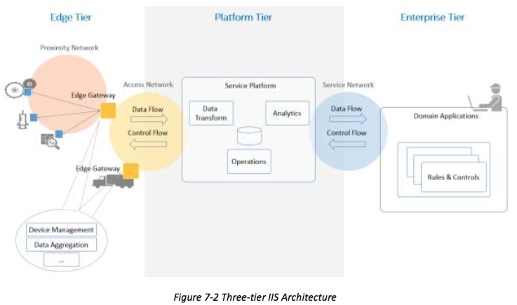
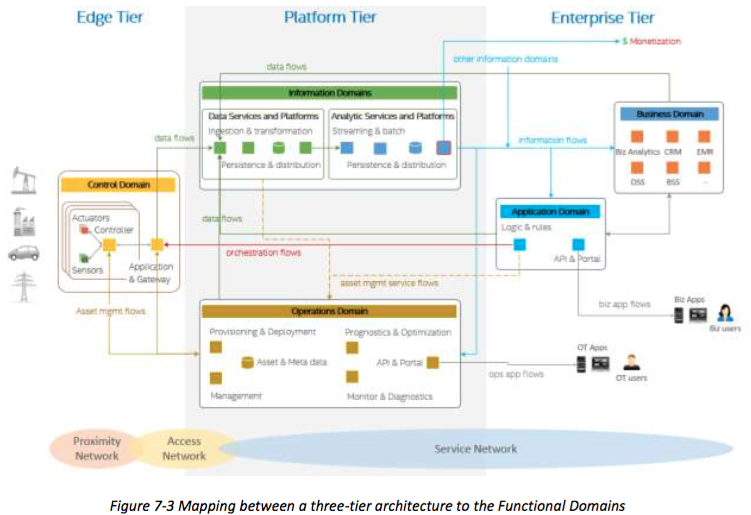
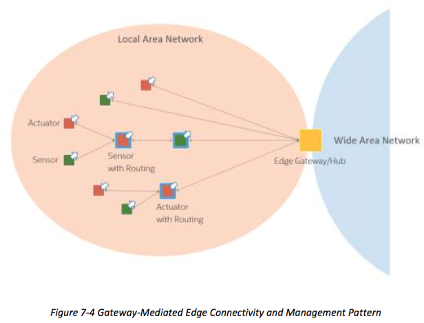
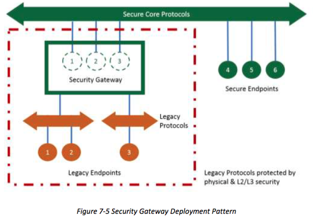

## 7 IMPLEMENTATION VIEWPOINT
## 7 实现观点
The implementation viewpoint is concerned with the technical representation of an Industrial Internet System and the technologies and system components required to implement the activities and functions prescribed by the usage and functional viewpoints.
执行视点涉及一种工业互联网系统的实施由使用和功能的观点出发规定的活动和功能所需的系统的组件的技术表示和技术和。

An IIS architecture and the choice of the technologies used for its implementation are also guided by the business viewpoint, including cost and go-to-market time constraints, business strategy in respect to the targeted markets, relevant regulation and compliance requirements and planned evolution of technologies.[^21] The implementation must also meet the system requirements including those identified as key system characteristics that are common across activities and must be enforced globally as end-to-end properties of the IIS. 
一个IIS架构和用于其实施的技术的选择也遵循的经营角度看，包括成本和进入市场时间的限制，经营策略相对于目标市场，相关的监管及合规要求和规划的演变技术。的实施也必须满足系统的要求，包括那些被确定为是在整个活动常见和必须在全球范围强制执行作为IIS的端 - 端特性密钥系统的特性。

The implementation viewpoint therefore describes:
因此，执行的观点描述：

* The general architecture of an IIS: its structure and the distribution of components, and the topology by which they are interconnected.
* A technical description of its components, including interfaces, protocols, behaviors and other properties.
* An implementation map of the activities identified in the usage viewpoint to the functional components, and from functional components to the implementation components.
* An implementation map for the key system characteristics.
* 一个IIS的一般结构：其结构和元件的分布，从而使它们相互连接的拓扑结构。
* 它的组成部分，其中包括接口，协议，行为等性能的技术说明。
* 在使用视点到上述功能部件，并从功能组件的执行部件确定的活动的实现的地图。
* 一个实现地图的关键系统特性。

[^21]: This version of the RA will not attempt to address regulatory and compliance requirements. These are substantially different by vertical, and may be addressed in more detail in future documents.

### 7.1 ARCHITECTURE PATTERNS
### 7.1 架构模式
Coherent IIS implementations follow certain well-established architectural patterns, such as:
连贯IIS实现遵循一定的成熟的架构模式，如：

* Three-tier architecture pattern
* Gateway-Mediated Edge Connectivity and Management architecture pattern
* Edge-to-Cloud architecture pattern (This pattern contrasts with the gateway-mediated
pattern as it assumes a wide-area connectivity and addressability for devices and assets.) 
* Multi-Tier Data Storage architecture pattern (This pattern supports a combination of storage tiers (performance tier, capacity tier, archive tier.)
* Distributed Analytics architecture pattern.
* 三层架构模式
* 网关介导边连通性和管理架构模式
* 边到云架构模式（这种模式与对比，因为它假设一个广域连接性和可寻址的设备和资产网关介导的模式。）
* 多级数据存储体系结构模式（这种模式支持的存储层（表现层，能力层，归档层的组合。）
* 分布式分析架构模式。

An architecture pattern is a simplified and abstracted view of a subset of an IIS implementation that is recurrent across many IIS, yet allowing for variants. For example, an implementation of the three-tier pattern in a real IIS does not exclude multiple implementations of every tier—e.g. many instances of the edge tier—as well as many-to-many connections between instances of a tier and instances of the next tier. Each tier and its connections will still be represented only once in the pattern definition.
一种架构模式是一个IIS执行一个子集的简化和抽象的观点，即是经常在许多IIS，但允许变种。例如，在一个真正的IIS三层模式的实现并不排除的每一级，例如多个实现边缘的许多实例一线以及一个层及下一层的实例实例之间许多到许多连接。每一层及其连接仍然会仅在图案定义一次来表示。

We describe the first two patterns in the previous list because of their stronger prevalence in IISs.
我们描述了因为在他们的IISS普遍存在较强的前两种模式在前面的列表中。

#### 7.1.1 THREE-TIER ARCHITECTURE PATTERN
#### 7.7.1 三层架构模式
The three-tier architecture pattern comprises edge, platform and enterprise tiers. These tiers play specific roles in processing the data flows and control flows (see section 6) involved in usage activities. They are connected by three networks, as shown in Figure 7-1.
三层架构模式包括边缘，平台和企业层次。这些层在处理数据流和控制流（见第6节）参与使用活动起着特殊的作用。它们通过三个网络相连，如图7-1所示。

	

The edge tier collects data from the edge nodes, using the proximity network. The architectural characteristics of this tier, breadth of distribution, location, governance scope and the nature of the proximity network, vary depending on the specific use cases.
边缘层从边缘节点收集数据，使用接近网络。这一层的建筑特征，分布，位置，治理范围和邻近网络的性质的广度，取决于具体使用例。

The platform tier receives, processes and forwards control commands from the enterprise tier to the edge tier. It consolidates processes and analyzes data flows from the edge tier and other tiers. It provides management functions for devices and assets. It also offers non-domain specific services such as data query and analytics.
该平台层接收，处理和从企业层到边缘层转发控制命令。它合并处理和分析从边缘层和其它层的数据流。它提供了管理功能的设备和资产。它还提供了非特定领域的服务，如数据查询和分析。

The enterprise tier implements domain-specific applications, decision support systems and
provides interfaces to end-users including operation specialists. The enterprise tier receives data flows from the edge and platform tier. It also originates control commands to the platform tier and edge tier.
企业层实现特定领域的应用，决策支持系统，并提供接口给最终用户，包括经营方面的专家。企业层接收从边缘和平台层数据流。它也源自控制命令到该平台层和边缘层。

>Note: In the above figure, functional blocks are shown in each tier. These functional blocks are indicative of the primary functional vocation of the tier, yet are not exclusively assigned to that tier. For example the 'data transform' function in the platform tier could also be found in the edge tier (e.g. performed by a gateway) although it would be implemented in a different way and for a different purpose. For example, 'data transform' at the edge is typically done in a device-specific manner through device-specific configuration and interfaces, unlike in the platform tier where it is usually supported as a higher-level service that operates on data that has been abstracted from any device source or type.
>注意：在上述图中，功能块示于每层。这些功能块表示层的主要功能的职业的，但不是仅仅分配给该层。例如，在平台层的“数据变换”功能也可以在边缘层（例如由网关执行的），尽管它会以不同的方式和不同的目的来实现中找到。例如，“数据变换'在边缘通常通过设备特定的配置和接口在平台层何处它通常支持作为上操作该已的数据的更高级别的服务做在一个设备专用的方式，不同于从任何设备来源或类型的抽象。

Different networks connect the tiers:
不同的网络连接层：

The proximity network connects the sensors, actuators, devices, control systems and assets, collectively called edge nodes. It typically connects these edge nodes, as one or more clusters related to a gateway that bridges to other networks.
接近网络连接的传感器，致动器，设备，控制系统和资产，统称边缘节点。它通常连接这些边缘节点，作为与桥接至其它网络的网关的一个或多个聚类。

The access network enables connectivity for data and control flows between the edge and the platform tiers. It may be a corporate network, or an overlay private network over the public Internet or a 4G/5G network.
接入网络使连接为边缘和平台层之间的数据和控制流。它可以是企业网络，或者一个覆盖专用网络在公共互联网或4G /5G网络。

The service network enables connectivity between the services in the platform tier and the enterprise tier. It may be an overlay private network over the public Internet or the Internet itself, allowing the enterprise grade of security between end-users and various services.
该服务网络，确保了服务于平台层和企业层之间的连接。这可能是一个覆盖专用网络通过公共互联网或互联网本身，使最终用户和各种服务之间的安全的企业级的。
		
		
		
The three-tier architecture pattern combines major components (e.g. platforms, management services, applications) that generally map to the functional domains (functional viewpoint) as shown in Figure 7-3.From the tier and domain perspective, the edge tier implements most of the control domain; the platform tier most of the information and operations domains; the enterprise tier most of the application and business domains. This mapping demonstrates a simple functional partitioning across tiers. The actual functional mapping of IIS tiers is usually not as simplistic and is highly depends on the specific of the system use cases and requirements. For example, some functions of the information domain may be implemented in or close to the edge tier, along with some application logic and rules to enable intelligent edge computing.
三层架构模式结合主要组件（例如平台，管理服务，应用程序），其通常映射到功能域（功能视点）如图7-3.From的层和域的角度来看，边缘层实现了大多数的控制域;平台层的大部分信息和操作域;企业层的大部分应用程序和业务领域。该映射表明跨层一个简单的功能划分。的IIS层次的实际功能映射通常是不一样简单，而且是高度依赖系统用例和需求的具体上。例如，该信息域的某些功能可以被实现或接近边缘层，以及一些应用逻辑和规则，以使智能边缘计算。

Another reason why implementation tiers do not generally have an exclusive mapping to a particular functional domain is that these tiers often provide services to each other to complete the end-to-end activities of the IIS. These services—e.g. data analytics from the information functional domain—then become supportive of other functional domains in other tiers. For example:
另一个原因执行层通常不具有专用映射的特定的功能域是，这些层往往相互提供服务，以完成的IIS的端至端的活动。这些服务，例如。从信息功能的数据分析领域，进而成为支持其他功能域在其他层次的。 例如：

The asset management flows (see fig. 7-2) is an expression of the operations domain component of the platform tier to manage the assets in the edge tier.
资产管理流（见图7-2）是平台层的操作域成分的表达在边缘层管理资产。

The operations domain component of the platform tier itself provides services (asset
management service flows in fig. 7-2) to other components, either in the same tier or in another.
该平台层本身的操作域组件提供的服务（在图资产管理服务流。7-2）的其它组件，无论是在同一层或另一个。

For example, the data services (information domain) component of the platform tier may request services from the operations domain component for:
例如，该平台层的数据（信息域）组分可以请求服务的操作域组件：
		
* The verification of asset credentials it receives in the data flows from the edge tier.
* The query of asset metadata so it can augment the data received from the assets before
the data are persisted or fed into analytics in the next stage of processing.
* 资产凭证它接收在数据验证从边缘层流动。
* 资产元数据的查询，所以可以增加从资产接收数据之前，在处理的下一阶段的数据被持久或馈送到分析。
		
Similar operations domain services can be provided to the application domain components in the enterprise tier as well. Conversely, the operations domain components may use data services from the information domain component in order to get better intelligence from asset data, e.g. for diagnostics, prognostics and optimization on the assets.
类似的操作域的服务可以以及被提供给应用程序域分量在企业层。相反地，操作域分量可能为了得到从资产数据，例如，更好的情报使用数据服务从信息域组件用于诊断，预测与优化的资产。

As a result, components from all functional domains may leverage the same data and use analytic platforms and services to transform data into information for their specific purposes.
其结果是，来自所有功能域组件可以利用相同的数据，并使用分析平台和服务将数据转换成信息用于其特定目的。

#### 7.1.2 GATEWAY-MEDIATED EDGE CONNECTIVITY AND MANAGEMENT ARCHITECTURE PATTERN
#### 7.1.2 网关介导EDGE连接和管理架构模式
The gateway-mediated edge connectivity and management architecture pattern comprises a local connectivity solution for the edge of an IIS, with a gateway that bridges to a wide area network as shown in Figure 7-4. The gateway acts as an endpoint for the wide area network while isolating the local network of edge nodes. This architecture pattern allows for localizing operations and controls (edge analytics and computing). Its main benefit is in breaking down the complexity of IISs, so that they may scale up both in numbers of managed assets as well as in networking. However, it may not be suited to systems where assets are mobile in a way that does not allow for stable clusters within the local network boundaries.
网关介导的边缘连接和管理体系结构模式包括为IIS边缘的本地连接解决方案，与桥接到广域网络，如图7-4的网关。网关充当广域网的端点同时隔离边缘节点的本地网络。这种架构模式允许本地化操作和控件（边分析和计算）。它的主要优点是在打破IISS的复杂性，以使它们可以扩大两者在管理资产的数量，以及在联网。然而，它可能不适合于系统，其中资产是移动的方式，不允许本地网络边界内稳定簇。

	

The edge gateway may also be used as a management point for devices and assets and data aggregation point where some data processing and analytics, and control logic are locally deployed.
边缘网关还可以用作用于设备和资产和数据聚集点处的一些数据处理和分析，以及控制逻辑本地部署的管理点。

The local network may use different topologies.
本地网络可以使用不同的拓扑结构。

In a hub-and-spoke topology, an edge gateway acts as a hub for connecting a cluster of edge nodes to each other and to a wide area network. It has a direct connection to each edge entity in the cluster allowing in-flow data from the edge nodes, and out-flow control commands to the edge nodes.
在一个轮毂和辐条拓扑，边缘网关充当边缘节点集群彼此连接和到广域网络的集线器。它具有集群允许在流数据从边缘节点中的每个边缘实体的直接连接，和出流控制命令给边缘节点。

In a mesh network (or peer-to-peer) topology, an edge gateway also acts as a hub for connecting a cluster of edge nodes to a wide area network. In this topology, however, some of the edge nodes have routing capability. As result, the routing paths from an edge node to another and to the edge gateway vary and may change dynamically. This topology is best suited to provide broad area coverage for low-power and low-data rate applications on resource-constrained devices that are geographically distributed.
在网状网络中（或对等的对等）的拓扑结构，边缘网关还用作边缘节点集群连接到广域网络的集线器。在此拓扑中，然而，一些边缘节点拥有路由能力。作为结果，路由路径从边缘节点到另一个节点和边缘网关变化，并且可以动态地改变。这种拓扑结构是最适合的资源受限的设备的低功耗，低数据速率应用地理上分布广泛提供区域覆盖。

In both topologies, the edge nodes are not directly accessible from the wide area network. The edge gateway acts as the single entry point to the edge nodes and as management point providing routing and address translation.
在这两种拓扑，边缘节点是不能直接从广域网进行访问。边缘网关充当单一的入口点到边缘节点和作为管理点提供路由和地址转换。

The edge gateway supports the following capabilities:
边缘网关支持以下功能：

* Local connectivity through wired serial buses and short-range wireless networks. New communication technologies and protocols are emerging in new deployments.
* Network and protocol bridging supporting various data transfer modes between the edge nodes and the wide area network: asynchronous, streaming, event-based and store-and- forward.
* Local data processing including aggregation, transformation, filtering, consolidation and analytics.
* Device and asset control and management point that manages the edge nodes locally and acts an agent enabling remote management of the edge nodes via the wide area network. 
* Site-specific decision and application logic that are perform within the local scope.
* 通过有线串行总线和短距离无线网络的本地连接。新的通信技术和协议正在出现新的部署。
* 网络和协议桥接支承边缘节点和广域网之间的各种数据传输模式：异步，流，基于事件和存储转发。
* 包括聚合，转换，过滤，整理和分析本地数据处理。
* 设备和资产的控制和管理点局部地管理在边缘节点和作用的药剂经由广域网使边缘节点的远程管理。
* 站点具体的决定和应用程序逻辑中的本地范围内执行。

## 7.2 SECURE IMPLEMENTATIONS
## 7.2 安全的执行
To secure an Industrial Internet System, we outline a number of important and common security issues to be addressed in its implementation.
为了确保一个工业网络系统，我们列出了在其实施需要解决一些重要的和共同的安全问题。

End-to-end security: To achieve end-to-end security in an IIS, its implementation must provide:
终端到终端的安全性：为了实现终端到终端的安全性在IIS，它的实现必须提供：

* protected device-to-device communications,
* confidentiality and privacy of the data collected,
* remote security management and monitoring,
* simultaneously addressing both existing technologies as well as new technologies, and
* seamlessly spanning both information technology (IT) and operational technology (OT)
subsystems and processes without interfering with operational business processes.
* 保护设备到设备通信，
* 保密收集到的数据和隐私，
* 远程安全管理和监控，
* 同时解决现有的技术以及新技术，和
* 无缝跨越两个信息技术（IT）和运营技术（OT）子系统和进程，而与运营业务流程的干扰。

This effort requires building in security by design rather than the often-tried and often-failed paradigm of bringing it in as an afterthought.
这项工作要求的建筑安全设计，而不是把它作为一种事后的经常尝试和经常失败的范例。

Securing legacy systems: Most IISs incorporate legacy systems due to the effort and capital expense involved in replacing or retrofitting these systems in industrial plants, hospitals and infrastructures. Often the legacy endpoints in these systems implement limited or no security capability in processing and in the protocols they use, and they are not modifiable to add the requisite security capability. Security of the overall system requires minimizing the attack surface of these legacy systems.
保护遗留系统：大多数的IISS将传统系统由于涉及更换或改造这些系统在工厂，医院和基础设施的努力和资本支出。经常在这些系统中的旧式终端中的处理和在它们使用的协议实现有限或无安全能力，并且它们不是修改来添加必要的安全能力。整个系统的安全性，需要尽量减少这些遗留系统的攻击面。

The use of security gateways is an approach to secure legacy endpoints and their protocols. A security gateway acting as proxies for the legacy endpoints bridges the legacy protocols supported by the legacy endpoints and their counterparts used by new endpoints. A security gateway isolates the attack surface introduced by the legacy endpoints and their protocols to the links from these endpoints. However, isolating the attack surface is insufficient, as we still need to detect attacks. We want to detect security attacks by analyzing the data for anomalies and abnormal behavior in a way that can be done within the threat surface, that is not all attacks will be routed through the gateway.
使用安全网关是确保旧式终端及其议定书的方法。安全网关充当代理的旧式终端桥面使用新的端点遗留终端和对口支持的传统协议。安全网关隔离的旧式终端及其议定书，从这些端点的链接介绍了攻击面。然而，隔离攻击面是不够的，因为我们仍然需要检测的攻击。我们想通过分析的方式，可以将所述威胁表面内进行对异常和异常行为的数据，以检测安全攻击，即不将通过网关被路由所有的攻击。



Security for architectural patterns: Every architecture pattern has its own specific security requirements and challenges. In the three-tier architecture pattern, for example, there are four critical areas and operations to secure:
安全性架构模式：每一个架构模式都有自己特定的安全需求和挑战。在三层架构模式，例如，有四个关键领域和业务，以确保：

* end-points
* information exchange
* management and control
* data distribution and storage
* 终点
* 信息交流
* 管理和控制
* 数据分配和存储

End-point security: Many IISs need to embed security capabilities and policy enforcement directly in end-point devices. It includes the enablement of the remote management and monitoring of end-points for near real-time security responses during an attack as well as for proactive security measures prior to an attack. The end-point should have the ability and autonomy to defend itself and must remain resilient even when disconnected from the external security management systems. Endpoints must be able remain secure and resilient even when adjacent peer endpoints are compromised.[^22] The embedded security measures should include mitigating controls, countermeasures and/or remediation actions defined by security policies to minimize the risk of being compromised and the impact when being compromised.
端点安全：许多IISS需要直接在终端设备中嵌入的安全功能和策略执行。它包括远程管理和监控的终点近实时的安全响应过程中的攻击以及对之前的攻击主动安全性措施的启用。结束点应具备的能力和自主性，以保护自己，甚至当从外部安全管理系统断开必须保持弹性。端点必须能够保持安全和有弹性的，即使相邻节点端点受到损害。嵌入式安全保护措施应包括减轻由安全策略定义的控制，对策和/或补救措施，以尽量减少被破坏的风险，当冲击被泄露。

[^22]: Both in the physical and the process sense.

Information exchange security: Communication and data exchanges within an IIS must be protected for authenticity, confidentiality, integrity and non-repudiation. Security solutions and practices in information technologies can be applied to network segments and applications that are built on information technologies-based infrastructures in an IIS. In some industrial environments, legacy communication technologies, protocols and processing capability may limit the full security implementation for information exchange. In these environments, the security gateway approach discussed above may be employed to protect the information exchange between the local legacy environments and the broad systems while enforcing logical isolation and physical protection for the local environments until the inadequate legacy systems are phased out over time.
信息交流的安全性：在一个IIS的通信和数据交换必须被保护的真实性，保密性，完整性和不可抵赖性。在信息技术安全解决方案和做法，可以适用于网段，即建立在信息技术应用的基础架构中的IIS。在一些工业环境中，传统的通信技术，协议和处理能力可以限制充分安全实现信息交换。在这些环境中，上面所讨论的安全网关的方法，可以采用，以保护当地传统环境和同时实施逻辑隔离和物理保护的本地环境，直到不足遗留系统被淘汰随时间的广泛系统之间的信息交换。