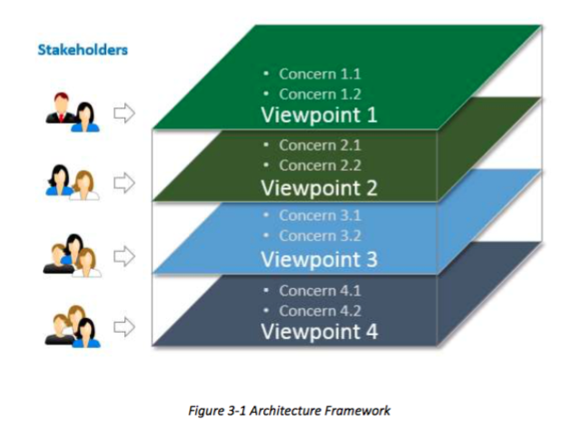
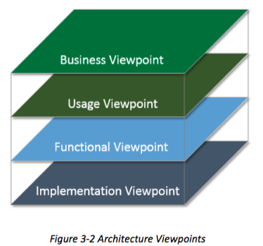
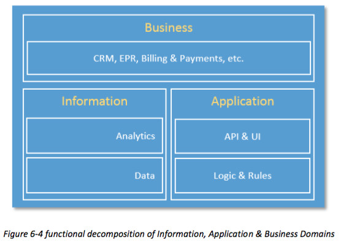
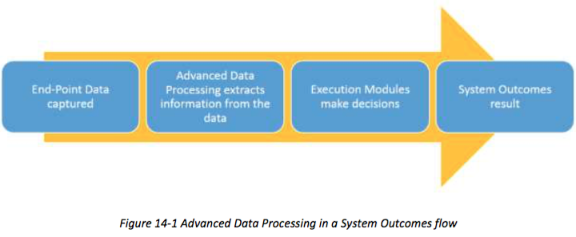
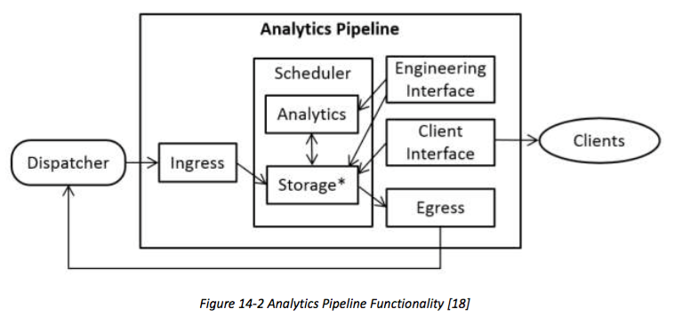

日期 | 版本 | 描述
------ | ------| ------
2016.01.17 | v0.1 | 初版

## 1 RATIONALE AND CONTEXT
## 1 原理及背景
This document describes a Reference Architecture for Industrial Internet Systems.
It defines Industrial Internet Systems, and specifies an Industrial Internet Architecture Framework to aid in the development, documentation and communication of the Industrial Internet Reference Architecture. We begin by describing our scope.
本文介绍了一个参考架构工业网络系统。
它定义了工业网络系统，并指定一个工业网络体系结构框架中的工业网络参考架构的发展，文件和通讯，以帮助。我们首先描述我们的范围。
### 1.1 THE INDUSTRIAL INTERNET
### 1.1 工业互联网
The Industrial Internet is an internet of things, machines, computers and people, enabling intelligent industrial operations using advanced data analytics for transformational business outcomes. It embodies the convergence of the global industrial ecosystem, advanced computing and manufacturing, pervasive sensing and ubiquitous network connectivity.
工业互联网是物联网，机械，计算机和人的网络，采用先进的数据分析为业务转型成果实现智能产业化经营。它体现了全球的产业生态系统，先进的计算和制造，无处不在的传感和无处不在的网络连接性的融合。


There are many interconnected systems deployed today that combine hardware, software and networking capabilities to sense and control the physical world. These industrial control systems contain embedded sensors, processors and actuators that provide the capability to serve specific operational or business purposes, but, by and large, these systems have not been connected to broader systems or the people who work with them.
有当前部署许多互连系统相结合的硬件，软件和网络功能，以检测和控制物理世界。这些工业控制系统包含嵌入的传感器，处理器和执行器提供服务的具体能力运营或商业目的，但总的来说，这些系统没有连接到更广泛的系统或者谁与他们一起工作的人。

The Industrial Internet concept is one that has evolved over the last decade to encompass a globally interconnected network of trillions of ubiquitous addressable devices and collectively representing the physical world.
工业互联网概念是一个已经发展在过去十年中，以涵盖全球互联的无所不在的寻址装置万亿和集体代表物理世界的网络。

The Industrial Internet effort will bring industrial control systems online to form large end-to-end systems, connecting them with people, and fully integrating them with enterprise systems, business processes and analytics solutions. These end-to-end systems are referred to as Industrial Internet Systems (IISs). Within these IISs, operational sensor data and the interactions of people with the systems may be combined with organizational or public information for advanced analytics and other advanced data processing (e.g., rule-based policies and decision systems). The result of such analytics and processing will in turn enable significant advances in optimizing decision-making, operation and collaboration among a large number of increasingly autonomous control systems.
工业互联网的努力会带来工业控制系统网络，形成大的终端到终端系统，与人连接它们，并充分与企业系统，业务流程和分析解决方案整合它们。这些终端到终端系统被称为工业互联网系统（IISs）。在这些国际战略研究所，操作传感器数据和人与系统的交互可以与组织或公共信息高级分析等先进的数据处理（例如，以规则为基础的政策和决策系统）相结合。这样的分析和处理的结果将反过来使在优化中的大量日益自主控制系统的决策，操作和协作显著进展。

Industrial Internet systems cover energy, healthcare, manufacturing, public sector,
transportation and related industrial systems. As such, many IISs operate in mission critical environments and so demand high standards of security, safety and resiliency, different from those in the consumer and commercial sectors. We do not draw a clear boundary between these types of systems. Rather, we focus on the reference architectures required for industrial systems with the understanding that many concepts defined here may be applied in other types of systems.
工业网络系统涵盖能源，医疗保健，制造业，公共事业，交通运输及相关产业体系。因此，许多工业互联网系统工作在关键任务环境，因此需要高标准的安全性，安全性和弹性，那些在消费和商业部门不同。我们不吸取这些类型的系统之间有清晰的界限。相反，我们专注于需要工业系统的理解，这里定义的许多概念可以在其他类型的系统中应用的参考架构。

To be effective, an IIS requires significant increases in levels of performance, scalability and efficiency. For rapid and widespread deployment, the IISs must be easily understandable and supported by widely applicable, standard-based, open and horizontal architecture frameworks and reference architectures that can be implemented with interoperable and interchangeable building blocks. These are the key motivations of this document.
为了有效，一个IIS需要显著增加在性能，可扩展性和效率水平。为了快速和广泛部署，峰峰必须易于理解和支持，可与互操作，并可互换的模块来实现广泛应用的，基于标准的，开放的和横向的结构框架和参考架构。这是本文的主要动机。
### 1.2 REFERENCE ARCHITECTURE CONCEPTS
### 1.2 参考架构概念

A reference architecture provides guidance for the development of system, solution and application architectures. It provides common and consistent definitions in the system of interest, its decompositions and design patterns, and a common vocabulary with which to discuss the specification of implementations so that options may be compared.
参考架构提供指导方针，系统，解决方案和应用架构的发展。它提供了共同一致的定义在感兴趣的系统，它的分解和设计模式，和一个共同的词汇与讨论实现的规格，这样的选择可被比较。

>Example: A reference architecture for a residential house states that all residential houses need to provide one or more bedrooms, bathrooms, a kitchen and a living area. This set of rooms is accessible inside the house through doors, hallways and stairways, and from outside through a main and a back door. The house provides a safe environment against threats such as fire, hurricanes and earthquakes. The structure of the house needs to sustain snow and wind load that may be found in its local environment. The house needs to provide reasonable measures to detect and prevent unauthorized intrusions.

>例如：一个参考架构的住宅规定，所有居住房屋需要提供一个或多个卧室，浴室，一间厨房和起居区。这套房间是访问通过门，走廊和楼梯的房子里面，从外面通过主和后门。房子提供了对如火灾，飓风和地震威胁安全的环境。房子的结构需要维持风雪荷载，可能会在其本地环境中找到。房子需要提供合理的措施，以发现并防止未经授权的入侵。

A reference architecture provides a common framework around which more detailed discussions can center. By staying at a higher level of abstraction, it enables the identification and comprehension of the most important issues and patterns across its applications in many different use cases. By avoiding specifics, a reference architecture allows subsequent designs to follow the reference architecture without the encumbrance of unnecessary and arbitrary restrictions.
参考架构提供了一个通用框架，在其周围更详细的讨论能中心。通过住在一个更高的抽象水平，它能够跨越其应用的最重要的问题和模式，在许多不同的使用情况下，识别和理解。通过避免细节，参考架构允许随后的设计遵循参考架构没有不必要的和任意限制的累赘。
### 1.3 INDUSTRIAL INTERNET REFERENCE ARCHITECTURE
### 1.3 工业互联网参考架构
The Industrial Internet Reference Architecture (IIRA) is a standard-based open architecture for IISs. To maximize its value, the IIRA has broad industry applicability to drive interoperability, to map applicable technologies, and to guide technology and standard development. The description and representation of the architecture are generic and at a high level of abstraction to support the requisite broad industry applicability. The IIRA distills and abstracts common characteristics, features and patterns from use cases well understood at this time, prominently those that have been defined in the Industrial Internet Consortium (IIC). The IIRA design is intended to transcend today’s available technologies and in so doing is capable of identifying technology gaps based on the architectural requirements. This will in turn drive new technology development efforts by the Industrial Internet community.
工业网络参考架构（IIRA）是一个基于标准的开放式体系结构的工业互联网系统。为了最大限度地提高它的价值，爱尔兰共和军拥有广泛的行业应用推动互操作性，以映射适用技术，并指导技术和标准的发展。该体系结构的描述和表示法是通用的，抽象，以支持必要的广泛工业应用性高的水平。所述IIRA蒸馏和提取的共同特点，特征和从用例模式很好地理解，在这个时候，显着那些在工业互联网协会（IIC）被定义。该IIRA设计旨在超越当今现有的技术并在这样做能够识别根据建筑要求的技术差距。这将反过来推动由工业互联网界新技术的开发力度。
### 1.4 MAJOR COMPONENTS OF THE TECHNICAL REPORT
### 1.4 技术报告的重要组成部分
This technical report is divided into two parts. The first part (Chapters 1~7) provides rationale and context for the types of system under consideration (Chapter 1), and their key characteristics (Chapter 2), the architectural framework we use to describe the reference architecture (Chapter 3), and each of the component parts (‘viewpoints’) of the reference architecture (Chapter 4~Chapter7). The second part (Chapters 8~16) provides an analysis of key system concerns that require consistent analysis across the viewpoints to ensure concerted system behaviors. We conclude with references (Chapter 17).
此技术报告是分为两部分。第一部分（章节1〜7）提供了所考虑的理由和上下文系统的类型（第1章），并且它们的主要特征（第2章），建筑框架我们用来描述参考架构（第3章），及每个参考架构的组成部分（“视点”）的（第4〜第7章）。第二部分（章节8〜16）提供了需要跨观点考虑一致分析，以确保一致的系统行为的关键系统的关注的分析。最后，我们引用（第17章）。

The force behind the Industrial Internet is the integration of Information Technologies (IT) and Operational Technologies (OT). That integration is now realized in several domains as described in Chapters 4~7. Further exploration of IT/OT issues is deferred to later versions. The IIC Vocabulary defines terms used in this document and other IIC documents [1].
背后的工业互联网的力量是信息技术（IT）和运营技术（OT）的集成。在第4章〜7描述了整合，现在实现了在一些领域。对IT/ OT问题的进一步勘探推迟到更高版本。在IIC词汇定义本文档中使用的术语和其他IIC文件[1]。

### 1.5 NEXT STEPS

### 1.5 下一步
The publication of this first version of this Technical Report enables feedback. As more use cases are developed, more real systems built, and more IIC testbeds deliver results, we will continuously explore the general architecture of Industrial Internet Systems, guided by the feedback from these activities, both to refine this document and produce new works built on it. Meanwhile, we shall define which standards and technologies fit into the building blocks of the reference architecture, identify gaps and define requirements for improvement.
这个技术报告的第一个版本的发布使反馈。随着越来越多的用例的开发，更真实的系统构建，更IIC测试平台取得成果，我们将不断探索实业互联网系统，通过这些活动的反馈指导的总体结构，既要完善这一文件，并产生建立在新的作品 它。同时，我们将定义哪些标准和技术融入参考架构的基石，找出差距，明确改进的要求。

## 2 KEY SYSTEM CHARACTERISTICS AND THEIR ASSURANCE
## 2 钥匙系统特征及其保证
### 2.1 KEY SYSTEM CHARACTERISTICS
### 2.1 钥匙系统特征
An Industrial Internet System will exhibit end-to-end characteristics, such as safety, security or resilience. Such characteristics are emergent properties or behaviors of the IIS resulting from the properties of its various components and the nature of their interactions. Because IISs are large scale, heterogeneous, built with multi-vendor components, often broadly distributed and continuously evolving, it is a challenge to define, measure, enforce and maintain the system characteristics over time. For these reasons, we give prominent treatment to a few key system characteristics in this document.
一个工业网络系统将展示终端到终端的特性，如安全，安全或韧性。这样的特性是突发属性或从它的各种组件的属性和它们的相互作用的性质而产生的的IIS行为。由于国际战略研究所是大型，异构，建有多个供应商的组件，往往广泛分布和不断发展的，它是定义，测量，实施并随着时间的推移维护系统的特点是一个挑战。由于这些原因，我们给突出治疗本文件中的一些关键的系统特性。

A system characteristic is delivered through four elements:
系统的特点是通过四个要素提供：

* the system’s functional components and their interactions,
* the way the system is used and maintained (system operations) and
* the engineering process by which the components are created and the system assembled (system engineering),
* the evidence gathered throughout the full lifecycle of the components and systems.[^1]
* 该系统的功能部件和它们的相互作用,
* 该系统的使用和维护的方式（系统操作）
* 通过该组件创建的工程过程和组装系统（系统工程）,
* 聚集整个部件和系统的整个生命周期的证据。

Common system characteristics include upholding privacy expectations, reliability, scalability, usability, maintainability, portability and composability but three are key to the discussion of IISs because of their criticality in ensuring the core functions, rather than the efficiency, of these functions, of the system:
通用系统的特征包括的坚持隐私期望，可靠性，可扩展性，易用性，可维护性，可移植性和可组合，但三个是关键IISs的讨论，因为它们在确保核心功能临界的，而不是效率，这些功能时，系统的：

Safety: the condition of the system operating without causing unacceptable risk of physical injury or damage to the health of people, either directly, or indirectly as a result of damage to property or to the environment.[^2]
安全性：系统没有造成人身伤害或损害的不可接受的风险对人的健康运行的前提下，无论是直接或间接的财产损失或环境的结果。

Security: the condition of the system operating without allowing unintended or unauthorized access, change or destruction of the system or the data and information it encompasses.
可靠性：该系统操作，而不使系统或它包含了数据和信息的意外或未经授权的访问，改变或破坏的情况。


Resilience: the condition of the system being able to avoid, absorb and/or manage dynamic
adversarial conditions while completing assigned mission(s), and to reconstitute operational capabilities after casualties.
韧性：该系统能够避免的情况下，吸收和/或管理动态对抗性的条件，同时完成分配的任务和人员伤亡后重建作战能力。

[^1]: Broadly speaking, a lifecycle of a system includes activities for requirement specification, design, development, manufacturing, test, assembly, integration, delivery, deployment, verification, evolution and upgrade, un-deployment, and disposal of the system. We will not hereafter refer to the specific activities unless it is necessary.
[^2]:IEC 61508, Functional Safety [25]

Desired system characteristics and the degree they are needed vary by system. They may be motivated by business context and values, be mandated by regulations and contractual agreements, or simply be commonly expected behaviors for a specific type of system. Note that some of these desired characteristics may be negated by unintended side effect of other unrelated system behaviors.[^3]
所需的系统特性和它们所需要的程度而变化由系统。他们可以通过商业环境和价值的动机，通过法规和合同协议，或者系统的特定类型简单地普遍预期的行为得到授权。注意，其中的一些所需特性可以通过其它无关系统行为意想不到的副作用被否定。

To preserve these system characteristics in the evolving IISs, continuous tracking and auditing should be provided throughout the lifecycle of these systems.
为了保持在不断变化的IISs这些系统的特性，连续跟踪和审核应贯穿这些系统的生命周期中被提供。

The number of reports of security attacks on large enterprise and infrastructure systems is rapidly increasing, along with the level of damage they have wrought. These attacks are better organized, and employ attack techniques of ever-increasing levels of sophistication. The actors in these attacks are becoming more diverse and include anyone from insiders to casual hackers, terrorists and state-sponsored actors. Security for Industrial Internet systems from design, development, and deployment to operations must be heightened to mitigate the increased security risks. We therefore give security, a key system characteristic, a strong emphasis in this document.
_对大型企业和基础设施系统的安全攻击报告的数量正在迅速增加，随着损伤的程度，他们紧张得要命。这些攻击有更好的组织，并采用复杂程度不断增加的攻击技术。在这些攻击的角色正变得更加多样化，包括任何人从内部人士向业余黑客，恐怖分子和国家支持的参与者。安全用于从设计，开发和部署到操作的工业互联网系统必须被提高以减少越来越高的安全风险。因此，我们给予保障，钥匙系统特征，本文件中的高度重视。_

[^3]:For example, a system that tracks an individual’s location on a ship to provide a man-overboard alert may also violate privacy expectations of that individual.例如，一个系统，在船上追踪个体的位置，以提供一个人为的舷外警报也可能违反该个人的隐私的期望。

### 2.2 SYSTEM CHARACTERISTIC ASSURANCE
### 2.2 系统特征保证

System characteristics are often subject to regulations, compliance requirements and contractual agreements and thus need be measured and assessed.[^4] The foundation for claiming such characteristics covers three major aspects:
系统特点常常受到法规，合规要求和合同协议，因此需要进行测量和评估.声称具有这种特性的基础包括三个主要方面：

[^4]:Examples of security related compliances include Common Criteria [23] and various Federal Information Processing Standards (FIPS) specifications. Examples of safety related compliance include the application of DO-178B/C to avionics software systems certification by the FAA. Compliance will not be taken up by the RA but may be addressed by future more detailed documents, as they are greatly dependent on the specific vertical and deployment scenario.安全与遵从性的例子包括通用标准[23]和各联邦信息处理标准（FIPS）规格。安全相关的合规性的例子包括DO-178B/ C的应用，航空电子软件系统认证，通过了美国联邦航空局。遵守不会被吸收由RA，但可以通过将来更详细的文件加以处理，因为它们是极大地依赖于特定的垂直和部署方案。

System engineering: Evidence supporting system characteristics must be gathered and provided, with proper tracking and certification, on the components and the system formed from their combination throughout the entire lifecycle of activities. It may include specific attributes of the software and hardware, documentation on the way it was constructed, where it was developed and by whom, and records of the types of component testing and analysis carried out, and the results thereof.
系统工程：支撑系统特性的证据必须收集和提供适当的跟踪和认证，对部件，并从他们的组合在整个活动的整个生命周期构成的系统。它可以包括软件和硬件的特定属性，在途中文档它被建造，在那里它被开发和由谁，和组件测试和分析的类型的记录进行的，并且其结果。

System operations: A system characteristic may depend on how a system is being used independent from the quality of the system design and components. Evidence must be available to demonstrate that the system operational processes support the characteristic. This may include evidence that the system is being used for its intended purpose and the qualification of the personnel who play a role in its operations.
系统的操作：甲系统特性可以取决于如何一个系统正在从系统设计和组件的质量中使用独立的。证据必须可用于证明该系统的操作流程支持特性。这可以包括证据，该系统被用于其预期目的和谁玩在其动作的角色的人员的资格。


System auditing: The system and its processes shall support the collection and the evaluation of metrics and logs necessary for monitoring and auditing the important characteristics. Monitoring and audit processes should be established and audit records must be maintained.
系统审计：系统和流程应支持收集和必要的监控和审计的重要特征指标和日志的评价。监控和审核过程应建立审计记录必须保持。

Because IISs are built from multi-vendor components and solutions, possibly composed
dynamically after deployment, engineers must be able to access recorded claims and their supportive evidences of specific system characteristics in components to evaluate, select, acquire and assemble qualified components into the desired IIS.
由于IISs是由多厂商组件和解决方案构建，可能是由部署后动态，工程师必须能够访问记录，权利要求和具体的系统特性中的组件的支持性的证据，以评估，选择，获得和装配合格的组件到所需的IIS。

>Example: In the residential house example above, information about fire resistance, load bearing capabilities and structural integrity of the materials must be available to support the claimed “key system characteristic” of safety for individually constructed homes.
>例子：在上面的住宅为例，约耐火性，承载能力和材料的结构完整性的信息必须提供能支持这种说法“钥匙系统的特点”安全的单独修建的家。

Similarly, the software in a Bluetooth-enabled device that controls the Bluetooth interface and communicates with external entities should have information available to support the assessment of the key characteristics in its fitness for a given use case. This information may include coding practices and reviews, tests and assessments done with respect to its strength to accidental inputs, malicious attacks, and the known issues and their risks in coding, design and architecture if any. It may also include regular and contingent update process and methods to address newly discovered vulnerabilities.
>同样地，在具有蓝牙功能的设备，其控制所述蓝牙接口和与外部实体进行通信应该要支持的关键特征的评估在其适应一个给定的用例可用信息的软件。这些信息可能包括编码惯例和评价，测试和评估方面做了它的实力意外投入，恶意攻击，以及已知的问题和他们的编码，设计和建筑，如果任何风险。它也可以包括常规和队伍更新过程和方法来解决新发现的漏洞。

>Supported by the information along with testable results as evidence, we can ascertain that it is, for example, safe and secure enough to use in an interface to an insulin pump.
>支持连同可测试结果作为证据的信息，我们能够确定它是，例如，安全有保障足够的接口使用到胰岛素泵。

An assurance case [2] [3] [4] is an argument supporting a claim that an IIS satisfies given provide a means to structure the reasoning about system creators can gain confidence that systems will work as expected. The assurance case also becomes a key element in the documentation of the system and provides a map to more detailed information.
一个保证的情况下[2] [3] [4]为支持主张给予IIS满足提供结构关于系统创作者的推理能够获得信心，系统会按预期的方式的参数。该保证的情况下也成为该系统的文档中的一个关键因素，并提供地图，以更详细的信息。

The activities required to construct an assurance case are similar to those that would normally occur when developing a system with required behaviors and characteristics. Assurance cases highlight and explicitly present the claims, evidence and reasoning that relates them together in a reviewable form. The explicit connections between what is claimed and the evidence used to support that claim makes the assurance case a useful tool for third parties who need to have confidence that the IIS exhibits the desired characteristics.
构造一个保证情况下所需的活动是类似于显影所需的行为和特征的系统时，通常会发生的。保证案件突出，并明确提出了索赔，证据和推理涉及他们在一个审查的形式在一起。所主张并用于支持该请求的证据，使案件的保证谁需要有信心，在IIS具有所要求的特性第三方的有效工具之间的明确联系。

Assurance cases are also often used to support the iterative review and revision of the implementation of the claimed characteristics until the stakeholder gains sufficient confidence about the system displaying the claimed behaviors.
保证的情况也经常被用来支持所要求的特性实施的反复审查和修订，直到利益相关者获得有关显示所要求的行为的系统足够的信心。

## 3 INDUSTRIAL INTERNET REFERENCE ARCHITECTURE
## 3 工业互联网参考架构
### 3.1 INDUSTRIAL INTERNET ARCHITECTURE FRAMEWORK
### 3.1 工业互联网体系结构
Many stakeholders are involved when considering complex systems such as those expected of Industrial Internet Systems (IISs). These stakeholders have many intertwining concerns pertinent to the system of interest. Their concerns cover the full lifecycle of the system, and their complexity calls for a framework to identify and classify the concerns into appropriate categories so that they can be evaluated and addressed systematically.
考虑到复杂的系统，如预期的工业互联网系统（IISs）的时候，许多利益相关者有参与进来。这些利益相关者有关的感兴趣的系统很多相互交织的关注。他们的关注覆盖系统的整个生命周期，和它们的复杂性要求的框架，以识别和分类的问题纳入适当的类别，以便它们可以评估和系统地处理。

To address this need, the Industrial Internet Consortium has defined an architecture framework that describes the conventions, principles and practices for the description of architectures established within a specific domain of application and/or community of stakeholders. Based on ISO/IEC/IEEE 42010:2011 [5], the IIC Architecture Framework facilitates easier evaluation, and systematic and effective resolution of stakeholder concerns, and serves as a valuable resource to guide the development and the documentation of, and the communication about, the Industrial Internet Reference Architecture (IIRA).
为了满足这一需求，工业互联网协会定义了一个架构框架，描述的约定，原则和实践应用的利益相关者和/或社区的特定领域内建立体系结构的描述。基于ISO/ IEC/ IEEE420102011[5]，在IIC体系结构框架有利于更容易评估和利益相关者的关注系统，有效的解决，并作为一种宝贵的资源，引导发展和文档，以及有关通信，工业网络参考架构（IIRA）。

The ISO/IEC/IEEE 42010:2011 standard specification codifies the conventions and common
practices of architecting and provides a core ontology for the description of architectures. The IIAF adopts the general concepts and constructs in this specification, e.g. architecture and architecture framework, concern, stakeholder, and viewpoint.
在ISO/ IEC/ IEEE42010：2011标准规范编纂的各项公约和共同架构和实践提供了一个核心本体为架构的描述。所述IIAF采用在本说明书中，例如，一般的概念和构造架构和架构框架，关心，利益相关者和观点。

The term concern refers to any topic of interest pertaining to the system. A stakeholder is an individual, team, organization or classes thereof, having an interest in a system. A viewpoint consists of conventions framing the description and analysis of specific system concerns.
术语关注是指与所述系统相关的兴趣的任何主题。风险承担者是个人，团队，组织或类物，有兴趣的系统。视点由公约框架的具体制度关注的描述和分析。

The stakeholders, concerns, viewpoints and their relationship, as shown in Figure 3-1, form the basis of the Architecture Framework. The Industrial Internet Reference Architecture is fully described by the analysis on the set of specific concerns in viewpoints.
利益相关方，关注，观点和他们的关系，如图3-1所示，形成体系结构框架的基础。工业网络参考架构是完全被分析的一系列观点中的具体问题描述。

>Example: Suppose we want to address the concerns of what the functional subsystems are,
across what interfaces they interact and how they interact to realize the desired system behaviors. A functional decomposition of the system can make each of the subsystems easier to conceive, understand, design, implement, reuse and maintain. A component diagram may be used to describe structure of the subsystems and their interfaces, sequence diagrams the way in which the subsystems interact, and state diagrams the way in which the system or one of its subsystems behaves in response to external events. These diagrams and their associated documentation collectively describe and address the concerns of the
functional viewpoint.
例如：假设我们要解决什么样的功能子系统有关心的问题，横跨哪些接口它们相互作用，以及他们如何交互以实现所期望的系统行为。该系统的功能分解可以使每一个容易的子系统想象，理解，设计，实施，再利用和维护。组件图可以用来形容子系统及其接口的结构，序列图中，各子系统之间的交互方式，以及状态图中的系统或它的子系统的行为响应外部事件的方式。这些图表及其相关文件共同描述和处理功能的观点的关注。

### 3.2 INDUSTRIAL INTERNET VIEWPOINTS
### 3.2 工业互联网观点

The various concerns of an IIS are classified and grouped together as four viewpoints:
一个IIS的各种关注进行分类，聚合为四种观点：
＊ Business
＊ Usage
＊ Functional
＊ Implementation
* 商业
* 用法
* 功能
* 实施

As shown in Figure 3-2, these four viewpoints form the basis for a detailed viewpoint-by- viewpoint analysis of individual sets of Industrial Internet System concerns.
如图3-2所示，这四个观点形成的基础，工业互联网体系的担忧各组的详细观点逐角度的分析。

The Business Viewpoint attends to the concerns of the identification of stakeholders and their business vision, values and objectives in establishing an IIS in its business and regulatory context. It further identifies how the IIS achieves the stated objectives through its mapping to fundamental system capabilities.
商务视点照顾到利益相关者的识别目标，在业务和管理方面建立IIS的关注，他们的业务愿景，价值观和。它进一步明确了如何在IIS通过其映射到基本的系统功能，实现了既定目标。

These concerns are business-oriented and are of particular interest to business decision-makers,product managers and system engineers.
这些问题都是以企业为主体，并特别感兴趣的企业决策者，产品经理和系统工程师。

The usage viewpoint addresses the concerns of expected system usage. It is typically represented as sequences of activities involving human or logical users that deliver its intended functionality in ultimately achieving its fundamental system capabilities.
用法的观点解决预期的系统使用情况的关切。它通常表示为涉及能够提供在最终实现其基本的系统功能，它的预期功能的人类或逻辑用户的活动序列。

The stakeholders of these concerns typically include system engineers, product managers and the other stakeholders including the individuals who are involved in the specification of the IIS under consideration and who represent the users in its ultimate usage.
这些问题的利益相关者通常包括系统工程师，产品经理和其他利益相关者，包括参与在IIS中所考虑的规范谁和谁代表了用户在其最终用途的个人。

The functional viewpoint focuses on the functional components in an IIS, their interrelation and structure, the interfaces and interactions between them, and the relation and interactions of the system with external elements in the environment, to support the usages and activities of the overall system.
功能视点集中于在一个IIS的功能部件，其相互关系和结构，它们之间的接口和交互，和指向与该系统与环境中的外部因素的相互作用，以支持整个系统的用途和活动。

These concerns are of particular interest to system and component architects, developers and integrators.
这些问题尤其吸引系统和组件架构师，开发人员集成商。

The implementation viewpoint deals with the technologies needed to implement functional
components, their communication schemes and their lifecycle procedures. These components are coordinated by activities (Usage viewpoint) and supportive of the system capabilities
(Business viewpoint).
该实现的观点处理来实现功能组件，它们的通信方案，并在其生命周期过程所需的技术。这些组件由活动（用法视点）和支持的系统能力（商业视点）协调。

These concerns are of particular interest to system and component architects, developers and integrators, and system operators.
这些问题尤其吸引系统和组件架构师，开发人员集成商和系统操作者。

### 3.3 SECURITY ACROSS THE VIEWPOINTS
### 3.3 安全横跨观点

Security of industrial control systems today often relies on physical security, the isolation of the systems and the obscurity of proprietary communication protocols. Industrial Internet Systems, on the other hand, are, by nature, connected and distributed. They continually exchange data; they are deeply integrated with enterprise systems; and they evolve over their lifetimes, converging with other IISs. Consequently, their attack surface is significantly larger than isolated industrial control systems.
工业控制系统今天往往依赖于物理安全，系统的隔离和专有通信协议的默默无闻的安全性。工业互联网系统，另一方面，是在本质上，连接及分发。他们不断地交换数据;他们深深地与企业系统集成;他们发展了自己的一生，与其他国际战略研究所融合。因此，他们的攻击面是不是孤立的工业控制系统显著较大。

IISs call for an integrated approach to security spanning the physical world (including direct observability), the network world (including preservation of rights to the use of data), and the business world (including property rights and rights to make contracts). They simply cannot treat security as a separate, add-on design concern.
IISs要求的综合方法安全跨越物理世界（包括直接观测性），在网络世界（包括保存的权利，使用数据），和商业世界（包括财产权和权利，使合约）。他们根本不把安全性作为一个单独的，附加的设计问题。

#### 3.3.1 AN INTEGRATED APPROACH TO SECURITY
#### 3.3.1 综合处理安全

The IIC Reference Architecture therefore integrates security policies for physical plant, hardware,software and communication as core to system design, across all the viewpoints:
因此，IIC参考架构集成了物理设备，硬件，软件和通信为核心，以系统设计的安全策略，在所有的观点：

* The business viewpoint establishes the return on investment for security, in the context of other considerations such as performance or consumer satisfaction. It also defines requirements for security compliance backed by security metrics that are collected.
* The usage viewpoint strives to make security transparent to the user, minimizing their involvement, and to establish a strong differentiation between machine-to-machine protocols and human interaction.
* The functional viewpoint defines what security functions must be provided for each functional domain and how they work in concert to provide consistent security for the system as a whole.
* The implementation viewpoint applies security technologies in respect to common architecture patterns and system components.
* 业务观点建立在投资回报的安全性，在其他因素，如性能和消费者满意的范围内。它还定义了安全合规性通过所收集的安全指标支持的要求。
* 用法视点力图使安全对用户透明，尽量减少它们的参与，并建立机器对机器的协议和人类交互之间有很强的分化。
* 功能视点定义了安全功能必须被提供用于每个功能域，以及它们如何协同工作，以对整个系统提供一致的安全性。
* 实现观点适用的安全技术相对于通用的架构模式和系统组件。

#### 3.3.2 THREAT MODELING AND SECURE DESIGN
#### 3.3.2 威胁建模和安全设计
All elements in an IIS are subject to various threats from various kinds of actors—anyone from employees and other insiders to casual hackers, terrorists, and state-sponsored actors, including from one’s own state when it exceeds its authority. Comprehensive threat modeling of users, assets, data and entry points considers:[^5]
在IIS中的所有元素都受到来自各种行为，任何人员工和其他内部人士向业余黑客，恐怖分子，国家支持的行动者，包括从自己的状态，当它超过了其权威的各种威胁。用户，资产，数据和切入点考虑综合威胁建模：

[^5]:A structured analysis to identify, quantify, and address the security risks associated with an application or a system.

* the solution as a whole,
* the features whose failures are security relevant and
* the features that cross a trust boundary separating different trust levels or domains.
* 解决方案是个整体，
* 特征是失败与安全相关
* 跨越信任边界分隔不同信任级别或领域的功能。

Secure system design requires consideration of not only threats and the typical software issues,but also hardware design at chip and device level, physical plant design, a robust personnel security program and supply chain security.
安全系统设计需要考虑的不仅是威胁和典型的软件问题，而且在芯片和设备级，物理设备的设计，强大的人才保障计划和供应链安全的硬件设计。

The functional capabilities that address these threats manifest differently in each viewpoint: they need to have a business rationale and value (business viewpoint), be coordinated by specific activities and roles (usage viewpoint), have specific security functions (functional viewpoint), and dictate some architectural and deployment properties while relying on specific technologies (implementation viewpoint).
解决这些威胁体现在每一个观点不同的功能的能力：他们需要有一个企业理念和价值（经营角度看），通过具体的活动和角色（使用视点）相协调，具有特定的安全功能（功能性的观点），并决定一些建筑和部署的性能，同时依靠特定的技术（实现的观点）。

## 4 THE BUSINESS VIEWPOINT
## 4 商业观点
### 4.1 ELEMENTS OF THE BUSINESS VIEWPOINT
### 4.1 商业观点元素
Business-oriented concerns such as value proposition, expected return on investment, cost of maintenance and product liability must be evaluated when considering an Industrial Internet System as a solution to business problems. To identify, evaluate and address these business concerns, we introduce a number of concepts and define the relationships between them, as shown in Figure 4-1. [^6]
商业化的问题，如价值主张，投资预期收益，维护和产品责任成本必须考虑的工业互联网系统作为解决业务问题的时候进行评估。为了识别，评估和解决这些企业的关注，我们介绍了一些概念和定义的关系，他们之间，如图4-1所示。

[^6]:This approach is based on the work, An IoT Experience Framework (IoTEF), presented to the Industrial Internet Consortium by Intel Corporation and the Business Motivation Model (BMM) [24] by the Object Management Group (OMG), consistent with best practices in this domain. Some of the terminology has been changed to be consistent with the ISO/IEC/IEEE 42010:2011.

Stakeholders have a major stake in the business and strong influence in its direction. They include those who drive the conception and development of IISs in an organization. They are often recognized as key strategic thinkers and visionaries within a company or an industry. It is important to identify these key stakeholders and engage them early in the process of evaluating these business-oriented concerns.
利益相关者有重大利害关系的商业和强大的影响力在它的方向。它们包括那些谁开车伦敦国际战略研究所的概念和发展的组织。他们通常被认为是一个公司或一个行业内重要的战略思想家和梦想家。重要的是要找出这些关键利益相关者和评估这些面向企业的关注过程的早期搞起来是很重要的。

Vision describes a future state of an organization or an industry.[^7] It provides the business direction toward which an organization executes. Senior business stakeholders usually develop and present an organization’s vision.
愿景描述了组织的未来状态或一个行业它提供了一个组织对执行其业务方向。高级业务利益相关者通常是制定和提出了一个组织的愿景。

[^7]:The concepts of vision, values and experiences and key objectives are related to the BMM concept of Ends (i.e. the results, or what needs to be achieved).

Values and experiences reflect how the vision may be perceived by the stakeholders who will be involved in funding the implementation of the new system as well as by the users of the resulting system. These values and experiences are typically identified by senior business and technical leaders in an organization. They provide the rationale as to why the vision has merit.
价值观和经历反映如何视力可能通过谁将会参与新系统的实施提供资金以及由所产生的系统用户的利益相关者所感知。这些价值和经验通常是确定的高级业务和技术领导者的组织。它们提供了理由，为什么愿景有可取之处。

Key Objectives are quantifiable high-level technical and ultimately business outcomes expected of the resultant system in the context of delivering the values and experiences. Key objectives should be measurable and time-bound. Senior business and technical leaders develop the Key Objectives.
主要目标是在提供价值和经验的情况下预期所产生的系统的可量化的高层次技术和最终的业务成果。主要目标应是可衡量的，有时限。高级业务和技术带头人培养的关键目标。

Fundamental capabilities refer to high-level specifications of the essential ability of the system to complete specific core business tasks.[^8] Key objectives are the basis for identifying the fundamental capabilities. Capabilities should be specified independently of how they are to be implemented (neutral to both the architecture and technology choices) so that system designers and implementers are not unduly constrained at this stage.
基本能力是指系统来完成特定的核心业务tasks.Key目标的基础上确定的基本能力，核心能力的高层次的规范。能力应独立的它们是如何被实现（中性到架构和技术选择两者），使得系统设计者和实现没有不适当地约束在此阶段指定。

[^8]:A capability is normally defined as “the ability to do something” although in enterprise architecture terms it is extended to be “a high-level specification of the enterprise’s ability” (MODAF). Fundamental Capabilities map to the Means aspect of the BMM, being a starting point for considering how the solution will provide the “means” to deliver the vision.

The process for following this approach is for the stakeholders first to identify the vision of the organization and then how it could improve its operations through the adoption of an IIS. From the vision, the stakeholders establish the values and experiences of the IIS under consideration and develop a set of key objectives that will drive the implementation of the vision. From the objectives, the stakeholders derive the fundamental capabilities that are required for the system.
这个过程对于下面这种做法是为利益攸关者首先要通过采用一个IIS的识别组织的愿景，然后它如何改善其业务。从视觉，利益相关者建立的价值观和IIS的经验，正在考虑和制定出一套将推动愿景的实现关键目标。从目标，利益相关者导出所需要的系统的基本功能。

To verify that the resultant system indeed provides the desired capabilities meeting the objectives, they should be characterized by detailed quantifiable attributes such as the degree of safety, security and resilience, benchmarks to measure the success of the system, and the criteria by which the claimed system characteristics can be supported by appropriate evidence.
要验证所得系统的确提供会议的目标所需要的能力，它们的特点应当是详尽的量化等属性的安全性，安全性和弹性，基准的程度来测量系统的成功，并通过所要求保护的标准系统特性可以通过适当的证据支持。


### 4.2 SECURITY CONCERNS IN THE BUSINESS CONTEXT
### 4.2 在商业环境关注安全
In rationalizing business values and establishing key system objectives for IISs, security inevitably stands out as a key consideration in today’s environment. Security considerations are driven by two main factors:
在合理企业价值观，建立关键系统目标的IISs，安全必然脱颖而出，在今天的环境中重点考虑的问题。安全性考虑取决于两个主要因素：

Regulatory and compliance mandate controlling access to financial systems, protecting credit card information, upholding privacy expectations and protecting critical infrastructure. These are requirements the business must meet, no matter the cost.
监管和合规任务控制对金融体系，保护信用卡信息，维护隐私的期望和保护关键基础设施。这些要求的企业必须满足，不管付出什么代价。

Business value requires safeguarding the business investment in IISs and protecting their
operations against the risk of damage brought about by security breaches. This damage may include interruption or stoppage of operations, destruction of systems, leaking sensitive business and personal data, and intellectual property, harming business reputation, and loss of customers. Heightened security objectives and standards are required to address these risks. However, they would lead to additional investment and likely extended time for system development and deployment. In some cases, they may affect user experience negatively. These additional costs must be justified to stakeholders in the context of the business risks they are addressing,sometime in terms of costs saved by averting damages.
业务价值需要保护的商业投资IISS和保护他们的行动，打击破坏受到安全漏洞所带来的风险。这种损害可能包括中断或业务停止，破坏系统，泄露敏感的商业和个人数据和知识产权，损害商业信誉，和客户的流失。提高安全性的目标和标准，需要解决这些风险。然而，它们将导致额外的投资和很可能延长时间为系统开发和部署。在某些情况下，它们可能产生负面影响用户体验。这些额外的成本必须是合理的，以利益相关者的，他们正在解决，有时在保存避免损害成本方面的经营风险的背景下。

Just like other key system objectives, there must be a way to measure and validate the continued effectiveness of security capabilities implemented in the system in meeting the security objectives. Derived from the security objectives and requirements, Security Metrics and Key Performance Indicators provide reports on compliance, regulatory, contractual or business driven, and create continuous feedback loops to increase accountability, improve effectiveness and provide quantified inputs for effective decision-making.
就像其他关键系统目标，必须有一种方法来衡量和验证实现的系统在满足安全目标的安全功能继续有效。从安全目标和要求派生，安全指标和关键绩效指标提供了有关合规，法规，合同和业务驱动，创造持续的反馈报告环路，以加强问责制，提高效率和有效决策提供量化的投入。


Security has a strong dependency on the quality of the design and implementation of a
component or a system—attackers often gain access to systems by exploiting vulnerabilities in design (flaws) or implementation (bugs). The principle tenets of secure development are the same as in quality development: to apply rigor in documenting, tracking, and validating the desired features and to use known best practices to avoid introducing unknown or undesired side effects. Secure development lifecycle (SDL) is a security development process that is widely used by many organizations to avoid software vulnerabilities.[^9] It begins by benchmarking existing 385 quality practices and improving any shortcomings found during initial assessments. Benefitting from the identified process improvements, the resultant product is typically both more secure and of higher quality by being more reliable and having fewer issues reported by the customers.Investments in security therefore can have measurable and sometimes immediate returns.
安全性对组件或系统攻击者常常获得通过利用漏洞获得系统的设计（缺陷）或实施（错误）的设计和实施质量强依赖性。安全发展的原则，原则是相同的质量发展：适用严格的记录，跟踪和验证所需要的功能和使用已知的最佳做法，以避免引入未知或不希望的副作用。安全开发生命周期（SDL）是一个安全的发展过程，被广泛应用于许多组织，以避免软件漏洞。它首先标杆现有的质量规范和完善过程中初步评估发现的不足之处。从所识别的工艺的改进中受益，将所得产物通常是通过更可靠和具有报告的客户较少的问题既安全质量更高和。在安全的投资，因此可以有可衡量的，有时甚至直接的回报。

[^9]:Microsoft: Security Development Lifecycle, SDL Process Guidance Version 5.2, 2012 [26]

## 5 THE USAGE VIEWPOINT
## 5 用法观点
### 5.1 ELEMENTS OF THE USAGE VIEWPOINT
### 5.1 用法观点元素
The usage viewpoint is concerned with how an Industrial Internet System realizes the key capabilities identified in the business viewpoint. The usage viewpoint describes the activities that coordinate various units of work over various system components. These activities—describing how the system is used—serve as an input for system requirements including those on key system characteristics and guide the design, implementation, deployment, operations and evolution of the IIS.
用法观点是关心如何在工业互联网系统，实现了业务的观点确定的主要功能。用法的观点描述了各种系统组件协调工作的各单位的活动。这些活动描述的系统是如何使用的，作为一个输入系统的要求包括对关键系统的特点和指导设计，实施，部署，运行在IIS和演化。



Figure 5-1 depicts the usage viewpoint’s main concepts and how they relate to each other.
The basic unit of work is a task, such as the invocation of an operation, a transfer of data or an action of a party. A task is carried out by a party assuming a role.
图5-1描绘了用法观点的主要概念，以及它们如何相互关联的。工作的基本单元是一个任务，诸如一个操作的调用，数据的传送或一方的作用。任务是由当事人承担角色。

A role is a set of capacities assumed by an entity to initiate and participate in the execution of, or consume the outcome of, some tasks or functions in an IIS as required by an activity. Roles are assumed by parties. A party is an agent, human or automated, that has autonomy, interest and responsibility in the execution of tasks. A party executes a task by assuming a role that has the right capacities for the execution of the task. A party may assume more than one role, and a role may be fulfilled by more than one party. A party also has security properties for assuming a role.
角色是一组的容量由实体假设发起和参与的执行，也可以根据需要由活动消耗的，某些任务或功能的结果在一个IIS。角色是承担当事人。一方是一家代理，人或自动，具有自主性，权益和责任任务的执行。当事人通过假设已为任务的执行权能力的一个角色执行的任务。当事人可以承担多个角色，一个角色可以由一个以上的政党得到满足。当事人也有承担角色的安全性。

Note: The above definition of role is primarily operational, based on capacities that qualify an agent from a functional perspective. It does not intend to be by itself an access control model for security purposes. However, because assuming a role implies access to the IIS, it is often associated with certain security properties (such as privileges, permissions, etc.). This association in turn may require a more refined notion of role—e.g. reflective of an organization chart, user groups, etc.—that is out of scope for this section. A party also has security properties (credentials, ID...) for assuming a role, the details of which are beyond the scope of this section. A task has a
role, a functional map, and an implementation map.
注：角色的上述定义主要是经营的基础上，有资格的代理人从功能的角度能力。它不打算将本身的访问控制模型，为安全起见。但是，因为承担角色意味着访问IIS，它往往与某些安全性能（如权限，权限等）相关联。反过来这种关联可能需要的角色，例如更精细的概念反射式的组织结构图，用户群体等，这是超出范围为本条。当事人也带来了安全性（证书，身份证...）为承担角色，其中的细节超出了本节的范围。任务有一定的作用，功能地图，并实现地图。

* A role describes, if applicable, the role(s) responsible for the execution of the task.
* A functional map describes to which functions or functional components the task maps. This can be defined only when the functional deposition of the system becomes available to perform the mapping. This mapping includes definition of inputs and outputs in the context where this task is to be executed (i.e. of a particular activity).
* An implementation map describes the implementation component(s) the task relies on for its execution. If role(s) are associated to the task, the map also defines how these roles map their capacities to the component(s) and related operations. Similarly, this property may be defined only when the implementation architecture of the system become available to perform the mapping.
* 一个角色介绍（如适用）的作用负责该任务的执行。
* 功能图描述了哪些功能或功能部件的任务列表。这可以定义仅当系统的功能沉积可用于执行该映射。该映射包括输入和输出的背景下定义，其中该任务将被执行（即一个特定的活动）。
* 一个实现地图介绍任务依靠其执行的执行元件。如果角色（多个）相关联的任务，在地图上还定义如何将这些角色映射的能力的成分和相关业务。同样地，该属性可以被定义仅当系统的实施架构变得可用来执行该映射。

Examples of tasks and roles are:
任务和角色的实例是：

* register a new device to the edge gateway (role: administrator),
* run test procedure for passive RFID readers on processing chain X (roles: administrator,
QA)
* authenticate user request (role: security agent) and
* summarize data streams from all temperature sensors on asset X (role: same as the role
that initiates the edge-to-Cloud data flow processing and consolidation activity that this task is part of).
*注册新设备的边缘网关（角色：管理员），
*运行测试程序对处理链X无源RFID阅读器（角色：管理员，QA）
*验证用户请求（角色：安全剂）和
*汇总来自各温度传感器上的资产X数据流（角色：相同的角色
发起的边缘到云数据流处理和合并的活动，这个任务是的一部分）。

An activity is a specified coordination of tasks (and possibly of other activities, recursively) required to realize a well-defined usage or process of an IIS. An activity may be executed repeatedly. An activity has the following elements:
一个活动是工作的指定协调（和其他活动的可能性，递归的）以实现一个良好定义的用法的IIS或过程必需的。一个活动可以重复执行。一项活动有以下内容：

* A trigger is one or more condition(s) under which the activity is initiated. It may be associated with one or more role(s) responsible for initiating or enabling the execution. * A workflow consists of a sequential, parallel, conditional, iterative organization of tasks. 
* An effect is the difference in the state of the IIS after successful completion of an activity. 
* Constraints are system characteristics that must be preserved during execution and after the new state is achieved, such as data integrity, data confidentiality and resilience. These characteristics may be affected by the enacting of the tasks beyond what is enforceable by the system design or its functional components alone.
* 触发器是一个或一个以上条件（多个）在其下的活性被启动。它可以与一个或多个角色（多个）负责启动或使能执行相关联。
* 工作流程由一个连续的，平行的，有条件的，重复的任务组织。
* 一个效果是成功完成的活动的后在IIS的状态的差别。
* 限制是系统特征它必须在执行期间被保留，并在新的状态实现之后完成，如数据的完整性，数据的保密性和复原能力。这些特性可能受到颁布的任务超出了可执行的系统设计或单独的功能组件。

An example of activity is of a device on-boarding procedure:
活动的一个例子是一个设备上的登机手续的：

	Trigger: Administrator approval of the new addition.
	触发：新增加了管理员的批准。
	Workflow:
	工作流：
		Task 1: Register new device to the Edge gateway.
		任务1：注册新设备到边缘网关。
 		Task 2: Register the new device in the Cloud-based management platform by automatic 	discovery and querying of all gateways.
		任务2:注册由所有网关自动发现和查询的基于云管理平台中的新设备。
		Task 3: Run remote test procedure appropriate for this device type and verify that 	values generated are within expected range and consistent with similar devices in the 	proximity.
		任务3:运行远程测试程序适用于该设备类型和验证生成的值是预期的范围内，并与附近类似的设备一致的范围内。
		
Initially, an abstract description of the activity is sufficient. During design, the activities serve as inputs to the requirements for the system, thus guiding the design of the functional architecture and its components. An activity then requires each task to be mapped to, and supported by, one or more functions. An activity is not restricted to one functional domain but may involve a sequence of tasks that span several functional domains.[^10]
最初，活动的抽象描述就足够了。在设计中，活动作为输入到该系统的要求，从而引导功能架构及其部件的设计。一个活动则需要每个任务映射到，并由一个或多个功能的支持。一个活动不限于一个功能域，但可能涉及跨越几个功能域的任务的顺序。

[^10]: Defined in the functional viewpoint (6.1)

The design of the IIS now has a concrete representation of the activities by mapping its tasks to the functional and implementation components. The mappings then enable architecture and implementation verification.	
在IIS的设计，现在通过映射其任务的功能和执行元件有活动的一个具体表现。该映射然后启用架构和实施核查。	
### 5.2 COMMON SECURITY ACTIVITIES
### 5.2 常见的安全活动
The enforcement of security policies requires the ability to control the various endpoints and their communications involved in an activity in a generic and consistent way to ensure complete end-to-end coverage. Four common security activities are described below.
安全策略的强制执行，需要控制中涉及的活动在通用的和一致的方式的各种端点和它们的通信，以确保完全的端至端的覆盖的能力。四种常见的安全活动介绍如下。

Security monitoring gathers and analyzes security-related data continuously as activities are performed. It may take different forms depending on the context of operations and on security events. For example, different tasks are appropriate before, during and after an attack.
安全监控采集并连续分析的活动中进行安全相关的数据。它可以采取不同的形式取决于操作的与上安全事件的上下文。例如，不同的任务是适当的前，中，攻击后。

Security auditing collects, stores and analyzes of security information related to an IIS.
安全审计收集，存储和相关的IIS安全信息分析。

Security policy management manages both automated and human-driven administrative security
tasks by documenting their usage and constraints.
安全策略管理通过记录他们的使用和约束管理自动和人力驱动的安全管理任务。

Cryptographic support management consists of globally interoperable key management, secure credential storage and revocation.
加密支持管理包括全球通用的密钥管理，安全证书存储和撤销。

## 6 THE FUNCTIONAL VIEWPOINT 
## 6 功能视点
### 6.1 BACKGROUND		
### 6.1 背景	
	
Industrial Control Systems (ICS) have been widely deployed to enable industrial automation
across industrial sectors.[^11] As we bring these automated control systems online with broader systems in the Industrial Internet effort, control remains a central and essential concept of industrial systems. Control, in this context, is the process of automatically exercising effects on physical systems and the environment, based on sensory inputs to achieve human and business objectives. Many control systems today apply low-latency, fine-grained controls to physical systems in close proximity, without a connection to other systems. Because of this, it is difficult to create local collaborative control, let alone globally orchestrated operations.
工业控制系统（ICS）已被广泛部署，使各产业部门的工业自动化。当我们把这些自动化控制系统在线与工业互联网的努力更广泛的系统，控制仍然是工业系统的核心和基本概念。控制，在这种情况下，是自动上锻炼的物理系统和环境的基础上，感觉输入实现人力和业务目标的效果的过程。许多控制系统适用于今日的低延迟，细粒度控制，以物理系统接近，但无其他系统的连接。正因为如此，也很难创建本地协同控制，更不用说全球协调行动。

Some might argue that the industrial internet is the conjoining of what has been traditionally two different domains with different purposes, standards and supporting disciplines: IT and OT.[^12]  [^13] In IT (information technology), everything is reducible to bits that represent ideas in the programmer’s head and transformed in a way to produce useful inference - anything from the sum of numbers in a column to email systems to schedule optimization problems (e.g. using Simplex). The essential problem with such an approach, noted as one of the fundamental problems in the Artificial Intelligence community is the so-called ‘symbol-grounding problem’— that symbols in the machine (the numbers passed around by the processor) only correspond to world objects because of the intentions of the programmer—they have no meaning to the machine.[^14]  [^15] In OT (operations technology) ‘controls’ (traditionally analogue) have been applied directly to physical processes without any attempt to create symbols or models to be processed by the machine. For example, PID (proportional-integrative-derivative) controllers may control the voltage on a line using a particular feedback equation that is defined by the control engineer and demonstrated to work for a particular application - there is no attempt at generality and no need to divide the problem among multiple processing units. The incidence of IT into the OT world has primarily come about due to a need to network larger systems and establish control over hierarchies of machines while also wanting to inject common IT ideas into the OT world (such as scheduling and optimization of resource consumption). There has also been a move toward controls that digitally simulate the physical world and base their control decisions on the simulation model rather than a control engineer’s equation. This makes other kinds of approaches that have been examined in IT, such as machine learning, possible to apply to OT. This has also led to OT systems to be susceptible to IT problems as well, such as network denial of service attack and spoofing as well as the aforementioned symbol-grounding problem. The combination of IT and OT holds forth a great possibility of advancement - embodied cognition - to a system that can avoid the symbol grounding problem by basing its representation on the world (and not on programmer supplied models) and only its own episodic experience (and thus not be limited to human conceptions of epistemology). However even nearer term breakthroughs that will support advanced analytics based on actual world data rather than engineering models may well yield substantial improvements. The key obstacle is safety and resilience. Mission-critical OT applications are important enough that the typical levels of software reliability that are acceptable in the IT market will not be sufficient for OT. Moreover, actions in the physical world generally cannot be undone, which is a consideration that IT systems normally do not have to address.	
有些人可能会认为，工业互联网是什么传统上两个不同的领域有不同的目的，标准和支持学科成为结合：IT和OT.在IT（信息技术），一切都还原为代表思想在程序员的头部和改造的方式来生产有用的推论位 - 从数字的总和在任何一列电子邮件系统调度优化问题（例如，使用单）。的基本问题与这种方法中，指出作为在人工智能界的基本问题之一是所谓的“符号接地problem'-，在机码元（由处理器周围通过数字）只对应于世界因为用心的对象编程，他们的机器没有任何意义。在OT（作业技术）'控制'（传统模拟）已直接应用于物理过程，没有任何企图制造符号或模型以由机器进行处理。例如，PID（比例 - 综合 - 微分）控制器可以控制上使用由控制工程师定义并表现出特定的反馈方程工作用于特定应用的线的电压 - 有在一般性没有尝试并没有必要划分在多个处理单元的问题。 IT的发病率成OT世界主要来约因需要网络更大的系统，并建立控制机器的层次，同时也希望注入通用的IT理念融入OT世界（如调度和资源消耗的优化）。同时也出现了朝着控制，数字化模拟物理世界，并根据他们的控制决策的仿真模型，而不是一个控制工程师的方程的举动。这使得其他类型的已审查的IT方法，如机器学习，可以申请到OT。这也导致OT系统易受IT问题为好，如网络拒绝服务攻击和欺骗，以及前面提到的符号接地问题。 IT和OT持有来回进步的可能性很大的组合 - 具身认知 - 以一个系统，可以通过立足其表示对世界（而不是提供的编程模型）避免符号接地问题，只有自己的情景体验（和因此，不局限于认识论的人的观念）。然而，即使较近期的突破，将支持基于现实世界的数据，而不是工程模型可能产生实质性的改进先进的分析。关键的障碍是安全性和弹性。关键任务应用OT足够重要的是软件可靠性的一般水平是可以接受的，在IT市场将无法满足OT。此外，在物理世界中通常动作无法复原，这是IT系统通常没有解决一个考虑因素。	

[^11]: ICSs typically include supervisory control and data acquisition (SCADA) systems, distributed control systems (DCS), and other control system configurations such as skid-mounted Programmable Logic Controllers (PLC) that are often found in the industrial control sectors [30].
[^12]: Here we use the more traditional version of the word ‘domain’.
[^13]: Consider this an introduction to the topic—we will deal with the IT/OT problem in more detail in future versions of this and other documents.
[^14]: http://en.wikipedia.org/wiki/Symbol_grounding_problem 
[^15]: http://en.wikipedia.org/wiki/Chinese_room		
Riding on continued advancement of computation and communication technologies, the Industrial Internet can dramatically transform industrial control systems in two major themes:
乘着计算和通信技术的不断进步，工业互联网可以极大地变换两大主题工业控制系统：

Increasing local collaborative autonomy: New sensing and detection technologies provide more, and more accurate, data. Greater embedded computational power enables more advanced analytics of these data and better models of the state of a physical system and the environment in which it operates. The result of this combination transforms control systems from merely automatic to autonomous—allowing them to react appropriately even when the system’s designers did not anticipate the current system state. Moreover, ubiquitous connectivity between peer systems enables a level of fusion and collaboration that was previously impractical.
增加局部协作自主：新感测和检测技术提供以上，更准确，数据。更大的嵌入式计算能力使这些数据的更先进的分析和更好的模型物理系统的状态，并在其开展业务的环境。这个组合的结果转换控制系统，从单纯自动到自主，使他们能够作出适当反应，即使系统的设计者没有预料到当前的系统状态。此外，对等系统之间无处不在的连接实现融合与合作的水平，这在以前是不切实际的。

Increasing system optimization through global orchestration: Collecting sensor data from across the control systems and applying analytics, including models developed through machine learning, to these data, we can gain insight to a business’s operations. With these insights, we can improve decision-making and optimize the system operations globally through automatic and autonomous orchestration.
通过全球协调提高了系统的优化：来自全国各地的控制系统中收集传感器数据和应用的分析，包括通过机器学习开发的模型，这些数据中，我们可以洞察到企业的运营。有了这些见解，我们可以提高决策，并通过自动和自主编排全局优化系统操作。

These two themes have far-reaching impact on the systems that we will build, though each system will have a different focus and will balance the two themes differently.
这两个主题，对我们将建立，但每个系统都会有不同的重点，并兼顾不同的两个主题系统产生深远的影响。

We create the concept of functional domain to address the key concerns surrounding the functional architecture of Industrial Internet Systems. A Functional Domain is a top-level functional decomposition of an Industrial Internet System, each providing a predominantly distinct functionality in the overall system.
我们创建了功能区的概念，以解决围绕工业网络系统的功能结构的关键问题。功能结构域是一个工业互联网系统中，每个提供在整个系统中占优势的不同的功能的顶级功能分解。

This functional domain model is intended to be generally applicable to IISs in many industrial verticals. However, a use case in a certain industrial vertical may place stronger emphasis on functions in one or more functional domains than in the others. In some cases, the functional domains can be implemented as a single system, combined into a single one, or split up and implemented as a part of other domains.
这个功能域模型旨在普遍适用于IISs在许多工业垂直行业。然而，用例在某些工业垂直可将更加强调功能中的一个或多个功能性结构域比其他人。在某些情况下，功能结构域可以被实现为一个单独的系统，组合成一个单一的一个，或分裂和实施为其他域的一部分。
		
The decomposition of functional domains highlights the important building blocks that have been seen to have wide applicability. The set of building blocks is neither a complete nor a minimum set that any system must possess. Rather, it is intended to be a starting point for conceptualizing a concrete functional architecture within these functional domains. A use case under consideration and its specific system requirements will strongly influence how the functional domains are decomposed, so in a concrete architecture derived and extended from this reference architecture, additional functions may be added, some of the functions described here may be left out or combined and all may be further decomposed as needed. 
功能域分解突出已被视为具有广泛适用性的重要组成部分。一组积木的既不是完整的，也不是任何系统必须具备的最小集合。相反，其旨在成为起点这些功能域内概念化的具体功能架构。用例所考虑和其特定的系统要求会强烈影响如何功能结构域被分解，因此，在衍生并从该参考架构可扩展的具体架构，附加功能可被添加，一些这里描述的功能可以被省略或组合和所有可能根据需要进一步分解。

We decompose a typical IIS into five functional domains:
我们分解一个典型的IIS为五个功能区：

* Control domain
* Operations domain
* Information domain
* Application domain
* Business domain
* 控制域
* 运行领域
* 信息领域
* 应用领域
* 商业领域



Data flows and control flows take place in and between these functional domains. Fig 6-1 above illustrates how the functional domains relate to each other with regard to data and control flows. Green arrows show how data flows circulate across domains. Red arrows show how control flows circulate across domains. Other horizontal arrows illustrate some processing taking place within each domain, to process input flows and generate new forms of data or control flows.		
数据流和控制流发生在这些功能域之间。图6-1示出了上述的功能结构域如何与彼此有关的数据和控制流。绿色箭头显示的数据流跨域如何循环。红色箭头显示控制流跨域如何循环。其他水平箭头示出了一些处理采取每个域内进行，以处理输入流和生成的数据或控制流的新形式。
		
Controls, coordination and orchestration exercised from each of the functional domains have different granularities and run on different temporal cycles. As it moves up in the functional domains, the coarseness of the interactions increases, their cycle becomes longer and the scope of impact likely becomes larger. Correspondingly, as the information moves up in the functional domains, the scope of the information becomes broader and richer, new information can be derived, and new intelligence may emerge in the larger contexts.
从每一个功能域行使控制，协调和业务流程有不同的粒度和运行在不同的时间周期。因为它的动作在功能结构域，的相互作用的增加的粗糙，其周期变长，影响的范围可能变得更大。与此相对应，作为信息在功能域向上移动，的信息的范围变得更宽和更丰富的，新的信息可以被获得，并且新的情报可能出现的较大的背景。

We describe each in turn, starting from the bottom of Figure 6-1, above the physical systems.
我们描述每个反过来，从图6-1的底部开始，上面的物理系统。
		
### 6.2 THE CONTROL DOMAIN
### 6.2 控制域

The control domain represents the collection of functions that are performed by industrial
control systems. The core of these functions comprises fine-grained closed-loops, reading data from sensors (“sense” in the figure), applying rules and logic, and exercising control over the physical system through actuators (“actuation”).[^16] Both accuracy and resolution in timing is usually critical. Components or systems implementing these functions (functional components) are usually deployed in proximity to the physical systems they control, and may therefore be geographically distributed. They may not be easily accessible physically by maintenance personnel, and physical security of these systems may require special consideration.		
控制域代表的是由工业控制系统执行的功能集合。这些功能的芯包括细粒闭合回路，由传感器读出的数据（图中的“有义”），应用规则和逻辑，并行使对通过致动器的物理系统（“致动”）的控制。精度和分辨率在定时通常是至关重要的。部件或实现这些功能（功能元件）系统通常部署在靠近它们控制的物理系统，并且因此可以在地理上分布的。他们可能也不容易接近物理维修人员，而这些系统的物理安全性可能需要特殊的考虑。
		
>Examples: Simple examples of functional components in this domain include a control room in electricity utility plant, control units in a wind-turbine, and control units in autonomous vehicles.
>例子：在此领域的功能性成分简单的例子包括控制室的电力公司厂房，控制单元的风力涡轮机，并在无人驾驶汽车控制单元。

The control domain comprises a set of common functions, as depicted in Figure 6-2.[^17] Their implementation may be at various levels of complexity and sophistication depending on the systems, and, in a given system, some components may not exist at all. We describe each in turn.
控制域包括一组常用的功能，如图6-2所示的。其实现可以是在各级复杂性和完善取决于系统的，并且，在给定系统中，某些组件可能不存在。我们描述依次在每个。

Sensing is the function that reads sensor data from sensors. Its implementation spans hardware, firmware, device drivers and software elements. Note that active sensing recursively, requires control and actuation, and may therefore have a more complex linkage to the rest of the control system, for example, an attention element to tell the sensor what is needed.
感测的是，从传感器读取传感器数据的功能。其实现跨越硬件，固件，设备驱动程序和软件元件。注意，有源传感递归，需要控制和致动，并因此可以具有更复杂的联动控制系统的其余部分，例如，一个关注元件告诉需要什么的传感器。

Actuation is the function that writes data and control signals to an actuator to enact the actuation. Its implementation spans hardware, firmware, device drivers and software elements.
致动是写入数据和控制信号到致动器颁布致动的功能。其实现跨越硬件，固件，设备驱动程序和软件元件。
		
[^16]: Possibly in a hierarchy, at several levels.
[^17]: These set of functions are considered essential to many control systems in the control domain. However, they may exist in other domains as well.


Communication connects sensors, actuators, controllers, gateways and other edge systems. The communication mechanisms take different forms, such as a bus (local to an underlying system platform or remote), or networked architecture (hierarchical, hubs and spokes, meshed, point- to-point), some statically configured and others dynamically. Quality of Service (QoS) characteristics such as latency, bandwidth, jitter, reliability and resilience must be taken into account.
通信连接的传感器，致动器，控制器，网关和其他边缘系统。的通信机制采取不同的形式，诸如总线（本地到下层系统平台或远程的），或网络体系结构（分层，集线器和辐条，网状，点到点），一些静态配置和其他动态。的服务质量（QoS）特征，例如等待时间，带宽，抖动，可靠性和弹性质量必须被考虑在内。

Within the communication function, a connectivity abstraction function may be used to encapsulate the specifics of the underlying communication technologies, using one or more common APIs to expose a set of connectivity services. These services may offer additional connectivity features that are not otherwise available directly from the underlying communication technologies, such as reliable delivery, auto-discovery and auto-reconfiguration of network topologies upon failures.
内的通信功能，一个连接抽象函数可以用于封装的基本通信技术的具体情况，使用一个或多个通用API以暴露一组连接服务。这些服务可能会提供额外的连接功能，是没有其他可以直接从底层通信技术，如可靠的传送，自动发现和自动重新配置的故障时的网络拓扑。

Entity abstraction, through a virtual entity representation, provides an abstraction of scores of sensors and actuators, peer controllers and systems in the next higher tiers, and expresses relationships between them. This serves as the context in which sensor data can be understood,actuation is enacted and the interaction with other entities is carried out. Generally, this includes the semantics of the terms used within the representations or messages passed between system elements.
实体的抽象，通过虚拟的实体表示，提供了一个更高的层次传感器和执行器等控制器和系统的分数的抽象，并表示它们之间的关系。这可作为在其中的传感器数据，可以理解的范围内，致动颁布，与其他实体的相互作用进行。通常，这包括系统元件之间传递的陈述或消息中使用的术语的语义。

Modeling deals with understanding the states, conditions and behaviors of the systems under control and those of peer systems by interpreting and correlating data gathered from sensors and peer systems. The complexity and sophistication of modeling of the system under control varies greatly. It may range from straightforward models (such as a simple interpretation of a time series of the temperature of a boiler), to moderately complex (a prebuilt physical model of an aircraft engine), to very complex and elastic (models built with artificial intelligence possessing learning and cognitive capabilities). These modeling capabilities, sometime referred to as edge analytics, are generally required to be evaluated locally in control systems for real-time applications. Edge analytics are also needed in use cases where it is not economical or practical to send a large amount of raw sensor data to remote systems to be analyzed even without a real-time requirement.
造型处理的理解状态，条件和控制系统的行为和那些对系统通过解释和相关传感器和对等系统收集的数据。该控制系统的建模的复杂性和复杂性差别很大。它的范围可以从简单的模型（例如时间序列锅炉的温度的简单解释），以中等复杂（飞机发动机的预建物理模型），来构建具有人工智能具有非常复杂的和弹性的（型号学习和认知能力）。这些建模能力，有时被称为边缘分析，一般都需要在控制系统实时应用的本地计算。还需要在用例边缘分析它是不经济的或实用的发送大量原始传感器数据的远程系统即使没有实时性要求进行分析。
		
A data abstraction sub-function of modeling may be needed for cleansing, filtering, de- duplicating, transforming, normalizing, ignoring, augmenting, mapping and possibly persisting data before the data are ready for analysis by the models or destroyed.
建模的数据抽象子功能可能需要的清洗，过滤，脱翻炒，转化，正火，忽略，扩增，映射以及可能存留数据之前的数据已准备好由分析模型或销毁。

Asset management enables operations management of the control systems including system onboarding, configuration, policy, system, software/firmware updates and other lifecycle management operations. Note that it is subservient to the executor so as to ensure that policies (such as safety and security) are always under the responsibility and authority of the edge entity.
资产管理使控制系统，包括系统的入职培训，配置，策略，系统，软件/固件更新和其他生命周期管理业务的运营管理。需要注意的是屈从于执行程序，以确保各项政策（如安全性和安全性），并且始终在边缘实体的责任和权力。

Executor executes control logic to the understanding of the states, conditions and behavior of the system under control and its environment in accordance with control objectives. The control objectives may be programmed or otherwise set by static configuration, be dynamic under the authority of local autonomy, or be advised dynamically by systems at higher tiers. The outcome of the control logic may be a sequence of actions to be applied to the system under control through actuation. It may also lead to interactions with peer systems or systems at higher tiers. Similar to the case of modeling, the control logic can be:
执行程序执行控制逻辑的状态，条件和系统的下控制行为及按照控制目标环境的认识。该控制目标可以被编程或通过静态配置设定，是根据地方自治的权力动态，或将在较高层级动态建议由系统。控制逻辑的结果可以是一系列的操作，以通过致动控制下施加到该系统。它也可能导致与在较高层级对等系统或系统相互作用。类似建模的情况下，控制逻辑可以是：

* straightforward – a set-point program employing algorithms to control the temperature of a boiler) or
* sophisticated – incorporating aspects of cognitive and learning capabilities with a high degree of autonomy, such as deciding which obstacle a vehicle should crash into—the full school bus pulling out in front of the vehicle from the grade school or the puddle of pedestrians in front of the nursing home?[^18]
*简单 - 一个设定点程序使用算法来控制锅炉的温度）或
*精密 - 结合的认知和学习能力，具有高度自治，比如决定哪些障碍车辆要碰撞问题纳入，全校车从小学车辆或前方行人的水坑前拉出的养老院？

The executor is responsible for assuring policies in its scope are applied so that data movement off its scope, use of actuators, etc. are within the bounds of such policies.
执行程序负责确保施加，使得数据移动了它的范围，使用致动器等，是这些政策的范围内其范围的策略。

[^18]: Such ethical choices are the subject of ‘trolley problems’ and are indicative of deep policy issues that typically should not be left up to a programmer to decide. See, e.g., [33]		
		
### 6.3 THE OPERATIONS DOMAIN
### 6.3 操作域
The operations domain represents the collection of functions responsible for the provisioning, management, monitoring and optimization of the systems in the control domain. Existing industrial control systems mostly focus on optimizing the assets in a single physical plant. The control systems of the Industrial Internet must move up a level, and optimize operations across asset types, fleets and customers. This opens up opportunities for added business and customer value as set out by higher-level, business-oriented domains.
该业务领域代表负责该系统在控制域的配置，管理，监控和优化功能集合。现有的工业控制系统主要集中在一个单一的物理设备优化的资产。工业互联网的控制系统必须向上移动的水平，以及跨资产类型，车队和客户优化运营。这开辟了增值业务和客户价值的机会，设置了由更高级别的，面向业务的领域。

>Examples: Optimizing the operation of one train has obvious cost savings, but optimizing train operations and routes across a fleet yields more, and combining data from fleets owned by different railroads can optimize the utilization of the rail network within a country.
>例如：优化一列火车的运行具有明显的成本节约，但优化列车运营和路线穿过船队的产量多，而且从不同的铁路拥有的船队组合数据可以在一个国家内优化铁路网络的利用率。

Figure 6-3 shows how operations in an IIS can be supported through a suite of interdependent operations support functions.
图6-3显示了如何在一个IIS操作可以通过一系列相互依存的运营支持职能的支持。
		
		
		
Provisioning and Deployment consists of a set of functions required to configure, onboard, register, and track assets, and to deploy and retire assets from operations. These functions must be able to provision and bring assets online remotely, securely and at scale. They must be able to communicate with them at the asset level as well as the fleet level, given the harsh, dynamic and remote environments common in industrial contexts. Provisioning and deployment has a strong dependency on functions in connectivity and security, trust and privacy.
供应及部署由一组配置，板载，注册和跟踪资产，以及部署和运营退休资产所需的功能。这些功能必须能够提供和使资产网上远程地，安全地和在刻度。他们必须能够在资产层面和舰队级别与他们沟通，因为在工业环境中常见的恶劣，充满活力和远程环境。配置和部署，对在连通性和安全性，信任和隐私功能很强的依赖性。

Management consists of a set of functions that enable assets management centers to issue a suite of management commands to the control systems, and from the control systems to the assets in which the control systems are installed, and in the reverse direction enable the control systems and the assets to respond to these commands. For this, many of the legacy “dumb” assets need to be retrofitted to have compute, storage and connectivity capabilities. Management has a strong dependency on functions in intelligent and resilient control.
管理由一组函数，使资产管理中心发出的一套管理的命令到控制系统，并从控制系统，其中控制系统被安装的资产，并且在相反的方向使该控制系统和资产以应对这些命令。对于这一点，许多传统的需要“哑巴”的资产被改装有计算，存储和连接功能。管理层在智能和弹性控制的功能很强的依赖性。

Monitoring and Diagnostics consists of functions that enable the detection and prediction of occurrences of problems. It is responsible for real-time monitoring of asset key performance indicators, collecting and processing asset health data with intelligence so that it can diagnose the real cause of a problem, and then alerting on abnormal conditions and deviations. This set of functions should assist operations and maintenance personnel to reduce the response time between detecting and addressing a problem. Monitoring and diagnostics has a strong dependency on functions in data services and analytics.
监控和诊断包括功能，使出现问题的检测和预测。它负责实时监控资产的关键绩效指标，收集和情报处理资产的健康数据，以便它可以诊断问题的真正原因，然后报警的异常情况和偏差。这组函数应协助操作和维护人员，以减少检测和解决某个问题的响应时间。监控和诊断，对数据业务和分析功能很强的依赖性。

Prognostics consists of the set of functions that serves as a predictive analytics engine of the IISs. It relies on historical data of asset operation and performance, engineering and physics properties of assets, and modeling information. The main goal is to identify potential issues before they occur and provide recommendations on their mitigation. It may use the analytic functions in the information domain to realize its functions.
故障预测包含的功能集，作为国际战略研究所的预测分析引擎。它依赖于资产的运行和性能，资产的工程和物理特性，和建模信息的历史数据。其主要目的是防患于未然，以找出潜在的问题，并提供有关其减排的建议。它可以使用分析功能，在信息领域，以实现其功能。

Optimization consists of a set of functions that improves asset reliability and performance, reduces energy consumption, and increase availability and output in correspondence to how the assets are used. It helps to ensure assets operating at their peak efficiency by identifying production losses and inefficiencies. This process should be automated, as much as it is feasible, in order to avoid potential inaccuracies and inconsistencies.
优化由一组功能，它提高了资产的可靠性和性能，降低了能耗，并提高可用性，并在对应的输出如何资产的使用的。它有助于确保资产以最高效率标识生产损失和低效率运行。这个过程应该是自动的，就像它是可行的，为了避免潜在的错误和不一致之处。

At this level, this set of functions should support key automation and analytics features including:
在这个层面上，这组函数要重点支持自动化和分析功能，包括：

* Automated data collection, processing and validation.
* Ability to capture and identify major events, such as downtime, delay, etc. 
* Ability to analyze and assign causes for known problems.
* 自动数据收集，处理和验证。
* 能够捕捉和识别重大活动，如停机时间，延迟等
* 能够分析和已知问题分配的原因。

Optimization has a strong dependency on functions in dynamic orchestration and automatic integration. It may use the data ingestion and processing functions and analytic functions in the information domain to realize part of its functions.
优化对动态的业务流程，并自动集成功能强大的依赖性。它可以使用数据摄取和处理功能和分析功能，在信息领域，以实现其职能的一部分。

### 6.4 THE INFORMATION DOMAIN
### 6.4 信息域

The Information Domain represents the collection of functions for gathering data from various domains, most significantly from the control domain, and transforming, persisting, and modeling or analyzing those data to acquire high-level intelligence about the overall system.[^19] The data collection and analysis functions in this domain are complementary to those implemented in the control domain. In the control domain, these functions participate directly in the immediate control of the physical systems whereas in the information domain they are for aiding decision- making, optimization of system-wide operations and improving the system models over the long term. Components implementing these functions may or may not be co-located with their counterparts in the control domain. They may be deployed in building closets, in factory control rooms, in corporate datacenters, or in the cloud as a service.
信息领域代表了来自各个领域的控制域，并转化收集数据，最显著，坚持和建模和分析这些数据，以获得对整个系统的高级智能功能集合。数据在这一领域收集和分析功能互补的控制域中实现。在控制领域，这些功能在物理系统，而在信息领域，他们是长期协助决策，整个系统的操作的优化，提高了系统模型的直接控制直接参与。实现这些功能部件可以或可以不位于同一位置与其对应于控制域。它们可以部署在建筑物壁橱，工厂控制室，在企业数据中心，还是在云中的服务。

[^19]: Possibly in a hierarchy, at several levels.

>Examples:

>* Optimizing the electricity generation level of a plant or a generator based on the condition of the facility, fuel cost and electricity price.
* Changing the route of a fleet of freight trucks based on weather, traffic and the condition of the goods in the trucks.
* Changing the output of an automated production plant based on condition of the facility, energy and material cost, demand patterns and logistic.
* Changing the temperature set-point of a boiler based on energy cost, weather condition and usage pattern.

>* 优化植物的发电水平或基于该设施，燃料成本和电力价格的条件的发电机。
* 改变货运卡车车队的路线根据天气，交通和货物的卡车的条件。
* 改变的基础上的设施，能源和材料成本，需求模式和后勤的条件自动生产厂的输出。
* 改变温度设定点基于能量成本，气候条件和使用模式锅炉。

Figure 6-4 illustrates the functional decomposition of the information, application and business domains.
图6-4所示的信息，应用和业务域的功能分解。

	

Data consists of functions for:
数据包括用于功能：

* ingesting sensor and operation state data from all domains,
* quality-of-data processing (data cleansing, filtering, de-duplication, etc.),
* syntactical transformation (e.g., format and value normalization),
* semantic transformation (semantic assignment, context injection and other data
augmentation processing based on metadata (e.g. provisioning data from the Operations
Domain) and other collaborating data set,
* data persistence and storage (e.g. for batch analysis) and
* data distribution (e.g. for streaming analytic processing).
* 从所有域摄取传感器和运行状态的数据，
* 质量-的数据处理（数据清洗，过滤，重复数据删除等），
* 语法转换（例如，格式和值正常化）
* 语义转换（语义分配，语境注入和基于元数据的其他数据增强处理（例如从操作域配置数据）和其他合作数据集，
* 数据持久化和存储（例如用于批量分析）和
* 数据分布（如流分析处理）。

These functions can be used in online streaming mode in which the data are processed as they are received to enable quasi-real-time analytics in support of orchestration of the activities of the assets in the control domain. They may be used in offline batch mode (e.g. seismic sensor data collected and accumulated in an offshore oil platform that does not have high-bandwidth connectivity to the onshore datacenter).
这些功能可以在其中，因为他们收到，使准实时分析，支持资产的控制域的活动编排的数据进行处理在线流媒体模式下使用。它们可以在离线批处理模式下使用（例如，地震传感器数据收集和在海上石油平台不具有高带宽连接到陆上数据中心累计）。

Data governance functions may be included for data security, data access control and data rights management, as well as conventional data management functions related to data resilience (replication in storage, snapshotting and restore, backup & recovery, and so on).
数据管理功能可以包括用于数据的安全性，数据访问控制和数据版权管理，以及相关的数据的韧性常规数据管理功能（在储存，快照和恢复，备份和恢复的复制，等等）。

Analytics encapsulates a set of functions for data modeling, analytics and other advanced data processing, such as rule engines. The analytic functions may be done in online/streaming or offline/batch modes. In the streaming mode, events and alerts may be generated and fed into functions in the application domains. In the batch mode, the outcome of analysis may be provided to the business domain for planning or persisted as information for other applications.
分析封装了一组数据建模，分析等先进的数据处理功能，如规则引擎。该分析函数可以在网上/流或离线/批的模式来完成。在流模式中，事件和警报可以产生并馈入的应用程序域的功能。在间歇模式中，分析的结果可以被提供给用于规划企业域或持久保存为信息用于其他应用。

The data volume at the system level in most IIS will eventually exceed a threshold at which the traditional analytic toolsets and approaches may no longer scale in meeting the requirement in performance. Big Data storage and analytic platforms may be considered for implementing these functions.
数据量在大多数IIS系统级最终将超过一个门槛，传统的分析工具集和方法可在满足要求的性能不再是规模。大数据存储和分析平台，可以考虑实现这些功能。

### 6.5 THE APPLICATION DOMAIN
### 6.5 应用域
The application domain represents the collection of functions implementing application logic that realizes specific business functionalities. Functions in this domain apply application logic, rules and models at a coarse-grained, high level for optimization in a global scope. They do not maintain low-level continuing operations, as these are delegated to functions in the control domain that must maintain local rules and models in the event of connectivity loss. Requests to the control domain from the application domain are advisory so as not to violate safety, security, or other operational constraints.
该应用程序域代表在实施了实现特定业务功能的应用逻辑函数的集合。在这一领域的应用功能的应用程序逻辑，规则和模式在全球范围内粗粒度的，高层次的优化。他们不维持低程度的持续操作，这些都委托给在控制域中必须保持在连接丢失的情况下，当地的规则和模式的功能。请从应用程序域控制域是咨询，以免违反安全，安保，或其他业务限制。

The decomposition of the application domain is illustrated in Figure 6-4.
应用程序域的分解，如图6-4。

Logics and Rules comprises core logics, e.g., rules, models, engines, activity flows, etc., implementing specific functionality that is required for the use case under consideration. It is expected that there are great variations in these functions in both its contents and its constructs among the use cases.
逻辑和规则包括核心逻辑，例如，规则，车型，发动机，活动流程等，实现所需的使用情况下，考虑特定的功能。据预计，有在两者的内容和它的用例中构建这些功能极大的变化。

APIs and UI represent a set of functions that an application exposes its functionalities as APIs for other applications to consume, or human user interface enabling human interactions with the application.
的API和UI表示一组功能，应用程序公开其功能作为API的其他应用程序消耗，或人类用户接口启用与应用程序人类交互。

### 6.6 THE BUSINESS DOMAIN
### 6.6 商业域
The business domain functions enable end-to-end operations of the Industrial Internet Systems by integrating them with traditional or new types of Industrial Internet specific business functions 765 including those supporting business processes and procedural activities. Examples of these business functions include enterprise resource management (ERP), customer relationship management (CRM), asset management, service lifecycle management, billing and payment, human resource, work planning and scheduling systems.
该业务领域的功能使工业网络系统的终端到终端的运营方式与传统的或新类型的工业网络特定的业务功能，765包括支持业务流程和程序上的活动整合它们。这些业务功能的例子包括企业资源管理（ERP），客户关系管理（CRM），资产管理，服务生命周期管理，计费和支付，人力资源，工作计划和调度系统。

>Examples: A predictive maintenance service for an oilrig may have an application that forecasts failures in the field. To do so, it may require a Resource Planning System to ensure the required parts are available and reserved, and it may need to connect to internal or partner’s service work schedule system and logistics management system, as well as the customer’s, to schedule the field service.
>例子：一个石油转井预测性维护服务可以具有预测故障在该领域的应用。要做到这一点，它可能需要一个资源规划系统，以保证所需的零部件都可以和保留，它可能需要连接到内部或合作伙伴的服务工作日程系统，物流管理系统，以及客户，安排现场 服务。

### 6.7 COMMON SECURITY FUNCTIONS
### 6.7 常见的安全功能
We summarize below a set of common security functions that may be needed in each of the functional domains and in the interactions between the functions in different domains. The common security functions are based on the international standard ‘Common Criteria for Information Technology Security Evaluation.[^20] Note that this document does not cover security compliance, which will be addressed in a future Security Reference Architecture document.
我们总结下面的一组可能需要在每一个功能性结构域和在不同的域的功能之间的相互作用共同安全功能。常用的安全功能是基于国际标准“信息技术安全评估通用准则。请注意，本文件并不涉及安全合规性，这将在未来的安全参考架构文档来解决。

* Security audit involves the collection, storage and analysis of security information related to the industrial system.
* Identity verification in communications assures the integrity of both the originator and
the recipient of a communication in the industrial system.
* Cryptographic support provides the resources necessary to support the encryption and
decryption operations (software and hardware).
* Data protection and privacy assures the confidentiality of data in transit and at rest. If the data contains information owned or related to a third party, it provides protection of the privacy of records as described by a security policy.
* Authentication and identity management ensures the components are only accessed by
the roles specified in the security policy.
* Physical protection provides necessary protections against physical tampering and
unauthorized observation as described by a security policy.
* 安全审计工作涉及的相关产业体系的安全信息的收集，存储和分析。
* 在通信身份验证，保证双方的鼻祖和通信在工业系统中的收件人的完整性。
* 加密支持提供必要支持的加密和解密操作（软件和硬件）的资源。
* 数据保护和隐私保证了在运输过程中和静态数据的机密性。如果该数据包含到一个第三方拥有信息或相关所描述的安全策略，它提供了保护的记录的隐私。
* 认证和身份管理，确保了组件仅通过在安全策略中指定的角色访问。
* 物理保护提供了对物理篡改和所描述的安全策略未经授权的观察必要的保护。

These functions contribute to various system security capabilities including:
这些功能有助于各个系统的安全功能，包括：

* secured booting to a known secure state enabled through cryptographically signed software and firmware,
* enhanced trust by network and application whitelisting and reputation-based approaches (or dynamic approvals),
* enhanced privacy through mutual authentication in communication integrated with means to automatically ensure the privacy of data.
* early attack detection through rigorous anomaly detection over established norms of traffic patterns and simplified system,
* secure management of all systems and their update processes and
* automatic threat containment to minimize the damage of a successful attack.
* 启动保障，通过加密签名的软件和固件启用一个已知的安全状态，
* 通过增强网络和应用白名单和信誉为基础的方式（或动态的批准）的信任，
* 通过通信集成方法相互验证增强了私密性，自动保证数据的保密性。
* 早期攻击检测，通过严格的异常检测过的流量模式，并简化系统建立规范，
* 所有的系统及其更新过程的安全管理，
* 自动威胁围堵，以尽量减少成功攻击的伤害。

[^20]:  The Common Criteria for Information Technology Security Evaluation (abbreviated as Common Criteria or CC) is an international standard (ISO/IEC 15408) [23] for computer security certification.

## 7 IMPLEMENTATION VIEWPOINT
## 7 实现观点
The implementation viewpoint is concerned with the technical representation of an Industrial Internet System and the technologies and system components required to implement the activities and functions prescribed by the usage and functional viewpoints.
执行视点涉及一种工业互联网系统的实施由使用和功能的观点出发规定的活动和功能所需的系统的组件的技术表示和技术和。

An IIS architecture and the choice of the technologies used for its implementation are also guided by the business viewpoint, including cost and go-to-market time constraints, business strategy in respect to the targeted markets, relevant regulation and compliance requirements and planned evolution of technologies.[^21] The implementation must also meet the system requirements including those identified as key system characteristics that are common across activities and must be enforced globally as end-to-end properties of the IIS. 
一个IIS架构和用于其实施的技术的选择也遵循的经营角度看，包括成本和进入市场时间的限制，经营策略相对于目标市场，相关的监管及合规要求和规划的演变技术。的实施也必须满足系统的要求，包括那些被确定为是在整个活动常见和必须在全球范围强制执行作为IIS的端 - 端特性密钥系统的特性。

The implementation viewpoint therefore describes:
因此，执行的观点描述：

* The general architecture of an IIS: its structure and the distribution of components, and the topology by which they are interconnected.
* A technical description of its components, including interfaces, protocols, behaviors and other properties.
* An implementation map of the activities identified in the usage viewpoint to the functional components, and from functional components to the implementation components.
* An implementation map for the key system characteristics.
* 一个IIS的一般结构：其结构和元件的分布，从而使它们相互连接的拓扑结构。
* 它的组成部分，其中包括接口，协议，行为等性能的技术说明。
* 在使用视点到上述功能部件，并从功能组件的执行部件确定的活动的实现的地图。
* 一个实现地图的关键系统特性。

[^21]: This version of the RA will not attempt to address regulatory and compliance requirements. These are substantially different by vertical, and may be addressed in more detail in future documents.

### 7.1 ARCHITECTURE PATTERNS
### 7.1 架构模式
Coherent IIS implementations follow certain well-established architectural patterns, such as:
连贯IIS实现遵循一定的成熟的架构模式，如：

* Three-tier architecture pattern
* Gateway-Mediated Edge Connectivity and Management architecture pattern
* Edge-to-Cloud architecture pattern (This pattern contrasts with the gateway-mediated
pattern as it assumes a wide-area connectivity and addressability for devices and assets.) 
* Multi-Tier Data Storage architecture pattern (This pattern supports a combination of storage tiers (performance tier, capacity tier, archive tier.)
* Distributed Analytics architecture pattern.
* 三层架构模式
* 网关介导边连通性和管理架构模式
* 边到云架构模式（这种模式与对比，因为它假设一个广域连接性和可寻址的设备和资产网关介导的模式。）
* 多级数据存储体系结构模式（这种模式支持的存储层（表现层，能力层，归档层的组合。）
* 分布式分析架构模式。

An architecture pattern is a simplified and abstracted view of a subset of an IIS implementation that is recurrent across many IIS, yet allowing for variants. For example, an implementation of the three-tier pattern in a real IIS does not exclude multiple implementations of every tier—e.g. many instances of the edge tier—as well as many-to-many connections between instances of a tier and instances of the next tier. Each tier and its connections will still be represented only once in the pattern definition.
一种架构模式是一个IIS执行一个子集的简化和抽象的观点，即是经常在许多IIS，但允许变种。例如，在一个真正的IIS三层模式的实现并不排除的每一级，例如多个实现边缘的许多实例一线以及一个层及下一层的实例实例之间许多到许多连接。每一层及其连接仍然会仅在图案定义一次来表示。

We describe the first two patterns in the previous list because of their stronger prevalence in IISs.
我们描述了因为在他们的IISS普遍存在较强的前两种模式在前面的列表中。

#### 7.1.1 THREE-TIER ARCHITECTURE PATTERN
#### 7.7.1 三层架构模式
The three-tier architecture pattern comprises edge, platform and enterprise tiers. These tiers play specific roles in processing the data flows and control flows (see section 6) involved in usage activities. They are connected by three networks, as shown in Figure 7-1.
三层架构模式包括边缘，平台和企业层次。这些层在处理数据流和控制流（见第6节）参与使用活动起着特殊的作用。它们通过三个网络相连，如图7-1所示。

	

The edge tier collects data from the edge nodes, using the proximity network. The architectural characteristics of this tier, breadth of distribution, location, governance scope and the nature of the proximity network, vary depending on the specific use cases.
边缘层从边缘节点收集数据，使用接近网络。这一层的建筑特征，分布，位置，治理范围和邻近网络的性质的广度，取决于具体使用例。

The platform tier receives, processes and forwards control commands from the enterprise tier to the edge tier. It consolidates processes and analyzes data flows from the edge tier and other tiers. It provides management functions for devices and assets. It also offers non-domain specific services such as data query and analytics.
该平台层接收，处理和从企业层到边缘层转发控制命令。它合并处理和分析从边缘层和其它层的数据流。它提供了管理功能的设备和资产。它还提供了非特定领域的服务，如数据查询和分析。

The enterprise tier implements domain-specific applications, decision support systems and
provides interfaces to end-users including operation specialists. The enterprise tier receives data flows from the edge and platform tier. It also originates control commands to the platform tier and edge tier.
企业层实现特定领域的应用，决策支持系统，并提供接口给最终用户，包括经营方面的专家。企业层接收从边缘和平台层数据流。它也源自控制命令到该平台层和边缘层。

>Note: In the above figure, functional blocks are shown in each tier. These functional blocks are indicative of the primary functional vocation of the tier, yet are not exclusively assigned to that tier. For example the 'data transform' function in the platform tier could also be found in the edge tier (e.g. performed by a gateway) although it would be implemented in a different way and for a different purpose. For example, 'data transform' at the edge is typically done in a device-specific manner through device-specific configuration and interfaces, unlike in the platform tier where it is usually supported as a higher-level service that operates on data that has been abstracted from any device source or type.
>注意：在上述图中，功能块示于每层。这些功能块表示层的主要功能的职业的，但不是仅仅分配给该层。例如，在平台层的“数据变换”功能也可以在边缘层（例如由网关执行的），尽管它会以不同的方式和不同的目的来实现中找到。例如，“数据变换'在边缘通常通过设备特定的配置和接口在平台层何处它通常支持作为上操作该已的数据的更高级别的服务做在一个设备专用的方式，不同于从任何设备来源或类型的抽象。

Different networks connect the tiers:
不同的网络连接层：

The proximity network connects the sensors, actuators, devices, control systems and assets, collectively called edge nodes. It typically connects these edge nodes, as one or more clusters related to a gateway that bridges to other networks.
接近网络连接的传感器，致动器，设备，控制系统和资产，统称边缘节点。它通常连接这些边缘节点，作为与桥接至其它网络的网关的一个或多个聚类。

The access network enables connectivity for data and control flows between the edge and the platform tiers. It may be a corporate network, or an overlay private network over the public Internet or a 4G/5G network.
接入网络使连接为边缘和平台层之间的数据和控制流。它可以是企业网络，或者一个覆盖专用网络在公共互联网或4G /5G网络。

The service network enables connectivity between the services in the platform tier and the enterprise tier. It may be an overlay private network over the public Internet or the Internet itself, allowing the enterprise grade of security between end-users and various services.
该服务网络，确保了服务于平台层和企业层之间的连接。这可能是一个覆盖专用网络通过公共互联网或互联网本身，使最终用户和各种服务之间的安全的企业级的。
		
		
		
The three-tier architecture pattern combines major components (e.g. platforms, management services, applications) that generally map to the functional domains (functional viewpoint) as shown in Figure 7-3.From the tier and domain perspective, the edge tier implements most of the control domain; the platform tier most of the information and operations domains; the enterprise tier most of the application and business domains. This mapping demonstrates a simple functional partitioning across tiers. The actual functional mapping of IIS tiers is usually not as simplistic and is highly depends on the specific of the system use cases and requirements. For example, some functions of the information domain may be implemented in or close to the edge tier, along with some application logic and rules to enable intelligent edge computing.
三层架构模式结合主要组件（例如平台，管理服务，应用程序），其通常映射到功能域（功能视点）如图7-3.From的层和域的角度来看，边缘层实现了大多数的控制域;平台层的大部分信息和操作域;企业层的大部分应用程序和业务领域。该映射表明跨层一个简单的功能划分。的IIS层次的实际功能映射通常是不一样简单，而且是高度依赖系统用例和需求的具体上。例如，该信息域的某些功能可以被实现或接近边缘层，以及一些应用逻辑和规则，以使智能边缘计算。

Another reason why implementation tiers do not generally have an exclusive mapping to a particular functional domain is that these tiers often provide services to each other to complete the end-to-end activities of the IIS. These services—e.g. data analytics from the information functional domain—then become supportive of other functional domains in other tiers. For example:
另一个原因执行层通常不具有专用映射的特定的功能域是，这些层往往相互提供服务，以完成的IIS的端至端的活动。这些服务，例如。从信息功能的数据分析领域，进而成为支持其他功能域在其他层次的。 例如：

The asset management flows (see fig. 7-2) is an expression of the operations domain component of the platform tier to manage the assets in the edge tier.
资产管理流（见图7-2）是平台层的操作域成分的表达在边缘层管理资产。

The operations domain component of the platform tier itself provides services (asset
management service flows in fig. 7-2) to other components, either in the same tier or in another.
该平台层本身的操作域组件提供的服务（在图资产管理服务流。7-2）的其它组件，无论是在同一层或另一个。

For example, the data services (information domain) component of the platform tier may request services from the operations domain component for:
例如，该平台层的数据（信息域）组分可以请求服务的操作域组件：
		
* The verification of asset credentials it receives in the data flows from the edge tier.
* The query of asset metadata so it can augment the data received from the assets before
the data are persisted or fed into analytics in the next stage of processing.
* 资产凭证它接收在数据验证从边缘层流动。
* 资产元数据的查询，所以可以增加从资产接收数据之前，在处理的下一阶段的数据被持久或馈送到分析。
		
Similar operations domain services can be provided to the application domain components in the enterprise tier as well. Conversely, the operations domain components may use data services from the information domain component in order to get better intelligence from asset data, e.g. for diagnostics, prognostics and optimization on the assets.
类似的操作域的服务可以以及被提供给应用程序域分量在企业层。相反地，操作域分量可能为了得到从资产数据，例如，更好的情报使用数据服务从信息域组件用于诊断，预测与优化的资产。

As a result, components from all functional domains may leverage the same data and use analytic platforms and services to transform data into information for their specific purposes.
其结果是，来自所有功能域组件可以利用相同的数据，并使用分析平台和服务将数据转换成信息用于其特定目的。

#### 7.1.2 GATEWAY-MEDIATED EDGE CONNECTIVITY AND MANAGEMENT ARCHITECTURE PATTERN
#### 7.1.2 网关介导EDGE连接和管理架构模式
The gateway-mediated edge connectivity and management architecture pattern comprises a local connectivity solution for the edge of an IIS, with a gateway that bridges to a wide area network as shown in Figure 7-4. The gateway acts as an endpoint for the wide area network while isolating the local network of edge nodes. This architecture pattern allows for localizing operations and controls (edge analytics and computing). Its main benefit is in breaking down the complexity of IISs, so that they may scale up both in numbers of managed assets as well as in networking. However, it may not be suited to systems where assets are mobile in a way that does not allow for stable clusters within the local network boundaries.
网关介导的边缘连接和管理体系结构模式包括为IIS边缘的本地连接解决方案，与桥接到广域网络，如图7-4的网关。网关充当广域网的端点同时隔离边缘节点的本地网络。这种架构模式允许本地化操作和控件（边分析和计算）。它的主要优点是在打破IISS的复杂性，以使它们可以扩大两者在管理资产的数量，以及在联网。然而，它可能不适合于系统，其中资产是移动的方式，不允许本地网络边界内稳定簇。

	

The edge gateway may also be used as a management point for devices and assets and data aggregation point where some data processing and analytics, and control logic are locally deployed.
边缘网关还可以用作用于设备和资产和数据聚集点处的一些数据处理和分析，以及控制逻辑本地部署的管理点。

The local network may use different topologies.
本地网络可以使用不同的拓扑结构。

In a hub-and-spoke topology, an edge gateway acts as a hub for connecting a cluster of edge nodes to each other and to a wide area network. It has a direct connection to each edge entity in the cluster allowing in-flow data from the edge nodes, and out-flow control commands to the edge nodes.
在一个轮毂和辐条拓扑，边缘网关充当边缘节点集群彼此连接和到广域网络的集线器。它具有集群允许在流数据从边缘节点中的每个边缘实体的直接连接，和出流控制命令给边缘节点。

In a mesh network (or peer-to-peer) topology, an edge gateway also acts as a hub for connecting a cluster of edge nodes to a wide area network. In this topology, however, some of the edge nodes have routing capability. As result, the routing paths from an edge node to another and to the edge gateway vary and may change dynamically. This topology is best suited to provide broad area coverage for low-power and low-data rate applications on resource-constrained devices that are geographically distributed.
在网状网络中（或对等的对等）的拓扑结构，边缘网关还用作边缘节点集群连接到广域网络的集线器。在此拓扑中，然而，一些边缘节点拥有路由能力。作为结果，路由路径从边缘节点到另一个节点和边缘网关变化，并且可以动态地改变。这种拓扑结构是最适合的资源受限的设备的低功耗，低数据速率应用地理上分布广泛提供区域覆盖。

In both topologies, the edge nodes are not directly accessible from the wide area network. The edge gateway acts as the single entry point to the edge nodes and as management point providing routing and address translation.
在这两种拓扑，边缘节点是不能直接从广域网进行访问。边缘网关充当单一的入口点到边缘节点和作为管理点提供路由和地址转换。

The edge gateway supports the following capabilities:
边缘网关支持以下功能：

* Local connectivity through wired serial buses and short-range wireless networks. New communication technologies and protocols are emerging in new deployments.
* Network and protocol bridging supporting various data transfer modes between the edge nodes and the wide area network: asynchronous, streaming, event-based and store-and- forward.
* Local data processing including aggregation, transformation, filtering, consolidation and analytics.
* Device and asset control and management point that manages the edge nodes locally and acts an agent enabling remote management of the edge nodes via the wide area network. 
* Site-specific decision and application logic that are perform within the local scope.
* 通过有线串行总线和短距离无线网络的本地连接。新的通信技术和协议正在出现新的部署。
* 网络和协议桥接支承边缘节点和广域网之间的各种数据传输模式：异步，流，基于事件和存储转发。
* 包括聚合，转换，过滤，整理和分析本地数据处理。
* 设备和资产的控制和管理点局部地管理在边缘节点和作用的药剂经由广域网使边缘节点的远程管理。
* 站点具体的决定和应用程序逻辑中的本地范围内执行。

## 7.2 SECURE IMPLEMENTATIONS
## 7.2 安全的执行
To secure an Industrial Internet System, we outline a number of important and common security issues to be addressed in its implementation.
为了确保一个工业网络系统，我们列出了在其实施需要解决一些重要的和共同的安全问题。

End-to-end security: To achieve end-to-end security in an IIS, its implementation must provide:
终端到终端的安全性：为了实现终端到终端的安全性在IIS，它的实现必须提供：

* protected device-to-device communications,
* confidentiality and privacy of the data collected,
* remote security management and monitoring,
* simultaneously addressing both existing technologies as well as new technologies, and
* seamlessly spanning both information technology (IT) and operational technology (OT)
subsystems and processes without interfering with operational business processes.
* 保护设备到设备通信，
* 保密收集到的数据和隐私，
* 远程安全管理和监控，
* 同时解决现有的技术以及新技术，和
* 无缝跨越两个信息技术（IT）和运营技术（OT）子系统和进程，而与运营业务流程的干扰。

This effort requires building in security by design rather than the often-tried and often-failed paradigm of bringing it in as an afterthought.
这项工作要求的建筑安全设计，而不是把它作为一种事后的经常尝试和经常失败的范例。

Securing legacy systems: Most IISs incorporate legacy systems due to the effort and capital expense involved in replacing or retrofitting these systems in industrial plants, hospitals and infrastructures. Often the legacy endpoints in these systems implement limited or no security capability in processing and in the protocols they use, and they are not modifiable to add the requisite security capability. Security of the overall system requires minimizing the attack surface of these legacy systems.
保护遗留系统：大多数的IISS将传统系统由于涉及更换或改造这些系统在工厂，医院和基础设施的努力和资本支出。经常在这些系统中的旧式终端中的处理和在它们使用的协议实现有限或无安全能力，并且它们不是修改来添加必要的安全能力。整个系统的安全性，需要尽量减少这些遗留系统的攻击面。

The use of security gateways is an approach to secure legacy endpoints and their protocols. A security gateway acting as proxies for the legacy endpoints bridges the legacy protocols supported by the legacy endpoints and their counterparts used by new endpoints. A security gateway isolates the attack surface introduced by the legacy endpoints and their protocols to the links from these endpoints. However, isolating the attack surface is insufficient, as we still need to detect attacks. We want to detect security attacks by analyzing the data for anomalies and abnormal behavior in a way that can be done within the threat surface, that is not all attacks will be routed through the gateway.
使用安全网关是确保旧式终端及其议定书的方法。安全网关充当代理的旧式终端桥面使用新的端点遗留终端和对口支持的传统协议。安全网关隔离的旧式终端及其议定书，从这些端点的链接介绍了攻击面。然而，隔离攻击面是不够的，因为我们仍然需要检测的攻击。我们想通过分析的方式，可以将所述威胁表面内进行对异常和异常行为的数据，以检测安全攻击，即不将通过网关被路由所有的攻击。



Security for architectural patterns: Every architecture pattern has its own specific security requirements and challenges. In the three-tier architecture pattern, for example, there are four critical areas and operations to secure:
安全性架构模式：每一个架构模式都有自己特定的安全需求和挑战。在三层架构模式，例如，有四个关键领域和业务，以确保：

* end-points
* information exchange
* management and control
* data distribution and storage
* 终点
* 信息交流
* 管理和控制
* 数据分配和存储

End-point security: Many IISs need to embed security capabilities and policy enforcement directly in end-point devices. It includes the enablement of the remote management and monitoring of end-points for near real-time security responses during an attack as well as for proactive security measures prior to an attack. The end-point should have the ability and autonomy to defend itself and must remain resilient even when disconnected from the external security management systems. Endpoints must be able remain secure and resilient even when adjacent peer endpoints are compromised.[^22] The embedded security measures should include mitigating controls, countermeasures and/or remediation actions defined by security policies to minimize the risk of being compromised and the impact when being compromised.
端点安全：许多IISS需要直接在终端设备中嵌入的安全功能和策略执行。它包括远程管理和监控的终点近实时的安全响应过程中的攻击以及对之前的攻击主动安全性措施的启用。结束点应具备的能力和自主性，以保护自己，甚至当从外部安全管理系统断开必须保持弹性。端点必须能够保持安全和有弹性的，即使相邻节点端点受到损害。嵌入式安全保护措施应包括减轻由安全策略定义的控制，对策和/或补救措施，以尽量减少被破坏的风险，当冲击被泄露。

[^22]: Both in the physical and the process sense.

Information exchange security: Communication and data exchanges within an IIS must be protected for authenticity, confidentiality, integrity and non-repudiation. Security solutions and practices in information technologies can be applied to network segments and applications that are built on information technologies-based infrastructures in an IIS. In some industrial environments, legacy communication technologies, protocols and processing capability may limit the full security implementation for information exchange. In these environments, the security gateway approach discussed above may be employed to protect the information exchange between the local legacy environments and the broad systems while enforcing logical isolation and physical protection for the local environments until the inadequate legacy systems are phased out over time.
信息交流的安全性：在一个IIS的通信和数据交换必须被保护的真实性，保密性，完整性和不可抵赖性。在信息技术安全解决方案和做法，可以适用于网段，即建立在信息技术应用的基础架构中的IIS。在一些工业环境中，传统的通信技术，协议和处理能力可以限制充分安全实现信息交换。在这些环境中，上面所讨论的安全网关的方法，可以采用，以保护当地传统环境和同时实施逻辑隔离和物理保护的本地环境，直到不足遗留系统被淘汰随时间的广泛系统之间的信息交换。

# Part II: Analysis of Key System Concerns
# 第二部分：重点关注系统的分析
Part I described the several viewpoints and the various functional domains needed to evaluate Industrial Internet Systems. However, there are common concerns that cannot be assigned to a particular viewpoint or functional domain, such as the key system characteristics that we discussed in Chapter 2. Addressing these concerns requires consistent analysis across the viewpoints and concerted system behaviors among the functional domains and components, ensured by engineering processes and assurance programs. We call these key system concerns.
第一部分介绍的几个观点和评估工业互联网系统所需要的各种功能区域。不过，也有不能分配给一个特定的观点或功能性领域共同关心的问题，如我们在第二章所讨论的关键系统特征2.解决这些问题需要的功能结构域和组件之间跨越观点和协调一致的系统行为相一致的分析通过工程过程和保证程序保证。我们把这些关键系统的担忧。


In this part, we highlight a few of these key system concerns in Industrial Internet systems as special topics and provide additional analysis on them. For some of these topics, we summarize their key elements based on prevailing and matured technologies and practices most relevant to Industrial Internet Systems. In others, we introduce some forward-looking ideas bridging what is in place now and what is needed in the near future to support the kind of IISs that we envision.
在这一部分，我们强调了一些作为专题这些关键系统的关切，工业网络系统，并提供更多的分析它们。对于其中的一些话题，我们总结的基础上普遍和成熟的技术和实践最相关的工业网络系统的关键要素。在其他方面，我们引入一些前瞻性的思路桥接什么是现在发生的，什么是需要在不久的将来，以支持我们设想的那种IISS的。

These topics are:
这些主题包括：

Safety highlights a number of important considerations for safety in IISs.
安全突出了一些重要的注意事项安全IISs。

Security, Trust & Privacy provides additional (to those presented in Part I) details on how to secure IISs end-to-end.
安全，信任和隐私提供了额外的（那些在第一部分介绍）就如何确保IISs的终端到终端的细节。

Resilience presents a few ideas on how to establish a resilient system, in reference to some of the learning from the military programs and operations.
韧性提出了关于如何从军事计划和行动建立一个有弹性的系统，在参考了一些学习的一些想法。

Integrability, Interoperability and Composability suggests the direction in which IISs components should be built to support the dynamic evolution of components, including self-assembling components. It also serves as a unifying reference topic for some of the topics, such as Connectivity, Data Management, and Dynamic Composition and Automatic Integration, all of which are to follow.
积性，互操作性和可组合性建议，其中IISs的组件应该建立支持组件，其中包括自组装部件的动态演变的方向。它也可作为对一些话题，如连接，数据管理，以及动态组合和自动整合，所有这些都遵循一个统一的参考主题。

Connectivity discusses a foundational aspect of Industrial Internet—how to connect the numerous components (sensors, controller, and other systems) together to form IISs.
连通讨论的工业因特网如何一个基础方面来连接许多部件（传感器，控制器，以及其他系统）一起形成IISs。

Data Management concerns the basic approaches for exchanging and management of data among the components in IISs.
数据管理问题的基本方法为在IISs的组件之间的数据交换的管理。

Analytics concerns the transformation of vast amounts of data collected in an IIS into information that be used to make decisions and system optimization.
分析涉及的大量收集在一个IIS成用来进行决策和系统优化信息数据的转换。

Intelligent and Resilient Control presents a conceptual model and some key ideas on how to build intelligent and resilient control.
智能弹性控制提出了一个概念模型，并就如何构建智能和弹性控制一些关键的思路。

Dynamic Composability and Automatic Integration concerns flexible adaptation to optimize services as environments change and to avoid disruptions as components are updated.
动态组合性和自动整合涉及灵活地适应优化服务环境的变化，并避免中断的组件更新。

## 8 SAFETY
## 8 安全
The Industrial Internet and the systems it comprises manage a variety of safety-critical processes. Safety is a key concern of IISs that must be considered and analyzed throughout their lifecycle. Depending on the operating domain, regulatory requirements may mandate that a target safety assurance level be established for IISs using a risk assessment process. While there are existing safety standards that may apply to IISs under development for different domains (e.g.,nuclear, rail, medical, automotive, process, maritime, machinery, and industrial process control), many are based on the fundamentals established in ISO/IEC 61508 Functional Safety of Electrical/Electronic/Programmable Electronic Safety-related Systems and do not explicitly address safety issues related to the cross-cutting concerns, architecture, integration and overall lifecycle of IISs. A complete dissertation of techniques for establishing and meeting IIS safety goals is beyond the scope of this document, but some of the relevant concerns are presented here.
工业网络和系统中，包括管理多种安全关键流程。安全是伦敦国际战略研究所的必须考虑和整个生命周期分析的一个关键问题。根据不同的工作领域，监管要求可能会指定一个目标安全保证级别使用风险评估过程中建立国际战略研究所。虽然有现行的安全标准，可能正在开发针对不同的领域（如，核能，铁路，医疗，汽车，工艺，航海，机械，工业过程控制），适用于IISS，很多是基于建立在ISO / IEC的基本原则电气/电子/可编程电子安全相关系统的61508功能安全性和不明确的解决与横切关注点，建筑，集成和伦敦国际战略研究所的全生命周期的安全问题。技术建立和会议IIS安全目标的完整的论文是超出了本文的范围，但一些相关的担忧都在这里呈现。

Safety is an emergent property of the system in question and that has two major implications for systems engineering:
安全是系统有问题的紧急性，并具有系统工程两大影响：

* Safety is not compositional: safety of every component in the system does not necessarily imply safety for the system as a whole.
* One cannot predict the safety of a system in a particular situation without first predicting the behavior of the system in that situation.
* 安全不是组成：系统中的每个组件的安全性并不一定意味着安全对于系统作为一个整体。
* 一个无法预测在特定情况下的系统的安全性而不先预测该系统在这种情况下的行为。

Therefore, IIS design must focus on not only mandating general notions of safety but also providing mechanisms that enable systems integrators to measure, predict and control the behavior of the system. For systems integrators to ensure safety, they must understand the intended behavior of the system and at the same time employ mechanisms that can constrain unintended behavior. Safety can be addressed either passively (e.g. by adding guards around a process to make sure nothing escapes the guarded area) or actively (e.g. by adding components that adjust the systems behavior to assure it is safe). Mechanisms include, but are not limited to:
因此，IIS的设计必须着眼于不仅强制安全的一般概念，但也提供了机制，使系统集成商来衡量，预测和控制系统的行为。对于系统集成商为确保安全，他们必须理解系统的预期行为，并在同一时间使用，可以限制意外情况的机制。安全可以被动地处理（例如，通过增加警卫围绕一个过程，以确保没有逃脱受保护区域）或主动（如通过添加调整系统性能的组件，以确保它是安全的）。机制包括，但不限于：

Support for independent functional safety features: A functional safety feature is a feature the rest of the system relies upon to ensure safe operation. Examples include airbags in automobiles, ejection seats in military aircraft, and the automatic shutdown system in nuclear reactors. It is not possible to prescribe specific functional safety features in general because a functional safety feature for one system or context may result in unsafe behavior in another. That being said, each safety-critical IIS must implement the functional safety features necessary to its safety requirements and usage context. Architecturally, functional safety features should be isolated and independent of the rest of the system to the maximum possible extent. This simplifies system safety validation and allows system integrators to mitigate costs associated with ensuring safe system behavior (see subsection “The Role Reliability and Resilience in Safety-Critical Systems” below).
支持独立的功能安全特性：功能安全功能是一种功能的系统的其余部分依靠以确保安全运行。实例包括安全气囊的汽车，在军用飞机弹射座椅，并自动关机系统在核反应堆。这是不可能的，以规定的一般特定官能安全特性，因为为一个系统或上下文功能安全特征可以导致另一个不安全行为。话虽这么说，每一个安全关键IIS必须实现功能安全功能所必需的，以它的安全要求和使用环境。在结构上，功能安全特征要被分离并独立于系统的其余部分的最大可能的程度。这简化了系统的安全性验证，并允许系统集成商，以减轻与确保安全的系统行为相关的成本（见第“的角色可靠性和弹性在安全关键系统”下）。

Well-defined, verified and documented interfaces: The system components used in IISs must have well-defined, verified and documented interfaces. Systems integrators can leverage these specifications, and the evidence that demonstrates that components conform to its interface, to make predictions about the emergent behavior of the composite system. Interfaces of concern include software, such as APIs, and relevant physical and processing characteristics that include the resource usage requirements and how the component will behave when used in its intended environment. Component manufacturers should make available any evidence used to verify that a component conforms to its specification. This helps system integrators predict how two or more components may interact when composed.
定义良好，核实和记录界面：在IISs使用的必须具有良好定义的，核实和记录接口的系统组件。系统集成商可以利用这些规范，并且表明组件符合其接口，做出关于所述复合系统的出射行为的预测的证据。关注的接口包括软件，如API和相关的物理和加工特性，其中包括的资源使用的要求和组件如何将表现在其预定环境中使用时。组件制造商应提供用于验证的组件符合其规范的任何证据。这有助于系统集成商预测了当由两个或多个部件可以相互作用。

Enforceable separation of disparate functions and fault containment: Component manufacturers cannot provide complete assurance of component behavior because testing cannot cover all eventualities. Additionally, system integrators may opt to control costs by using components that come with less assurance (providing those components will not be used to support a safety critical function).
对不同的功能和故障隔离强制执行的分离：组件制造商无法提供的组件行为完全保证，因为测试不能涵盖所有的可能性。另外，系统集成商可以选择使用的部件附带少保证控制成本（提供这些组件将不被用于支持安全关键功能）。

Systems integrators must ensure that low assurance components will not negatively impact safety critical system functions. Thus, IIS design must have mechanisms to enforce separation between disparate functions and components. The enforcement mechanism must isolate faults and prevent unintended interactions between different system components. Examples of unintended actions include:
系统集成商必须确保低保证组件不会产生负面的安全关键系统功能的影响。因此，IIS的设计必须有机制来执行不同的功能和组件之间的分离。执法机制必须隔离故障，防止不同系统组件之间的交互意外。意外动作的例子包括：

* A software component stealing CPU resources from another.
* A software component corrupting the data or instructions of another.
* A device on the network becomes a “babbling idiot” and preventing other components from communicating in a timely manner.
* A can of liquid on a conveyer spilling and causing the floor near the machine to become
slippery, causing a mobile robot to lose traction.
* A motor drawing more power than expected causing a brownout affecting other devices
on the same branch circuit.
* 软件组件从另一个占用CPU资源。
* 一个软件组件破坏他人数据或指令。
* 网络上的设备将成为“咿呀学语白痴”，防止其他部件的及时沟通。
* 液体在传送带上溢出而导致机器附近的地板上能够变得湿滑，导致移动机器人失去牵引力。
* 马达吸引更多的权力比预期造成影响同一分支电路中的其他设备掉电。

Runtime monitoring and logging: Engineering is a human activity, and our knowledge of engineering is constantly improving. System failures, when they occur, should be looked upon as an opportunity to learn more. Mechanisms for gathering and preserving the episodic chain of events that has led to a failure may be useful to determine the underlying causes of a particular failure incident. Runtime monitoring and logging is one approach to gather and preserve such information.
运行时监控和记录：技术是一种人类活动，我们的工程方面的知识也在不断提高。系统故障，发生时，应看作是一个机会，了解更多信息。机制收集和保存已导致故障事件的情节链可能是有用的，以确定一个特定的故障事件发生的根本原因。运行时监控和记录是一种方法来收集和保存这些信息。

In addition to supporting post-accident forensic activities, runtime-monitoring and logging can help prevent accidents. Runtime monitoring can detect if the system under scrutiny has entered or is trending towards an unsafe state and generate an alert. Some systems are equipped with special safety functions that automatically activate a safety mode in response to this alert. These safety modes are designed to either drive the system to a safe state, or prevent the system from entering unsafe states in the first place (e.g., the automatic shutdown system of a nuclear reactor). The runtime monitor can trigger such mode changes.
除了支持事故后取证活动，运行时监控和记录可以帮助防止事故的发生。运行监测可以检测被测系统已进入或正趋向一种不安全的状态，并生成警报。有些系统配备了特殊的安全功能，可自动启动安全模式，以响应此警报。这些安全模式设计为驱动系统切换到安全状态，或者阻止系统在首位（例如，一个核反应堆的自动停机系统）进入不安全状态。运行时监控器可以触发这种模式的变化。

### 8.1 RELATIONSHIPS WITH OTHER CONCERNS
### 8.1 与其他问题关系
Safety interacts with other system concerns.
安全交互与其它系统的担忧。

The role of reliability and resilience in safety-critical systems: Neither ‘reliability’ nor ‘resilience’ imply system safety. Indeed, there can be reliable systems that are unsafe in that they reliably perform unsafe behavior, and there can be unreliable systems that are safe. Even so, reliable and resilient infrastructure is useful and sometimes necessary to support the safety-critical functions of a larger system. Examples of features that support reliability and resiliency include fault tolerant computation and communication, replicated communications, distributed consistency protocols, adaptive control algorithms, and ‘hardened’ components, such as radiation-hardened CPUs and memory. Unfortunately, increased reliability may increase cost. This can be mitigated at the architecture level: The IISs could partition the infrastructure to allow for separation between the infrastructure utilized by safety and non-safety functions. The safety functions reside on a high-reliability (or high-resilience, and high-security) partition while non-safety functions are deployed on a less reliable (but cheaper) partition.
在安全关键系统的可靠性和应变能力方面的作用：无论是“可靠性”，也没有“弹性”意味着系统的安全。实际上，可以有可靠的系统，是不安全的，因为它们可靠地进行不安全行为，并且有可能不可靠的系统是安全的。即便如此，可靠和灵活的基础设施是有用的，有时有必要支持一个更大的系统的安全关键功能。的支持可靠性和弹性特征的示例包括容错计算和通信，复制通信，分布式一致性协议，自适应控制算法，和'硬化“组分，如抗辐射加固的CPU和存储器。不幸的是，更高的可靠性可能会增加成本。这可以在架构层面来缓解：国际战略研究所可分割的基础设施，以便通过安全和非安全功能利用的基础设施之间的分离。安全功能驻留在一高可靠性（或高弹性和高安全性的）分区，而非安全功能部署在一个较不可靠的（但便宜）分区。

The relationship between safety and security: Often, system safety requirements impose system security requirements. Sometimes safety depends on the presence of a security feature. For example, if a platform cannot protect application code from unauthorized modification, malicious actors can corrupt safety-critical control algorithms and drive the system into an unsafe state. Sometimes, safety depends on the absence of a security feature. For example, one may actually want unauthorized or unauthenticated users, such as emergency responders to have the ability to initiate emergency shutdown procedures. Safety and security requirements (and their possible implementations) must be carefully balanced.
安全与保安之间的关系：通常情况下，系统的安全性要求征收系统安全要求。有时候，安全取决于安全功能的存在。例如，如果一个平台不能保护应用代码从未经授权的修改，恶意行动者可能会破坏安全关键控制算法和驱动系统进入一个不安全的状态。有时，安全性依赖于缺乏一个安全特性。例如，一个可以真正想要非法或未经授权的用户，如紧急救援人员不得不启动紧急停炉程序的能力。安全和安全性要求（和它们的可能的实现）必须仔细平衡。

Implications of dynamic composition and automated interoperability for safety: Traditionally,safety-critical systems have been designed, manufactured and integrated by a single systems integrator. This model of integration allows the systems integrator to ensure the safety of their system by decomposing system safety requirements to sub-systems in a top-down manner and by verification and validation to ensure that no unsafe interactions were introduced during integration. Dynamic composition and automated interoperability functionality enable two models of system integration, each with their own set of implications for safety and the IIRA.
动态组合和自动互操作性的启示安全：传统上，安全关键系统的设计，制造和集成由一个单一的系统集成商。这种集成模式使系统集成商，以确保通过分解系统安全要求子系统在自上而下的方式，并通过验证和确认，以确保没有不安全的互动整合过程中介绍了他们的系统的安全性。动态组合和自动互操作性功能使两款车型的系统集成，每个都有自己的一套安全和IIRA影响的。

Accelerated traditional: Here systems integrators still design, manufacture, and integrate the system prior to its delivery to the customer. The systems integrator understands the top-level system safety requirements and the collection of specific system components that will be composed to comprise the system. In this model, dynamic composition and automated interoperability features, such as active inter-component interface checking, can reduce integration effort by the systems integrator if those features can be trusted. If the dynamic composition and automated interoperability features cannot be trusted, then it would be possible to compose components with incompatible interfaces, and other integration verification activities must be performed by the systems integrator to ensure the system components interact properly with each other. Therefore, if dynamic composition and automated interoperability features are used to support safety-critical functions, those features themselves must be verified and validated to the same level of assurance as the safety critical function.
加速传统：在这里，系统集成商还是设计，制造和集成系统，其交付给客户之前。系统集成理解顶层系统安全要求和特定的系统组件将被组成为包括该系统的集合。在此模型中，组合物的动态和自动互操作特性，如活性的组件间的接口检查，可以降低集成工作由系统集成商，如果这些特征可以被信任。如果动态组合物和自动互操作特性不能被信任，那么这将是可以构成部件不兼容的接口和其他集成核查活动必须由系统集成商来执行，以确保系统的组件进行交互彼此正确。因此，如果组合物的动态和自动互操作特性被用来支持安全关键功能，自己这些功能必须进行验证和确认以保证作为安全关键功能相同的水平。

User assembled: Here component manufacturers market a variety of interoperable components. Users can buy those components and compose them into a system designed to meet the user’s specific needs. Users effectively act as the integrator of these systems. Unlike the traditional integration model, here the integrator (the users) would not have the necessary engineering expertise or resources to ensure the safety of the composite system. Indeed, the user may not even have a comprehensive understanding of the top-level safety requirements for the composite system. Instead, the dynamic composition and interoperability features of both the IIS infrastructure and IIS components must be designed to enforce safe system integration.
用户组装：这里元器件制造商市场推出多种可互操作的组件。用户可以购买这些组件并撰写成专为满足用户的特定需求的系统。用户有效地充当了这些系统的积分器。不像传统的集成的模式，这里积分器（用户）将不具备必要的工程专业知识或资源，以确保在复合系统的安全性。事实上，用户甚至可能不具有用于复合系统的顶层的安全要求的全面理解。相反，无论是基础设施的IIS和IIS组件的动态组合物和互操作特性必须设计成执行安全系统集成。

# 9 SECURITY, TRUST AND PRIVACY
# 9 安全，信任和隐私
To address the concerns of security, trust and privacy in Industrial Internet Systems, end-to-end security capability must be provided to harden endpoints, secure device-to-device communications, enable remote management and monitoring, and secure data distribution. This end-to-end security capability with real-time situational awareness should seamlessly span the functional domains, and the information technology (IT) and operational technology (OT) subsystems and processes without interfering with the operational business processes.
为了解决安全性，信任和隐私工业互联网系统的关切，端至端的安全能力，必须提供硬化端点，安全设备到设备通信，使远程管理和监控，安全的数据分布。这种终端对终端具有实时态势感知能力，安全性要无缝跨越功能域，以及信息技术（IT）和运营技术（OT）子系统和过程，而不与运营业务流程的干扰。

Today, we build IISs with technology from multiple vendors who provide heterogeneous
components with various levels of security. This is fertile ground for weak links in the assembled 170 system that must be addressed by building security in by design rather than the often-tried and often-failed paradigm of bringing in security as an afterthought.
今天，我们就从多个供应商谁提供不同级别的安全性异构组件构建IISS与技术。这是在组装170系统的薄弱环节，必须由在建筑安全设计，而不是把安全作为一种事后的经常尝试和经常失败的范例加以解决的沃土。

Secure design requires establishing the relevant security concerns for endpoints, the communication between them, the management of both the endpoints and the communication mechanisms, and for processing and storing data. The following security concerns must be considered for each of the viewpoints:
安全的设计，需要建立的有关安全问题的端点，和存储数据它们之间的通信，无论端点和通信机制的管理，并进行处理。下面的安全问题，必须考虑对每个视点的：

* business viewpoint, for an assessment of business risks, cost factors, regulatory and audit requirements, and what is the ROI on security investments,
* usage viewpoint, for a description of security procedures, and of how to secure end-to- end activities in an IIS, including privileges assigned to their roles,
* functional viewpoint, for a detailed assessment of security functions required to support end-to-end secure activities and operations and
* implementation viewpoint, for ensuring secure architectures and the best use of relevant
security technologies.
* 业务的观点，对于经营风险，成本等因素，监管和审计要求进行评估，什么是安全投资的投资回报率，
* 使用观点出发，为的安全程序和，如何保护端到端活动的IIS，包括分配给自己的角色的权限的描述，
* 官能观点考虑，为安全功能的详细评估须支持端至端的安全活动和业务和
* 实现的观点，确保安全架构和相关的安全技术，物尽其用。

Security requirements in each of these viewpoints can be analyzed and addressed separately, but a comprehensive security solution requires considering the interplay between them, for example, how some system designs (implementation viewpoint) need to comply with costs aspects (business viewpoint), or how some security functions (functional viewpoint) may not be appropriate for some end-user requirements (usage viewpoint).
在这些观点的安全性要求，可以分析并单独解决，而是一个全面的安全解决方案需要考虑它们之间的相互作用，例如，如何一些系统设计（实现视点）需要符合成本方面（经营角度看），或者如何一些安全功能（功能视点）可能不适合于一些最终用户的要求（用途视点）。

Flaws introduced during the design of IISs can be exploited by hackers and intruders leading to data leakage, business disruption, financial losses and damage to products and company brands. This mandates that security be integrated from the outset with a comprehensive development lifecycle encompassing not only the software design lifecycle, but also hardware design at chip and device level for hardware-backed security, secured physical design (e.g. tamper- resistant/proved) for the devices and equipment, and physical plant design along with a robust personnel security program. Each of these requires training and data gathering through the development, deployment and operations of these complex systems.
IISs的设计过程中引入的缺陷可以被黑客和入侵者导致数据泄漏，业务中断，经济损失和损害产品和公司的品牌被利用。这种强制要求的安全性从一开始就集成了全面的开发生命周期不仅包括软件设计的生命周期，而且在芯片和硬件支持的安全设备级的硬件设计，保证物理设计（如防篡改/证明）的装置和设备，以及物理工厂设计连同一个健壮的人员的安全程序。所有这些，需要通过这些复杂系统的开发，部署和操作训练和数据收集。

It is important to keep in mind that security metrics are difficult to define a priori for a system. In order to provide assurance for security the IIS needs to implement security best practices appropriate to the application according to stakeholder policies. Some of the proposed best practices and implementation patterns are described in this section.
重要的是要记住，安全度量是很难定义先验一种系统是非常重要的。为了提供保证安全的IIS需要采取适当的根据利益相关者的会计政策的应用安全最佳实践。拟议中的某些最佳实践和实施模式在本节中介绍。

To build a comprehensive security solution, the IIS needs to address the following relevant security concerns:
要构建一个全面的安全解决方案，IIS需要解决以下相关的安全问题：

* endpoint security,
* communication security between the endpoints,
* management and monitoring security of both the endpoints and the communication mechanisms and
* data distribution and secure storage.
* 端点安全，
* 在端点之间通信的安全性，
* 两个端点和通信机制的管理和监测的安全性和
* 数据分发和安全存储。

The following subsections examine each of these concerns.
以下小节检查每个这些问题。

### 9.1 ENDPOINT SECURITY
### 9.1 端点安全
The security of the endpoint is fundamental to the security of the data and control of IISs. The exact nature of the endpoint security is heavily dependent upon the type of endpoints and what interfaces they expose. However, the security measures that are required to protect them share many common security functions. These common security functions can be organized and implemented consistently as self-contained modules that can be deployed in the endpoints to enforce uniform security policies. Once deployed, such a security agent can monitor and perform security management on the activities within an endpoint and its communication with other endpoints.
端点的安全性是基本的数据和IISS的控制的安全性。端点安全的确切性质在很大程度上依赖于端点它们公开的类型和哪些接口。然而，需要保护他们的安全措施，有很多共同的安全功能。这些常见的安全功能可被组织和一致作为可部署在端点实施统一的安全策略自包含的模块实现。一旦部署，这样的安全代理可以监视和端点以及它与其他终端的通信范围内的活动进行安全管理。

There are many ways to attack an endpoint and therefore many issues to address. The issues to address include:
有很多方法来攻击一个端点，因此很多问题需要解决。这些问题需要解决包括：

* Secure boot attestation
* Separation of security agent
* Endpoint identity
* Endpoint attack response
* Remote policy managemen
* Logging and event monitoring
* Application sandboxing
* Application whitelisting
* Network whitelisting
* Endpoint and configuration control to prevent unauthorized change to the endpoints
* Dynamically deployed countermeasures
* Remote and automated endpoint update
* Policy orchestration across multiple endpoints
* Peripheral devices management
* Endpoint storage management
* Access control
* 安全开机认证
* 安全代理分离
* 端点标识
* 端点攻击响应
* 远程管理软件的政策
* 记录和事件监控
* 应用程序沙箱
* 应用程序白名单
* 网络白名单
* 端点和配置控制，以防止未经授权的更改端点
* 动态部署对策
* 远程和自动端点更新
* 在多个端点政策协调
* 外围设备管理
* 端点存储管理
* 访问控制

#### 9.1.1 SECURE BOOT ATTESTATION
#### 9.1.1 安全启动证明
An endpoint must start from a known secure state, following only a prescribed boot sequence of steps, with no modification of intended execution function. To ensure this, remote attestation to the integrity of the boot sequence (via the secure agent), as well as policy to describe how to proceed when deviation from the expected boot sequence is detected may be used.
端点必须从一个已知的安全状态开始，下面的步骤只是一个规定的启动顺序，以拟执行功能没有修改。为了确保这一点，远程证明，以引导序列的完整性（通过安全剂），以及政策来描述如何进行时，可以使用从被检测到预期的启动顺序偏差。

In the event that an endpoint’s boot sequence has been found altered in an unexpected way, the boot process shall fail, and optionally report failure via the secure agent. The endpoint should either be stopped or be quarantined, depending on policy. This ensures that an endpoint that has been tampered with does not participate in the IIS, thus preventing an attack entry point to the overall system.
倘若端点的启动顺序已被发现改变以意想不到的方式，启动过程将失败，并通过可选的安全代理报告故障。端点要么停止或被隔离，这取决于政策。这保证已被篡改的端点不参与在IIS，从而防止了攻击进入点到整个系统中。

#### 9.1.2 DEPLOYMENT OF SECURITY AGENT
#### 9.1.2 部署安全客户端
Four primary security separation models exist to deploy the secure agent at the endpoint: process, container, virtual and physical.
四个主要的安全分离模式的存在是为了部署在端点安全代理：工艺，集装箱，虚拟和物理。

Process-based security agent: If the security agent resides in a process, then it shares the operating environment with other processes. This is the traditional security model, common in the home environment in the form of anti-viruses and miscellaneous security software. This model is well understood and widely implemented, but suffers from severe security weaknesses. For example, if a process on the device is compromised, it may serve as an attack vector for the agent to be compromised. [^23]
基于流程的安全客户端：如果安全代理驻留在一个过程中，那么它的股票与其他进程的运行环境。这是传统的安全模式，在家庭环境中的抗病毒和杂安全软件的形式常见。这个模型是充分理解和广泛实施，但严重的安全弱点受损。例如，如果该装置上的过程被破坏，它可以用作该代理受到损害攻击向量。

[^23]: A path or means (e.g. viruses, e-mail attachment, Web pages, etc.) by which an attacker can gain access to a computer or network server in order to deliver malicious payloads or outcome.

Container-based security agent: The security agent can also be implemented with a secured container within the endpoint. With this approach, the separation is implemented using hardware- and software-enforced boundaries. Container-based security agents include operating system containers (software), Trusted Platform Module, hardware co-processors, secure memory mapping and code execution crypto operations. [^24]
基于容器的安全代理：安全代理还可以与端点在一个安全的容器来实现。使用这种方法，分离是使用硬件和软件实施的边界来实现。基于容器的安全人员包括操作系统容器（软件），可信平台模块，硬件协处理器，安全存储器映射和代码执行加密操作。

[^24]: Such as the ARM TrustZone and Intel Software Guard Extensions.

Virtualization-based security agent: Hypervisors in virtualized environment are widely used to enforce security policies transparently on enterprise and cloud applications in enterprise IT and cloud computing environments. Applied to security management of devices in the OT environment, this approach allows the security agent to function independently in its own environment without changing the existing endpoint functions and its OT operating environment. However, operating within the same physical endpoint as the OT environment does, the security agent gains increased visibility to the activities of the OT environment and is thus able to control security activities such as embedded identity, secure boot attestation, communications (implementing firewall, on-demand VPN connections, mutual authentication,communication authorization, data attestation, IDS/IPS, etc.), all transparent to the OT environment.
基于虚拟化的安全客户端：在虚拟化环境中的管理程序被广泛用于透明强制执行安全政策对企业和云应用程序的企业IT和云计算环境。施加到在OT环境中的设备的安全性的管理，这种方法允许安全剂独立运作在其自己的环境，而不会改变现有的端点的功能和它的OT的操作环境。然而，同样的物理端点作为对OT环境内操作进行操作，安全剂增益增加能见度到OT环境的活动，并因此能够控制安全性的活动，如嵌入式身份，安全引导认证，通信（实施防火墙，上VPN的按需连接，相互认证，通信授权，数据认证，IDS/ IPS等），全透明的OT环境。

Gateway-based security agent: When security cannot be added to an endpoint, as is the case for legacy systems, a security gateway or bump-in-the-wire implementing the security agent function as a physically separate network node can be deployed to secure these type of endpoints and their communications. Because the security agent is not physically on the same endpoint that it protects, advanced security functions such as secure boot attestation or application whitelisting in that endpoint cannot be easily implemented.
基于网关的安全客户端：当安全不能被添加到终点，因为是旧系统的情况下，安全网关或撞击式的线上实现安全代理功能作为一个物理上独立的网络节点可以部署，以确保这些类型的端点和他们沟通。因为安全剂不是物理上它保护的同一端点，高级安全功能，如在该端点安全引导认证或应用白名单不能容易地实现。

#### 9.1.3 ENDPOINT IDENTITY
#### 9.1.3 端点标识
Endpoints and other controllable assets in an IIS must have a unique identity so they can be managed and tracked via the secure agent. Ideally, this identity is hardware-embedded so that it cannot be altered. Identifiers traditionally used in applications, such as IP address, MAC address, host name Bluetooth address and IMEI, are not sufficiently secure for they can be changed easily and spoofed trivially.
在一个IIS端点和其他可控资产必须有唯一的身份，以便它们可以被管理，并通过所述安全代理跟踪。理想情况下，这个标识硬件嵌入，以便它可以不被改变。标识符在应用，如IP地址，MAC地址，主机名蓝牙地址和IMEI传统上使用，都没有足够安全的，他们可以很容易地改变和欺骗平凡。

Credentials may be issued to the holder of each identity to prove that its identity is genuine.These credentials, such as cryptographic keys, must be secured by hardware. These measures  are required to prevent logical attacks by “impersonating” a legitimate identity, and physical attacks by replacing a genuine asset with a forgery.
可发给每个身份持有证书，以证明其身份是真实的。这些凭证，例如密码密钥，必须由硬件固定。需要这些措施，以防止由“冒充”一个合法的身份，物理攻击逻辑攻击用伪造代替真正的资产。

#### 9.1.4 ENDPOINT ATTACK RESPONSE
#### 9.1.4端点攻击响应
When an endpoint is attacked, it should defend itself, report the attack and reconfigure itself to thwart the attack based on policy. The responsible security management system (see section 9.1.10) should provide the policy to the secure agent in the endpoint in response to the attack, or a priori for use when communication with the server is severed.
当一个端点受到攻击时，它应该为自己辩护，报告攻击并重新配置本身，挫败基于策略的攻击。该负责安全管理系统（见9.1.10）应提供政策，在端点安全代理响应攻击，或先验使用时，与服务器的通信被切断。

Endpoints must remain resilient and secure even when their peer endpoints have been compromised. If an endpoint is able to recognize that a peer has been compromised, it must report the event to the security management system. The security management system should then quarantine that compromised endpoint to contain the damage and diminish the risk of the compromise being spread.
端点必须保持弹性，当他们的对等端点受到了侵害保证均匀。如果一个端点能够认识到对已被破坏，就必须报告该事件的安全管理系统。安全管理系统应然后检疫的损害端点遏制破坏和削弱的妥协可能被波及。

Upon the detection of an attack, an endpoint may increase the level of security monitoring and analysis, and stop suspicious processes and services. As the threat subsides, a decay algorithm slowly should reduce the risk assessment, as appropriate, to bring the system back to the steady state, resetting appropriate policy along the way.
一旦攻击的检测，端点可以增加安全性监测和分析水平，并停止可疑的进程和服务。随着威胁消退，衰减慢的算法应减少风险评估，酌情将系统恢复到稳定状态，一路上重置相应的策略。

#### 9.1.5 REMOTE POLICY MANAGEMENT
#### 9.1.5远程策略管理
A central security management system defines the configuration of the security controls and functions as a form of a security policy for each endpoint. The security policy is communicated to the secure agent that authenticates and enforces the policy at the endpoint. Policies can be modified and updated to the security agent on-demand to address new vulnerabilities or changing concerns in response to changing circumstances.
中央安全管理系统的安全控制和功能的配置定义为每个端点安全策略的一种形式。安全策略传送到所述安全代理进行认证，并强制执行该策略在端点。策略可以修改和更新，以按需，以响应不断变化的情况解决新的安全漏洞或更改关注安全代理。

#### 9.1.6 LOGGING AND EVENT MONITORING
#### 9.1.6记录和事件监控
The security agent must be able to monitor and record events as they occur at the endpoint
including events pertinent to security violation, user login/logout, data access, configuration update, application execution and communication.
因为它们发生在端点安全代理程序必须能够监控和记录事件
包括事件有关的安全违规，用户登录/注销，数据访问，配置更新，应用程序的执行和沟通。

The endpoint policy defines the events of interest and how specific event records are persisted. This includes location of the storage and the rule for retention to guard against premature deletion of event records. For example, event logs can be stored in a known location on the local file system, or at a remote location that can survive endpoint tampering or failure. The policy should contain provision on access control to prevent unauthorized access and tampering and privacy control to prevent the leaking of personally identifiable information.
端点策略定义的兴趣，以及如何具体事件的记录被持久化的事件。这包括存储位置和保存，以防止过早缺失事件记录的规则。例如，事件日志可以存储在一个已知的位置在本地文件系统上，或者在该可存活端点篡改或失败远程位置。该政策应包含提供访问控制，防止未经授权的访问和篡改和隐私控制，以防止个人身份信息泄露。

#### 9.1.7 APPLICATION WHITELISTING
#### 9.1.7应用白名单
Mechanisms should be in place at the endpoint to ensure that only known and authorized
application code (whitelist) including binaries, scripts, libraries are allowed to execute on the endpoint to prevent the endpoint from being compromised by malicious code. All other execution attempts should be halted, logged and reported. The security management system may update the application whitelist in the policy at the secure agent for its enforcement at the endpoint.
机制要到位，在端点，以确保只有已知和授权
应用程序代码（白名单），包括二进制文件，脚本库被允许在端点上执行，以防止端点受到侵害恶意代码。所有其他执行企图应当停止，记录和报告。安全管理系统可以在其执法的端点安全代理更新策略中的应用程序白名单。

#### 9.1.8 NETWORK WHITELISTING
####9.1.8网络白名单
Mechanisms should be in place at the endpoint to ensure that only a defined set of source/destination, port and protocol tuples is allowed to communicate to/from the endpoint. All other communication attempts should be terminated, logged and reported. Trusted and secured mutual authentication is desirable and required in some cases to prevent masquerading, man-in-the-middle attacks and other network-based attacks. The security management system may update the network whitelist in the policy at the secure agent for its enforcement at the endpoint.
机制应到位在端点，以确保只有一组已定义的源/目的地，端口和协议元组被允许从端点通信/。其他所有的通信的尝试应终止，记录和报告。可信和安全的相互认证是可取的，在某些情况下，需要防止伪装，人在这方面的中间人攻击和其他基于网络的攻击。安全管理系统可以在其执法的端点安全代理更新策略在网络白名单。

#### 9.1.9 DYNAMICALLY DEPLOYED COUNTERMEASURES
#### 9.1.9动态配置对策
The security management system should be able to deploy trusted new countermeasures and
other mitigating controls as part of the endpoint security policy to the security agent for its enforcement at the endpoint.
安全管理系统应该能够部署信任的新措施和其他缓解控件端点安全策略，安全客户端对其予以执行的端点的一部分。

#### 9.1.10 REMOTE AND AUTOMATED ENDPOINT UPDATE
#### 9.1.10遥控和自动端点更新
The security management system must be able to remotely update the endpoint with trusted software updates via the secure agent through an automated and secure process. The firmware and software updates must be first authorized by the security management system before distributing them to the security agents at the endpoints. Upon receiving the updates, the security agents must validate the update based on its policy before allowing them to be implemented at the endpoints.
安全管理系统必须能够通过自动化和安全进程远程更新与通过安全可信的代理软件更新的端点。固件和软件更新必须由安全管理体系它们在端点分配到保安人员前先授权。一旦接收到更新时，保安人员必须使他们能够在端点实施之前验证基于政策的更新。

#### 9.1.11 POLICY ORCHESTRATION ACROSS MULTIPLE ENDPOINTS
#### 9.1.11政策协调横跨多个端点
Policy orchestration is the coordination of security policy across multiple endpoints to enable secure, trusted operation workflow across these endpoints. For example, a data-generating sensor endpoint and a storage endpoint must have synchronized a consistent policy for the data generated in the former to be stored in the latter.
政策协调是跨多个端点安全政策的协调，以实现跨越这些端点安全，值得信赖的操作流程。例如，一个数据生成传感器端点和存储终端必须有同步一致的策略为前产生的数据将被存储在后者。

#### 9.1.12 PERIPHERAL DEVICES MANAGEMENT
#### 9.1.12外围设备的管理
Peripherals on an endpoint must be managed based on security policy concerning whether to allow a peripheral to be connected to or disconnected from the endpoint. Any violation of this policy, such as unauthorized removal of a peripheral, may cause the endpoint to be considered compromised and thus subject to quarantine. The security policy should disable by default all communication ports such as USB or other console ports at an endpoint unless they are used for operations. The security agent may allow a port to be opened temporarily for diagnostic purposes, however the port should be closed immediately when it is no longer used.
在端点上的外围设备必须基于有关是否允许外围连接到或从端点断开安全策略来管理。任何违反此政策，如擅自拆除外围的，可能会导致需要考虑的端点受到影响，因而受到隔离。安全策略应该通过诸如USB或其他控制台端口在端点默认情况下所有的通讯端口关闭，除非它们被用于操作。所述安全剂可以允许暂时打开一个端口，用于诊断目的，然而，端口应立即关闭时，它不再使用。

#### 9.1.13 ENDPOINT STORAGE MANAGEMENT
#### 9.1.13端点存储管理
Data storage and file systems at an endpoint must be managed based on security policy. The security management function includes file integrity monitoring, file reputation tracking (blacklisted, gray-listed, and whitelisted), data, file, file system or device-level encryption, file and data access right management, remote access to file system, data loss prevention, and alerting policy violations reporting.
数据存储和文件系统，在端点必须基于安全策略进行管理。安全管理功能包括文件完整性监控，文件信誉跟踪（列入黑名单，灰上市，并列入白名单），数据，文件，文件系统或设备级加密，文件和数据的访问权限管理，远程访问文件系统，数据丢失预防和预警违反政策报告。

#### 9.1.14 ACCESS CONTROL
#### 9.1.14访问控制
Network access to endpoints must be controlled based on security policy that allows connections required by the operations and deny all other connections. The unauthorized access attempts may be logged and reported to the security management system for analysis. These unauthorized access attempts may be the result of a misconfiguration or an indication of attack that requires appropriate response.
网络接入端点必须基于安全策略允许的操作所需的连接，并拒绝所有其他的连接进行控制。未经授权访问尝试可能会记录并报告为分析安全管理系统。这些未经授权的访问尝试可能是一个错误配置或者指示攻击，需要适当的反应的结果。

Threats enacted through physical access to endpoints must be considered. Disconnecting power or network cables to an endpoint should not result in vulnerability beyond an endpoint going offline.
通过威胁到端点的物理访问制定必须考虑的。断开电源或网络电缆连接到一个端点要不会导致脆弱性超出一个端点进入脱机状态。

### 9.2 COMMUNICATION SECURITY
### 9.2通信安全
In addition to communication solutions with well-known and mature security features, such as Ethernet and IP-based connectivity, industrial systems use an assortment of industrial-specific and often vendor-specific legacy solutions that have limited or no security features. In some cases, a number of legacy communication solutions are used in separate segments of the network where new systems are meshed with legacy ones. Securing communications consistently between legacy endpoints and those using new solutions presents special challenges in IISs.
除了通信解决方案与众所周知的和成熟的安全功能，诸如以太网和基于IP的连接，工业系统使用具有有限的工业专用的和经常供应商特定的传统解决方案或没有安全特性的分类。在一些情况下，一些传统的通信解决方案被用于在新的系统都啮合旧式那些网络的单独的段。传统的端点和那些使用新的解决方案之间始终确保通信安全提出了在IISs的特殊挑战。

This section describes how communications between IIS components must be secured, and presents scenarios where security must be considered in the following areas:
本节介绍IIS组件之间的通信必须如何保护，并提出方案，其中安全必须在以下几个方面考虑：

* Architectural considerations for information exchange security
* Security in request-response and publish-subscribe communications
* Mutual authentication between endpoints
* Communication authorization
* Identity proxy/consolidation point
* User authentication and authorization
* Encryption communication
* 建筑方面的考虑进行信息交换的安全性
* 安全的请求 - 响应和发布 - 订阅通信
* 端点之间的相互认证
* 通讯授权
* 身份代理/整合点
* 用户身份验证和授权
* 加密通信

#### 9.2.1 ARCHITECTURAL CONSIDERATIONS FOR INFORMATION EXCHANGE SECURITY
#### 9.2.1架构考虑信息交换安全
When designing security solutions, consideration must be given to requirements in
confidentiality, integrity, availability, scalability, resilience, interoperability and performance for both transport layers (the communication transport layer and the connectivity framework, as described in Chapter 12). Protecting communication links at each layer requires corresponding security controls and mechanisms applicable to that layer. An important design question, therefore, is which layers to protect, and how to protect them for a given industrial application. Providing security controls in all layers may be necessary for some applications but may bring unacceptable performance costs for others.
在设计的安全解决方案，必须考虑到这两个传输层的机密性，完整性，可用性，可扩展性，弹性，互操作性和性能要求（通信传输层和连接框架，如第12章）。保护通信链路在每一层都需要相应的安全控制，并适用于该层的机制。一个重要的设计问题，所以，是保护，以及如何保护他们对于给定的工业应用的图层。在所有的层提供的安全控制，可能需要对某些应用，但可能带来对他人不可接受的性能成本。

#### 9.2.2 SECURITY IN REQUEST-RESPONSE AND PUBLISH-SUBSCRIBE COMMUNICATIONS
#### 9.2.2安全性在请求 - 响应和发布 - 订阅通信
Two common patterns in IIS communications are request-response and publish-subscribe. The request-response pattern is common in industrial systems. Examples of the implementation of this pattern include Java Remote Method Invocation (Java RMI) [6], Web Services/SOAP [7], RPC-over-DDS [8], RESTful Servers, OPC [9], Global Platform Secure Channel Protocol and Modbus [10]. As the protocols of this pattern vary in degrees of support for security, they should be independently and carefully evaluated with regard to confidentiality, integrity and availability requirements. As an example, Modbus, a popular application-level fieldbus protocol within industrial systems, lacks support for authentication and encryption, and does not provide message checksums, and lacks support for suppressing broadcast messages.
在IIS通信两种常见模式是请求 - 响应，发布 - 订阅。请求 - 响应模式是在工业系统中常见的。此模式的实现的例子包括Java远程方法调用（Java RMI）[6]，Web服务/ SOAP[7]，RPC-过DDS[8]，基于REST的服务器，OPC[9]，全球平台安全通道协议和Modbus[10]。由于这种模式的协议各不相同程度的安全支持，他们应该独立，并仔细考虑到保密性，完整性和可用性的要求进行评估。举个例子，Modbus总线，工业系统内流行的应用程序级的现场总线协议，缺少支持认证和加密，并且不提供信息校验，并缺乏对抑制广播消息的支持。

Some implementations of the publish-subscribe pattern, such as MQTT or AMQP, rely on an intermediary message broker that performs a store-and-forward function to route messages; others such as DDS may be broker-less. Endpoint security policy should be applied both the publish-subscribe endpoints as well as the message broker (for the former case). For the publish-subscribe pattern the primary categories of threats are: unauthorized subscription, unauthorized publication, removal and replay, tampering and unauthorized access to data.
发布 - 订阅图案一些实现中，诸如MQTT或AMQP，依赖于执行一个存储和转发功能将消息路由媒介消息代理;其他如DDS可能是经纪人少。端点安全策略应该应用的发布 - 订阅端点既以及消息代理（对于前者的情况下）。对于发布 - 订阅模式的威胁的主要类别有：未经授权的订阅，擅自出版，拆除和重放，篡改和未经授权的数据访问。

#### 9.2.3 MUTUAL AUTHENTICATION BETWEEN ENDPOINTS
#### 9.2.3 端点之间的相互认证
Endpoints must be able to perform mutual authentication before exchanging data to ensure data are only exchanged with intended parties and not leaked to malicious or unauthorized entities. The security policy may specify the acceptable authentication protocols and credentials to be used for authentication. Resource-constrained devices, such as sensors, may lack the capability to perform cryptographic intensive operations and implement lightweight authentication protocols instead to limit the vulnerability.
端点必须能够交换数据，以保证数据仅交换预期的政党，而不是泄露给恶意或未经授权的实体之前执行相互认证。要用于认证的安全策略可以指定可接受的认证协议和凭证。资源受限设备，诸如传感器，可能缺乏执行密码密集型操作和实现轻量级认证协议，而不是限制本脆弱的能力。

#### 9.2.4 COMMUNICATION AUTHORIZATION 
#### 9.2.4通信授权
Before granting access of any resource, to an authenticated party, authorization must be performed at the endpoint according to the security policy. The security policy may specify fine-grain authorization rules such as what data records to share with whom, under what condition (e.g. encryption, anonymization or redaction of certain data fields) including temporal and spatial conditions.
授予的任何资源访问，到验证方之前，授权书必须在端点根据安全策略执行。安全策略可以指定细粒度的授权规则，如什么样的数据记录，以什么样的条件下，与谁共享，（如：加密，匿名或某些数据字段的新版本），包括时间和空间条件。

#### 9.2.5 IDENTITY PROXY/CONSOLIDATION POINT
#### 9.2.5身份代理/合并点
In existing industrial deployments (“brown-field”), the identification of endpoints and their authentication may not be achievable in a way that is consistent with higher security standards. In this case, these components may be proxied by an endpoint with capability that meets the higher standard and capable of performing the proxy functions—the proxying endpoint is referred to as a security gateway (see section 7.2). The security gateway, among other functions, provides identity and authentication proxy functions to these brown-field endpoints enabling them to participate securely in the IIS.
在现有的工业部署（“棕色场”），端点的身份和他们的认证可能无法实现的方式，是安全性较高的标准一致。在这种情况下，这些组件可以通过与能力的端点符合更高标准，并能够执行代理的被代理功能-所述代理端点被称为一个安全网关（见7.2节）。安全网关，除其它功能，提供身份和验证代理功能向这些棕字段端点使它们在IIS牢固参加。

#### 9.2.6 USER AUTHENTICATION AND AUTHORIZATION
####9.2.6用户认证和授权
In addition to the endpoint credentials, user credentials can be used to identify the user of the endpoint uniquely. This is for authentication and authorization of the user for access to the network and resources at an endpoint. The combination of endpoint and user access control can be used to present a unique access profile to request access to resources at an endpoint.
除了端点凭证，用户凭证可以用于唯一地标识该端点的用户。这是用于认证和用户的授权访问网络和资源的端点。终端和用户的访问控制的组合可以被用来呈现出独特的访问简档来请求对资源的访问，在一个端点。

#### 9.2.7 ENCRYPTION IN COMMUNICATION
#### 9.2.7加密通信
Data exchange between endpoints over communication channels must be encrypted with cryptographic keys of security strength and cipher suite meeting the security policy
requirements.
在沟通渠道终端之间的数据交换必须以安全强度和加密套件符合安全策略要求的密钥进行加密。

## 9.3 MANAGEMENT AND MONITORING SECURITY
##9.3管理和监控安全
Management and monitoring security involves these areas: 
管理和监控安全包括以下方面：

* Identity management
* Provisioning and commissioning
* Security policy management
* Endpoint activation management
* Credential management
* Management console
* Situational awareness
* Remote update
* Management and monitoring resiliency
* 身份管理
* 配置和调试
* 安全策略管理
* 端点激活管理
* 凭证管理
* 管理控制台
* 对情况的意识
* 远程更新
* 管理和监控的弹性

#### 9.3.1 IDENTITY MANAGEMENT
#### 9.3.1身份管理
Hardware-backed identity is required to determine the identity of the endpoint authoritatively. Keys and certificates should be stored in a hardware-secured container (e.g. TPM). These hardware-secured containers generate asymmetric key pairs on chip and never expose private keys outside of the container. They perform crypto-operations on-chip with the private-keys. They export public keys to be distributed to other endpoints or likely signed into PKI certificates by a certificate authority. These containers also perform other crypto-based security operations such as attestation, signing, and sealing on-chip.
硬件支持的身份必须确定的端点的身份权威性。密钥和证书应存放在一个硬件保护的容器（例如，TPM）。这些硬件保护的容器产生在芯片上的非对称密钥对，并从未在容器外部暴露私钥。这些芯片的私人密钥进行加密操作。他们出口公钥分发到其他终端，或可能是由证书颁发机构签署了PKI证书。这些容器还执行其他密码的安全性操作，如认证，签名和密封片。

#### 9.3.2 PROVISIONING AND COMMISSIONING
#### 9.3.2配置和调试
An endpoint must be provisioned and commissioned securely before it is allowed to participate in an IIS. In many cases, this process needs to be automated. This requires identity and credentials to be generated, distributed and installed in the endpoints and registered with the security management system.
一个端点必须配置和调试安全，然后才允许参加一个IIS。在许多情况下，这个过程需要实现自动化。这就需要将要产生的身份和凭证，分布和安装在端点和与安全管理系统中登记。

Endpoint devices receive an identifier either at the time of hardware manufacturing, when the software/firmware image is provisioned to the device or on first boot after that provisioning. Optimally, devices receive an initial set of credentials during a “personalization” step in hardware manufacturing.
端点设备接收的标识符无论是在硬件制造时，当软件/固件映像被提供到设备上或在调配后的第一次启动。理想情况下，设备在硬件制造一个“个性化”的步骤获得一组初始的凭证。

Alternatively, devices may generate a credential on first boot then register that credential with a trusted authority; or the device may receive credentials from a trusted authority. The device may register its credentials with additional authorities.
另外，设备可能会生成一个证书在首次启动然后注册的证书与信任的机构;或设备可接收来自一个可信管理机构证书。该设备可以注册的凭证额外权限。

#### 9.3.3 SECURITY POLICY MANAGEMENT
#### 9.3.3安全策略管理
Remote policy management involves policy creation, assignment and distribution. Policies are defined on a security management system and communicated to endpoints via the secure agent.
远程策略管理涉及到策略的创建，分配和分发。策略在安全管理系统中定义，并通过安全代理传达给终端。

The agent also ensures that the policy is available to the appropriate processes on the endpoint for configuration and enforcement. The agent may pull the policy, or the policy may be pushed to the agent. The agent may interpret the policy for the security processes on the endpoint.
代理还确保策略可用来对配置和执行端点的适当的处理。所述剂可以拉策略或策略可被推到代理。代理可以解释为端点上的安全流程的策略。

There may be cases where cross-organizational communication is required; therefore, a common set of interfaces and protocols between the endpoints and the security management system, and even among the endpoints is required.
可能存在的跨组织沟通是必需的案件;因此，一组公共的端点和安全管理系统之间的接口和协议，以及甚至在端点是必需的。

#### 9.3.4 ENDPOINT ACTIVATION MANAGEMENT
#### 9.3.4端点激活管理
Endpoint activation is the event where a new endpoint is recognized, authenticated and then permitted to exchange data with other endpoints in the system. An endpoint may need to activate with the security management system to be considered a legitimate endpoint in the IIS.
端点激活是其中一个新的端点被识别，认证，然后使其与系统中的其他端点交换数据的事件。端点可能需要与安全管理系统激活被认为在IIS合法的端点。

Endpoints should be able to activate dynamically and securely on multiple systems simultaneously, and deactivate as circumstances require.
端点应该能够同时动态且安全地激活在多个系统，并视情况需要停用。

#### 9.3.5 CREDENTIAL MANAGEMENT
#### 9.3.5凭证管理
The credential management lifecycle consists of:
凭证管理生命周期包括：

* credential provisioning/enrollment/recognition
* additional credential generation (particularly for temporary credentials)
* credential update
* credential revocation/de-recognition
* 凭证提供/报名/识别
* 附加凭证生成（特别是对临时凭证）
* 证书更新
* 凭证撤销/去识别

The credentials at an endpoint are managed remotely and securely by one or more security management systems via the secure agent. The endpoint’s credentials can be provisioned, updated and revoked by a security management system, and this should be able to be done
automatically for many endpoints at once.
在端点的凭据远程安全地由一个或多个安全管理系统通过安全代理管理。端点的凭证可以被接通，更新和由安全管理系统撤销，而这应能自动为许多端点一次完成。

By allowing credentials to be managed by multiple security management systems, the endpoint can be authenticated by multiple IIS networks at the same time. This also requires that one or more certificate authorities can be used on any one endpoint.
通过允许凭据由多个安全管理体系进行管理，端点可以通过多个IIS网络在同一时间验证。这还需要一个或多个认证机构可以在任何一个端点可以使用。

There are concerns over using the PKI system (i.e. Certificate Authority Model) [11] for managing large number of endpoints in IISs because of its constraints in scalability and reliability, and complexity in management. New schemes such as the DNS-based Authentication of Named Entities (DANE) [12] are emerging to address some of the scalability, reliability and management issues that associated with existing PKI systems.
有超过使用PKI系统（即证书颁发机构模型）[11]，因为它的可扩展性和可靠性，并在管理复杂的约束管理的IISS大量端点的关注。新的方案，如命名实体（国家统计局）[12]基于DNS的认证正在兴起，以解决一些与现有的PKI系统相关的可扩展性，可靠性和管理问题。

#### 9.3.6 MANAGEMENT CONSOLE
#### 9.3.6管理控制台
The management console allows human user interaction with the security management system for tasks such as creating and managing security policy and monitoring security activities and events across all the endpoints.
管理控制台允许与如创建和管理安全策略和监控所有端点安全活动和事件任务的安全管理系统人力用户交互。

#### 9.3.7 SITUATIONAL AWARENESS
#### 9.3.7态势感知
The security management system in an IIS must maintain awareness of situations in the network of endpoints including security events, attack attempts, currently deployed mechanisms to thwart such attempts, network health and general endpoint status.
在IIS的安全管理系统必须保持环境的意识，包括端点安全事件，攻击企图，目前部署的机制来阻止这样的企图，网络健康和一般端点状态的网络之中。
In addition to single-event issues, patterns emerging a sequence of events can contribute to an understanding of the current environment of the IIS. For example, while a single failed login may not be interesting, a series of failed login attempts is significant and contributes to situational awareness. A detection of a single port scan event is not as interesting as a series of events of port scans. By correlating information, the IIS is able to detect system-wide attacks, whereas less coupled systems would miss them.
除了单事件的问题，图案新兴的事件序列可以向IIS的当前环境的理解。例如，虽然单个登录失败可能并不感兴趣，一系列失败的登录尝试的是显著并有助于情景意识。的检测的一个端口扫描事件是不是有趣的一系列端口扫描活动。通过关联信息时，IIS可以检测整个系统的攻击，而较少的耦合系统会想念他们。

#### 9.3.8 REMOTE UPDATE
#### 9.3.8远程升级
Mechanism must be in place to automatically, securely and remotely update software/firmware via the security agent at the endpoint in response to identified vulnerabilities so they can be remedied quickly.
机构必须到位以自动，安全地和远程更新通过在端点响应所述安全代理软件/固件来确定的漏洞，这样他们可以被快速补救。

#### 9.3.9 MANAGEMENT AND MONITORING RESILIENCY
#### 9.3.9管理和监测的弹性
Security management needs to manage and monitor the IIS network especially when facing non- optimal network conditions such as when it is under attack, degraded or damaged. The communication mechanisms for management and monitoring must continue to function as well as possible, and be able to restore the network to full function with as little manual intervention as possible.
安全管理需要面对非最佳网络环境中的管理，特别是监视IIS网络，例如当它受到攻击，降级或损坏。为管理和监测的通信机制必须继续运作，以及可能的，并且能够在网络恢复到全功能模式用尽可能少的人工干预越好。

### 9.4 DATA DISTRIBUTION AND SECURE STORAGE
### 9.4数据分配和安全存储
A core benefit of the Industrial Internet is improving the performance of its operations through data analysis. This process requires the collection of large amounts of data, its analysis in multiple locations and its storage for future use. All these operations must comply with privacy and policy regulations while still providing access to permitted data.
工业互联网的核心好处是提高其运营通过数据分析性能。这个过程需要大量的数据，其在多个位置的分析和其存储以供将来使用的集合。所有这些操作必须遵守隐私和政策法规，同时还提供获得许可的数据。

We must therefore consider:
因此，我们必须考虑：

* data security
* data centric policies
* data analysis and privacy
* IT systems and the cloud
* 数据安全
* 数据为中心的政策
* 数据分析和隐私
* IT系统和云

#### 9.4.1 DATA SECURITY
#### 9.4.1数据安全
Sensitive data in an IIS must be protected during communication (see section 9.2.7) and storage. In the case of storage, sensitive data can be protected by employing data encryption at the field, record, file, directory, file system or storage device level. Access control to the sensitive data must be enforced based on authentication, authorization and access control policy.
在一个IIS敏感数据必须通信（见9.2.7），并在储存过程中受到保护。在存储的情况下，敏感的数据可通过使用数据加密的字段，记录，文件，目录，文件系统或存储装置级别的保护。访问控制对敏感数据必须基于身份验证，授权和访问控制策略来执行。

#### 9.4.2 DATA CENTRIC POLICIES
#### 9.4.2数据为中心的政策
Data-centric policies include data security, privacy, integrity and ownership, and these policies apply through all stages, including data collection, distribution, processing and storage.
以数据为中心的政策包括数据的安全性，保密性，完整性和所有权，而这些政策适用于在所有阶段，包括数据收集，分发，处理和存储。

Different actors dictate these security requirements and policies: compliance mandates, such as the Sarbanes-Oxley act; industry standards, such as collecting automotive information; or national security enforcement, to preserve the secrecy of vital parameters in a nuclear reactor.
不同的参与者规定这些安全要求和政策：合规性要求，如萨班斯 - 奥克斯利法案;行业标准，例如收集汽车信息;或国家安全的执法，维护的重要参数的秘密核反应堆。

The information provided by these actors must be translated and implemented automatically to prevent errors.
这些行动者所提供的资料必须进行翻译，并自动实施，以防止错误。

#### 9.4.3 DATA ANALYSIS AND PRIVACY
#### 9.4.3数据分析和隐私
To protect sensitive data or meet privacy requirements, data access policy may be provided to enforce fine-grained data access rules for example requiring certain data or fields to be removed, encrypted, obfuscated or redacted before distributing them to the data consumers for analysis or other uses.
保护敏感数据或满足隐私要求，数据访问策略可以被提供给执行例如需要某些数据或字段细粒度数据访问规则被删除，加密，混淆或它们分发给数据消费者用于分析或其他前删节用途。



The medical record shown in Figure 9-1 requires the enforcement of privacy if it is to be distributed and analyzed by third parties. This is achieved by obfuscation and encrypting at the record level.
在图9-1所示的医疗记录需要的隐私的执行，如果它是要分配和由第三方进行分析。这是通过模糊处理和加密的创纪录水平来实现的。

#### 9.4.4 IT SYSTEMS AND THE CLOUD
#### 9.4.4 IT系统和云
In many cases the storage, distribution and analysis of the data needs to be performed at the IT, as opposed to OT environments. To protect the data, provenance information and privacy requirements should be attached to it so that ownership and the custody chain for the data records can be maintained. This applies during communication, when the data is processed by cloud systems (detached from the industrial system), when the analysis is performed by third parties, or moved to storage environments with different privacy requirements.
在许多情况下，数据的存储，分配和分析需要在对IT执行，而不是OT环境。为了保护数据，来源信息和隐私的要求应该重视它，这样的所有权和保管链的数据记录可以保持。这适用于通信中，当数据由云系统（从工业系统分离的）处理，当由第三方进行分析，或移动到存储环境具有不同的隐私要求中。

## 10 RESILIENCE
## 10回弹
Resilience is more than just recovering quickly from pressure. To be resilient is to be able to take “bitter circumstance in stride” and still “get the job done.” It might cost more or not be done as well had less (intentional or unintentional) adversity been present, but it will be done. Resilience is a superset of fault tolerance—and very much related to autonomic computing notions of self- healing, self-configuring, self-organizing and self-protecting.[^25]  [^26]
弹性更比压力刚刚复苏迅速。是有弹性的，能够采取“痛苦的情况在大步”，仍然“把工作做好。”这可能会导致更多或不能这样做，以及有较少（有意或无意）逆境中一直存在，但它会做。弹性是容错，以及一个超集有很大关系自我修复，自我配置，自我组织和自我保护的自主计算概念。

[^25]: Fault tolerance traditionally addresses system internal faults caused by a bug, hardware failure, or some kinds of internal error states. Resilience has a bigger scope in that it focuses on harmful elements external to the system, often introduced by an adversary, that tend to be unpredictable and unforeseen by the system’s designers.
[^26]: Sometimes called self-optimizing (as part of self-CHOP), but optimization is often too strong a concept— we will accept suboptimal but improved capabilities as part of recovery.

No other institutions are more involved directly in bitter or adversarial circumstances than the military. No other institutions have a greater dependence on resilience of its organizations and operations to survive and to succeed. Therefore, the current thinking of the military on resilience and the lessons they have learned in the past will inform us on how to better effect resilience within Industrial Internet Systems.
没有其他机构更苦的还是对抗性的情况比军队直接参与。没有其他机构对其组织和业务应变能力的更大依赖生存和成功。因此，军事上的韧性目前的想法和经验教训，他们已经学会了过去将告诉我们如何更好地在工业网络系统作用的弹性。

Military Command and Control (C2) has four main functions:
军事指挥与控制（C2）有四个主要功能：

Mission planning is either strategic (what resources and programs need to be in place to handle expected major events in the long term), or tactical (what resource can be deployed in response to an event that is expected to occur, and what is the overall impact if the resource is diverted from other tasks). Generally, tactical planning is done by units like ships or battalions and by units at higher levels such as a carrier group or a division) for larger engagements. Tactical planning focuses on a set of objectives such as the enemy’s next moves and planning for those that pose the deadliest threat. For IISs, this is the difference between how we plan to fail (create systems 590 that are robust to expected kinds of failures and have sufficient resources to recover), and how we enable recovery (create subsystems that are aware of their own performance and can adjust
how they operate, particularly in light of their peers.)
任务规划或者是战略（哪些资源和程序必须到位，以处理从长远来看，预期的重大事件），或战术（有什么资源可以被部署在响应，预计将发生的事件，什么是整体冲击，如果资源是从其它任务转移）。一般情况下，战术规划是由像船舶，营单位，由单位在较高的水平完成，如较大的订婚载体组或部门）。战术规划的重点是一组目标，例如敌人的下一步行动和规划对于那些构成了致命的威胁。对于IISS，这是我们计划失败（创建系统590是稳健的预期各种故障，并有足够的资源来恢复），以及我们如何能恢复（创建子系统都知道自己的表现并能之间的差异调整他们是如何运作，尤其是在光他们的同龄人。）

Situation awareness is knowing what needs to be known about a situation in relation to the
tactical plan. Situation understanding is the larger contextual picture: why things are as they are.
态势感知是知道哪些需要知道的战术计划的情况有关。了解情况是更大的背景画面：为什么事情是因为它们。

Resource Management balances competing interests and concerns. It balances resources between threats that are current and imminent and those that are future and potential. For an IIS, it addresses questions such as how much computational resource to expend against detecting a security incursion vs. increasing replication of a service to assure that some copy will be able to compute a needed result in time.
资源管理平衡相互冲突的利益和关切。它平衡和威胁是当前和即将发生的那些未来和潜在的资源。为IIS，它解决了如多少计算资源花费针对检测安全侵入与增加的服务的复制，以确保一些拷贝将能够在时间上计算所需结果的问题。

Decide and Assess is the execution arm and the part that measures what has been done. If one sets out to neutralize an enemy emplacement, places the order and completes an air strike on the target, the next question is whether it has in fact been neutralized. This of course has implications for next steps, which could be further targeting or determining the target is too hardened and change the plan. For an IIS, there will be a constant balance of trying to decide if the current result is ‘good enough’ or if additional resources need to be expended to improve it (such as additional sensor readings to reduce uncertainty, confirmation dialogues to reduce risk of unintended action), or suggesting an in-service part be scrapped after a minor failure as it is more likely to trigger a major failure.
决定和评估是在执行臂和用来测量做了什么的部分。如果一个人下决心压制敌人的炮台，下订单并完成对目标的空袭，接下来的问题是，它是否实际上已被瓦解。这当然具有用于下一步骤的影响，这可进一步靶向或确定目标太硬化和改变计划。对于IIS，将有试图确定一个恒定的平衡，如果目前的结果是“足够好”，或者更多的资源需要花费来改善它（例如额外的传感器读数，以减少不确定性，确认对话，以降低风险意想不到的动作），或建议的服务中的一部分轻微故障后报废，因为它更容易引发重大故障。

The military generally sorts responsibilities into administration, intelligence, operations, logistics, and communications, all under a common commanding officer. These groups may be replicated at several levels of command, so there may be division level intelligence as well as battalion level(or fleet vs. ship).
军方通常排序责任纳入管理，情报，作战，后勤和通信，都在一个共同的指挥官。这些团体可以在几个层次指挥被复制，所以有可能是正处级的情报，以及营职（或车队与船）。

Military orders between levels of command have a specific syntax, including a number of sections that must be addressed, but the most important aspect for resilience is the notion of commander’s intent.[^27] This is used as part of the mission planning process where the commander sets up what the mission is about. The commander’s intent is important to resilience when used operationally, as it enables an isolated unit at any level devoid of communication to still have a chance of knowing what to do even if the extant plan fails.
指挥级别之间的军令有一个特定的语法，包括一些必须解决的部分，但对于适应能力最重要的方面就是指挥官的意图的概念。[^27]这是用来作为任务规划过程，其中的一部分指挥官设立的使命是什么。指挥官的意图是很重要的韧性作战使用时，因为它使一个孤立的单元，在任何层面缺乏沟通还是有知道即使现存的计划失败，该怎么做的机会。

[^27]: Of particular importance, “what are the N most likely things the adversary may do?” “What are the M most dangerous things they may do?” Planning generally has to address all of these contingencies, the longer one has for planning, the larger N and M can be—which means that the unit can be ready for a wider variety of unfolding circumstances.

>Example: For instance, if all we have is the order to neutralize hill 73, then we must continue until hill 73 is neutralized or we run out of men. If we instead know that we are told this in the context of getting a clear shot at bunker AAA which is blocked by hill 73, then an unit which is (temporarily) under independent command can look at alternatives; perhaps all that is needed is to suppress the enemy or divert them on hill 73 to give the unit the opportunity to take the shot on AAA. So commander’s intent pushes decision making down to the level that is best able (in terms of having the best information at the best time) to make the decision. Then when the mission is completed, the unit can attempt to reintegrate, report what they did while out of contact and allow the plans to be changed to address the new situation.
>示例：例如，如果我们所有的是为了中和山73，那么我们就必须继续下去，直到山73中和或我们跑出的人。如果不是知道我们在得到一个明确的射击掩体AAA这是阻止山73的情况下告诉本报，那么单位是（暂时）独立的指挥下，可以看一下替代品;或许所有需要的就是压制敌人或改变他们在山上73给单元拍到了AAA级的拍摄。因此，指挥官的意图推动决策下来，是最能水平（中具有最好的时机的最佳信息方面）做出决定。然后，当任务完成后，该单位可以尝试重新整合，报告他们做了什么，而失去联系，并允许计划更改为应对新形势。

This approach handles uncertainty and failures of communication within ‘decide and assess,’ which is probably the most time-sensitive part of command-and-control. When executed well, there is a tremendous amount of flexibility and local negotiation possible even with ‘disconnected’ units to ‘get the job done.’[^28]
这种方法在处理“决定和评估，”这可能是指挥和控制的时间最敏感的部分不确定性和通信故障。如果进行顺利的话，有弹性和地方的谈判可能产生巨大量甚至与“断开”单位“把工作做好。”

[^28]: The exact amount depends on the service—marines have a lot more doctrinal flexibility than army units do for instance.

Establishing a global information grid (a military cloud) to provide information to the frontline commanders wherever they were has proved to have unintended consequences. For example,providing this information has offered a way to run battles directly from the command headquarters, overriding intermediate command. The military has moved in the other direction in recent years partly because such remote control of battle hurts resiliency. Similarly, moving industrial control to the “cloud” may also hurt resilience—not only does the network itself create an attack surface and a point of failure, but the information available at the scene will always be greater than that which can compressed into the pipe. For resilience, we should instead think of how to improve local decision-making through network services—without introducing new dependencies such as using the cloud for higher-level management and perhaps permission, but not low-level control.
建立一个全球信息网格（军事云）将信息提供给前线指挥官无论他们是已被证明产生意想不到的后果。例如，提供此信息提供了一种方法来直接从司令部运行的战役，覆盖中级指挥。军方已移动到另一个方向，近年来部分原因是这样的战斗遥控伤害弹性。同样，移动工业控制的“云”的可能伤害复原力不仅网络本身创建的一个攻面和一个故障点，但信息可在现场将总是大于它可以压制成的管。对于弹性，我们应该将思考如何提高地方决策通过网络服务，而不会引入新的相关性，如使用云更高层次的管理，也许权限，而不是低级别的控制。

Here then is a list of lessons we can learn from the military C2 structure and doctrine:
那么，这是教训，我们可以从军事C2结构和理论学习的列表：

Expect to be disconnected from authority. Mechanisms must be in place to allow the mission to succeed, so some level of decision making on the edge is a requirement.
预计从权威断开。机制必须到位，以使特派团成功，所以决策上的优势一定程度上是一个要求。

In an IIS, control elements for critical operations must not be dependent on network availability.
在IIS中，非常重要的操作控制元件必须不依赖于网络的可用性。

Good decisions are not made in a vacuum. Communicate commander’s intent so that units in the field understand show their actions fit the bigger picture. The ability to alter plans locally provides a lot more flexibility and resiliency.
良好的决策不是在真空中进行。沟通指挥官的意图，使单位在现场了解展现自己的行为符合大局观。在本地修改计划的能力提供了更大的灵活性和弹性。

The implication for IISs is that local control elements must know more than just their own part of the plan. They must have a bigger picture of what they are responsible for that allows them to reconfigure their operation and maintain mission-level performance when under stress.
其含义为IISs，是本地控制元件必须知道的不仅仅是他们自己的计划的一部分。他们必须对他们负责，让他们重新配置他们的运行和在压力下保持时，任务级别的性能一个更大的图片。

Peer-to-peer communication is more important than hierarchical communication. Changing plans and developing new tasks requires the disconnected units to engage in all parts of command- and-control jointly with their neighbors so they can jointly succeed within the constraints of the commander’s intent. Once that intent (and an initial plan based on the strategically available resources) is communicated, little more needs to be said from higher chain of command until the mission is completed.
点对点通信是比分层通信更重要。改变计划，并开发新的任务，需要断开连接的单位从事命令 - 与控制的各个部分共同与他们的邻居，使他们能够共同指挥官的意图的限制范围内取得成功。一旦意图（以及基于战略上的可用资源的初步计划）沟通，多一点需要从更高的指挥链可以说，直到任务完成。

In IISs, this suggests that components must be autonomous, and able to act independently based on the plan and information from other independently operating components nearby.
在IISs，这表明组件必须是自主的，并且能够根据从附近的其他独立操作部件的计划，并在独立采取行动。

Take advantage of the hierarchical network to optimize all parts of command-and-control. Do not use the connectivity, when available, to centralize decision making but distribute information to ensure that whole network becomes aware of changes to local plans so they can get an early start on changing too.
采取分层网络的优势，优化指挥和控制的所有地区。不要使用连接可用时，集中决策，但分发信息，以确保整个网络的意识到改变当地的计划，以便他们能够尽早开始就改变了。

In IISs, this suggests that components must be aware of the behavior of other components.
在IISs，这表明组件都必须知道其他组件的行为的。

Build a system that does not need the network to work—it only needs it to optimize. This is a given in the ‘fog of war.’
构建不需要网络中工作，只需要它来优化系统。这是在给定的“战争迷雾”。

In IISs, this partly follows from being able to run disconnected. However, some functions such as safety, should never be compromised just because of a network failure.
在IISs，这在某种程度上遵循从能够运行断开。然而，一些功能，如安全性，绝不应仅仅因为网络故障损害。

Delegate authority but not responsibility. Delegate sufficient authority to the agents to get the tasks done, but assume full responsibility to ensure the tasks are done right.
In IISs, mechanisms must be in place to find the right function for the job, and to validate that it did what it said it would do. It is important, for example, that orchestration elements not just suggest a process, but also suggest how the process can be validated and monitored.
下放权力，但不承担责任。委派足够的权力给代理商拿到的任务完成，但请自行承担全部责任，确保任务完成的权利。
在IISs，机制必须到位，以找到合适的函数的工作，以验证它做什么它说，它会做。这一点很重要，例如，该业务流程的元素不只是提供一个过程，但也建议如何过程可以验证和监控。

Data without context can never become information. Pushing data around without context is not actionable. Context is hard to transmit as most context is the unwritten aspect of the circumstances and how the data was collected. Again this points to the criticality of ‘man on the spot’ processing—local to where the context actually is, enabling new techniques like learning to discover local phenomena that can help the particular instance of the problem being solved (rather than the much harder problem of inducing broad general rules).
没有上下文数据就永远不能成为信息。围绕推进数据没有上下文是不可诉的。上下文很难传播，因为大多数情况下是情节不成文的方面，以及如何收集数据。同样，这点到'人当场“处理本地到上下文实际上是，支持新技术，如学习，发现当地的现象，可以帮助问题的特定实例的重要性得到解决（而不是更难的问题诱导广泛的一般规则）。

Plans do not survive first contact with the enemy. Many plans are reworked every time we learn something new. To have a plan is not to have a set of instructions for every situation but to ensure training is in place to handle every conceivable contingency. Battles will always be dynamic, what endures is the ability to see patterns, react quickly and get inside the enemy’s OODA loop. [^29]
计划没有生存与敌人第一次接触。许多计划被改写每次我们学到新的东西的时间。有一个计划是不是有一组对每一种情况的说明，但是，以确保培训到位，处理每一个可以想象的偶然性。战斗永远是动态的，什么等外是看模式，迅速作出反应，并得到了敌人的OODA循环中的能力。

[^29]: “Observe, Orient, Decide, Act” Col. Boyd’s brilliant insight into how fighter pilots operate. If one can execute one’s OODA loop faster than the adversary can, they will usually win the battle because they can react to unfolding circumstances and in fact create unsettling circumstances faster than the adversary can. (This has also been applied to business management).

Control systems observe (by reading sensors), decide (using a comparator) and act (using actuators). There is no ‘orient’ function. In IISs, a resilient control architecture must be able to notice and discover when it is in an unexpected situation (i.e. orient itself), and then work to get itself back into a reasonable operating band, with the cooperation and collaboration of its peers.
控制系统的观察（通过读取传感器），决定（使用比较器）和行为（使用驱动器）。有没有“定向”功能。在IISS，弹性控制架构必须能够看到和发现的时候它是在一个意想不到的情况下（即东方本身），然后努力让自己回到一个合理的工作频段，与同行的合作与协作。

Plan and Prepare. Current military thinking tries to go beyond ‘react and respond.’ This goes back to mission planning. We must both plan to fail and enable recovery. We must also capture the lessons learned to aid future recovery. Recovery of prior operational capacity can mean changes to tactics, techniques and procedure (‘doctrine’). That is how the organization learns rather than just individuals.
筹划。目前的军事思想试图超越“的反应和应对。”这又回到了任务规划。我们必须同时计划失败，使恢复。我们还必须捕捉到的经验教训，以帮助未来的复苏。恢复之前的业务能力就意味着改变战术，技术和程序（“教义”）。这是怎样的组织学习，而不仅仅是个人。

In IISs, analytics can detect both imminent failure of a component, but also circumstances extant across a fleet of components when a component failed. This enables global learning.
Upward communication is often more important than downward. Mechanisms must be in place to communicate knowledge up the chain of command based on actual incidents, including what has been tried and failed.
在IISs，分析可以检测组件的两个即将发生的故障，而且情况在整个组件的舰队现存当一个组件失败。这使得全球学习。
上行通信往往比向下更重要。机制必须到位，以传播知识了命令基于已经发生的事故，包括哪些已经尝试和失败的链。

In IISs, we have to ensure the kinds of properties driven down to the autonomous edge devices are policies rather than plans. That is, they include advice about how to make choices in difficult situations, rather than specific courses of action. The implication of this is that edge devices are dependent on having appropriate computational elements for the complexity of the kinds of ‘reactive plans’ they are expected to implement.[^30]
在IISs，我们必须确保种驱动下到自主边缘设备属性是政策，而不是计划。也就是说，他们的建议包括关于如何做出选择在困难的情况下，而不是行动的具体课程。这个含义是，边缘设备依赖于具有用于种，他们有望实现“无规划”的复杂性，适当的计算元素。

[^30]: http://en.wikipedia.org/wiki/Reactive_planning

I was just following orders. This is never a legitimate excuse in the military.
我只是奉命行事。这是从来没有在军事上合法的借口。

In IISs, each component to the extent possible must make sure it does not violate local safety doctrine, even if it means ignoring direct orders from chain of command.[^31]The ‘unit on the spot’ is on the spot both in the physical and legal sense.
在IISs，每个组件尽可能必须确保它不违反当地安全学说，即使这意味着从指挥链无视直接下单。“当场单位的是无论是在现场物理和法律意识。

There is a chain of command. Communications between units must be validated before they are trusted. Obey no commands even if they are issued by a higher-level officer unless they are established in that unit’s chain of command. Trust is established before it is needed, and is necessarily hard to change with very formal procedures in place for transfer between commands.
有一个指挥链。他们是值得信赖的前部之间的通信必须经过验证。服从即使它们由更高级别的人员发出，除非它们被建立命令的那个单元的链没有命令。建立信任是需要在它之前，是必然难有非常正式的程序，以改变地方的命令之间的传输。

Similarly IISs components should be inherently distrustful of ‘changes of ownership,’ ‘new
doctrine,’ or even out-of-cycle updates; it is important that they are mechanisms not only for verifying they come from a trusted source, but that they make sense now.
同样IISS成分应该是内在的不信任“新学说”所有权的变化“，”甚至超出了周期更新;重要的是，它们不仅用于验证它们来自可靠源的机制，但它们是有意义了。

[^31]: Other doctrine, such as security, privacy, etc. may come into play as well, but safety is the most important as it is the hardest to recover from.

## 11 INTEGRABILITY, INTEROPERABILITY AND COMPOSABILITY
##11 可积性，互操作性和可组合性

IISs are assembled from many components from multiple vendors and organizations within a
vendor. To be assembled into large systems, these multifarious components must demonstrate:[^32]
IISS是从供应商的多个厂商和组织的许多部件组装而成。组装成较大的系统中，这些繁杂的部件必须证明：

[^32]: This model is based on Page et al: Toward a Family of Maturity Models for the Simulation Interconnection Problem [29]

* integrability—the capability to communicate with each other based on compatible means of signaling and protocols,
* interoperability—the capability to exchange information with each other based on common conceptual models and interpretation of information in context and
* composability—the capability of a component to interact with any other component in a recombinant fashion to satisfy requirements based on the expectation of the behaviors of the interacting parties.
* 积-能力基于信令和协议兼容装置相互通信，
* 互操作性的能力基于共同的概念模型，并在上下文中解释的信息，并与彼此交换信息
* 组分的组合性-的能力与任何其他组分相互作用在重组的方式，以满足基于所述交互方的行为的期望要求。

Composability relies on and adds to interoperability and integrability. Integrated components may have a capacity to communicate with each other but there is no guarantee that they can exchange information correctly, let alone whether they would have the intuitively expected behavior. Interoperable components can exchange information correctly but there is no guarantee their behavior is predictable. To look at this in another way: if an integrable component is replaced with another integrable component, the system may stop functioning; if an interoperable component is replaced, the system may behave quite differently; if a composable component is replaced with another with similar specifications, the system behaves in the same way.
组合性依赖，并增加了互操作性和可积性。集成的组件可能有能力与对方沟通，但也不能保证他们能正确地交换信息，更遑论他们是否有直观的预期行为。可互操作的组件能够正确地交换信息，但并不能保证他们的行为是可以预测的。看看这个以另一种方式：如果一个积组件替换为另一个积组件，系统可能会停止运作;如果一个可互操作的部件被更换，系统的行为将完全不同;如果一个组合的组件被替换为另一个具有类似规格，系统行为中的方式相同。

>Example: Two people are integrable if both are able to speak and listen; interoperable if they speak the same language; and composable if they share similar culture and educational background and can collaborate for specific tasks.
>例子：两个人都积如果两者都可以说和听;可互操作的，如果他们说同一种语言;如果他们有着相似的文化和教育背景，可以为特定的任务协作组合的。

>Consider a person as a potential pilot in an airplane cockpit. The person is considered integrable with the airplane cockpit if she fits well in the seat, can view the front horizon, see the instrument readings and indicators, and reach to all the controls—this includes any physically fitting adult. The same person is interoperable with the cockpit if she understands the meaning of the instruments and the intended outcome of the controls—this includes any physically fitting enthusiast about piloting. The same person is composable with the airplane cockpit if she is trained for the model of the airplane so that she understands the meaning of the instruments in context and the behavior of the airplane when she exercises control over it. One appropriately trained pilot can replace another in operating a plane.
>考虑一个人在飞机驾驶舱内的潜在试点。此人被认为是积与飞机驾驶舱，如果她非常适合在座椅上，可以看到前方地平线上，看到仪表读数和指标，并达到所有的控制，这包括身体上的任何配件成人。同样的人是可互操作的驾驶舱，如果她懂乐器的含义和控制，这样的预期成果包括关于试行任何物理拟合爱好者。同样的人是可组合与飞机驾驶舱，如果她被训练的飞机的模型，这样她理解上下文中的工具的意义和飞机的行为，当她在它行使控制权。一个受过适当训练的飞行员可以在操作平面取代另一个。

IISs are large in scale and constructed from many types of components that are each evolving at an increasingly rapid pace. Components will change from being automatic (working by themselves with little or no direct human control) to autonomous (having the freedom to act independently) and they will need to be able to self-assemble. Integrability and interoperability are inadequate to meet the needs of such systems. We also need composability.
IISs规模大，并从多种类型的组件，这些组件分别在不断发展的步伐越来越快建造。组件将来自被自动（本身很少或没有直接人力控制的工作）来自主改变（具有自由独立行动），他们将需要能够自组装。积性和互操作性不足以满足这样的系统的需求。我们还需要组合性。

Human interaction and communication using natural languages has proven to be a robust and dynamic method for composability. This is evident from observing how well two strangers can communicate on the spot, with minimal preparation for integration and interoperation, and how well they form groups collaborating to complete large tasks (or gossiping on Facebook).
人的交互和使用自然语言的通信已被证明是一个强大的和动态的方法可组合。这是从观察有多好两个陌生人可以当场沟通，与集成和互操作，以及他们如何形成团体合作，以完成大任务（或闲聊Facebook上）最少的准备明显。

Willingly or not, component designers have different models of reality with different constraints and assumptions. Lacking telepathy or shared memory between designers of different components means models, constraints and assumptions are not easily communicated or shared. It is therefore difficult to support the higher levels of communications and interactions beyond the level of integrability.
自愿与否，组件设计有不同的模型与现实不同的约束和假设。不同的组件设计师之间缺乏心灵感应或共享存储装置模型，约束和假设是不容易沟通和共享。因此它是难以支持更高级别的通信和相互作用的超越积的水平。

Facing this challenge, we impose a mental framework for undertaking integrability,
interoperability, and composability as different levels of communication or interaction, similar to that taken in Conceptual Interoperability [13], an idea grounded in simulation theory—how to make different parts of a simulation system interoperate.[^33]
面对这一挑战，我们施加心理框架进行积性，互操作性和可组合为不同层次的沟通和互动，类似的概念互操作性考虑[13]，在模拟理论知识接地的想法，使不同的部位仿真系统互操作。

[^33]: The considerations here are similar to those studied under linguistics and the philosophy of language— to ask how it is possible for humans to communicate, for us to know someone else’s meaning, and how we can learn new things without actually experiencing them through language, by, for example reading a book.

We treat each communication in terms of passing messages containing symbols, similar in concept to natural language. (We will use natural language for examples.) The manner of communication supporting integrability in messages is well understood, so we focus on interoperability and composability.
我们把在通过包含符号，在概念上自然语言类似的消息方面各通信。 （我们将使用自然语言的例子。）沟通，信息支持可积的方式是很好理解的，所以我们专注于互操作性和可组合性。

At the base level, we have vocabulary and syntax—grammar—rules on legal word order and the relationship to meaning. For example, “car race” and “race car” both use the same words, and the meanings of the words themselves to do not change, but the thing that is denoted by the two examples, which differ only in their syntax, is different. Syntax can be fixed, as they are for the order of entries in a form, or variable as they are in a sentence where grammar is expressed as a set of rules.
在基础层面，我们有词汇和法律语序语法语法规则和关系的意义。例如，“汽车比赛”和“赛车”都使用相同的话，的话，自己不会改变，但表示为两个例子，只能在自己的语法，不同事物的含义，不同的是。语法可以是固定的，因为它们是条目的一个形式，或变量的顺序，因为它们是在一个句子，其中语法被表示为一组规则。

The next level up is semantics—the meaning of the words themselves. In most languages, each word can have more than one sense, which is taken up by context. For example, “Safety” has one meaning in an industrial setting and another in football; we would not expect a safety engineer to worry about a defensive strategy in a game. Typically, in systems design we try to have each symbol have a unique context-free meaning, but this can also lead to excessive verbosity as well as inflexibility.
上一级是文字本身语义的含义。在大多数语言中，每个字可以有一个以上的意义，这是采取了由上下文。例如，“安全”具有一个涵义在工业环境中，另一个在足球;我们不希望一个安全工程师担心在比赛中的防守策略。通常，在系统的设计，我们尝试有每个符号有一个唯一的上下文无关的意思，但是这也可能导致过度的详细程度以及不灵活性。

Database schemas tend to express the semantics of items in the structure of records, and these can be used as a kind of translation between different systems. For example, one database may talk about ‘names’ while another may segregate ‘last name’ and ‘first name’ but the meaning of ‘last name’ is culturally dependent, so translating between the two may depend on the culture of the person being denoted. In one culture, the ‘last name’ is given; in another, it is that of the family.
数据库模式倾向于表示项的语义中的记录的结构，并且这些可被用作一种不同的系统之间的翻译。例如，一个数据库可以谈“名”，而另一个则可能分离'姓'和'名字'，但'姓'的含义是文化相关的，因此两者之间的转换可能依赖于人的文化表示。在一种文化中，“姓”被定;在另一方面，它是系列。

Therefore, to exchange information with natural languages, we need to share some basic vocabulary (how a word is interpreted in different contexts) and syntax in which the words can be arranged into structures. This semantic understanding in communication is the basis of interoperability.
因此，要与自然语言交换信息，我们需要共享一些基本词汇（一个字如何解释在不同情况下）和语法，其中的话可以被布置成结构。这种语义理解沟通是互操作性的基础。

Next, we have pragmatics, which is the meaning of a sentence in context. This generally depends on the conceptual model of the world. Pragmatics allows us to understand the import of an utterance on a particular occasion. In speech act [14] theory (how speech can be treated as a form of action), the base level is the ‘locution’ or what was actually said—the grunts in the utterance along with the syntax and semantics that are defined by the language (as opposed to the use in this instance). Above that is the ‘illocution’ or what the speaker intended to say: the pragmatics.[^34] The final layer is the ‘perlocution,’ which is the effect (intended or otherwise) on the other parties who hear the locution.
接下来，我们有语用学，这是在上下文中的句子的意思。这一般取决于世界的概念模型。语用学让我们明白在特定的场合话语的进口。在言语行为[14]理论（如何语音可以被视为作用的一种形式），该基级是“惯用语”或什么实际说-的在发声呼噜声连同由所定义的语法和语义语言（相对于使用在这种情况下）。以上说的是'illocution“或说话者打算说：语用学.最后一层是”表达效果，“这是谁听到惯用语其他各方的影响（有意或以其他方式）。

[^34]: Agent-based systems generally spill quite a bit of ink defining ‘performative’ speech acts (those that are performed by way of saying them, that is, when I say, “I promise you...,” I have done something, namely made a promise!). See, e.g., [31]

So one way to think about communication is that we want to specify the illocution (what we intend to say) such that the perlocution (the effect on the listener) can be what we intend. (‘Can be’ rather than ‘will be’ because the speaker does not control the mental state of the listener, and the listener may not use the locution for the speaker’s intended purposes—let’s recall the ‘invented the internet’ meme among others.)
所以要考虑通信的一种方法是，我们要指定illocution（我们打算说），使得表达效果（对听众的影响）可能是我们所想要的。 （“可以”而不是“将”，因为说话者不控制听者的精神状态，和听者可能不会使用惯用语的说话人的预期目的，让我们来回顾一下“发明了互联网”等等米姆。 ）

Therefore, to exchange information with natural languages to achieve the intended effect, we need:
因此，为了交换自然语言的信息，实现了预期的效果，我们需要：

* to share a common or similar world knowledge (the understanding of the natural world and culture),
* the conceptual model, to have the ability of comprehend the meaning in its context (locution and illocution) and
* some general expectation of the other party in their understanding of the information (illocution) and their reaction (perlocution)—behavior.
* 共享一个共同的或相似的世界的知识（对自然世界和文化的了解），
* 概念模型，以在其上下文（语言风格和illocution）理解含义的能力，
* 对方的信息（illocution）的理解和他们的反应（表达效果）-behavior一些普遍的期望。

This pragmatic understanding is the basis for composability.
这种务实的理解是基础，组合性。

With this understanding of the different ways components can be assembled to form larger systems and how they are related to the different levels of understanding in communications, we can point to the places in this document where each of these elements are addressed:
有了这样的认识的不同方式部件可以组装以形成更大的系统以及它们如何在通信相关的不同层次的理解，我们可以指出，其中这些元素的被寻址本文档中的地方：

Levels of Communication | Levels of understanding in communication[^35] | Refer to
------------ | ------------- | ------------
Integrability | Technical  | Connectivity (Chapter 12)
Interoperability | Syntax—getting the format of the messages right Semantics—getting the meaning of the symbols in the messages right  | Connectivity (Chapter 12) and Data Management (Chapter 13)
Composability | Pragmatics/illocution— interpreting what was intended by the sender | Intelligent and Resilient Control (Chapter 15), Safety (Chapter 8), and Dynamic Composition and Automatic Integration (Chapter 16)
通信水平|了解通信水平 |参考
积|技术|连接（第12章）
互操作性|语法-得到消息的格式正确的语义，得到的符号的含义，信息权|连接（第12章）和数据管理（第13章）
组合性|语用学/ illocution-解释什么打算由发件人|智能弹性控制（第15章），安全（第8章），以及动态组合和自动整合（第16章）

Table 11-1 Mapping of Levels of Communication to topics in this document
表11-1映射通信量水平，本文件中的主题

[^35]: The three levels of understanding in communication discussed here loosely map to the corresponding levels of interoperability as defined in the Conceptual Interoperability [13], i.e. technical, syntactic, semantic and pragmatic understanding to technical, syntactic, semantic and pragmatic interoperability, respectively. We use the term understanding in place of interoperability here to avoid the confusion that might be otherwise caused by also using the term interoperability in the levels of communication (integrability, interoperability and composability). However, phrases such as semantic interoperability will be used in other sections of this document.

## 12 CONNECTIVITY
## 12连接性
Ubiquitous connectivity is one of the key foundational technology advances that enable the Industrial Internet. The seven-layer Open Systems Interconnect (OSI) Model [15] and the four- layer Internet Model [16] do not adequately represent all Industrial Internet connectivity requirements. An Industrial Internet System is more complex and it is necessary to define a new connectivity functional layer model that addresses its distributed industrial sensors, controllers, devices, gateways and other systems.
无处不在的连接性是其中的关键基础技术的进步，使工业互联网之一。七层开放系统互连（OSI）模型[15]和四层网络模型[16]没有充分代表所有工业互联网连接的要求。一个工业互联网系统较复杂，有必要定义一个寻址其分布式工业传感器，控制器，设备，网关和其他系统的连接性的功能层模型。

### 12.1 ARCHITECTURAL ROLE
### 12.1建筑作用
Connectivity provides the foundational capability among endpoints to facilitate component integration, interoperability and composability (see Chapter 11).
连接提供端点之间的基本能力，以促进组件集成，互操作性和可组合性（参见第11章）。

Technical interoperability is the ability to exchange bits and bytes using an information exchange infrastructure and an unambiguously defined underlying networks and protocols. Syntactic interoperability is the ability to exchange information in a common data format, with a common protocol to structure the data and an unambiguously defined format for the information exchange. Syntactic interoperability requires technical interoperability. 
技术互操作性是交流位和使用信息交换基础设施字节和明确定义底层网络和协议的能力。句法互操作性是在一个共同的数据格式进行信息交换，以共用通讯协议来组织数据和用于信息交换的明确定义的格式的能力。句法互操作性需要技术的互操作性。

For IISs, connectivity comprises two functional layers:
对于IISs，连接性包括两个功能层：

* Communication Transport layer—provides the means of carrying information between endpoints. Its role is to provide technical interoperability between endpoints participating in an information exchange. This function corresponds to layers 1 (physical) through 4 (transport) of the OSI conceptual model or the bottom three layers of the Internet model (See Table 12-1).
* Connectivity Framework layer—facilitates how information is unambiguously structured and parsed by the endpoints. Its role is to provide the mechanisms to realize syntactic interoperability between endpoints. Familiar examples include data structures in programming languages and schemas for databases. This function spans layers 5 (session) through 7 (application) of the OSI conceptual model or the Application layer of the Internet Model (See Table 12-1).
* 通信传输层提供了执行端点之间的信息的手段。它的作用是提供参与信息交换终端之间的技术互操作性。该功能对应于OSI概念模型或因特网模型的底部三层的层1（物理）至4（运输）（见表12-1）。
* 连接架构层，有利于信息是如何明确结构和端点解析。它的作用是提供机制，以实现端点之间的语法互操作性。常见的例子有数据结构的编程语言和架构的数据库。该功能通过OSI概念模型或互联网模型的应用层7（应用程序）跨越5层（会话）（见表12-1）。

The data services framework in the data management crosscutting function builds on the
foundation provided by the connectivity framework to achieve syntactic interoperability between endpoints. That, in turn, provides the foundation for semantic interoperability required by the “Dynamic Composition and Automated Interoperability” as discussed in Chapter 16. 
在数据管理横切函数的数据服务框架基础上提供的连接框架实现端点之间句法互通性的基础。这反过来，提供了对“动态组合和自动互通”需要语义互操作的基础，在第16章中讨论。

The table below summarizes the role and scope of the Connectivity functional layers
下表总结了连接功能层的作用和范围

Scope of IIC Reference Architecture | Correspondence to OSI Reference | Correspondence to Internet Model (RFC 1122) [16] | Correspondence to Levels of Conceptual Interoperability [13]
------------ | ------------- | ------------ | ------------
Crosscutting Function | Model (ISO/IEC 7498) [15] | |
Connectivity Framework Layer | 7. Application 6. Presentation 5. Session | Application Layer | Syntactic Interoperability Mechanism introduces a common structure to exchange information. On this level, a common protocol to structure the data is used; the format of the information exchange is unambiguously defined.
Communication Transport Layer | 4. Transport 3. Network 2. Data Link 1. Physical | Transport Layer Internet Layer Link Layer | Technical Interoperability: provides the communication protocols for exchanging data between participating systems. On this level, a communication infrastructure is established allowing systems to exchange bits and bytes, and the underlying networks and protocols are unambiguously defined.
IIC参考架构范围|对应于OSI参考|对应于互联网模式（RFC 1122）[16] |对应于概念的互操作性水平[13]
横切功能|模型（ISO / IEC 7498）[15] | |
连接架构层| 7.应用6.表示5.会话|应用层|句法互通机制引入了一个共同的结构，以交换信息。在这个层面上，公共协议来组织数据被使用;的信息交换的格式明确定义。
通信传输层| 4.运输3.网络2.数据链路1.物理|传输层网络层链路层|技术互操作性：提供用于参与系统之间交换数据的通信协议。在这个层面上，一个通信基础设施建立允许系统交换比特和字节，以及底层网络和协议被明确定义。

Table 12-1 Role and scope of the connectivity functional layers
表12-1的连接功能层的作用和范围

### 12.2 KEY SYSTEM CHARACTERISTICS
### 12.2钥匙系统特性
In IISs, the connectivity function supports several key characteristics:
在IISs，在连接功能支持几个关键特性：

Performance: High performance connectivity is expected in IISs. The spectrum of performance ranges from tight sub-millisecond control loops to supervisory control on a human scale. The performance characteristic is measured along two axes.
性能：高性能连接，预计在IISs。性能的范围从紧的亚毫秒级的控制环上的人性化管理控制。工作特性是沿着两个轴测量。

* Latency and jitter: The right answer delivered too late is often the wrong answer. Thus, latency must be within limits and low jitter is needed for predictable performance.
* Throughput: High throughput is needed when large volumes of information are exchanged over a short time.
*时延和抖动：正确的答案发送太晚往往是错误的答案。因此，延迟时间必须在限制和低抖动是需要可预测的性能。
*吞吐量：是需要高吞吐量时，大量的信息交换在很短的时间。

High throughput and low latency are often competing requirements. Low latency and jitter are often more critical than throughput because IISs require short reaction times and tight coordination to maintain effective control over the real-world processes.
高吞吐量和低延迟经常竞争的要求。因为IISs需要短的反应时间和紧密协调，以保持有效控制所述现实世界的过程低延迟和抖动通常比通过更为关键。

Scalability: Large numbers of things in the physical world and endpoints that exchange
information about those things must be represented and managed. The connectivity function must support horizontal scaling as billions of things are added into the system.
可扩展性：大批在物理世界中的东西，而交换的那些东西的信息终端都必须表示和管理。在连接功能必须支持水平扩展数十亿的东西被添加到系统中。

Resilience: IISs operate continually in a real-world environment prone to failures. Endpoints operate in a dynamic fashion and may fail or become disconnected. Connectivity should support graceful degradation, including localizing the loss of information exchange to disconnected endpoints and restoring information exchange automatically when a broken connection is restored.
韧性：IISS在现实环境中容易发生故障持续运转。端点工作在一个动态的方式和可能失败或断开连接。连接应支持优雅降级，包括本地化信息交换断开连接端点的损失，并自动恢复信息交换恢复断开的连接时。

Connectivity security—architectural considerations: Information exchange among different actors within a system takes place over the two abstract layers documented in Table 12-1, both of which must consider when designing security solutions, including those of confidentiality, Integrity, availability, scalability, resilience, interoperability and performance. 
连接安全架构方面的考虑：一系统内不同行为者之间的信息交流发生在记录表12-1中的两个抽象层，这两者在设计安全解决方案时，包括保密性，完整性，可用性，可扩展性，适应能力必须考虑，互操作性和性能。

Different information exchange patterns used in the connectivity framework, such as request- response or publish-subscribe patterns, have different security requirements.
在连接框架用于不同的信息交换的模式，如请求 - 响应或发布 - 订阅模式，具有不同的安全要求。

Connectivity Security—building blocks: Information exchange security among connectivity endpoints relies on:
连接安全 - 积木：连接端点之间信息交换的安全性依赖于：

* explicit endpoint information exchange policies
* cryptographically strong mutual authentication between endpoints
* authorization mechanisms that enforce access control rules derived from the policy, and * cryptographically backed mechanisms for ensuring confidentiality, integrity, and
freshness of the exchanged information.
* 明确的端点信息交流政策
* 端点之间的保密性强的相互认证
* 强制实施，从政策衍生的访问控制规则授权机制，以及
* 加密备份，确保保密的信息交换，完整性和新鲜度的机制。

A security management mechanism manages the information exchange policies for connectivity  endpoints. They define how to protect exchanged information. For example, they specify how to filter and route traffic, how to protect exchanged data and metadata (authenticate or encrypt-then-authenticate) and what access control rules should be used.
一个安全的管理机制，管理的连接端点信息交流政策。他们定义如何保护交换的信息。例如，它们指定如何过滤和路由流量，如何保护交换的数据和元数据（认证或加密-然后进行验证），什么访问应使用控制规则。

Longevity: IISs have long lifetimes, yet components, especially those in the communication
transport layer, are often built into the hardware and hence are not easily replaceable. Where feasible, the connectivity software components should support incremental evolution including upgrades, addition and removal of components. It should also support incremental evolution of the information exchange solutions during the lifecycle of a system.
持久：IISS有长的寿命，但组件，特别是那些在通信传输层中，通常内置在硬件，因此不易更换。如果可行，连接软件组件应该支持增量演变，包括升级，添加和删除组件。它还应当在系统的生命周期期间支持信息交换的解决方案的增量变化。

Integrability, interoperability and composability: IISs comprise components that are often
systems in their own right. Connectivity must support the integrability, interoperability and composability of system components (see Chapter 11), isolation and encapsulation of information exchanges internal to a system component, and hierarchical organization of information exchanges. In dynamic systems, connectivity should also support discovery of system components and relevant information exchanges for system composition.
积性，互操作性和可组合性：IISs包括成分，往往在自己的权利体系。连接必须支持系统组件（参见第11章），隔离与信息交换内部系统组件的封装和信息交流的层级组织的积性，互操作性和可组合性。在动力系统，连接也应该支持发现系统组件和相关信息交换系统组成。

Operation: IISs generally require maintaining continuous operation (see Section 6.3). Hence, it must be possible to monitor, manage and dynamically replace elements of the Connectivity function. Monitoring may include health, performance, and service level characteristics of the connectivity function; management may include configuring and administering the capabilities; dynamic replacement may include being able to replace hardware and or software while a system is operating.
操作：IISs一般需要保持连续运行（参见6.3节）。因此，它必须是可以监控，管理和动态替换连通功能的元素。监测可以包括健康，性能和服务水平的连通功能的特性;管理包括配置和管理能力;动态替换可以包括能够替换硬件和软件或同时系统正在运行。

### 12.3 KEY FUNCTIONAL CHARACTERISTICS OF THE CONNECTIVITY FRAMEWORK LAYER
### 12.3 连通框架层重点功能特性
The connectivity framework layer provides a logical information exchange service to the endpoints participating in an information exchange. It can observe and ‘understand’ the information exchanges, and use that knowledge to improve information delivery. It is a logical functional layer on top of the communication transport layer and should be agnostic to the technologies used to implement communication transports.
该连接框架层提供了一个逻辑的信息交换服务，参与信息交换的端点。它可以观察和“理解”的信息交流，并利用这些知识来改善信息传递。它是在通信的传输层之上的逻辑功能层和应不可知的用于实现通信的传输技术。

The key role of the connectivity framework is to provide syntactic interoperability among the endpoints. Information is structured in a common and unambiguous data format, independent of endpoint implementation, and decoupled from the hardware and programming platform. The connectivity framework addresses service discovery, information exchange patterns (such as peer-to-peer, client-server, publish-subscribe), data quality of service, and the programming model.
连通框架的主要作用是提供在端点之间句法的互操作性。信息的结构是共同的和明确的数据格式，独立的端点实现，并且从硬件和编程平台分离。该连接框架解决服务发现，信息交换模式（如对等网络，客户端 - 服务器，发布 - 订阅），服务数据质量和编程模型。

Discovery and permissions: To support more intelligent decisions, the discovery, authentication and access to services (including information exchanges) must be automated.
发现和权限：为支持更为明智的决定，发现，身份验证和访问服务（包括信息交换）必须是自动的。

A connectivity framework should provide mechanisms to discover:
连接性框架应提供各种机制来发现：

* The services available and their associated required or offered quality of service 
* The data formats associated with the services
* The endpoints participating in an information exchange
* 这些服务提供与它们相关的要求或所提供的服务的质量
* 与服务相关的数据格式
* 端点参与信息交流

The connectivity framework discovery mechanisms should provide a means to:
在连接框架发现机制应该提供一种手段：

* Authenticate endpoints before allowing them to participate in an information exchange
* Authorize permissions (e.g. read, write) granted to the endpoints participating in an information exchange
* 让他们参与信息交换之前进行认证端点
* 授权权限（如读，写），以参与信息交换的端点授予

Data exchange patterns: A connectivity framework should support the following information exchange patterns, typical of IIS.
数据交换模式：一种连接框架应该支持以下信息交换模式，典型的IIS。

* Peer-to-peer is a symmetric information exchange pattern between endpoints without any intermediary or broker. It can provide the lowest latency and jitter information exchange between endpoints.
* Client-server is an asymmetric information exchange where endpoints are classified into “client” or “server” roles. A “client” can initiate a service request that is fulfilled by endpoints in the “server” role. An endpoint may operate in both a client and a server role.This pattern is sometimes also referred to as a “pull” or a “request-reply”, or a “request- response” style pattern.
* Publish-subscribe is an information exchange pattern where endpoints are classified into “publishers” or “subscribers”. A publisher can “publish” information on a well-known topic without regard for subscribers. A subscriber can “subscribe” to information from the well-known topic without regards for publishers. Thus, the topic acts as a channel that decouples the publishers form the subscribers. The result is loosely coupled endpoints that can be replaced independently on one another. An endpoint may operate in both a publisher and subscriber role. This pattern is sometimes also referred to as a “push” style pattern.
* 同行对等的端点之间没有任何中间人或经纪人对称的信息交换模式。它可以提供端点之间的最低延迟和抖动的信息交流。
* 客户端 - 服务器是一种非对称信息交流，其中终端分为“客户端”或“服务器”角色。 “客户”可以启动由端点在“服务器”角色完成一个服务请求。端点可以工作在一个客户端和一个服务器role.This图案有时也被称为“拉”或“请求 - 应答”或“请求 - 响应”风格图案。
* 发布 - 订阅就是终端分为“发行商”或“用户”的信息交换模式。不考虑用户的发布者可以“发表”一个众所周知的主题。订户可以从著名的主题“预订”信息，而出版商的问候。因此，该主题充当该解耦出版商形成订户的信道。其结果是松散耦合可独立更换上彼此端点。端点可以工作于一个发布者和用户角色。这种模式有时也被称为“推”风格图案。

Data quality of service: Different information exchanges have varying requirements on how the information is delivered. This non-functional aspect of the information exchange is referred to as the quality of service (QoS).
服务的数据质量：不同的信息交流有不同的信息是如何传递的要求。此非功能的信息交换的方面被称为的服务质量（QoS）的质量。

A connectivity framework should support many of the following information exchange QoS, categories.
连接性框架应该支持下列多种信息交换的QoS，类别。

Delivery refers to the delivery aspects of the information. These include
输送指的是信息的传送方面。 这些包括

* At most once delivery: Variations include fire-and-forget or best efforts delivery, and “latest update” delivery. This is typical of state updates.
* At least once delivery, sometimes also referred to as reliable delivery. This is typical of events and notifications.
* Exactly once delivery: This is typical of job dispatching, and sometimes referred to as “once and only-once” delivery.
* 最多一次交付：变化包括发射后忘记或尽最大努力交付，以及“最新更新”的交付。这是典型的状态更新。
* 至少一次输送，有时也被称为可靠传送。这是典型的事件和通知的。
* 恰好传递一次：这是典型的工作调度，有时被称为“一次且仅一次”交付。

Timeliness refers to the ability of the connectivity framework to prioritize one type of information over another, and inform the endpoints when the delivered information is “late”.
时效性是指连接框架的优先一种类型的对另一信息，并通知端点当配送信息是“迟到”的能力。

Ordering refers to the ability of the connectivity framework to present in the information in the order it was produced, or received, and collate updates from different things in the system.
排序是指连接框架的呈现在它被生产，或者接收的顺序的信息，并整理从系统中的不同的事物的更新的能力。

Durability refers to the ability of the connectivity framework to make information available to late joiners, expire stale information, and extend the lifecycle of the information beyond that of the source when so desired, and survive failures in the 
infrastructure.
耐久性是指连接框架使提供给晚加入者信息的能力，到期陈旧的信息，并且延长了信息的生命周期超出需要的话，当源的，和生存中的基础设施故障。

Lifespan refers to the ability of the connectivity framework to expire stale information.
寿命是指连接框架的到期陈旧信息的能力。

Fault Tolerance refers to the ability of the connectivity framework to ensure that redundant connectivity endpoints are properly managed, and appropriate failover mechanisms are in place when an endpoint or a connection is lost.
容错是指连接框架，以确保冗余连接端点得到妥善管理的能力，以及相应的故障切换机制，在当一个端点或连接丢失。

Security refers to the ability of the connectivity framework to ensure confidentiality, integrity,authenticity and non-repudiation of the information exchange, when so desired.
安全性是指连接框架，以确保保密性，完整性，真实性和不可抵赖性的信息交换，因此在需要时的能力。

The connectivity function’s performance and scalability limits would ultimately be determined by the communication transports layer. Therefore, the connectivity framework layer must introduce minimal overhead in providing the information exchange QoS and must have minimal impact on the overall performance and scalability.
由通信传输层连接功能的性能和可扩展性的限制将最终确定。因此，连接框架层必须引入最小的开销在提供信息交流服务质量，必须对整体性能和可扩展性的影响微乎其微。

Programming Model: IISs typically involve multiple components, developed by multiple parties over time, with a variety of programming languages.
编程模型：IISS通常涉及多个组件，通过多方随着时间的推移开发，具有多种编程语言。

A connectivity framework must provide an un-ambiguously documented programming model, in multiple programming languages, commonly used in the different parts of an IIS, such as C/C++, Java, C# and so on.
连接性框架必须提供一个非含糊记载的编程模型，多种编程语言，在IIS中的不同部分，如C/ C ++，Java和C＃等常用。

## 12.4 KEY FUNCTIONAL CHARACTERISTICS OF THE COMMUNICATION TRANSPORT LAYER
## 12.4 通信传输层的主要功能特性
The communication transport layer transparently provides technical interoperability among the endpoints. The communication transport must address endpoint addressing; modes of communication; network topology, whether endpoints will be connected in a virtual circuit or connectionless, mechanisms to deal with congestion such as prioritization and segmentation, and with timing and synchronization between endpoints.
通信传输层透明地提供端点间的技术互操作性。通信传输必须解决端点地址;通信模式;网络拓扑结构，无论是终端将在虚拟电路或连接的连接机制，以处理拥塞，如优先级和分割，以及与终端之间的定时和同步。

Network addressing: Each node in an IIS can house one or more components, each with one or more connectivity endpoints. Each node is identified by an address that can be locally unique and possibly globally unique. A node, and hence the endpoints residing on it, may be reachable via multiple addresses. The addressing scheme and associated infrastructure should be able to support billions of devices.
网络寻址：在一个IIS每个节点可以容纳一个或多个组件，每个组件具有一个或更多的连接端点。每个节点由一个地址，可以是本地唯一性和可能的全球唯一的。的节点，因此驻留在它的端点，可以经由多个地址可达。寻址方案和相关联的基础设施应该能够支持几十亿设备。

Communication modes: A communication transport can support one or more of the following communication modes:
通信模式：通信传输可以支持一个下列通讯方式的一种或多种：

* Unicast for on-to-one communication between two endpoints
* Multicast for one-to-many communication between endpoints
* Broadcast for one-to-all communication between endpoints, where “all” refers to all the endpoints present on the communication transport network at the time of transmission
*单播有关对一的两个端点之间的通信
*组播的端点之间的一个一对多的通信
*广播为一对的所有端点之间的通信，其中，“所有”，是指所有在发射的时间存在的通信传输网络上的端点

Topology: Communication transport may have one of the network topologies below:
拓扑结构：通信传输可以有下面的网络拓扑之一：

* point-to-point
* hubs-and-spoke
* meshed
* hierarchical
* a combination of the above
It does not preclude others.

* 点对点
* 枢纽和辐条
* 网状
* 等级
* 以上的组合
它不排除其他。

Communication transport gateways (see below) can be used to link multiple networks and communication topologies, to form more complex topologies.
通信传输网关（见下文）可以被用于连接多个网络与通信拓扑，以形成更复杂的拓扑。

Span: A communication transport network in the logical architecture view may span across multiple physical geographies. In the physical view, a logical communication transport network may span just the local area (LAN), or span across large geographic distances (WAN), or span somewhere in between (MAN).
跨度：在逻辑架构视图中的通信传输网络可以跨越多个物理地域跨越。在物理视图，一个逻辑通信传输网络可以跨越只是局部区域（LAN），或跨度横跨大的地理距离的广域网（WAN），或在（MAN）之间跨越的某处。

Connectedness: For interactions between endpoints that require high degree of scalability, low latency and jitter, the design of connectivity function should give careful consideration to the choice of connection-oriented and connectionless mode of communication transport and its specific implementation. For example, UDP as a connectionless communication transport is usually chosen for low latency and jitter applications in typical network settings in comparison to TCP as its connection-oriented counterpart, largely due to the retransmission delay and other overheads in TCP. On the other hand, in a network with complex topology and high variation of traffic loads, connection-oriented communication transport may offer less jitter by providing a “virtual circuit” behavior that reduces the variation in routing path.
连通性：对于需要的可扩展性，低时延和抖动高度终端之间的互动，连通功能的设计应以通信传输的面向连接和无连接模式，其具体实施的选择给予慎重考虑。例如，UDP作为一个连接的通信传输通常选择为在典型的网络设置低延迟和抖动应用相比，TCP作为其面向连接配对，主要是由于重发延迟和其他开销TCP中。另一方面，在具有复杂拓扑和流量负载的高变化的网络，面向连接的通信传输可以通过提供一种“虚电路”的行为，减少在路由路径中的变化提供了较小的抖动。

IISs call for new connection-oriented communication transports that do not suffer the drawbacks that are found in TCP today. When using a connectionless communication transport, the connectivity framework design needs to handle failures in the transport caused, for example, by loss of or out of order packets. Consequently, designing a connectivity framework based on the connection-oriented transport may preclude it from providing a connection-less information exchange.
IISs呼吁新的面向连接的通信传输不遭受被发现在TCP今天的缺点。当使用无连接的通信传输，所述连接框架设计需要处理的失败在运输引起的，例如，通过丢失或乱序分组。因此，设计基于该面向连接的传输连接性框架可以从提供无连接的信息交换排除它。

Prioritization: IISs often need a way to ensure that critical information is delivered first, ahead of non-critical information. The communication transport function may provide the ability to prioritize some byte sequences over others in the information exchange between endpoints.
优先级：IISs往往需要一种方法来确保关键信息首先传递，领先于非关键信息。通信传输功能，可以提供在终端之间的信息交流比别人优先考虑一些字节序列的能力。

Network Segmentation: IISs often need a way to separate information from different functional domains over the same communication transport network. The communication transport function may provide the ability to segment a communication transport network, to isolate different functional domains and to isolate one set of information exchanges from another.
网络分段：IISs往往需要一种方法在相同的通信传输网络分离，从不同的功能域的信息。通信传输功能，可提供的功能分割的通信传输网络，来隔离不同的功能域和隔离一组从其他的信息交流。

Timing & Synchronization: IISs often need a way to synchronize local endpoint clocks over a communication transport network. Many methods are in use today, including NTP or PTP based time synchronization and GPS clocks, and new approaches are in development. The communication transport function may provide ability to synchronize time across the network.
定时与同步：IISS往往需要一种方法来同步本地端的时钟在通信传输网络。许多方法至今都在使用，包括NTP或基于PTP时间同步和GPS时钟，和新的方法正在开发中。通信传输功能，可提供跨网络时间同步能力。

## 12.5 CONNECTIVITY GATEWAYS
## 12.5 连通性网关
IISs need to integrate multiple technologies, and in the system’s lifetime, new connectivity technologies may need to be integrated as well. Gateways can be used to bridge one or more connectivity technologies. This gateway concept is shown in the figure below.
IISS需要多种技术整合，并在系统的寿命，新的连接技术，可能需要被集成为好。网关可用于桥接的一个或多个连接技术。这个网关概念示于下图。



To keep the reference architecture manageable, within a functional domain, a connectivity technology standard is chosen as the baseline, and referred to as the “connectivity core standard”. Gateways are used to bridge other technologies and to the connectivity core standards used in other functional domains.
为了保持参考架构管理，功能域内，连接技术标准的选择为基准，而被称为“连接核心标准”。网关是用来弥补其他的技术，并在其他功能域使用的连接核心标准。

There are two types of commonly deployed connectivity gateways:
有两种类型的常部署连接网关：

* Communication transport gateways expand the logical span of communications across transport networks. They are transparent to the payload and do not make any logical changes to the payload.
* Connectivity framework gateways expand the logical span of connectivity across connectivity framework technologies. They preserve the logical structure of data, but may change the representation (e.g. binary format vs. string format).
* 通信传输网关扩大整个传输网络通信的逻辑范围。它们是透明的有效载荷和不作有效负载的任何逻辑上的改变。
* 连接框架网关扩大整个连接框架技术连接的逻辑范围。它们保持的数据的逻辑结构，但可以改变表示（例如二进制格式与串格式）。

Connectivity gateways provide the architectural construct to incorporate new connectivity technologies that will become relevant in the future. They allow the possibility to pivot to a new baseline core standard that better satisfies the requirements, thus providing a stable foundation anchored in “best-of-breed” technologies available today, while allowing for future evolution.
连接网关提供的建筑结构，其中包含新的连接技术，将成为相关的未来。他们允许的可能性枢转到一个新的基线核心标准，更好地满足要求，从而提供一个稳定的基础锚定在“最佳的品种”技术今天可用的，同时允许未来演进。

# 13 DATA MANAGEMENT
# 13 数据管理
Industrial Internet Systems Data Management consists of coordinated activities involving tasks and roles from the usage viewpoint and functional components from the functional viewpoint, specifically:
工业网络系统的数据管理由涉及从功能角度看从使用角度看任务，角色和功能部件，特别是协调的活动：

* Reduction and Analytics
* Publish and Subscribe
* Query
* Storage, Persistence and Retrieval
* Integration
* Description and Presence
* Data Framework
* Rights Management
* 削减和分析
* 发布和订阅
* 查询
* 存储，持久性和检索
* 积分
* 说明和状态
* 数据框架
* 权限管理

## 13.1 REDUCTION AND ANALYTICS
## 13.1还原和分析
Sensors and other systems in the IIS produce extremely large amounts of data.[^36] Transmitting all this raw data over the networks to a central data center is often unnecessary and prohibitively expensive, but insights contained in the raw data must not be lost.
在IIS传感器和其他系统产生非常大量的数据。[^36]传送过网络上的所有这些原始数据到中央数据中心通常是不必要的，昂贵的，但包含在原始数据的见解必须不会丢失。

[^36]: Data quality monitoring and sensor health monitoring are common applications for data reduction and analysis.

Reduction and analytics can manage data by either reducing the volume or velocity without losing the value or the information content. It is analogous to lossy data compression, as the original IIS data is irretrievable.
还原和分析可以管理通过降低音量或速度数据，而不会失去价值或信息内容。它类似于有损数据压缩，作为原始数据的IIS不可恢复。

Analytics summarize raw data and produce an approximation of the truth that is suitable for downstream communication, processing and storage, while data sampling and filtering are examples of data reduction techniques devoid of analytics. Data reduction and analytics services suggest a migration of computing, networking and storage resources from enterprise to edge systems.
分析总结的原始数据，并产生适合于下游通信，处理和存储的道理的近似，而数据采样与滤波是数据压缩技术缺乏的分析的例子。数据整理和数据分析服务建议的计算，网络和存储资源从企业到边缘系统迁移。

## 13.2 PUBLISH AND SUBSCRIBE
## 13.2发布和订阅
Publish and subscribe is suited for exchanging data updates between loosely coupled components and allows the publish-subscribe framework to optimize the communication path between publishers and subscribers based on their requirements.
发布和订阅适合用于交换松散耦合的组件之间的数据的更新，并允许发布 - 订阅框架，以优化根据他们的要求发布者和订阅之间的通信路径。

Publish-subscribe contributes to IIS reliability, maintenance and resilience by the decoupling of publishing and subscribing components in both location (location transparency) and time (asynchronous delivery). This decreases the likelihood of fault-propagation and simplifies incremental updating and evolution. Interactions on the receiver side can be periodic (time-driven) or responsive (event-driven), depending on the needs of the user. Asynchronous transfers can also handle IIS component failures such as a network failure on the data path by delaying rather than cancelling an ongoing data transfer operation. 
通过发布和订阅部件在两个位置（位置透明）和时间（异步传送）去耦发布 - 订阅有贡献到IIS可靠性，维护和恢复能力。这降低了断层传播的可能性，并简化了增量更新和进化。在接收器侧的相互作用可以是周期性的（时间驱动）或响应（事件驱动），根据用户的需要。异步传输也可以处理IIS组件故障，如通过延迟而不是取消正在进行的数据传送操作的数据路径上的网络故障。

Publish-subscribe naturally supports the following kinds of IIS data exchange.
发布 - 订阅自然地支持以下几种IIS的数据交换。

Streaming data: Data is continually or periodically updated at fixed rates ranging from KHz frequencies to multi-second periods, requiring low latencies and jitter with best-effort reliability. Components often check for the reception of data on a periodic basis. When the volume of streaming data is exceedingly large, publish-subscribe offers key advantages for the large numbers of interconnected systems.
流数据：数据是连续或定期更新的固定利率从千赫频率多秒的时间，需要低时延和抖动与尽力而为的可靠性。组件经常检查数据的定期接待。当流数据的量是非常大的，发布 - 订阅提供了重要优势，为大量相互关联的系统。

Alarm and event: Data is issued when detection of specific IIS system conditions occurs. This spontaneous publication requires the IIS system to provide at a minimum guaranteed at-least- once delivery. IIS alarm and event data should be delivered with low latency and high priority, and pre-empt lower priority data where needed to ensure critical alarms are transmitted within acceptable delays. Parallel processing of a topic by multiple subscribers is essential when large number of spontaneous alarms or events may arrive at once.
报警和事件：当检测到特定的IIS系统的情况下出现的数据发出。这种自发的出版物需要IIS系统，以提供最低保证的，最小-一次传递。 IIS报警和事件数据应交付低延迟和高优先级，并在需要的地方，确保紧急报警是可以接受的延迟范围内传播抢先低优先级的数据。通过多个用户的一个话题并行处理是必不可少的，当大量自发的告警或事件可能到达一次。

Command and control: Control algorithms or people change the behavior or state of IIS components by generating command and control messages. They are typically time sensitive and require delivery by a deadline to allow target IIS component to react in a timely manner.Spontaneous publication is the norm and it requires guaranteed, low-latency and high-priority delivery, pre-empting lower priority data where needed, to minimize response time.
指挥和控制：控制算法或个人通过生成命令和控制信息更改IIS组件的行为或状态。他们通常是时间敏感，需要交付的最后期限，让目标IIS组件，及时作出反应。自然出版是正常的，它需要保证的，低延时和高优先级传递，抢占在需要低优先级的数据，最大限度地减少响应时间。

Configuration: Configuration or policy data are exchanged to enable IIS components to adjust their algorithms and behavior. These data change slowly, and typically have low latency and low priority requirements. Persistence is essential to support information requirements of newly joining subscribers even when the original moment of publication is missed. The data may also need to persist beyond the lifetime of the original publisher.
配置：配置或政策数据交换，使IIS组件，以调整他们的算法和行为。这些数据慢慢改变，并且通常具有低延迟和低优先级的要求。坚持是必须支持新加入的用户的信息需求，即使公布的原时刻错过。该数据可能还需要持续超过原始发布者的寿命。

Publish-subscribe serves these purposes:
发布 - 订阅服务这些目的：

* Reliable data flow from the edge to a data consolidation and aggregation tier, for example to a cloud-based data services platform.
* Scalable handling of a large, evolving number of data sources such as devices, as well as of a large number of data consumers.
* End-user, application-level data consumption often requires a subscription model, from data consolidated on a platform to application components.
* Reliable control flow from applications or management services to devices: Control commands can be multi-cast in a way that allows devices to get these commands whenever they are ready.
* 从边缘到基于云的数据服务平台的可靠数据流给数据合并和聚合层，例如。
* 的数据源的一个大的，进化的数目可扩展的处理，如设备，以及大量数据的消费者。
* 最终用户，应用程序级的数据消费往往需要订阅模式，从整合在一个平台上的应用程序组件的数据。
* 从应用程序或管理服务，设备可靠的控制流程：控制命令可以多播的方式，使设备得到这些命令时，他们已经准备就绪。

## 13.3 QUERY
## 13.3查询
IISs employ two models to make queries. The one-time query model is associated with traditional databases and it fits well with the request-response pattern. The continuous query model is associated with data stream management systems and in-memory databases. It fits naturally with a publish-subscribe pattern and is better suited to handle infinite and rapidly changing data streams and support real-time analytics.
IISs采用两种模式来进行查询。一次性查询模型与传统的数据库相关联，并且它很好地符合请求 - 响应模式。连续查询模型与数据流管理系统和内存数据库相关联。它天生适合发布 - 订阅模式，更适合处理无限的，快速变化的数据流，并支持实时分析。

IISs use a combination of two styles to select a subset of data from a larger data set: Save Data;Run Query and its inverse, Save Query; Run Data. [^37] Both query styles and models may apply at 1140 different levels in an IIS architecture, including at the device level.
IISs使用两种样式的组合来选择一个更大的数据集数据的子集：保存数据;运行查询和逆，保存查询;运行数据。 [^37]这两种查询方式和模型可能在1140不同层次的应用在一个IIS架构，包括在设备级别。

[^37]: Essentially, the difference is in the active element – in the first case, a knowledge base contains the data and a query is run against that data such as SQL. In the latter case, the query is fixed in a stream processor and the data is run through it to filter out anything from the stream that does not fit. The latter can be a better fit when the data being generated is too voluminous to store, however, once filtered the ‘filtered out’ data is lost.

Addressable devices may support direct queries (e.g. using WebSockets) in pull mode. Alternatively, device data may be pushed to a gateway configured with filtering rules that selects a subset of the device-generated data stream before acting as a data source to a higher-level data broker or data bus.
可寻址设备可以支持拉模式直接查询（如使用的WebSockets）。可替代地，设备数据可以被推动到配置了作为数据源到较高层次的数据经纪人或数据总线之前选择器件产生的数据流的子集过滤规则的网关。

Query serves the following purposes:
查询有以下用途：

* selection of a subset of device-generated data, either pulled by requests to addressable devices or pushed to a gateway running filters, and
* selective, usage-centric access to consolidated data by end-users and analytics, possibly in the cloud
*选择装置产生的数据的一个子集，要么通过请求寻址装置拉或推至一个网关上运行的过滤器，并
*选择，使用为中心，以合并数据，最终用户和分析云中的访问，有可能

## 13.4 STORAGE, PERSISTENCE AND RETRIEVAL
## 13.4存放，持久性和检索
Storage, persistence and retrieval support many IIS functions:
存储，持久性和检索的支持许多IIS功能：

Record supports defining and persisting a subset of IIS data in sequential order. Preserving time- stamping information supports ordering identification and reproduction between different data sets. Record data is typically not queried or reproduced as a time-series. Record is used for meeting record-keeping obligations, post-processing and analysis, replaying of system scenarios and related II use cases.
记录支持定义和坚持的IIS数据子集的顺序。保留时间标记信息支持订购不同的数据集之间的识别和繁殖。记录数据通常不查询或再现为一个时间序列。纪录是用来满足保存记录的义务，后处理和分析，回放的系统方案和相关II的用例。

Replay supports retrieving a collection of IIS data previously recorded by replaying data-items in the order received. Replay supports creating simulation environments, regression tests and related II use cases.
重播支持检索先前通过重放数据项中接收的顺序记录的IIS数据的集合。回放支持创建仿真环境，回归测试以及相关的II的用例。

Historian persists selected data for delayed time-series analysis.
历史学家持续延迟的时间序列分析所选择的数据。

Big data solutions support voluminous IIS Control Domain system data. 
大数据解决方案支持大量IIS Control Domain系统的数据。

Storage, persistence and retrieval serve these purposes:
存储，持久性和检索服务于这些目的：

* creation of audit records for future auditing (record and historian)
* support for simulations and various forms of testing (record and replay) and 
* reliable storage and scalable archiving (Big Data).
* 对未来审计（记录和历史学家）创作的审计记录
* 用于模拟和各种形式的测试（录制和回放）的支持，
* 可靠的存储和可扩展的归档（大数据）。

## 13.5 INTEGRATION
## 13.5集成
Subsystems often have only partially compatible data models, so integration mechanisms between them are essential. An IIS Integration mechanism may use a wide variety of available integration mechanisms, including:
子系统往往只是部分兼容的数据模型，所以它们之间的整合机制是必不可少的。一个IIS集成机制可以使用各种可用的一体化机制，其中包括：

Syntactical transformation, which requires knowledge about the structure of the data and transformation rules in both IIS subsystems. Presence Discovery (see below) partially addresses this requirement. Semantic compatibility is also required and can be achieved via an Open Standards based metadata solution such as ISO 11179.
语法变换，这需要了解的数据，并转换规则中的IIS子系统的结构。存在发现（见下文）部分地解决了这个要求。语义兼容性也是必需的，可以通过基于开放标准的元数据解决方案，如ISO11179来实现。

Domain transformation, which converts a data domain based on one protocol to a data domain based on another.
域变换，其将基于一个协议到基于另一个数据域上的数据域。

Integration serves these purposes:
集成服务这些目的：

* enabling integration across various middleware and application components and
* supporting functions analogous to conventional ETL, typically occurring in the first stages of data transfer, and preceding initial storage. [^38]
* 在不同的中间件和应用程序组件实现整合和
* 支持功能类似传统的ETL，典型地在数据传输的第一阶段产生的，并初始存储前述。

[^38]: Extract, transform, load, a process in database usage and especially in data warehousing.

## 13.6 DESCRIPTION AND PRESENCE
## 13.6描述和在线
Description and presence enable components to discover the kinds, format, structure and metadata of available system data. Both use a variety of available mechanisms including query.
描述和存在使组件以发现可用的系统数据的种，格式，结构和元数据。两者都使用了各种可用的机制，包括查询。

Presence allows components to discover which kinds of data are available using mechanisms such as query.
存在允许组件发现哪些类型的数据都可以使用的机制，如查询。

Metadata description enables components to obtain definitions of the structure of, and other information about, the present data.
_元数据描述使成分，得到的结构，以及有关，本数据等信息的定义。_

Description and presence serve the following purposes:
描述和状态达到以下目的：

* dynamic integration of new application components or middleware in a deployed IIS,
* addition of new types of devices with different data models and communication modes, 
* design of a system management console applicable to various IISs and
* composition of IIS with different data models.
* 新的应用程序组件或中间件的部署IIS动态集成，
* 增加新的类型具有不同的数据模型和通信方式的设备中，
* 系统管理控制台的设计适用于不同的IISs和
* IIS与不同的数据模型组成。

## 13.7 DATA FRAMEWORK
## 13.7数据框架
Data frameworks provide users with insight into state and behavior of data exchange
components by exposing diagnostic data, such as data update rates, number of discovered framework participants and detected message loss. Diagnostic data is similar to other data and therefore subject to all regular data mechanisms.
数据框架，为用户提供洞察状态和数据交换组件的行为被揭露的诊断数据，如数据更新率，发现框架参加人数和检测到的信息丢失。诊断数据是类似其他数据，并因此受到了所有常规数据的机制。

Monitoring and analyzing framework-associated information access is required such as data exposed by ‘description and presence’. Framework mechanisms produce regular data that should be accessible via ‘publish, subscribe and query’. The data provided enables creation of a dashboard for the data management framework that can track:
监测和分析框架，相关的信息需要访问如“描述和存在'暴露的数据。框架机制产生定期的数据，应该是通过“发布，订阅和查询”访问。提供的数据能够创建仪表盘的数据管理框架，可以跟踪：

Component presence discovery identifies IIS component past or present framework participation.
组件存在发现标识IIS组件过去或现在的框架的参与。

Component activity monitoring monitors IIS component data such as update frequencies, throughput numbers, CPU load and memory usage.
组件活动监控显示器IIS组件的数据，例如更新频率，吞吐量数字，CPU负载和内存使用情况。

Traffic monitoring monitors data flow characteristics such as data exchange volume, throughput,latencies, and jitters.
交通监控监测的数据流特性，如数据交换量，吞吐量，延迟，抖动和。

Data frameworks serve these purposes:
数据框架为这些用途：

* design of a system management console applicable to various IIS and not specific to system technologies and components and
* ongoing deployed IIS testing and diagnostics
* 系统管理控制台的设计适用于各种IIS和不特定的系统技术和部件，并
* 持续部署IIS测试和诊断

## 13.8 RIGHTS MANAGEMENT
## 13.8权限管理
IIS data rights management identifies and tracks data ownership. Rights management enables data owners to grant use rights, manage access based on the granted rights, and protect against unauthorized use. Rights management must be built on security functions but are clearly distinct from generic data protection and privacy.
IIS数据权限管理识别和跟踪数据的所有权。权限管理使数据所有者授予使用权，管理基础上，授予的权限访问，并防止未经授权的使用。权限管理必须建立在安全的功能，但显然，从一般的数据保护和隐私截然不同。

Rights management serves these purposes:
权限管理服务这些目的：

* general data stewardship, in particular in case of consolidation and integration scenarios (between IISs, or IIS integration with enterprise systems),
* out-sourcing of data-related functions of an IIS to third parties such as cloud providers and
* support for regulatory and compliance requirements.
* 一般的数据管理，特别是在案件的整合和集成方案（IISS之间，或与企业系统集成的IIS）
* 外包的IIS给第三方，如云提供商的数据相关的功能和
* 监管和合规性要求的支持。

# 14 ANALYTICS AND ADVANCED DATA PROCESSING
# 14 分析和先进的数据处理
Analytics and advanced data processing transform and analyze massive amounts of data from
sensors to extract useful information that can deliver specific functions, give operators insightful information and recommendations, and enable real-time business and operational decisions, as shown in Figure 14-1. This section discusses the middle two boxes: advanced data processing in a system outcomes flow.
分析和先进的数据处理来自传感器的转换和分析海量数据的提取，可以提供特定的功能，使运营商有见地的信息和建议，并支持实时业务和运营决策，如图14-1的有用信息。本节讨论中间两个框：在一个系统的结果流了先进的数据处理。



## 14.1 ADVANCED DATA PROCESSING
## 14.1先进的数据处理
Advanced data processing enables a better understanding of system operational states and environments. It identifies and analyzes emerging information patterns to enable control system assessments under varied conditions in different environments. These assessments improve functionality and reduce operational cost and negative effects. For example, they enable utility companies to optimize electricity level output based on dynamic usage patterns that factor in weather, season, events, pricing, resource availability, cost and electricity generation asset availability; support vehicle and equipment fleet management; optimize smart home energy management and other unimagined capabilities. This is called dynamic operations optimization.
先进的数据处理能更好地了解系统运行状态和环境。它识别和分析新兴的信息模式，以便在各种条件在不同的环境下的控制系统的评估。这些评估改进功能和降低运营成本和负面影响。例如，它们使公用事业公司基于这样的因素天气，季节，事件，定价，资源可用性，成本和发电资产的可用性动态使用模式的电平输出进行优化;支持车辆和设备的车队管理;优化的智能家庭能源管理等难以想象的能力。这就是所谓的动态操作优化。

Advanced data processing can also optimize system missions. For example, metropolitan area real-time traffic pattern analysis combined with roadway conditions, roadway construction and maintenance, weather condition, time and day, seasons, accidents and other events can lead to vehicle control systems determining optimal routes to reduce travel time, congestion, pollution and energy consumption.
先进的数据处理还可以优化系统的任务。例如，城域网实时流量图案分析结合巷道条件，道路施工及维修，天气状况，时间和日，季节，事故和其他事件可导致车辆控制系统确定最佳路由，以减少旅行时间，拥堵，污染和能源消耗。

Industrial Internet advanced data processing consists of a number of components, with the two primary disciplines being complex event processing and advanced analytics. They share a common objective in discovering meaningful patterns from data.
工业因特网先进的数据处理包括多个部件，与两个主学科被复杂事件处理和高级分析。他们从数据发现有意义的模式都有一个共同的目标。

Complex event processing receives streaming data from disparate sources to detect, abstract, filter and aggregate event-patterns, and finally to correlate and model them to detect event relationships, such as causality, membership, and timing characteristics. By identifying meaningful events and inferring patterns that suggest large and more complex correlations, proper responses can be made to these events and circumstances.
复杂事件处理接收流媒体从不同来源的数据进行检测，抽象，过滤和聚合的事件模式，最后以关联和模拟他们检测事件的关系，如因果关系，成员身份和时序特性。通过确定有意义的事件，并推断建议大和更复杂的相关性的模式，适当的响应，可向这些事件和情况。

Advanced analytics are used to discover and communicate meaningful patterns in data and to predict outcomes. Traditional business analytics are typically applied to business data to describe, predict and improve business performance.
高级分析用来发现和交流有意义的模式数据和预测结果。传统的业务分析，通常适用于业务数据来描述，预测和提高经营业绩。

Advanced data processing can reside in various components in an IIS across the breadth of its Functional Domains. It may, for example, be implemented in the information domain to analyze data aggregated from the control domain, other functional domains and external sources to providing analytic results covering the full scope of an end-to-end IIS. It may also be implemented in the control domain to analyze data to realize functionality in a local scope.
先进的数据处理可以驻留在各种部件在横跨其功能领域的广度IIS。它可能，例如，可以在从控制结构域的聚集数据，其它功能结构域和外部来源分析提供分析结果覆盖的端至端的IIS的全部范围的信息域中实现。它也可以在控制域中实现对数据进行分析，以在局部范围实现功能。

## 14.2 ADVANCED DATA PROCESSING PATTERN AND PROPERTIES
## 14.2 先进的数据处理格局与性能
Advanced data processing can be implemented according to a variety of architectural patterns. One common architecture is a pipes and filters architecture [17] that allows pipelines to be created, in parallel and series, based on the application requirements, as depicted in Figure 14-2. The value in this composability is two-fold:
先进的数据处理可以根据各种架构模式来实现。一个共同的体系结构是一个管道和过滤器结构[17]，它允许将创建管道，在并联和串联，根据应用的要求，如在图14-2所示。在此组合性的值是双重的：

* the problem is divided into parts where each can be solved independently, to support different requirements and
* pipelines need not be co-located allowing the processing to be deployed as appropriate.
* 问题分成部分，其中每一个都可以独立地解决，以支持不同的要求，并
* 管线不必共同位于允许处理被部署为适当。



Two components enable change over time. A dispatcher directs the input to the relevant analytics pipeline(s) that supply an environment in which data is analyzed and stored, and clients either pull data from a pipeline (as a query), or have data pushed to them (a notification).
两个组件能够随时间的变化。甲调度指示输入到相关分析管线表示供应，其中数据分析和存储的环境中，与客户端或者从管道（作为查询）提取数据，或具有数据被推给他们（通知）。

A pipeline feeds the dispatcher with data, composed with other pipelines that tap into these data streams. Each analytics pipeline has a model set of features:
一个管道饲料调度数据，与其他管线的挖掘这些数据流组成。每个分析管道具有特征的模型集：

* ingress: connected to the dispatcher with the responsibility to transform the incoming data stream into something the storage component can handle,
* storage: temporary or long-term resource, such as a buffer, memory, disk, storage cluster, distributed file system that makes the data available to other components,
*analytics: configured with algorithmic functionality, which is designed using the
engineering interface ,
* outgress: responsible for exposing the pipeline results,
* Scheduler: manages concurrent access to storage and schedules the analytics tasks,
* engineering interface: design time environment for specifying and experimenting with
analytics algorithms, and
* client interface: provides access the data, including analytics results.
* 入口：连接到调度程序与责任来转换输入数据流弄成存储组件可以处理，
* 存储：临时或长期性的资源，如缓冲器，存储器，磁盘，存储簇，分布式文件系统，使得提供给其他组件的数据，
* 分析：配置了算法的功能，这是使用的工程设计的接口，
* outgress：负责公开管道结果，
* 调度：管理并发访问，存储和调度分析的任务，
* 工程界面：设计时环境，用于指定和分析算法进行实验，并
* 客户端接口：提供访问数据，包括分析结果。

Each pipeline should have an ingress and egress specification defining compatibility criteria for the dispatcher and other pipelines, and a quality-of-service specification setting response-time expectations. 
每个管道应具有一个入口和出口规范限定兼容性标准的调度和其它管道，并服务质量的一个规范设定响应时间的期望。

To match defined application needs, each pipeline type’s properties must be understood.
要匹配定义的应用需求，每条管线类型的属性必须被理解。

Property | Description 
------------ | ------------- 
Data Flexibility  | New/unknown data types, without data model modification
Algorithm Flexibility | Variety of supporting libraries, query representations
Productivity | Ratio between effort and cost
Static Capacity | Store or configure permanently
Dynamic Capacity | Process or manage data simultaneously with concurrent tasks
Analytics Latency | Time delay experienced in core data processing
Round Trip Response | Time elapsed between request and response
Scalability | Ease, speed and affordability of changing performance qualities
Reliability | MTBF, operation when faults occur, degree of recovery, no data loss
属性| 描述
数据灵活性|新的/未知的数据类型，而没有数据模型修正
算法的灵活性|多款支持库，查询交涉
生产力|付出与成本比率
静电容量|存储或配置永久
动态容量|处理或并发任务的同时管理数据
分析延迟|延时经历了核心数据处理
往返响应|经过时间的请求和响应之间
可扩展性|轻松，速度和变化的性能品质的负担能力
可靠性|平均无故障时间，运行时出现故障，采出程度，没有数据丢失

Table 14-1 Analytics Pipeline Properties [18]

## 14.3 ADVANCED ANALYTICS
## 14.3 高级分析
Advanced analytics are intended to spot opportunities in real-time, make fast and accurate predictions and act with confidence at the point of decision. These advanced analytics fall into four major categories:
先进的分析的目的是发现商机实时，使快速而准确的预测，并与在判定点信心行动。这些先进的分析功能可分为四大类：

* descriptive analytics: gain insight from historical data with reporting, scorecards, clustering and such.
* predictive analytics: identify expected behaviors or outcomes based on predictive modeling using statistical and machine learning techniques.
* prescriptive analytics: recommend decisions using optimization, simulation etc.
* 描述性分析：从获得与报告，记分卡，集群和这样的历史数据的洞察力。
* 预测分析：确定预期行为，或基于使用统计和机器学习技术的预测模型的结果。
* 规范分析：建议用优化决策，模拟等。

The results of analytics can be used to support human decisions through visual analytics to enhance human understanding and generate confidence in a decision 
分析的结果可以通过使用可视化分析，以支持人类的决策，以提高人的理解和产生信心的决定

Advanced Analytics use a combination of the following execution approaches:
高级分析使用相结合的以下执行方法：

* Automated: automated data analysis, modeling and result application to automatic and continuous executions (including improving the analytics and modeling themselves in systems capable of learning).
* Real-time: near instantaneous analytic results with correct timing information enabling appropriate and timely actions.
* Streaming: continuous results flow of on-the-fly analysis of live streaming data in memory without storage persistence until after analysis completion.
* Active: active sharing of real-time pattern discoveries with other components enabling
fast and accurate responses to discovered system changes.
* Causal-oriented: identifying complex, causal relationships in the data anchored in well-
understood physical laws enabling better analysis using new approaches such as physical modeling and combining physical modeling with neural network deep-learning capabilities.
* Distributed: shared processing and results generation leveraging dynamic inter- and intra- functional domain relationships within and across II systems.
* 自动：自动数据分析，建模和结果应用到自动连续执行（包括提高分析和学习能力的系统建模本身）。
* 实时：具有使适当和及时的行动，正确的定时信息近瞬时分析结果。
* 流：上即时分析在存储器实时流数据的连续结果流无存储装置的持久性，直到分析结束后。
* 活动：以使得能够发现系统的变化快速，准确的答复等组成积极共享实时模式的发现。
* 因果导向：识别挂靠在使用新的方法，如物理建模，并结合神经网络的深度学习的能力，物理模拟更好的分析很好理解的物理定律的数据复杂，因果关系。
* 分布：共享处理和结果的产生利用内部和跨II系统动态间和细胞内功能区的关系。

IIS place unique requirements on advanced analytics to include timing constraints, data volume constraints and safety criticality, as described below.
Timing constraints: If network latency cannot meet real-time requirements or the communication is not dependable, analytics must be performed in close proximity to the data sources and the systems that consume the results. For example, the results of image analytics of an autonomous vehicle must be made available to the model executor controlling the driving system within milliseconds.
高级分析的IIS地方独特的要求，以包括定时约束，数据量的限制和安全临界性，如下所述。
时序约束：如果网络延迟无法满足实时性要求或通信是不可靠的，分析必须在靠近数据源和消耗的结果的系统来执行。例如，自主汽车的图像分析的结果必须提供给模型执行人控制在几毫秒内驱动系统。

Data volume constraints: Control systems that operate at high frequency and high speed, such an aircraft engine process large volume of time-series data of high resolution in both time and value. Network bandwidth constraints may make it infeasible to transport such large data volumes across the network. Dynamic Composition and Automated Interoperability, enables dynamic binding of the data to the analytic capabilities at the edge, and bursts of high volume data to the appropriate analytic systems on demand. When low-level, high-resolution data are analyzed locally, summary data can find useful patterns across fleets of systems.
数据量的限制：在高频率和高的速度工作的控制系统，例如飞机引擎进程大体积的高分辨率在时间和值的时间序列数据。网络带宽的限制可能使得不可能通过网络传输如此大的数据量。动态组合物和自动互操作性，使数据的分析功能在边缘的动态结合，和高容量的数据，以根据需要适当的分析系统的脉冲串。当低层次的，高分辨率的数据进行本地分析，汇总数据可以发现有用的模式在整个系统车队。

Safety criticality constraint: Safety-critical situations such as the presence of a child in an autonomous vehicle requires instantaneous, zero-fault-tolerant analytic. Failure to execute a safety override because the image analytics failed due to poor image quality is not an option.
安全的关键性制约因素：安全，紧急情况下，如一个孩子在自主汽车的存在需要瞬时，零容错分析。未能执行安全超控，因为图像的分析失败，原因是图像质量差是不是一种选择。

## 14.4 IIS RA ALIGNMENT
## 14.4 IIS RA对齐
Advanced data processing plays a role in each of the four IIS Reference Architecture viewpoints.
In the Business Viewpoint, stakeholders have a vision focused on achieving benefits from their investments that requires advanced, real-time data processing activities for continuing measurement of business performance and ultimately the return-on-investment (ROI). These business-driven system objectives can guide the identification of advanced data processing capabilities required in an IIS.
先进的数据处理起着四个IIS参考架构视点的作用。
在经营角度看，利益相关者的愿景集中在从他们的投资获得收益，需要先进的，实时的业务绩效持续测量，最终的回报率的投资回报率（ROI）的数据处理活动。这些业务驱动系统目标可以指导在IIS需要先进的数据处理能力的鉴定。

Advanced data processing activities in the Usage Viewpoint must be identified to support the required advanced data processing capabilities and to guide the design,implementation,deployment, operations and evolution of these capabilities.
在使用视点先进的数据处理活动必须确定支持所需的先进的数据处理能力，并指导设计，实施，部署，操作这些功能和进化。

From an implementation viewpoint perspective, the implementation of analytics must take into account the timing, data volume and safety constraints and the consideration of resilience. Because of these constraints, analytics may be distributed across an IIS architecture, for example, in each of the edge, platform, and enterprise tiers of a three-tier architecture pattern.
从实现的角度来看的角度来看，分析的实施必须考虑到时间，数据量和安全性约束和应变能力的考虑。因为这些限制，分析可分布在一个IIS架构，例如，在每一个三层结构图案的边缘，平台和企业层。

# 15 INTELLIGENT AND RESILIENT CONTROL
# 15 智能弹性控制
## 15.1 MOTIVATION 
## 15.1 动机
The control model prevailing in industrial automation systems today tends to be localized in scope and reactive in response, such as the limited implemented by When we embark on the task of creating a control, even a simple PID controller, we must consider a number of system engineering factors in respect to the conditions, constraints on operation, and the context. We then build a mechanism that takes some inputs to produce some outputs including engineering data values (voltages, temperatures etc.) and control signals to hardware, (opening or closing a breaker). Most of these factors are kept in the heads of the control (systems?) engineers and are thus a black box.
控制模型当今流行的工业自动化系统往往是局部的活动范围和应对反应，如受限于当我们走上创建一个控件，甚至一个简单的PID控制器的任务来实现，我们必须考虑一系列制度工程因素在相对于所述的条件下，在操作的限制，并在上下文。然后，我们构建需要一些输入来产生一些输出，包括工程数据值（电压，温度等）和控制信号的硬件，（打开或关闭断路器）的机构。大多数的这些因素都保持在控制的磁头（系统？）的工程师，因而一个黑盒子。

In IISs, we intend to perform distributed rather than local control, and to make predictions about how the world will change as a result of control. Moreover, this control must be 'intelligent and resilient’ so that it can operate within a dynamic and unpredictable environment, using a distributed, collaborative capability to sense, make sense of, and affect the world and so achieve the goals of the specific entity that is acting (the agent). However, to reason and make predictions about how other controllers will work, particularly in unpredictable circumstances and dynamic environments, etc., we need transparency into that black box—the head of the control engineer. We need to understand how those choices were made, and what models of the world, assumptions about the world, understanding of the actions an actuator can take, and so on,
prompted those decisions.
在IISs，我们打算执行分布，而不是局部控制，并且使这个世界将如何改变作为控制的结果预测。而且，这种控制必须是“智能和弹性的”，以便它可以在动态和不可预测的环境中操作，使用分布式，协同能力以感测，使感，并影响世界等实现的具体实体的目标，这担当（代理）。然而，推理和对如何其它控制器将工作，特别是在无法预测的情况下和动态环境等的预测，我们需要透明度到控制工程师的黑盒的头部。我们需要了解这些选择被做了，和这个世界的模型，对世界的假设，致动器可以，等行动的认识，
促使这些决定。

By employing models, either explicit or implicit, we can affect the desired intelligent control of the resources available to the agent and enable planning to bring the world to a state more acceptable to our interests. By making these modeling choices explicit, we improve the communication with the users of the system, and enable more advanced approaches to resiliency.
通过采用模型，显式或隐式的，我们可以影响可用的代理资源的期望的智能控制，使规划将世界到更容易接受我们的利益的状态。通过使这些建模选择明确的，我们提高与系统的用户的通信，并实现更先进的方法，以弹性。

## 15.2 CONSIDERATIONS
## 15.2 考量
The control engineer makes these choices based on a number of considerations, including:
控制工程师使得这些选择基于许多因素，其中包括：

Is the model of the world fully or partially observable? In a chess game, where the world is completely observable, the rules are known, so a legal move has a deterministic result. We may not be able to precisely determine the opponents move, we know it will be from a list of legal moves, and once it has been made we will know which move in the list has been taken. On the other hand, in a world that is only partially observable, such as many card games where cards are hidden, we are forced to infer world state based on the actions of the opponent. This affects our choices of the decision theory to use, the way we will model the world, the kinds of recovery strategies that are available to us after a fault, etc.
是世界的模型全部或部分可观察到的？在国际象棋比赛，那里的世界是完全可观的，规则是已知的，因此法律的举动具有确定性的结果。我们可能不能够精确地确定对手移动，我们知道这将是从合法动作列表，并且一旦它已被提出，我们将知道哪个移动列表中已采取。在另一方面，在世界上只有部分可观，比如很多纸牌游戏，其中卡是隐藏的，我们不得不根据对手的行动来推断世界的状态。这会影响我们的选择决定的理论来使用，我们将模拟世界的方式，各种恢复策略是提供给我们一个故障后，等

Are actions deterministic or probabilistic? When dealing with actions that can fail, such as a game of billiards, we are forced to consider not only the position of the balls we want to create if our shot is successful (leading to the next shot we will take being easier), but also that if we are unsuccessful (leading to the next shot our opponent will take being harder). Many models presume sensing the world is ‘free’ in that it evolves continuously and outside of the influence of our decision making system, but taking a reading may require effort in that we have to move our sensor to observe something. That means that a world that might at one level of analysis appear to be fully observable is really only partially observable (because we don’t have the processing capability to digest all of the sensor information we may be receiving) and also that what we think is the ‘right’ choice may not be, because we didn’t see everything—the outcome of a particular action in a fully known state may be deterministic, but if we can’t fully know the state— if some portion of it is uncertain, then we may want to say that the outcome of the action is uncertain (probabilistic) as well.
是行动的确定性或概率？当可能发生故障的动作，比如打台球的处理，我们不得不考虑我们要建立，如果我们的投篮成功（导致下一个镜头，我们将是更容易）的球不仅是位置，但同样，如果我们不成功（导致下一个镜头我们的对手将是更难）。许多模型假设感知世界是“免费”的，因为它不断地和我们的决策系统的影响之外的发展，但同时读取可能需要努力，我们必须将我们的传感器来观察的东西。这意味着，可能在分析一个级别出现的世界完全观察到真的只有部分观察到的（因为我们没有足够的处理能力来消化所有的，我们可以接收传感器信息），而且我们在想什么是“正确”的选择可能不是，因为我们没有看到一个完全已知状态特定的动作可能是确定性的一切-的结果，但如果我们不能完全知道语句，如果它的某些部分是不确定的，那么我们可能想说的是，该操作的结果是不确定的（概率）为好。

Can we plan all at once, or must we plan-to-plan? One way to deal with uncertainty is to defer planning until we have more knowledge—that is we can ‘plan to plan’ in that we create a partial plan that includes ‘planning’ as an action that will be taken under certain circumstances.
我们可以计划一次全部，或者我们必须从计划到规划？处理不确定性的方法之一是延迟规划，直到我们有更多的知识，也就是我们不能计划计划'中，我们创建部分计划，其中包括“规划”，因为他们会在某些情况下采取的动作。

>Example: I may not know the train schedule to NY, so I have to plan to get the schedule before I buy the ticket. Since getting the schedule is insufficient to know which ticket to buy, I then have to plan to plan - decide now to postpone my decision as to which train to take, and thus the specifics of what I will do upon arrival. Or I may create a contingency plan, where I do all the work now iterating through every reasonable contingency, e.g., arrival before lunch,arrival after lunch, arrival after dinner, arrival after the subways are shut down, etc. It is a metacognitive action to decide which kind of plan I should create, but that decision can also be fixed at design time (i.e. the system will always generate a non-contingent plan, and if there are sufficient unknowns to prevent generation of such a plan, planning will fail with a list of unknowns to be satisfied).
>例：我可能不知道的列车时刻表，以纽约，所以我有计划，以获得时间表之前，我买了票。由于得到的时间表不足以知道买哪些票，然后我得计划计划 - 现在决定推迟我的决定哪个训练取，因而我会做什么在抵达时的具体细节。或者，我可以创造一个应急计划，在那里我做了所有的工作，现在通过各种合理的应急迭代，比如，午饭前到达，午餐后抵达，晚餐后到来，地铁抵达后都关机等，这是一种认知行为决定哪一种方案我应该创建，但该决定也可以固定在设计时（即系统总是会生成一个非偶然的计划，如果有足够的未知因素，防止产生这样的计划，计划将失败与未知的名单得到满足）。

Can we specify alternative methods to achieve goals? There’s usually more than one way to skin a cat, and just as there are several possible routes to travel from point A to point B, by specifying multiple non-redundant ways to achieve a goal we build in a mechanism for the system to have backup strategies. For instance, while raising the house temperature is best achieved by turning on the furnace, a fireplace can be used, or the stove, or electrical heaters - all alternative methods that can be used if the furnace temporarily is non-operational.
我们可以指定其他方法来实现目标？还有平时对皮肤一只猫的方法不止一种，只是因为有几个可能的路径从A点行驶到B点，通过指定多个非冗余的方式来实现我们建立一个机制，一个目标系统具有备份策略。例如，并同时将房子温度最好通过接通炉实现，壁炉可以使用，或炉子，或电加热器的 - 所有的替代方法，可使用，如果在炉暂时是不可操作。

Can we specify methods to reclaim or recover resources (particularly after casualty)? Such methods may be as simple as instructions for rebooting the network routers in case the network stops working, to strategies for reducing electrical usage to allow high current machinery to be started. Similar to the alternative methods, such an approach allows us to construct resilient systems - those that can reconstitute their capabilities after a failure. One can easily imagine resources having been assigned to processes (such as a database) to be in an unknown state during use, but should the process fail, we need to have a method to return those resources to some kind of known good state so they can be used again without having to wait for repair. In a database, this might be a rollback; in a nuclear power plant, this might be an orderly shutdown followed by a cold restart.
我们可以指定方法来回收或（特别是事故发生后）恢复的资源？这样的方法可以很简单，如对于重新启动网络中的路由器的情况下在网络停止工作，以策略，以减少电力使用，以允许开始高电流机械指令。类似于替代的方法，这种方法使我们能够构造弹性系统 - 那些在发生故障后，可以重建他们的能力。人们可以很容易想象的资源已经被分配给进程（如数据库）是在使用过程中未知状态，而应该在过程中失败，我们需要有一种方法对这些资源的恢复某种已知的正常状态，使他们可再次使用，而不必等待维修。在数据库中，这可能是一个回滚;在核电厂，这可能是一个有序的关闭之后冷启动。

Do we want to learn and adapt to our inputs over time? Our main concern is application to dynamic situations - so the connection between the inputs and outputs may not be known perfectly at design time, and may change over time. For instance, if we are controlling both heat and humidity in a house, we may not know what kind of insulation the house has, and the system may not even know the time of the year it is (so if heating or cooling will be called for, if humidity will need to be added or subtracted, and at what rate). We will know that cooling will dehumidify. But presuming we have (unlike most residential systems) the ability to change the rate of cooling or adjust the balance between cooling and dehumidification, we may want to do so based on how the system has reacted in the past to such controls and furthermore be willing to readapt since seasonal changes will alter the response.
难道我们要学习和适应我们的投入随着时间的推移？我们主要关心的是应用到动态情况 - 这样的输入和输出之间的连接可能不知道完全在设计时，也可以随时间改变。例如，如果我们同时控制温度和湿度在一所房子，我们可能不知道什么样的绝缘的房子有，并且系统可能甚至不知道年它的时间（因此，如果加热或冷却将被称为为，如果湿度将需要被相加或相减，以及以何种速率）。我们都知道，冷却会除湿。但追求，我们有（不像大多数住宅系统）来改变冷却速率或调整冷却，除湿之间的平衡的能力，我们可能会想这样做基于系统如何在过去已经反应到这样的控制，此外愿意要重新适应，因为季节的变化会改变的响应。

These considerations allow building appropriate models of and the relationships between the following that were previously mapped in the control engineer’s head:
这些考虑允许建立适当的模式和先前映射到控制工程师的头部以下的关系：

* the (relevant) world (context, environment, state of the universe, etc.),[^39]
* action (both atomic and compound—e.g. a typical process that does something useful),
* communication (as a kind of action),
* intention (as of other agents),
* sensors,
* actuation and
* ethics (that is, those actions we must and must not do within a context)
* 在（有关）世界（背景下，环境，宇宙的状态等），[^39]
* 动作（包括原子和化合物 - 例如，一个典型的过程中，做一些有用的东西），
* 通信（作为一种行为），
* 意向（如其他代理），
* 传感器，
* 驱动和
* 道德（即，这些行动一定要且必须在环境中不会做）

[^39]: Modeling invariably involves abstracting away irrelevant detail. Deciding what is and what is not relevant is part of the job and risks of systems engineering.

## 15.3 FUNCTIONAL COMPONENTS
## 15.3 功能组件
Figure 15-1 is a sketch of one way we might architect an intelligent control for a very dynamic environment. As a top-level decomposition, we have the following modules:
Deliberative and reactive planners: Long-horizon plans (typically called “deliberative”) set goals. Short-horizon planners (“reactive”) make satisficing real-time decisions (addressing resiliency) using a long-term plan to guide executing the plan in the current situation. Thus even when the long-term plan is obsolete, i.e. we cannot execute the plan as written, the reactive planner must be able to modify it on the fly to fit the actual circumstances. The planners handle most physical or logical planning constraints. For example, you cannot put down something you are not holding and you cannot use two positives to make a negative.[^40]
图15-1是一个我们可能建筑师智能控制一个非常动态的环境的方式草图。作为一个顶级的分解，我们有以下几个模块：
协商和无功策划：龙地平线计划（通常称为“协商”）设定的目标。短视距规划师（“无”），用长远的计划，以指导执行该计划在当前形势下做出令人满意的实时决策（寻址弹性）。因此，即使在长期计划是过时的，也就是说，我们不能执行书面，无功规划师必须能够修改它的飞行，以适应实际情况的计划。规划者处理大多数物理或逻辑的规划限制。例如，你不能放下的东西，你不拿着，你不能同时采用两种阳性做出负面的。

[^40]: Yeah, yeah. [32]



The deliberative planner needs more resources to establish a long-term plan, and is driven on a general understanding of the current world state, but is not the ‘man on the scene.’ That is the reactive planner, in the tight loop with the sensors and actuators making moment-to-moment decisions—guided by the long term plan, but able to override actions—the long term plan provides the moral equivalent of ‘commander’s guidance’ while the reactive planner is the non-commissioned officer making tactical decisions under fire.
慎思规划师需要更多的资源，建立一个长期计划，并推动就当前世界状态的一般理解，但不是“人的身影。”这是无功规划师，在紧凑循环使用传感器和执行器制作的时刻到时刻的决策导向的长期计划，但能够覆盖的行为，长远规划提供了“指挥官的指导意见”的道德等同，而反应的策划者是士官做出战术决定下火。

Because planning is a joint activity, and ‘the plan’ may not be visible to any particular agent or set of agents—since much of the plan is parochial and by the time it is observed by a (remote) agent, it will have been implemented or overtaken by events. A flexible mechanism for planning and implementing plans is therefore called for. One recommendation is a small but flexible reactive planner in the device itself and a deliberative (offline) planner provided as a service by a larger system or through remote service providers.
因为规划是一个关节活动，和'计划'可以是不可见的任何特定试剂或一组代理-因为许多计划的是狭隘和由它是由一个（远程）剂中观察到的时间，它会一直实施或事过境迁。因此，一个灵活的机制来规划和实施计划的要求。一个建议是在设备本身和由一个较大的系统或通过远程服务提供商提供的作为服务一个审议（脱机）筹办一个小而灵活反应性规划器。

Predictor and precepts: Because plans may fail in an uncertain and dynamic world, we should expect that any particular agent’s plan may fail, and that its models may make mistakes and fail. We therefore need perception to look at the relevant part of the world (driven by the plan) and for it to generate percepts—individual perceptions of interest to the agent.
预测和戒律：因为计划可能会在一个不确定的和动态的世界失败，我们应该期待什么特别的代理人的计划可能会失败，它的型号可能会犯错误和失败。因此，我们需要观念来看待世界（由计划驱动）的相关部分，并为它产生的利益的代理知觉个体的看法。

The Predictor function informs the reactive planner what the likely outcome of planned actions will be, and through the comparator can look at what actually happened as the result of taking an action. If there is no difference, the operation continues but when there is a difference, we invoke the Blame Assigner (see below). A predictor function predicts what the state of the world will be at some point in the future, given an action or lack of action by that agent. (We regard not taking an action as an action: waiting). We can break the predictor down into two components: one that uses the models to chain out a possible future, and another that learns from experience. A learning function also requires additional parameters, including at least the inertia (how long to wait until making a prediction) or entropy rate (how likely is the pattern of the next input to be different from the past). (As an example, if we see the time series 0, 1, 1, 2, 3, 5, 8, 13: at what point do we react and say ‘Fibonacci’—after the 2? The 3? The 13? At what point do we go back and make sure we are still seeing Fibonacci numbers? Every time? Every xx numbers? What if the pattern repeats? Stops and changes to some other pattern?).
预测功能可为无功规划师有什么计划行动的可能的结果将是，通过比较可以看看究竟发生了什么，作为采取措施的结果。如果没有差别，操作继续，但如果是有区别的，我们调用了追溯分配器（见下文）。一个预测函数预测世界的状态会是怎样在未来的某个时刻，鉴于该代理人的行动或不采取行动。 （我们认为不采取行动的一个动作：等待）。我们可以打破预测器分解成两个分量：一个使用这些模型来链条出一个可能的未来，而另一个从学习体验。学习功能还需要额外的参数，包括至少惯性（等待多长时间，直到进行预测）或熵率（怎么可能是下一个输入的模式是与以往不同）。 （作为一个例子，如果我们看到的时间序列0，1，1，2，3，5，8，13：在哪一点我们反应并说“Fibonacci'-后2 3 13在？？？什么时候做，我们回去，并确保我们仍然看到斐波那契数？每一次？每XX号？如果什么模式重复？停止和改变一些其他的方式？）。

Blame assigner: Given a world model, a predictor and a plan, we can predict the likelihood our plan will succeed, and then amend the plan to increase the likelihood of success (in probabilistic models). But we may be ‘surprised’ when our action does not have the intended effect. The ‘blame assigner’ makes the decision as to why things aren’t as we thought they would be by considering a number of possible scenarios to determine the component at fault when something goes awry. It could be bad sensing where the control did generate the expected effect, but our decision to act was based on incorrect sensor data, or the world was not in the state we thought it was when we selected the action. It could be because of a bad model in which we have the wrong effects or likelihood of effects from our action, or because of the conditions under which the action is effective were incomplete, etc. It could also be because of faulty action in which e.g. we intended to press button A, but actually pressed button B, etc.
要怪就怪分配器：给定一个世界模型，一个预测和计划，我们可以预测的可能性我们的计划会成功，然后修改，以增加成功的可能性（以概率模型）的计划。但是，我们可能是“惊讶”当我们的行动没有达到预期效果。该“怪出让方”作出判决，为什么事情并不像我们想象他们会考虑一些可能出现的情况有过错来确定组件时，事情就会出差错。这可能是坏的传感，其中控制确实产生预期的效果，但是我们决定采取行动是基于不正确的传感器数据，还是世界是不是我们想，当我们选择的动作是状态。这可能是因为一个糟糕的模型中，我们有错误的影响或影响我们的行动，或者是因为根据该行动是有效的不完整的条件可能性等，也可能是因为错误的诉讼中，如我们打​​算按按钮A，但实际上按下按钮B等。

Ethical governor: An ethical governor (not in this diagram) might also be used to vet the action decisions to make sure that the agent does not perform any action it ‘must not’ perform (for, e.g., safety, security, or other reasons) and does perform any action it ‘must’ perform. It is a special deontic checker that validates that a course of action is within the scope of agreed upon ethics within appropriately negotiated, communicated, and represented community policies. The ethical governor must have the ability to override the agents’ intentions. We give ethical rules special treatment because they do not tend to be an issue at the level of action selection but rather the overall plan pragmatics.[^41]
_道德省长：有道德的州长（未在此图中），也可用于兽医的行动决策，以确保代理不执行任何操作它不能“执行（对，例如，安全，安保，或其他原因）和不执行任何操作它必须“执行。这是一个特殊的道义检查，它验证的行动方针的范围之内约定适当的协商，沟通，并代表社会政策范围内的道德。道德调速器必须具备覆盖代理的意图的能力。我们给道德规则特殊待遇，因为他们不倾向于是一个问题，在行动选择的层面，而是总体规划语。_

[^41]: Ron Arkin: Governing Lethal Behavior: Embedding Ethics in a Hybrid Deliberative/Reactive Robot Architecture [22]

Security, safety and other models implemented by the ethical governor would be able to reject a request made by an operator or other agents. The autonomy implemented by an agent would always have ‘final say’ on accepting or rejecting a request.
保安，安全和其他型号的道德州长实施将能够拒绝由运营商或其他代理人提出的要求。通过代理人实施的自主性总是有'说了算'的接受或拒绝的请求。

Another task of the ethical governor is to determine when it is safe to dynamically change a device’s behavior and/or performance through updating the device by deciding if the update is appropriate for the current circumstance and does not violate a safety or security constraint.
伦理调速器的另一任务是确定何时可以安全通过，决定更新设备动态地改变设备的行为和/或性能，如果该更新是适合当前情况和不违反安全或安全约束。

The agent should also store its own meta-information, so as to advertise its capabilities to the community, or to describe them in whole or in part in answer to a query about them.[^42]
代理还应该存储其自己的元信息，以告知其能力到社区，或描述它们中的全部或部分在回答有关他们的查询。

[^42]: Note that this does not require the agent to understand the meta-information, just be able to report it. The meta-information could then be parsed or interpreted by the receiver, through either pattern matching or general reasoning.

# 16 DYNAMIC COMPOSITION AND AUTOMATED INTEROPERABILITY
# 16 动态组合和自动互操作
## 16.1 MOTIVATION
## 16.1 动机
IISs require secure, safe and scalable composition of many diverse components from a variety of sources, often with different protocols, to deliver reliable end-to-end services. Given that distributed Industrial Internet applications are intended to be responsive to dynamic environments and that related technologies and standards are rapidly evolving, resilient IISs need to adapt flexibly to optimize services as environments change and to avoid disruptions as components are updated, upgraded and replaced. IISs present new use-cases in distributed computing that will drive advances in information technology architecture.
IISs需要多个不同的元件的从各种来源的安全，安全，可扩展的组合物，通常与不同的协议，以提供可靠的终端对终端的服务。鉴于分布式工业互联网应用旨在是响应于动态环境，并且相关技术和标准是迅速发展的，弹性IISS需要适应灵活优化服务环境的变化，并避免作为组件被更新，升级和替换中断。IISS提出了新的用例，分布式计算，将推动信息技术架构的进步。

Service Orientation defines a logical framework for thinking about exchanging capabilities and data via distributed services and the ability to compose services into high-order applications and business processes. Though implementations vary and evolve, in general practice, service compositions are models of statically connected components. The relationships between components are defined in advance. At run-time, “orchestration engines” merely execute the composition. The method of composition design do not provide for any adaptation in response to change in the environment or of the components themselves. This tight coupling makes the compositions brittle; change requires manual redesign and generation of a new model or else the service is likely to break. The approach is not scalable in dynamic IIS environments. Advance testing of such service compositions can only validate the model in a controlled environment that
is not representative of real-world operations. 
面向服务定义想着通过分布式服务和服务组合成高阶应用和业务流程的能力，交流能力和数据的逻辑框架。虽然实现改变和演进，在一般的做法，服务组合是静态连接的组件模型。组件之间的关系是预先定义的。在运行时，“编制引擎”仅仅执行的成分。组合物设计的方法不提供任何适应于响应于组件本身的环境或改变。这种紧密的耦合使该组合物变脆;改变需要手动重新设计的新模式的产生，否则该服务很可能会打破。这种方法是不可扩展的动态IIS环境。这样的服务的组合物的预先测试可以只验证模型中的受控环境是不能代表真实世界的操作。

IISs require a flexible method of composing services, so components can be dynamically integrated at run-time to enable adaptable services. Instead of static point-to-point connections, the demands of IISs need semantic interoperability to support many-to-many connections. In this approach, compositions indirectly link components using metadata references to a domain information model. Compositions represent a set of references to the information model, rather than a fixed set of named components. By separating the model from the implementation, semantic service compositions support metadata-driven policy-controlled orchestration that interprets references at run-time to dynamically discover components and their connections, as well as their transport and transformation details and integrate them on-demand. This loosely coupled approach automates interoperability and enables policy-based optimization for flexible and dynamic IISs that can adapt to change and re-configure network resources accordingly. Since semantically composed services have abstract contracts that are dynamically translated to concrete implementations, simulations can demonstrate the impact of real-time change and provide an execution trace that can be validated.
IISs需要构成服务的灵活的方法，所以组件可以在运行时被动态地集成，以使适应服务。而不是静态的点对点连接，伦敦国际战略研究所的要求，需要语义互操作性，支持多到多的连接。在此方法中，组合物间接链接使用元数据引用的域信息模型组件。组合物代表了一组引用到信息模式，而不是一组固定的命名组件。通过分离从实施该模型，语义服务组合物支持元数据驱动的策略受控配器，它解释的引用，在运行时动态地发现的组件和它们的连接，以及它们的运输和转化的细节和它们的按需集成。这种松耦合方式自动互操作性，并实现基于策略的优化灵活，动态IISs能适应相应地改变和重新配置网络资源。因为语义由服务具有抽象的合同被动态地转换为具体的实现，模拟可以展示实时变化的影响，并提供一种执行跟踪可被验证。

Many of these concepts were part of the original vision of Service Oriented Architecture (SOA).[^43] In the early days of SOA, the software industry focused on static solutions that it could bring to market quickly to satisfy pressing business demand for distributed computing. While dynamic features were perhaps ahead of their time, IISs now clearly require ‘smart’, adaptable composite applications. The demands of IIS drive change in several areas:
许多这些概念是面向服务的架构（SOA）的原始愿景的一部分。在SOA的早期，软件产业主要集中于静态的解决方案，它可以带来快速推向市场，以满足迫切的业务需求分布式计算。虽然动态特征是可能超前了，IISs现在显然需要'聪明'，适应性强的复合应用程序。在若干领域IIS推动变革的要求：

[^43]: Using OMG’s Model Driven Architecture (MDA) to Integrate Web Services (2002) [20] and New OASIS Committee Organizes to Provide Semantic Foundation for SOA (2005) [21]

Situational awareness: Static solutions do not provide mechanisms for resolving possible incompatible assumptions about, for example, the operating environment, the deployment
context, the interacting entities, and so on.
情景意识：静态的解决方案不提供机制解决有关，例如，在操作环境中，部署方面，交互实体，等等可能不相容的假设。

Workload diversity: Static compositions cannot change their stripes. In the real world, an end-to- end process may be a collaboration, choreography or orchestration with elements of various levels of autonomy. Many responses may be taking place simultaneously and would require flexible compositions in response to event.
工作负荷的多样性：静态组合物不能改变他们的条纹。在现实世界中，一个端到端的过程可能是一个协作，编排或流程与各种级别的自主元素。许多反应可能同时发生，并需要灵活组合以响应事件。

Complex relationships: In IISs any element may have peer, parent and child relationships and thus varying roles and perspectives. This applies recursively to the participating elements, which may represent complex systems and involve a network of sub-systems. In a static solution, as tightly coupled complexity goes up, resilience goes down.
复杂的关系：在IISs的任何元素可能有同行，父子关系，因此不同的角色和观点。这个递归适用于参与的元素，其可以表示复杂的系统，并且涉及子系统的网络。在一个静态的解决方案，紧密耦合的复杂性上升，韧性下降。

Dynamic relationships: In IISs relationships are constantly forming and un-forming, as in a ‘friend- of-a-friend network’. The dynamics are changing constantly, creating on-the-fly activity and changing state among collaborating components. A self-forming composition may come into being when there is value in coordination, and then disengage or be uninvited from the group as events unfold. 
动态关系：在IISs的关系都在不断形成和未形成，如在'的一个朋友的网络朋友 - “。在动态的不断变化，创造的即时活动和不断变化的协作组件之间的状态。一种自形成组合物应运而生时，有协调的值，然后脱离或从组不请自来的事件展开。

In short, static, compartmentalized and centralized methods are not suited for dynamic optimization that concurrently satisfies multiple constraints for dynamic, diverse and distributed interactions expected in an IIS, and this prompts a shift from static models of integration and orchestration to “Dynamic Composition and Automated Interoperability.”
总之，静态，条块和集中的方法不适合于动态优化该同时满足多个约束为预期在一个IIS动态的，不同的分布式交互，这提示从集成和编排到“动态组成和自动化的静态模型的移位互操作性。“

## 16.2 CONSIDERATIONS
## 16.2 考量
Practices and standards established today may enable or constrain future capabilities, so any approach must provide enduring value, and delay the need for expensive and time-consuming re-evaluation and re-design of the architecture.
今天惯例和标准，可以允许或限制未来的能力，因此任何方法必须提供持久的价值，并推迟了对昂贵和费时的重新评估和重新设计的体系结构。

By separating models from implementation, dynamic composition and automated
interoperability supports a future-proofed IIS architecture that accommodates change by design (i.e. integration decisions are postponed to run-time to allow for optimization and adaptation).
通过从实施动态组合和自动化的互操作性分离模式支持适应变化设计一个面向未来的IIS架构（即集成决定推迟到了运行的时间，以便优化和调整）。

We compose loosely coupled components using metadata references, contained in an information model that captures logical models of services based on abstract contracts. The abstract contracts de-couple system capability and control from the details of the implementation and infrastructure complexity. Consequently, the system capabilities can be declaratively described in the form of policy to bring about the desired service, function, conditions, and so on, without having to understand low-level implementation details.
我们撰写使用元数据的引用，包含在信息模型捕获基于抽象的合同服务的逻辑模型松散耦合的组件。抽象合同解除情侣系统功能，从实施和基础设施的复杂性的细节控制。因此，该系统的能力，可以声明在政策的形式描述带来所期望的服务，功能，条件，等等，而不必了解低层次的实现细节。

Since the abstract contracts do not explicitly define the implementation, they need to be interpreted at run-time by an agent that acts as an intermediary responding to events. Every event is an opportunity for an agent to add value, not just to perform a static script, but to discover patterns, perform functions, run analytics and otherwise ‘reason’.
由于抽象合同没有明确定义的实施，就需要在运行时由该充当中介响应事件的试剂来解释。每一个事件是一个机会，一个代理来增加价值，而不仅仅是进行静态脚本，但要发现模式，执行功能，运行分析和否则“理由”。

Agents resolve all references to find-and-bind the right resources just-in-time by performing all necessary connections and transformations, and to provide an optimal, context-enhanced response. Moreover, these agents monitor the responses of the employed services to ascertain if they are, in fact, responsive in accordance to the contract and otherwise replace the underperforming services to achieve the desired end-goal.
代理解决所有引用查找和绑定通过执行所有必需的连接和转换正确的资源只是在时间，并提供最佳的，情境增强的响应。此外，这些试剂监测所采用的服务的响应，以确定它们是否实际上，响应根据该合同和否则取代不佳服务，以实现所需的最终目标。

To maintain Quality of Service (QoS) and Quality of Experience (QoE), applications in an IIS may require visibility to the state of the interacting elements and network resources so it can observe and react to changes in connectivity and faults. This requires information be aggregated and translated into a common abstraction so system management applications can respond to events with any necessary re-configuration of the infrastructure and service implementation. The same high-level abstraction supports change at the application level, with the same QoS and QoE implications, to provide for sustainability of the end-to-end business capability.
为了保持服务质量（QoS）和用户体验质量（QoE）的质量，在一个IIS应用程序可能需要的可视性，交互元素和网络资源的状态，以便观察和应对变化的连通性和故障。这需要的信息进行汇总，并转换成通用的抽象使系统管理应用程序可以使用的基础设施和服务实施任何必要的重新配置，以响应事件。同样的高层次的抽象支持更改在应用层，具有相同的QoS和QoE的影响，以提供终端到终端的业务能力的可持续性。

In short, dynamic composition and automated interoperability must allow for real-time, data-driven, policy-controlled integration of services, and systematically late-bound at run-time, rather than integrating them in advance at design-time.
总之，动态组合和自动化的互操作必须允许实时，数据驱动的，策略控制服务的整合，以及系统后期绑定在运行时，而不是将它们在设计时融合提前。

This approach for IISs, as a natural advancement in the evolution of system composition and service orchestration, has other significant benefits:[^44]
这种做法对IISs，作为系统的组成和服务协调发展的一个自然的进程，还有其他显著的好处：

[^44]: For more details, please see “Semantic SOA makes Sense!” [19].

Virtually centralized policy control: Security, business compliance and IT governance policies can be linked to abstract contracts addressing the historic challenge of managing consistent policy enforcement of system-wide concerns across diverse and distributed components.
事实上，集中策略控制：安全，业务合规性和IT治理策略可以链接到抽象的合同处理管理一致的策略实施跨不同的分布式组件系统广泛关注的历史性挑战。

Service adaptability: Since abstract contracts are not tightly coupled to any resources in advance, they can automatically evolve with updates and upgrades of underlying components without interrupting the operations.
服务的适应性：由于抽象的合同并不紧耦合的任何资源提前，就可以自动更新和基础部件的升级，而无需中断业务发展。

DevOpspProductivity: Automating interoperability eliminates repetitive, error-prone and time-consuming integration work, accelerating service delivery and reducing cost.
DevOpspProductivity：自动化互操作消除了重复，容易出错且耗时的整合工作，加快服务交付和降低成本。

## 16.3 FUNCTIONAL COMPONENTS
## 16.3功能组件
The key functional components required to support the dynamic composition and automated integration are:
所需的关键功能组件，支持动态组合和自动整合是：

Integration contract management: The integration contract management functional component provides capabilities for managing abstract contracts for automated interoperability, including:
集成合同管理：[^45]集成合同管理功能组件提供的功能来管理抽象的合同自动互操作性，其中包括：

[^45]: Traditional SOA composition patterns, such as orchestration, collaboration and choreography can be supported through static integration contracts, using existing languages such as WS-BPEL. Languages for specifying more dynamic automated integration patterns may require new standardization.

* creation, query, update and deletion of abstract contracts for automated integration
* management of policies that apply to dynamic compositions.
* 创建，查询，更新和删除抽象的合同自动整合
* 适用于动态组合策略的管理。

Dynamic composition: The dynamic composition functional component provides run-time capabilities for composing system elements, in adherence to abstract contracts for automated integration, including:
动态组合：动态复合功能组件提供运行时能力构成系统的元素，在坚持抽象的合同自动集成，包括：

* monitoring the status of the distributed system
* automated addition and removal of system components to a composition, in reaction to
changes of system state
* creation and deletion of links between the interfaces of composed components.
* 监视分布式系统的状态
* 自动添加和去除系统部件的组合物，在反应体系的状态的变化
* 创建和删除组成部件的接口之间的联系。

















